## 认识视图
### 视图的认识和切换

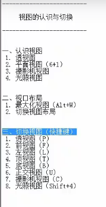
### 视图显示模式

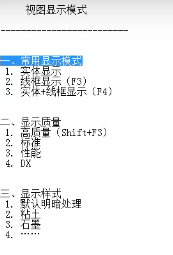
### 视图变换操作

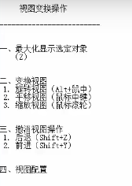
## 创建对象
### 创建基础对象

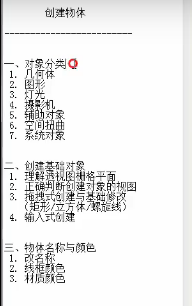
### 场景文件管理

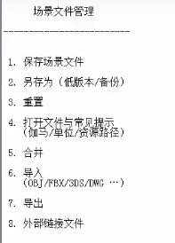

### 选择功能

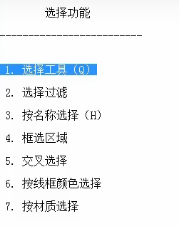

### 操作功能补充

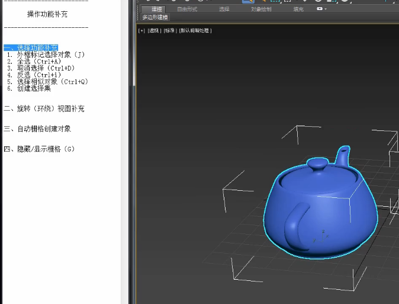

### 隐藏显示功能

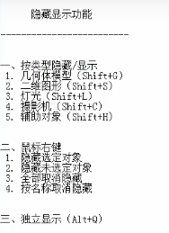

### 3Dmax变幻功能

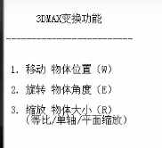

### 3Dmax坐标系统

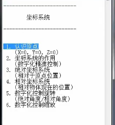

### 物体轴心的作用和控制

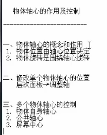

### 参考坐标系

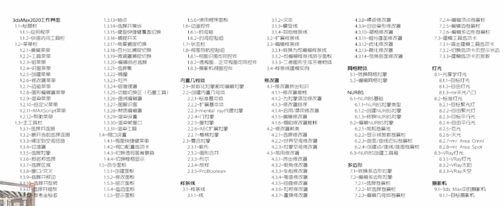

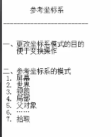

### 捕捉功能 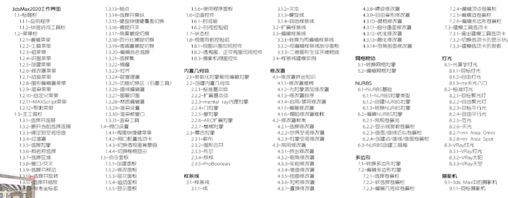

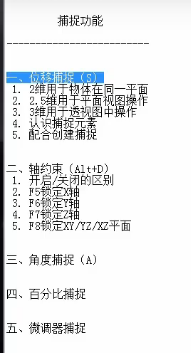

### 二维图形的顶点属性

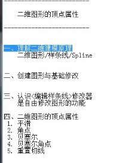

### 编辑样条线的子层级元素

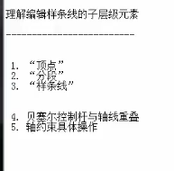

### 二维图形的插值属性

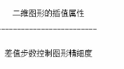

### 创建图形中的三种特殊图形

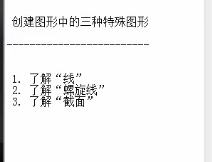 

### 

