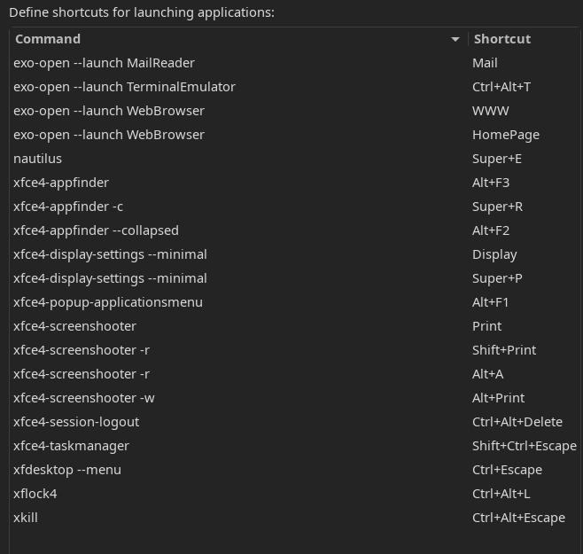

# ArchLinux安装教程

## 停止reflector服务 禁止自动更新服务器列表

`systemctl stop reflector.service`

小提示:系统启动后小键盘数字键未开启 记得手动开启

## 网络连接

### 有线连接 若是连接到已经有网的路由器可以自动联网

### 无线网络连接

```bash
iwctl                       #执行iwctl命令，==进入交互式命令行==
device list                 #列出设备名，比如无线网卡看到叫 wlan0
station wlan0 scan          #用wlan0网卡扫描网络
station wlan0 get-networks  #列出网络
station wlan0 connect 无线网名字    #连接网络名字 输入密码
exit或者quit                #成功后退出
```

## 同步网络时间

`timedatectl set-ntp true`

## 修改软件源 把中国的服务器排在前列, 搜索ustc的两行剪切到行首

```bash
vim /etc/pacman.d/mirrorlist

pacman -Syyu  #刷新但是不要更新软件包
```

## 开始分区

lsblk  # 查看磁盘列表
fdisk -l #查看磁盘列表
fdisk /dev/sda #分区sda磁盘

### fdisk磁盘操作手册

```bash
m 帮助
g 小写g创建gpt格式磁盘
n 创建分区
p 查看分区
w 保存并退出 所有的操作没有执行w前都不会生效
```

### 我分了四个区 ,根据自己硬件修改 不可照抄

```bash
第1个分区 序号1 512M EFI启动分区     # 若安装双系统，可跳过，不用引导分区，后面挂载已有引导分区即可
第2个分区 序号2 8G swap交换分区
第3个分区 序号3 100G /根目录
第4个分区 序号4 剩余空间 /home目录
```

1. 格式化EFI分区
   mkfs.vfat /dev/sda1 || mkfs.fat -F32 /dev/sda1
2. 格式化swap分区并激活
   mkswap /dev/sda2
   swapon /dev/sda2
3. 格式化home和根分区
   mkfs.ext4 /dev/sda3
   mkfs.ext4 /dev/sda4
4. 挂载，先挂根目录，才能挂载其他目录
   mount /dev/sda3 /mnt            # 挂载根目录
   mkdir /mnt/home                 # 新建home目录
   mkdir /mnt/boot                 # 新建boot引导目录
   mount /dev/sda4 /mnt/home       # 挂载home目录
   mount /dev/sda1 /mnt/boot       # 挂载boot引导

## 往/mnt目录里安装系统

其中最基础的四个包是base base-devel linux linux-firmware

```bash
pacstrap /mnt base base-devel linux linux-firmware dhcpcd iwd vim sudo bash-completion net-tools openssh man git wget zsh
```

## 生成fstab,并查看是否正确，则继续，否则检查

```bash
genfstab -U /mnt >> /mnt/etc/fstab
cat /mnt/etc/fstab
```

## 从当前的live环境切换到刚安装的系统内

`arch-chroot /mnt`

## 编辑hostname 名字自行取名 如arch 填入里面

`vim /etc/hostname`

## 编辑hosts， 我这里的名字是arch可自行更改

```bash
vim /etc/hosts
# 内容如下
127.0.0.1   localhost
::1         localhost
127.0.1.1   arch
```

## 设置时区

`ln -sf /usr/share/zoneinfo/Asia/Shanghai /etc/localtime`

## 硬件时间设置

`hwclock --systohc`

## 编辑语言环境

```bash
vim /etc/locale.gen
# 搜索en_US 和zh_CN注意大小写,取消注释
en_US.UTF-8.UTF-8
zh_CN.UTF-8.UTF-8
```

### 使刚才编辑的语言环境生效

```bash
locale-gen
echo 'LANG=en_US.UTF-8' > /etc/locale.conf
```

## 编辑archlinuxcn中国源

```bash
vim /etc/pacman.conf
#索Color注意大小写,取消注释，系统报错会彩色显示 方便用户排查
Color
...
[multilib] 
Include = /etc/pacman.d/mirrorlist

[archlinuxcn]
Server = https://mirrors.ustc.edu.cn/archlinuxcn/$arch
Server = http://mirrors.163.com/archlinux-cn/$arch
```

## 用户设置

```bash
passwd root   # 当前账户就是root 可以不用打root*
useradd -m -G wheel -s /bin/bash xiaohan  # 新建用户名arch 可自行更改用户名
passwd xiaohan # 设置arch用户名的密码

EDITOR=vim visudo # 编辑arch用户的权限,搜索%wheel,取消注释
# %wheel ALL=(ALL:ALL)ALL
```

## 安装 cpu微码和引导软件

```bash
pacman -S intel-ucode grub efibootmgr os-prober
# 如果是intel的cpu 则输入intel-ucode amd-ucode
# os-prober查找已安装的操作系统 推荐实体机上安装
```

## 安装grub引导

```bash
grub-install --target=x86_64-efi --efi-directory=/boot --bootloader-id=GRUB
```

> grub-install *安装grub*
> --target=x86_64-efi      *目标架构x86架构64位 efi启动方式  若不确定使用uname -a 可以查看*
> --efi-directory=/boot      *就是我sda1挂载的/boot位置*
> --bootloader-id=GRUB     *这里的GRUB名字可以自行更改 甚至这一段都可以不用写*

## 生成grub

`grub-mkconfig -o /boot/grub/grub.cfg`

## 安装KDE桌面 字体 浏览器等软件包

```bash
pacman -S plasma                                  # 1. plasma kde桌面        任选一种
pacman -S lightdm xfce4 xfce4-goodies             # 2. lightdm xfce4桌面     任选一种
pacman -S kitty nautilus      #和终端，文件管理器*
pacman -S ntfs-3g          #可以读取ntfs格式磁盘 实体机上推荐安装*
pacman -S adobe-source-han-serif-cn-fonts adobe-source-han-sans-cn-fonts wqy-zenhei wqy-microhei noto-fonts-cjk noto-fonts-emoji noto-fonts-extra ttf-dejavu  # 中文字体 这里如果不安装 之后设置语言的时候都是框框不好辨认
pacman -S lsd neovim firefox google-chrome-stable ark gwenview packagekit-qt5 packagekit appstream-qt appstream man neofetch net-tools networkmanager openssh git wget            #一堆软件

systemctl enable NetworkManager sddm sshd # 开机启动 显示管理器 网络管理 ssh 虚拟机自适应分辨率 注意大小写

# 虚拟机专用--start
pacman -S gtkmm gtk2 gtkmm3 open-vm-tools xf86-input-vmmouse xf86-video-vmware # vmware虚拟机的自适应分辨率
systemctl enable vmtoolsd #vmware虚拟机刚才安装了vmware的软件包才能启动vmtoolsd进程*
# vim /etc/mkinitcpio.conf
MODULES=(vsock vmw_vsock_vmci_transport vmw_balloon vmw_vmci vmwgfx)
mkinitcpio -p linux # 运行以下命令 使刚才编辑的配置文件生效
# 虚拟机专用--end

## 卸载本机的/mnt目录,并重启
umount -R /mnt
reboot
```

## 安装后配置

安装aur助手 前提是开启aur中国源nano /etc/pacman.conf

```bash
pacman -S archlinuxcn-keyring

# 如果报错则执行以下命令
rm -rf /etc/pacman.d/gnupg     # rm命令谨慎操作
pacman-key --init
pacman-key --populate archlinux
pacman-key --populate archlinuxcn
pacman -S yay paru # yay paru都是aur助手 任选一种 还有其他的aur助手软件可以自行搜索

# 安装aur中国源软件库里面的软件 以网易云为例
yay -S netease-cloud-music || paru -S netease-cloud-music
```

### 安装fcitx5输入法

```bash
pacman -S fcitx5-im fcitx5-chinese-addons fcitx5-pinyin-moegirl fcitx5-pinyin-zhwiki fcitx5-material-color
EDITOR=vim sudoedit /etc/environment # 编辑运行环境 使fcitx5输入法生效
# 输入以下内容
GTK_IM_MODULE=fcitx
QT_IM_MODULE=fcitx
XMODIFIERS=@im=fcitx
SDL_IM_MODULE=fcitx
```

### 声音和网络: HDMI 使用pulseaudio和pavucontrol

```bash
pacman -S alsa alsa-utils kmix # 开启系统声音
# alsamixer #为命令行管理音量
# kmix #为图形界面音量管理
```

1. xfce4: 自从某次更新过后，panel中调节声音的插件变成了 xfce4-pulseaudio-plugin。然后就发现在panel中无法调节声音了。
   在这个插件的属性中发现了一项设置是 Audio Mixer: pavucontrol
   通过搜索，找到了这个网页：https://wiki.archlinux.org/index.php/PulseAudio
   解决方法只要两步：
   1). 安装 pulseaudio
   PulseAudio serves as a proxy to sound applications using existing kernel sound components like ALSA or OSS.
   2). 安装 pavucontrol
   There are a number of front-ends available for controlling the PulseAudio daemon:    GTK GUIs: paprefs and pavucontrol
   安装后：
   $：pulseaudio --start        //--kill关闭 作者：shiyue-001 https://www.bilibili.com/read/cv12709685 出处：bilibili

## 安装其他软件

```bash
pacman -S sublime-text code picom ulauncher go
pacman -S deadbeef vlc 

```

## 快捷键

ctrl+alt+d 显示桌面
shift+PrintScreen Screenshot截图


