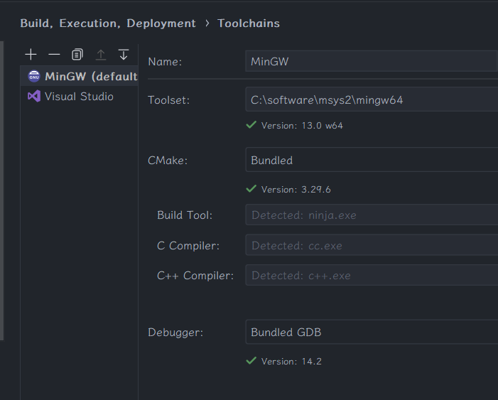
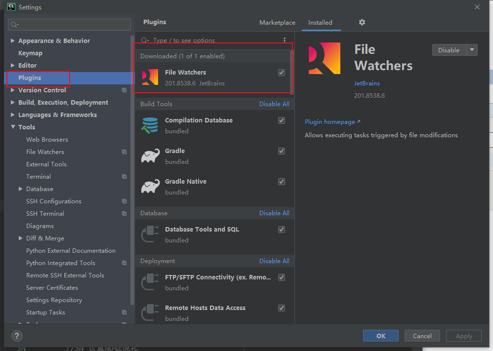
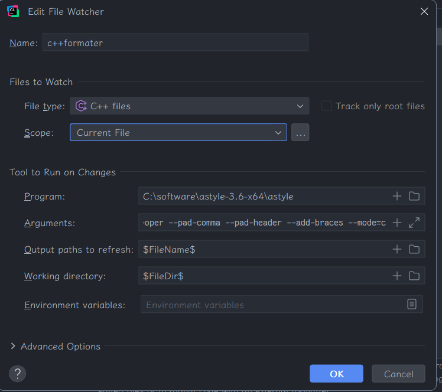

# gtk 4 C++
## 1 安装包
### 1.1 alias
```bash
alias pi='pacman --noconfirm -S'
alias pq='pacman --noconfirm -Qs'
alias pr='pacman --noconfirm -R'
```
### 1.2 依赖和 gtkmm
- 参考 [https://developer-old.gnome.org/gtkmm-tutorial/unstable/sec-installation-dependencies.html.en](https://developer-old.gnome.org/gtkmm-tutorial/unstable/sec-installation-dependencies.html.en)
- 依赖列表
    - sigc++−3.0
    - gtk4
    - glibmm-2.68
    - cairomm-1.16
    - pangomm-2.48
    - pkg-config
    - glib-2.0
    - pango
    - cairo
    - gdk-pixbuf-2.0
    - graphene-1.0
```bash
- 进入[msys2官网](https://packages.msys2.org/search)搜索依赖得到完整的目标名 (带 **mingw-w64-x86_64** 前缀的)
pi mingw-w64-x86_64-libsigc++-3.0 mingw-w64-x86_64-glibmm-2.68
pi mingw-w64-x86_64-gtkmm-4.0
```

### 1.3 Clion 代码格式化配置
#### 1.3.1 Artistic Style
1、Astyle 官网下载地址：[https://sourceforge.net/projects/astyle](https://sourceforge.net/projects/astyle)
1、将压缩包解压到指定目录下
2、找到Astyle.exe存放目录
**1、下载插件 File Watchers**

**配置插件 File Watchers：按照图中一摸一样填写即可**
```
Name：用户自己取个名字
File type：选C/C++
Scope：选择Open Files

Program：找到目录并选择Astyle.exe

Argument（附：博主最满意格式）：-n -i $FileName$ --style=allman --indent=spaces=4 --align-pointer=type --attach-closing-while --indent-col1-comments --pad-oper --pad-comma --pad-header --add-braces --mode=c

Output paths to refresh：$FileName$

Working Directory：$FileDir$
```


> 三、细节
> - 工具会自动生成备份文件 main. Cpp **. Orig** 取消自动生成只需在 Arguments: 最前面添加 `**-n**` 参数即可
> -- 参数用法请参考[https://zhuanlan.zhihu.com/p/410642368?utm_id=0](https://zhuanlan.zhihu.com/p/410642368?utm_id=0)
## 2 新建 c++
CMakeLists. Txt
```bash
cmake_minimum_required(VERSION 3.29)  
project(cppgtk4_tsk)  
  
#set(CMAKE_CXX_FLAGS "${CMAKE_CXX_FLAGS} -std=c++26")  
set(CMAKE_CXX_STANDARD 26)  
  
find_package(PkgConfig)  
pkg_check_modules(GTKMM gtkmm-4.0)  
  
include_directories(${GTKMM_INCLUDE_DIRS})  
link_directories(${GTKMM_LIBRARY_DIRS})  
  
set(SOURCE_FILES main.cpp)  
add_executable(cppgtk4_tsk ${SOURCE_FILES})  
target_link_libraries(${CMAKE_PROJECT_NAME} ${GTKMM_LIBRARIES})
```
### 2.1 C++
Main. Cpp
```cpp
#include <gtkmm.h>  
  
class MyWindow : public Gtk::Window {  
public:  
    MyWindow();  
};  
  
MyWindow::MyWindow() {  
    set_title("GTKMM4");  
    set_default_size(400, 200);  
}  
  
int main(int argc, char* argv[]) {  
    const auto app = Gtk::Application::create("my_test.examples.base");  
  
    return app->make_window_and_run<MyWindow>(argc, argv);  
}
```

## 3 文档和 api
- https://gtkmm.org/en/documentation.html
- https://gnome.pages.gitlab.gnome.org/gtkmm-documentation/index.html
