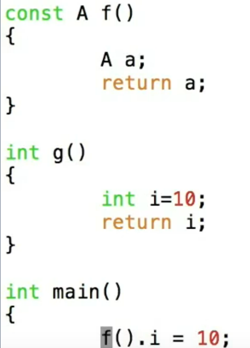
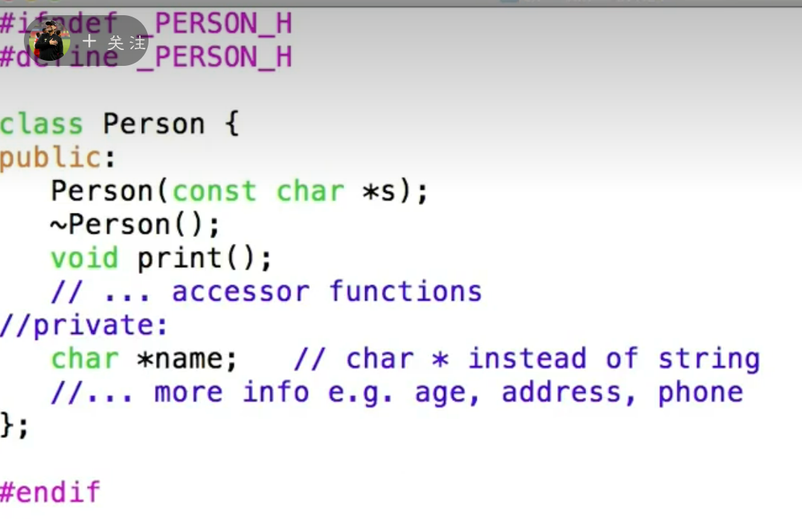
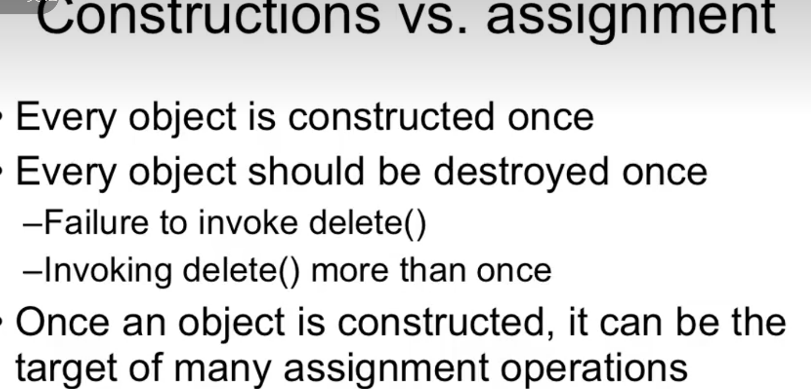
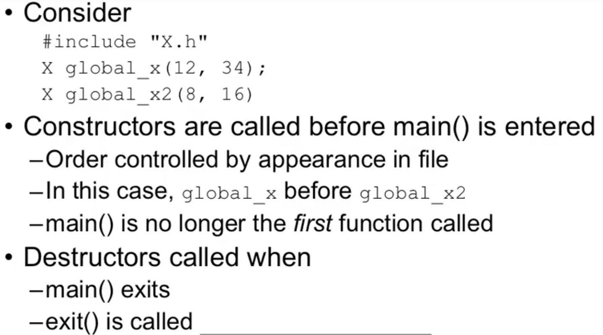
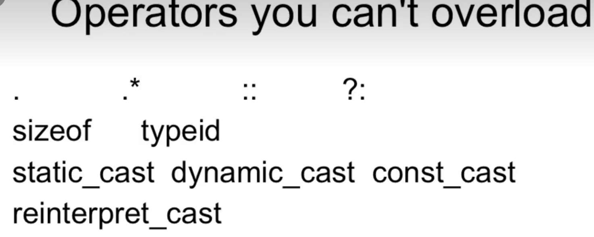
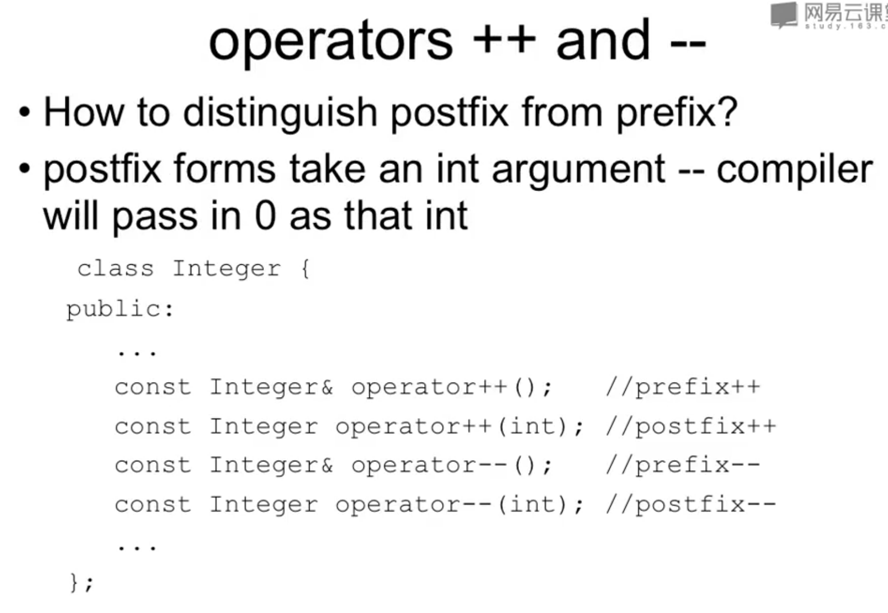
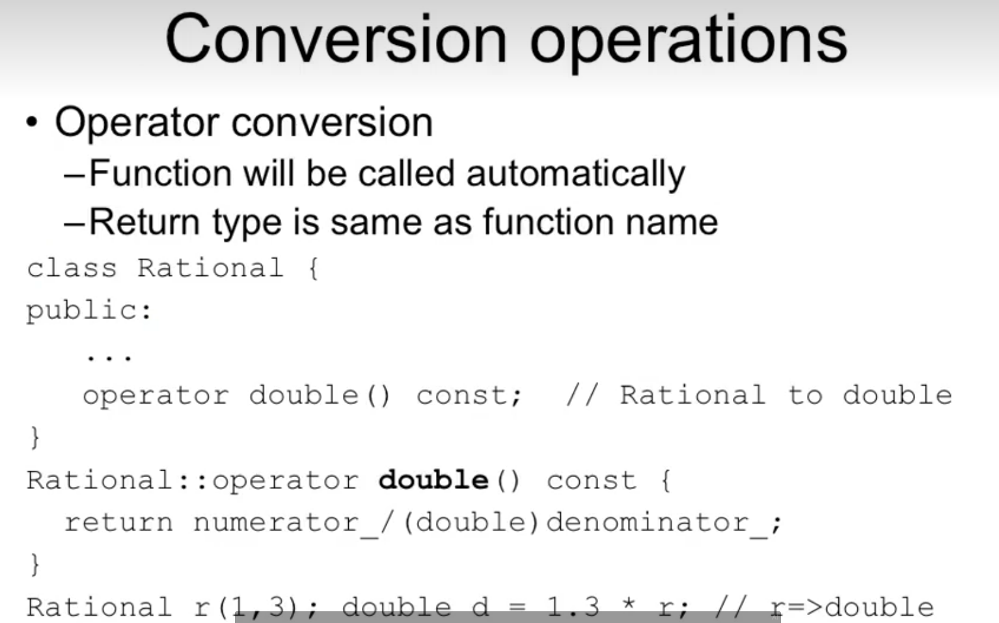
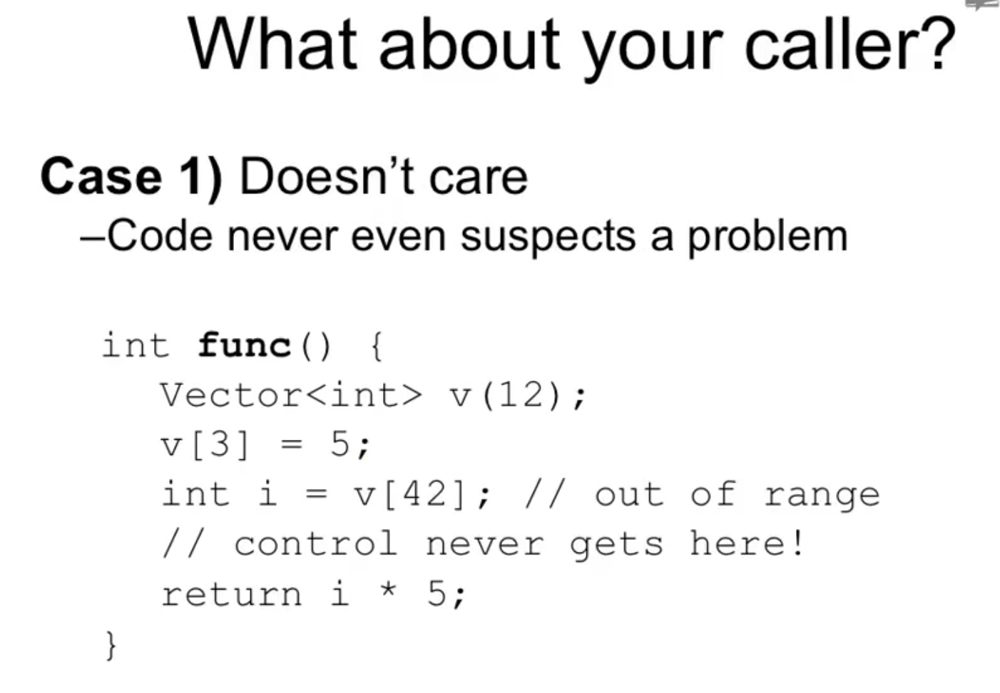
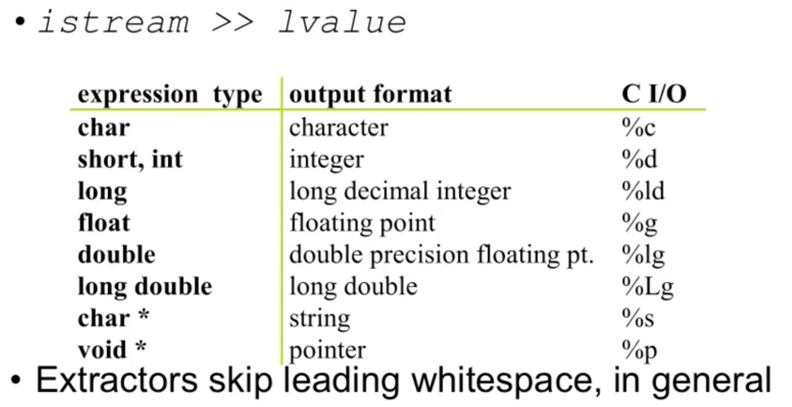
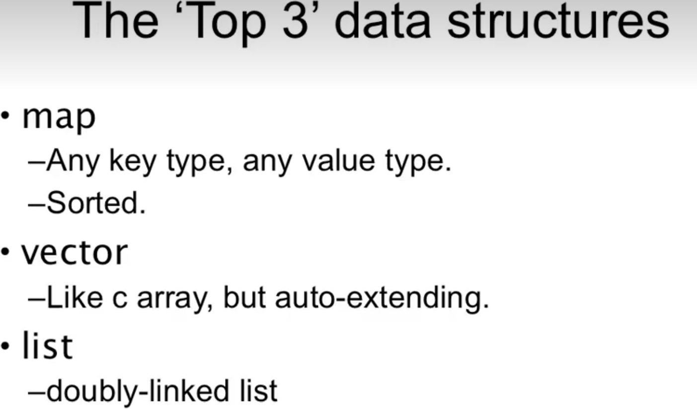

# C++
[toc]


## 1 翁凯
### 1.1 Reference 引用


### 1.2 向上造型

```cpp
#include <iostream>  
using namespace std;  
  
class A {  
public:  
    int i;  
  
    A() : i(10) {  
    };  
};  
  
class B : public A {  
};  
  
int main() {  
    A a;  
    B b;  
  
    cout << a.i << " " << b.i << endl;  
    cout << sizeof(a) << " " << sizeof(b) << endl;  
  
    int *p = (int*) &a;  
    cout << p << " " << *p << endl;

    p = (int*) &b;  
    cout << p << " " << *p << endl;  
    return 0;  
}

D:\codehub\cpp_test\cmake-build-debug\cpp_test.exe
10 10
4 4
0x5518bff6d4 10
0x5518bff6d0 10
```
```cpp
int *p = (int*) &a;  
cout << p << " " << *p << endl;  
*p = 20;  
cout << a.i << endl;  
p = (int*) &b;  
cout << p << " " << *p << endl;
10 10
4 4
0x58dfbff994 10
20
0x58dfbff990 10
```
```cpp
#include <iostream>  
using namespace std;  
  
class A {  
public:  
    int i;  
  
    A() : i(10) {  
    };  
};  
  
class B : public A {  
    int j;  
  
public:  
    B() : j(30) {  
    };  
  
    void f() {  
        cout << "B.j=" << j << endl;  
    }  
};  
  
int main() {  
    A a;  
    B b;  
  
    cout << a.i << " " << b.i << endl;  
    cout << sizeof(a) << " " << sizeof(b) << endl;  
  
    int *p = (int*) &a;  
    cout << p << " " << *p << endl;  
    *p = 20;  
    cout << a.i << endl;  
    p = (int*) &b;  
    cout << p << " " << *p << endl;  
    p++;  
    *p = 50;  
    b.f();  
    return 0;  
}
10 10
4 8
0x1dad3ff714 10
20
0x1dad3ff70c 10
B.j=50
```

#### 1.2.1 Upcasting
Upcasting is the act of converting from a Derived reference or pointer to a base class reference or pointer
```
Base
^
|
Derived
```
Downcasting
### 1.3 多态性

继承 in C++


```cpp
//定义shape的普遍特性
class XYPos{...};
class Shape{
public:
 Shape();
 virtual ~Shape();
 virtual void render(); //virtual 表示 子类中同名的函数和父类中的同名函数是有关系的
 void move(const XYpos&);
 virtual void resize();
protected:
  XYPos center;
}

```
new Shape


#### 1.3.1 多态性 Polymorphism
Upcast: 向上造型
	take an object of the derived class as an object of the base one: Ellipse can be treated as a Shape
Dynamic binding: 动态绑定
	Binding: 绑定，which function to be called
		Static binding： 绑定的函数确定的，call the function as the code
		Dynamic bingding: 绑定的函数为指向的对象，call the function of the object

#### 1.3.2 多态的实现
任何一个类只要有一个虚函数，就比正常的类大一点指向 vtable 的指针

```cpp
#include <iostream>  
using namespace std;  
  
class A {  
public:  
    int i;  
  
    A() : i(10) {  
    };  
  
    virtual void f() {  
        cout << "A::F()" << i << endl;  
    }  
};  
  
  
int main() {  
    A a, b;  
    cout << sizeof(a) << endl;  
    int *p = (int*) &a;  
    int *q = (int*) &b;  
    cout << *p << endl << *q << endl;  
    int *x = (int*) *p;  
    cout << x << endl;  
    return 0;  
}
16
1920943488
1920943488
0xffffffffd1744580
```

Shape  VS Ellipse


```cpp
#include <iostream>  
using namespace std;  
  
class A {  
public:  
    int i;  
  
    A() : i(10) {  
    };  
  
    virtual void f() {  
        cout << "A::F()" << i << endl;  
    }  
};  
  
class B : public A {  
public:  
    B(): j(20) {  
    }  
  
    virtual void f() {  
        cout << "B::f()" << j << endl;  
    }  
  
    int j;  
};  
  
int main() {  
    A a;  
    B b;  
    A *p = &b;  
    p->f(); //B.f  
    a = b;  
    a.f(); //A.f  
    p = &a;  
    p->f(); //A.f  
  
    A *p2 = &a;  
    int *r = (int*) &a;  
    int *t = (int*) &b;  
    *r = *t;  
    p2->f();//B.f  
    return 0;  
}
```
*r=*t 时将 a.vtable 抹掉，指向 b.vtable, 而 p 2 ->f指向a.vtable 所以是 b.vtable


#### 1.3.3 指针


#### 1.3.4 引用类型

#### 1.3.5 virtual destructirs

#### 1.3.6 overriding


#### 1.3.7 return types relaxation（current）


返回对象的指针、引用都是 ok 的，返回对象本身是不行的

#### 1.3.8 overload and virtual

子类中必须 overload 所有的 virtual 函数

### 1.4 引用再研究
引用作为类成员
声明的时候无初始化值
必须使用构造函数列表进行初始化
```cpp
class X{
public :
    int& my;
    X(int& a);
};
X::X(int& a):my(a){};
```
#### 1.4.1 返回 references

不能返回本地变量的地址和它本身作为 reference
上面的代码返回的是全局变量
```cpp
main(){
  for(int i=0;i<SIZE;i++){
	  arr[i]=i*0.5;
  }
  double value=subscript(12);
  subscript(3)=34.5;
}
```
#### 1.4.2 传递参数进函数

 传递对象进函数时，使用 const reference，可以用，但是不能修改
 
#### 1.4.3 temporary values are const


#### 1.4.4 函数返回值里面包含 const


会报错


### 1.5 拷贝构造


 


需要有一个对象引用的构造函数，第三个


##### 1.5.1.1 这个特殊的构造函数叫作拷贝构造

### 1.6 拷贝构造 2
如果类包含指针

猜一下是使用那种拷贝方式：使用的第一种




使用第一种析构了 2 遍所以 malloc error 了
##### 1.6.1.1 c 的字符串


person 的拷贝构造


person 的拷贝构造

拷贝构造的地方


编译器拷贝优化


 

### 1.7 静态对象
#### 1.7.1 持久存储、访问性受限、函数或类内部使用

#### 1.7.2 c++中 static 的使用

#### 1.7.3 c 早期的全局变量

#### 1.7.4 static inside functions

#### 1.7.5 Static applied ti objects

#### 1.7.6 static applied to objects


构造、析构
#### 1.7.7 构造时机
当 f 函数被调用时，并且 x>0 时，构造会被调用一次，然后调用析构
#### 1.7.8 全局对象


构造（全局变量）：，在全局数据区，程序运行时，main 之前进行构造
析构（全局变量）：main 退出，exit () 调用后
#### 1.7.9 static initialization Dependency
程序有多个 cpp 文件，每个里面都有全局变量，这个是没有规定的，是随机的

如果一个文件依赖其他文件的全局变量；
1、将所有被依赖的全局变量放到一个地方
2、定义全局或 namespace
3、\在类中定义静态
### 1.8 静态成员
can we apply static ti members?

隐藏+持久存储（函数之间流转的东西）

不依赖某个对象而存在的东西
static member 是类领域的东西
#### 1.8.1 static members
静态成员变量，在所有类中保持一致的


 
### 1.9 运算符重载--基本规则
#### 1.9.1 运算符重载
允许用户定义类型去重载内建的类型
另一种方式是调用函数

1. 这些可以被重载


2. 这些不能重载

3. 限制条件
已经存在的运算符才可以被重载
对一个类或者枚举的类型来重载
重载：必须保留原来的参数个数，优先级

#### 1.9.2 运算符重载
实际是写一个函数替换 operator
可以作为成员函数
全局的函数

#### 1.9.3 怎么重载


二元成员函数

#### 1.9.4 operator as a global function

#### 1.9.5 全局操作符 friend

friend 可以访问其中的 i
#### 1.9.6 global operators


#### 1.9.7 成员和非成员的


单幕的做成成员的 +-\*/
=（）【】-> ->* 必须是成员的
赋值操作应该是成员的
二元的都是非成员的
### 1.10 运算符重载-原型

#### 1.10.1 argument passing

特殊的运算符

#### 1.10.2 返回值


返回值是对自己做了修改，还是创建了一个新的对象出来
新的对象是不是可以继续做左值

#### 1.10.3 常见的 operator 的原型


++  --


prefix ++a
Postfix a++


#### 1.10.4 关系运算符


只定义了这 2 个，其他都是推出来的
==  < 
都是 inline 的函数，无性能损失
#### 1.10.5 [] index


### 1.11 运算符重载-赋值

拷贝构造和赋值


第一个 fee 初始化 int 的构造函数，
Fee fum=fi，使用 Fee（const Fi&）的构造函数，赋值给 fum
fum=fi 会用 Fi&构造函数创建一个 Fee 对象，不会赋值


A=b

成员函数，

错误演示❌

#### 1.11.1 assignment operator


动态分配内存的，需要写
都是成员对象没有指针的可以不写
防止系统做的行为不正确可以写为 private，但是代价比较大
### 1.12 运算符重载--类型转换
#### 1.12.1 类的作用表达值
基本元素类型
可以被传递进函数和返回的
可以被重载的运算符常用的
转换为其他类型

#### 1.12.2 用户定义的类型转换


xyz 是一个对象，abc 也是 一个对象
string 的operator

先用构造函数构造一个 Two，传给 f 函数

#### 1.12.3 阻止隐式转换




把 x 对象转换为 T
#### 1.12.4 c++类型转换

从窄到宽，会自动转的


#### 1.12.5 要不要用

建议别用，会有别的问题
### 1.13 模板 1
为什么使用模板
你需要一个 x 的 list 和 y 的 list
两个 list 一样的 code，不同是存储类型不一样

1. 需要一个基类
2. Clone 代码：难于维护，类型安全
3. 没有类型的 list： 类型不安全
4. 使用模板
#### 1.13.1 templates

1. function template 函数模板，用来做函数
2. class template 类模板，做类
3. Template functions: 用 template 做出的 function, 比如排序的函数
4. Template class：template 做出的 class：容器比如 list queuw
##### 1.13.1.1 Function templates


###### 1.13.1.1.1 Function template syntax

##### 1.13.1.2 Template instantiation

使用template

编译器遇到 swap 时会根据当前的类型值，实时做出一个匹配函数来
#### 1.13.2 交互
使用模板时就不做类型转换了

#### 1.13.3 重载规则

#### 1.13.4 函数实例化 function instantiation

显示声明
```c++
Void foo (void){
Foo<int>();
Foo<float>();
}
```
#### 1.13.5 类模板 class templates


内部函数，每一个都是函数模板

类模板的每一个函数都是函数模板
函数中类名字中间要加上 `<T>`
### 1.14 模板 2
排序函数模板


小于，需要有 overload 的 operator<函数（重载运算符小于），没有编译会出错
#### 1.14.1 模板多个参数
最好使用大写的 K 和 B，以防认为是实际的一个参数

注意>中间要有空格>

类型可被编译的

##### 1.14.1.1 表达式参数
 
#### 1.14.2 模板和继承

#### 1.14.3 写模板


### 1.15 异常基本概念
#### 1.15.1 运行时错误

读文件

数据流，文件、设备、正在写，独占
不一定有那么大的内存让你申请
读文件不一定读取完整
硬盘坏、文件坏
程序健壮性

可读性不强，正确和错误分支放一起了，下面的好一点了

#### 1.15.2 异常机制

#### 1.15.3 exception 好处

业务逻辑，错误处理分开了
### 1.16 异常的抛出和捕捉


index 越界了


#### 1.16.1 什么时候使用异常


#### 1.16.2 throw 了什么



 


 捕捉所有的异常...
 
 最常用的地方就是输入输出
#### 1.16.3 回顾 review
 
### 1.17 异常语句


#### 1.17.1 选择异常处理

对每一条 catch 做 123，从上到下顺序依次检查
#### 1.17.2 catch继承使用例子


#### 1.17.3 特殊异常
显示指出会抛出的异常类型

没有写是不会抛出任何异常的

#### 1.17.4 new 的异常

#### 1.17.5 构造函数中异常


构造没有完成，析构不会被调用
别人拿不到这个对象

比较麻烦
#### 1.17.6 编程中的异常

catch 对象，会发生 slice

catch 一个指针，需要 delete 它
#### 1.17.7 使用引用抛出异常

### 1.18 流的概念 streams
c 中所有对象是文件：文本和二进制，类型不安全

C++引入了流：比较啰唆，比较慢

#### 1.18.1 什么是流
一维单方向的：
	有特定方向的
	有长度的

#### 1.18.2 stream naming convertions

#### 1.18.3 流操作

#### 1.18.4 流分类

文本流 （解析+格式化）、二进制流（不需要解析）
### 1.19 流的运算符
预定义流


#### 1.19.1 预定义的 extractors

#### 1.19.2 自定义流 extractor

#### 1.19.3 其他输入操作


#### 1.19.4 创建插入流

#### 1.19.5 其他 output 操作

#### 1.19.6 formatting using  manipulators


set 设为 1
reset 恢复为 0

#### 1.19.7 stream flag

##### 1.19.7.1 setting flags

### 1.20 STL
#### 1.20.1 什么是 STL
标准模板库包含数据结构和算法

#### 1.20.2 为什么用 STL

robustness 强壮性
可移植，可维护
#### 1.20.3 c++标准库

基础的算法
都在 std 的 namspace 中的
全部小写
容器、算法、枚举器



