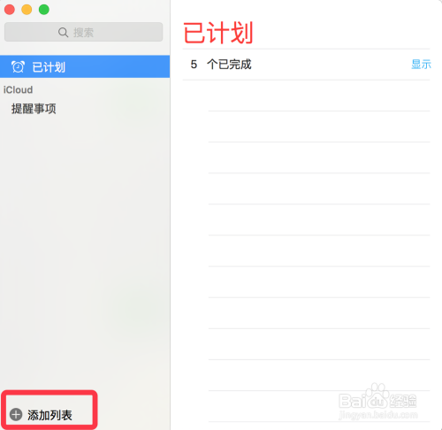
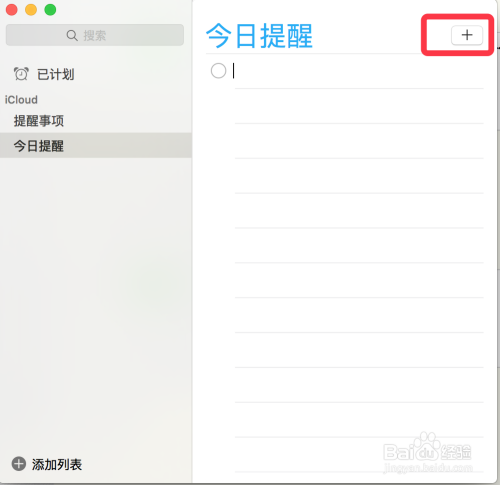
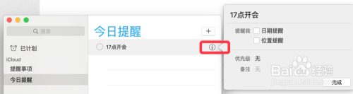
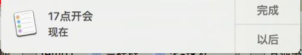

# Mac内置提醒功能如何使用？听语音

-   Mac苹果电脑内置装有提醒事项程序，如何使用这个提醒功能？

平时埋头工作，一不留神，就会把到点该优先做的事给忘掉，这时就需要设置个提醒，让电脑做你的秘书，提醒你有重要事项该做。

-   

## 方法/步骤

1.  1 打开Launchpad（有个火箭图标的，），打开里面的 ‘提醒事项’程序

    

2.  打开后，点击左下的‘添加列表’，先添加一个列表，名字随便输入，这里我们输入了‘今日提醒

    

3.  [点击+号，在该列表下，添加一个提醒，我们输入信息，比如‘17点开会’](http://jingyan.baidu.com/album/6f2f55a17d9de9b5b93e6cef.html?picindex=2)

    

4.  [点击i号，弹出具体提醒选项，这里主要设置提醒的日期，时间。](http://jingyan.baidu.com/album/6f2f55a17d9de9b5b93e6cef.html?picindex=3)

    [还可以设置是否重复，‘每日’，’每周‘等。](http://jingyan.baidu.com/album/6f2f55a17d9de9b5b93e6cef.html?picindex=3)

    

5.  [设置完毕，等提醒时间到了后，系统就会在右上角弹出提醒，这是在所有窗口之前的，你不关他，他一直会在那里提醒着你。](http://jingyan.baidu.com/album/6f2f55a17d9de9b5b93e6cef.html?picindex=4)

    [你点击 '完成'，则表示你已经知道提醒，并关掉了他。](http://jingyan.baidu.com/album/6f2f55a17d9de9b5b93e6cef.html?picindex=4)

    [你也可以点击 '以后'， 这里会让你选择 5分钟的，1小时，再次提醒你。](http://jingyan.baidu.com/album/6f2f55a17d9de9b5b93e6cef.html?picindex=4)

    

6.  [其实在系统的侧栏，也会有这个提醒通知的。](http://jingyan.baidu.com/album/6f2f55a17d9de9b5b93e6cef.html?picindex=5)

    [当你埋头电脑工作，或娱乐时，设置个备忘提醒，有时也是很有必要的。比如你正在看个电影，但一小时后你有个约会，就不能让看电影给耽误了：）](http://jingyan.baidu.com/album/6f2f55a17d9de9b5b93e6cef.html?picindex=5)

    [END](http://jingyan.baidu.com/album/6f2f55a17d9de9b5b93e6cef.html?picindex=6)

## 注意事项

-   ==这个提醒缺少一个自定义的声音（音乐）作为提醒铃声，算是这个程序的一个不尽人意的地方了。==

