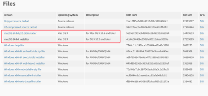
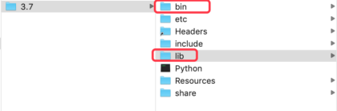
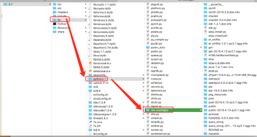
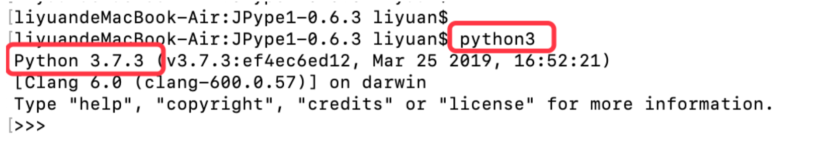
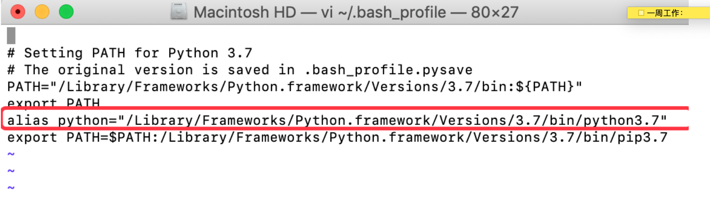
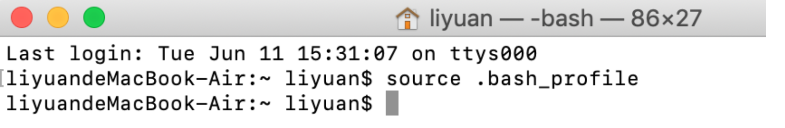
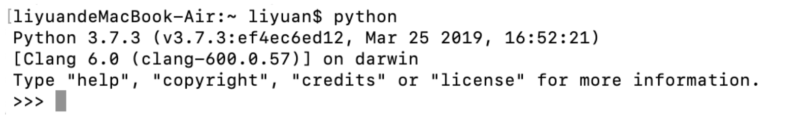
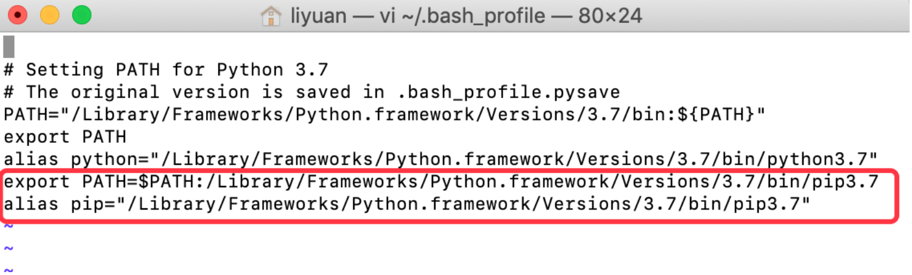
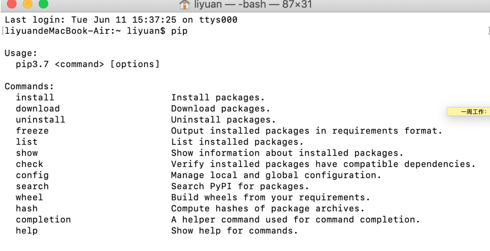

## search and install python3

```sh
brew search python
```

## Python has been installed as

```sh
/usr/local/bin/python3
```

## Unversioned symlinks `python`, `python-config`, `pip` etc. pointing to
`python3`, `python3-config`, `pip3` etc., respectively, have been installed into

```sh
/usr/local/opt/python/libexec/bin
```
## You can install Python packages with

```
pip3 install <package>
```

## They will install into the site-package directory

```sh
/usr/local/lib/python3.7/site-packages
```

==See: https://docs.brew.sh/Homebrew-and-Python==

# [MAC 下 python3 环境安装和配置](https://www.cnblogs.com/Simple-Small/p/12221135.html)

基于很多盆友关心mac下python环境安装的问题，于是此篇文章便诞生了。接来下，请跟我一步步的去安装它。

## 在mac的终端命令行当中运行python，默认出来的就是py27.

在mac中的存放路径为：`/系统/资源库/Frameworks/Python.framework/Versions`

Current就是指当前正在用的版本。

 [](http://www.lemfix.com/uploads/photo/2019/c1736c0e-49f2-4454-a354-8acbacdd46f7.png!large)

## 安装py37版本

在官方网站当中，下载mac下的py37版本。一路安装下来即可。

[](http://www.lemfix.com/uploads/photo/2019/749826cf-de84-426f-bd22-4b266e5216e2.png!large)

 下载的官方地址为：https://www.python.org/downloads/release/python-373/

## 	 py37在mac中的文件结构

python37的路径：/资源库/Frameworks⁩/Python.framework⁩ /⁨Versions⁩/3.7

在Mac中，python的运行程序在bin中，库在lib当中。

 [](http://www.lemfix.com/uploads/photo/2019/69c84535-217f-4f92-8b21-65015c5fcb60.png!large)

 在lib当中，第三方库仍然是在site-package当中。

[](http://www.lemfix.com/uploads/photo/2019/7b1aae32-07bc-4b38-b5f3-65b2866a694c.png!large)

## 配置终端运行python和pip，均指向python3

1) 配置python命令

python3安装好后，在命令行当中，运行python都仍然是指向python2的。运行命令时，运行python3就会自动指向安装的python3了。

[](http://www.lemfix.com/uploads/photo/2019/a21a944a-239a-472c-ab78-dc89656648cb.png!large)

但我们，仍然可以将python3配置成默认使用的版本。修改方式如下：

1、終端当中，打开并编辑 .bash_profile文件。

 运行命令：vi ~/.bash_profile

 按 i 进入编辑状态，添加一行配置：

alias python="/Library/Frameworks/Python.framework/Versions/3.7/bin/python3.7"

[](http://www.lemfix.com/uploads/photo/2019/1a619aba-3e23-4120-9490-46b8fd166d61.png!large)

 

 

按ESC和:后，再输入wq保存和退出。

2、在终端当中，重新加载bash_profile.sh文件数据。

运行命令：source .bash_profile

 

[](http://www.lemfix.com/uploads/photo/2019/c5ef3878-2c76-4e21-ab55-4058aaaba91c.png!large)

 

 

3、在终端当中，运行命令python指向的就是python3.

 

[](http://www.lemfix.com/uploads/photo/2019/176e6fa9-9797-4e8a-a4e4-138c607587f8.png!large)

 

 

2) 配置pip

与配置python一样的方式。

1、用vi命令编辑bash_profile 文件 。在其中加入以下2行(第1行是加入到环境变量中，第2行是取别名为pip)：

export PATH=$PATH:/Library/Frameworks/Python.framework/Versions/3.7/bin/pip3.7

alias pip="/Library/Frameworks/Python.framework/Versions/3.7/bin/pip3.7"

 

[](http://www.lemfix.com/uploads/photo/2019/81a33e73-5021-4f81-84d4-c3cbd822e6b2.png!large)

 

 

保存并退出。

2、在终端当中，重新加载bash_profile.sh文件数据。

运行命令：source .bash_profile

3、在终端当中，去运行pip就可以得到python37下的pip3了。

 

[](http://www.lemfix.com/uploads/photo/2019/e1fd7d3f-f032-4902-af3d-9abefaeb722d.png!large)