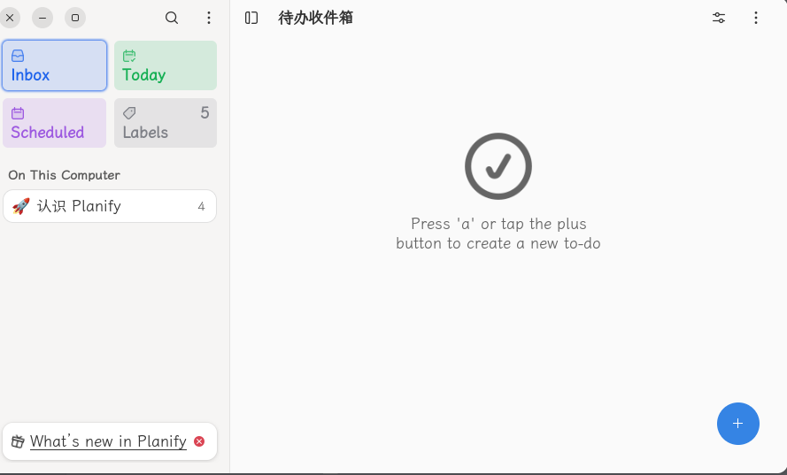
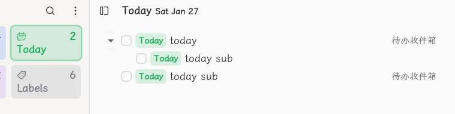
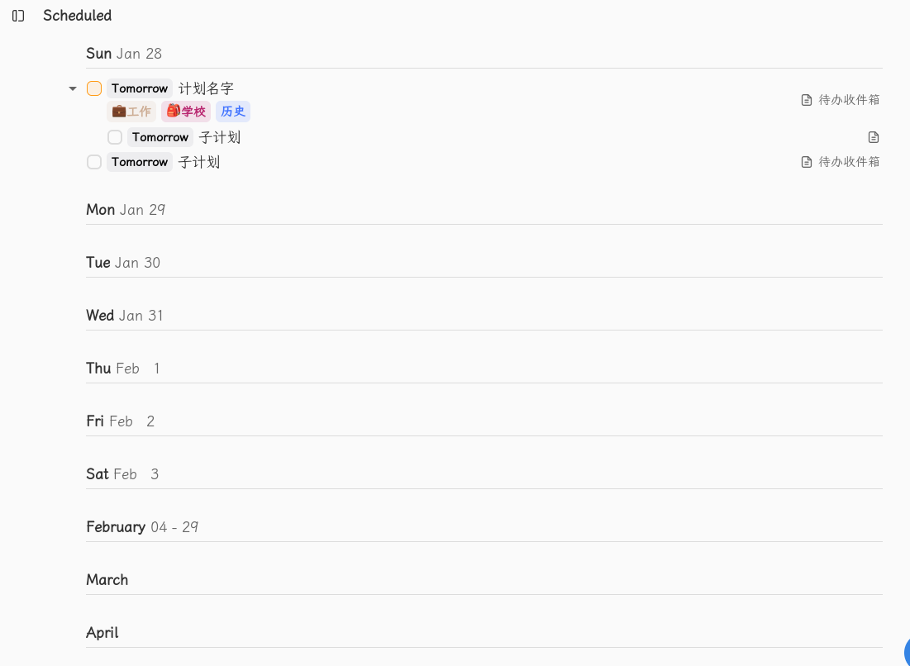

# planify todo工具

[toc]

## 首页



## inbox代办收件箱


## today



## scheduled计划



### add todo


收缩起来


展开


```bash
Tomorrow
	Today  Sat
	Tommorow Sun
	Next Week Feb 3
	No Date
	Choose a Date

add labels
```

### add sub task


### Add label(s)

```bash
Search or create
可以多选
不存在的点击回车会新增
```


### Set the priority

设置后计划名字前对应颜色


```bash
红旗子🚩 Priority 1：high
黄旗子🚩 Priority 2：medium
蓝旗子🚩 Priority 3：low
白旗帜🏳 Priority 4：none
```

### Add Reminder(s)

Reminders                  +

```
Your list reminders will show up here, Add one by click the '+' button
```

#### add reminder

January 2024     <   >

| Mo   | Tu   | We   | Th   | Fr   | Sa     | Su   |
| ---- | ---- | ---- | ---- | ---- | ------ | ---- |
| 1    | 2    | 3    | 4    | 5    | 6      | 7    |
| 8    | 9    | 10   | 11   | 12   | 13     | 14   |
| 15   | 16   | 17   | 18   | 19   | 20     | 21   |
| 22   | 23   | 24   | 25   | 26   | **27** | 28   |
| 29   | 30   | 31   |      |      |        |      |

Time :  20:33

Add Reminder 按钮

#### reminder显示


点击🔔后显示：

Reminders    +

🔔 Today 20:34      ❎（圆框的）

### 置顶

点击后变为红色📌


#### 更多三个点

```bash
Copy to clipboard
Dumplicate
Move                  移到其他的project
Repeat               重复设置：Daily Weekly Monthly Yearly -- None Custom（Every）
------
Delete task
-----
Added at: Today 20:36
Updated at: Today 21:37
```

重复设置

``` 
Repeat
Every 2 days
2 - + [Day(s)) Week(s) Month(s) Year(s)]

Week(s): Monday Tuesday Wednesday Thusday Friday Saturday Sunday
Done 按钮
```


### labels


#### update label


#### delete label


#### add label


## project

index 和project中都key添加section

add project


list | board

Ordered by   ：custom sort order | alphabetically |Due date |Date Added |Priority

Show Completed Tasks |Hide Completd Tasks

### board视图


### 更多

#### edit project


#### When?

设置项目的截止日期


#### Add Section

添加项目阶段 


section中添加todo，然后点击后，key看到子sub，点击子sub可以看到子sub的sub，会显示子sub的数量和完成情况


#### Select

选择一个todo 


#### Paste

功能不明

#### Delete Project


## quick find


## 更多

### Preference系统设置


#### integration 


#### general


#### sidbar


#### appearence


#### Quick Add


#### backup


#### Delete Planify Data 清除数据

