# planify todo工具

[toc]

## 1 首页


## 2 inbox代办收件箱


## 3 today


## 4 scheduled计划


### 4.1 add todo


收缩起来

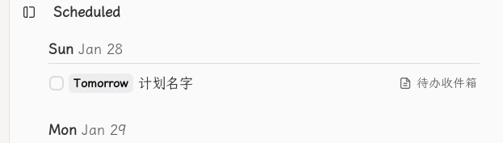

展开

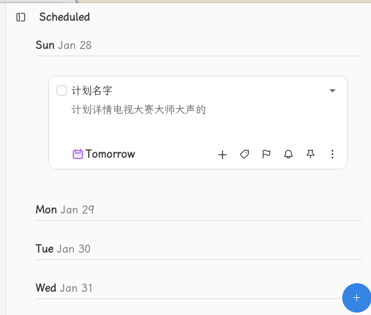

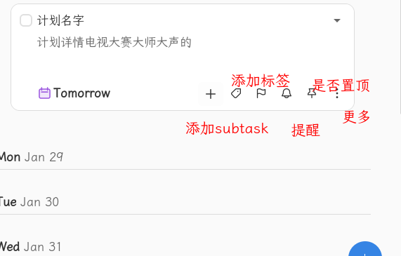

```bash
Tomorrow
	Today  Sat
	Tommorow Sun
	Next Week Feb 3
	No Date
	Choose a Date

add labels
```

### 4.2 add sub task


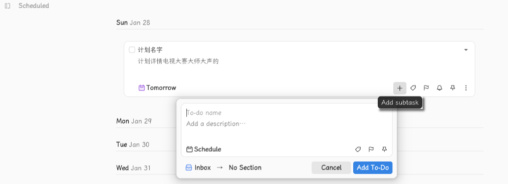

### 4.3 Add label(s)

```bash
Search or create
可以多选
不存在的点击回车会新增
```


### 4.4 Set the priority

设置后计划名字前对应颜色


```bash
红旗子🚩 Priority 1：high
黄旗子🚩 Priority 2：medium
蓝旗子🚩 Priority 3：low
白旗帜🏳 Priority 4：none
```

### 4.5 Add Reminder(s)

Reminders                  +

```
Your list reminders will show up here, Add one by click the '+' button
```

#### 4.5.1 add reminder

January 2024     <   >

| Mo   | Tu   | We   | Th   | Fr   | Sa     | Su   |
| ---- | ---- | ---- | ---- | ---- | ------ | ---- |
| 1    | 2    | 3    | 4    | 5    | 6      | 7    |
| 8    | 9    | 10   | 11   | 12   | 13     | 14   |
| 15   | 16   | 17   | 18   | 19   | 20     | 21   |
| 22   | 23   | 24   | 25   | 26   | **27** | 28   |
| 29   | 30   | 31   |      |      |        |      |

Time :  20:33

Add Reminder 按钮

#### 4.5.2 reminder显示


点击🔔后显示：

Reminders    +

🔔 Today 20:34      ❎（圆框的）

### 4.6 置顶

点击后变为红色📌


#### 4.6.1 更多三个点

```bash
Copy to clipboard
Dumplicate
Move                  移到其他的project
Repeat               重复设置：Daily Weekly Monthly Yearly -- None Custom（Every）
------
Delete task
-----
Added at: Today 20:36
Updated at: Today 21:37
```

重复设置

``` 
Repeat
Every 2 days
2 - + [Day(s)) Week(s) Month(s) Year(s)]

Week(s): Monday Tuesday Wednesday Thusday Friday Saturday Sunday
Done 按钮
```


### 4.7 labels


#### 4.7.1 update label


#### 4.7.2 delete label


#### 4.7.3 add label


## 5 project

index 和project中都key添加section

add project


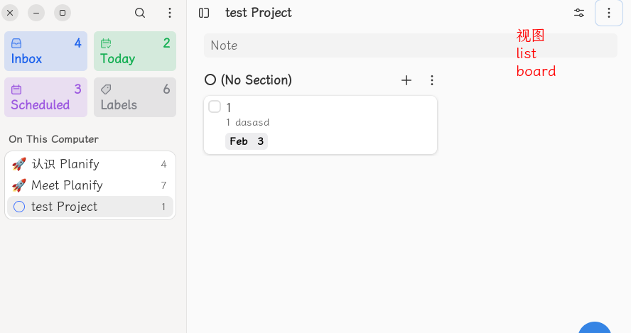

list | board

Ordered by   ：custom sort order | alphabetically |Due date |Date Added |Priority

Show Completed Tasks |Hide Completd Tasks

### 5.1 board视图

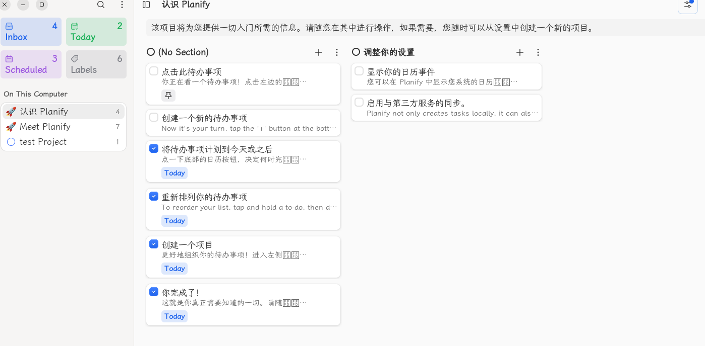

### 5.2 更多

#### 5.2.1 edit project

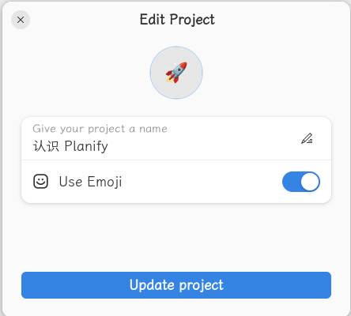

#### 5.2.2 When?

设置项目的截止日期


#### 5.2.3 Add Section

添加项目阶段 

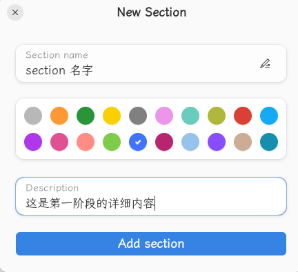

section中添加todo，然后点击后，key看到子sub，点击子sub可以看到子sub的sub，会显示子sub的数量和完成情况

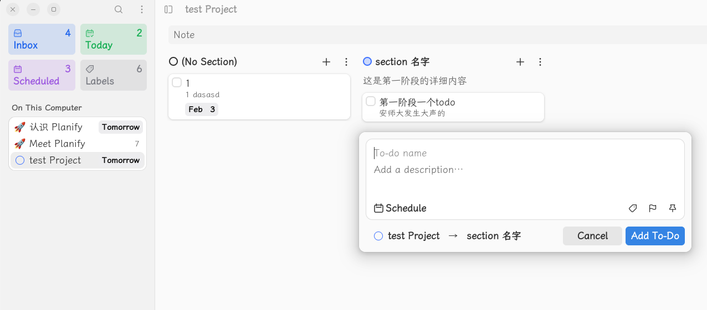

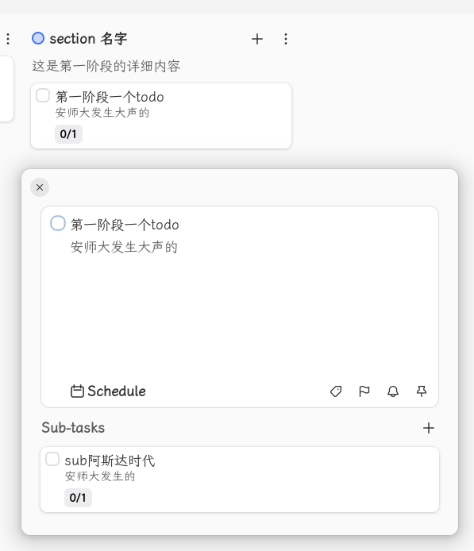

#### 5.2.4 Select

选择一个todo 


#### 5.2.5 Paste

功能不明

#### 5.2.6 Delete Project

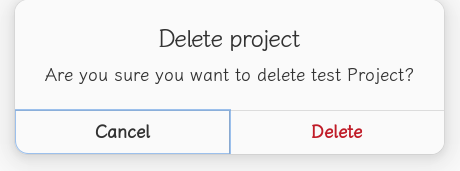

## 6 quick find

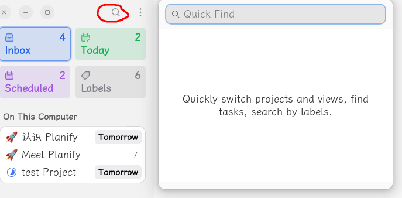

## 7 更多

### 7.1 Preference系统设置


#### 7.1.1 integration 


#### 7.1.2 general


#### 7.1.3 sidbar

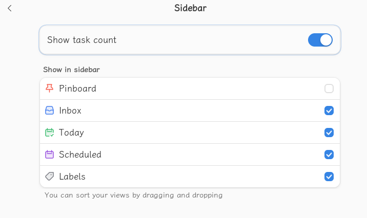

#### 7.1.4 appearence


#### 7.1.5 Quick Add

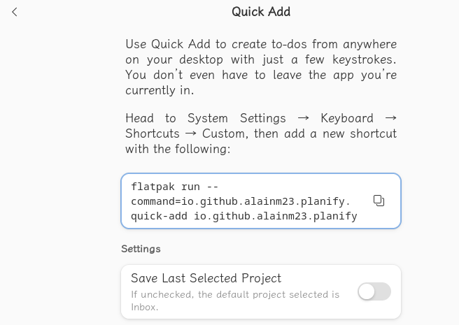

#### 7.1.6 backup


#### 7.1.7 Delete Planify Data 清除数据

