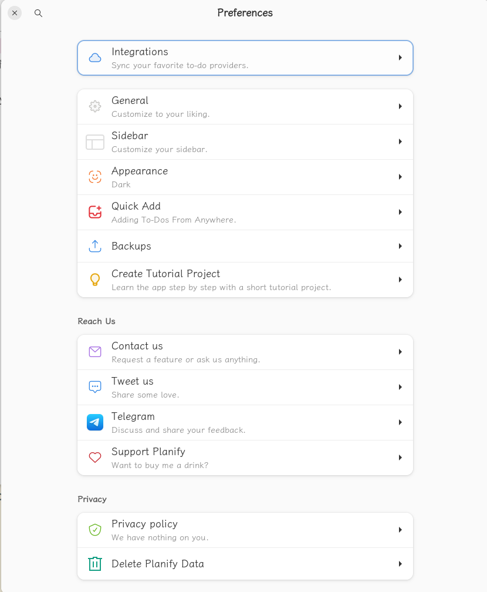
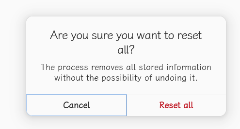

# planify todo工具

[toc]

## 1 首页


## 2 settings
### 2.1 settings

### 2.2 archived projects 已归档project

### 2.3 shotcuts


### 2.4 about


sidebar list view for filters

## 3 inbox

### 3.1 empty:

### 3.2 actions


add section

manage section

### 3.3 views


#### 3.3.1 board view

#### 3.3.2 list view

### 3.4 filters
labels

	### 3.5 add task


add success


### 3.5 inbox task sidebar view


#### 3.5.1 status

#### 3.5.2 section

#### 3.5.3 schedule

repeat: 

repeat custom

#### 3.5.4 labels

#### 3.5.5 reminders


### 3.6 inbox item edit

#### 3.6.1 set schedule and repeat
choose a date

repeat

add time

#### 3.6.2 add attachment

#### 3.6.3 add labels


#### 3.6.4 set priority

#### 3.6.5 remindres

#### 3.6.6 extra


### 3.7 section

### 3.8 add sub tasks


## 4 today

### 4.1 reschedule

### 4.2 show view


## 5 scheduled计划

## 6 pinboard

## 7 labels

### 7.1 add label


> ## 8 completed


### 7.2 add todo


收缩起来


展开


```bash
Tomorrow
	Today  Sat
	Tommorow Sun
	Next Week Feb 3
	No Date
	Choose a Date

add labels
```

### 7.3 add sub task


### 7.4 Add label(s)

```bash
Search or create
可以多选
不存在的点击回车会新增
```


### 7.5 Set the priority

设置后计划名字前对应颜色


```bash
红旗子🚩 Priority 1：high
黄旗子🚩 Priority 2：medium
蓝旗子🚩 Priority 3：low
白旗帜🏳 Priority 4：none
```

### 7.6 Add Reminder(s)

Reminders                  +

```
Your list reminders will show up here, Add one by click the '+' button
```

#### 7.6.1 add reminder

January 2024     <   >

| Mo   | Tu   | We   | Th   | Fr   | Sa     | Su   |
| ---- | ---- | ---- | ---- | ---- | ------ | ---- |
| 1    | 2    | 3    | 4    | 5    | 6      | 7    |
| 8    | 9    | 10   | 11   | 12   | 13     | 14   |
| 15   | 16   | 17   | 18   | 19   | 20     | 21   |
| 22   | 23   | 24   | 25   | 26   | **27** | 28   |
| 29   | 30   | 31   |      |      |        |      |

Time :  20:33

Add Reminder 按钮

#### 7.6.2 reminder显示


点击🔔后显示：

Reminders    +

🔔 Today 20:34      ❎（圆框的）

### 7.7 置顶

点击后变为红色📌


#### 7.7.1 更多三个点

```bash
Copy to clipboard
Dumplicate
Move                  移到其他的project
Repeat               重复设置：Daily Weekly Monthly Yearly -- None Custom（Every）
------
Delete task
-----
Added at: Today 20:36
Updated at: Today 21:37
```

重复设置

``` 
Repeat
Every 2 days
2 - + [Day(s)) Week(s) Month(s) Year(s)]

Week(s): Monday Tuesday Wednesday Thusday Friday Saturday Sunday
Done 按钮
```


### 7.8 labels


#### 7.8.1 update label


#### 7.8.2 delete label


#### 7.8.3 add label


## 8 anytime

## 9 unlabeled

## 10 tomorrow

## 11 repeating

## 12 all tasks


## 13 project

index 和project中都key添加section

### 13.1 add project


use emoji

set color

### 13.2 project action


### 13.3 project view


list | board

Ordered by   ：custom sort order | alphabetically |Due date |Date Added |Priority

Show Completed Tasks |Hide Completd Tasks

### 13.4 project section add project

### 13.5 project ...

### 13.6 section
#### 13.6.1 edit section

#### 13.6.2 section ...

#### 13.6.3 manage section order


### 13.7 board视图


### 13.8 更多

#### 13.8.1 edit project


#### 13.8.2 When?

设置项目的截止日期


#### 13.8.3 Add Section

添加项目阶段 


section中添加todo，然后点击后，key看到子sub，点击子sub可以看到子sub的sub，会显示子sub的数量和完成情况


#### 13.8.4 Select

选择一个todo 


#### 13.8.5 Paste

功能不明

#### 13.8.6 Delete Project

> 

## 14 quick find


## 15 更多

### 15.1 Preference系统设置



#### 15.1.1 integration


#### 15.1.2 general


#### 15.1.3 sidbar


#### 15.1.4 appearence


#### 15.1.5 Quick Add


#### 15.1.6 backup


#### 15.1.7 Delete Planify Data 清除数据



```bash
asdfasd


```


```bash
啊的撒旦发生的
```
