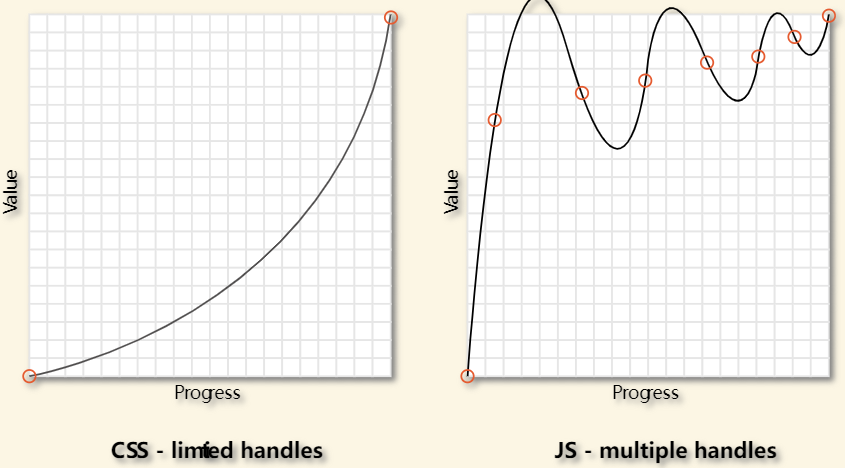
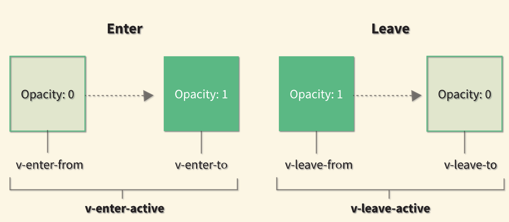

# Vue 3 中文文档

[toc]

# 基础

## vue.js 介绍

### 渲染

```vue
<div id="counter">
  Counter: {{ counter }}
</div>

<javascript>
const Counter = {
  data() {
    return {
      counter: 0
    }
  }
}

Vue.createApp(Counter).mount('#counter')
</javascript>javascript>
```

### v-bind :将这个元素节点的 `title` attribute 和当前活跃实例的 `message` property 保持一致

```vue
<div id="bind-attribute">
  <span v-bind:title="message">
    鼠标悬停几秒钟查看此处动态绑定的提示信息！
  </span>
    <p>{{ message }}</p>
  <button v-on:click="reverseMessage">反转 Message</button>
</div>	

const AttributeBinding = {
  data() {
    return {
      message: 'You loaded this page on ' + new Date().toLocaleString()
    }
  }
}

Vue.createApp(AttributeBinding).mount('#bind-attribute')
```

### v-on:添加一个事件监听器，通过它调用在实例中定义的方法：

```vue
<div id="event-handling">
  <p>{{ message }}</p>
  <button v-on:click="reverseMessage">反转 Message</button>
</div>

const EventHandling = {
  data() {
    return {
      message: 'Hello Vue.js!'
    }
  },
  methods: {
    reverseMessage() {
      this.message = this.message
        .split('')
        .reverse()
        .join('')
    }
  }
}

Vue.createApp(EventHandling).mount('#event-handling')
```

### v-model:表单输入和应用状态之间的双向绑定

```vue
<div id="two-way-binding">
  <p>{{ message }}</p>
  <input v-model="message" />
</div>
const TwoWayBinding = {
  data() {
    return {
      message: 'Hello Vue!'
    }
  }
}

Vue.createApp(TwoWayBinding).mount('#two-way-binding')

```

### v-if:控制切换一个元素是否显示

```vue
<div id="conditional-rendering">
  <span v-if="seen">现在你看到我了</span>
</div>
const ConditionalRendering = {
  data() {
    return {
      seen: true
    }
  }
}

Vue.createApp(ConditionalRendering).mount('#conditional-rendering')
```

### v-for:绑定数组的数据来渲染一个项目列表

```vue
<div id="list-rendering">
  <ol>
    <li v-for="todo in todos">
      {{ todo.text }}
    </li>
  </ol>
</div>
const ListRendering = {
  data() {
    return {
      todos: [
        { text: 'Learn JavaScript' },
        { text: 'Learn Vue' },
        { text: 'Build something awesome' }
      ]
    }
  }
}

Vue.createApp(ListRendering).mount('#list-rendering')
```

## 组件

组件系统是 Vue 的另一个重要概念，因为它是一种抽象，允许我们使用小型、独立和通常可复用的组件构建大型应用。仔细想想，几乎任意类型的应用界面都可以抽象为一个组件树：


### 根组件

传递给 `createApp` 的选项用于配置**根组件**。当我们**挂载**应用时，该组件被用作渲染的起点。

一个应用需要被挂载到一个 DOM 元素中。例如，如果你想把一个 Vue 应用挂载到 `<div id="app"></div>`，应该传入 `#app`：

```js
const RootComponent = { 
  /* 选项 */ 
}
const app = Vue.createApp(RootComponent)
const vm = app.mount('#app')
```

与大多数应用方法不同的是，`mount` 不返回应用本身。相反，它返回的是根组件实例。

一个 todo 应用组件树可能是这样的：

```text
Root Component
└─ TodoList
   ├─ TodoItem
   │  ├─ DeleteTodoButton
   │  └─ EditTodoButton
   └─ TodoListFooter
      ├─ ClearTodosButton
      └─ TodoListStatistics
```

### 组件实例 property

在前面的指南中，我们认识了 `data` property。在 `data` 中定义的 property 是通过组件实例暴露的：

```js
const app = Vue.createApp({
  data() {
    return { count: 4 }
  }
})

const vm = app.mount('#app')

console.log(vm.count) // => 4
```

还有各种其他的组件选项，可以将用户定义的 property 添加到组件实例中，例如 `methods`，`props`，`computed`，`inject` 和 `setup`。我们将在后面的指南中深入讨论它们。组件实例的所有 property，无论如何定义，都可以在组件的模板中访问。

Vue 还通过组件实例暴露了一些内置 property，如 `$attrs` 和 `$emit`。这些 property 都有一个 `$` 前缀，以避免与用户定义的 property 名冲突。

### 生命周期钩子

每个组件在被创建时都要经过一系列的初始化过程——例如，需要设置数据监听、编译模板、将实例挂载到 DOM 并在数据变化时更新 DOM 等。同时在这个过程中也会运行一些叫做**生命周期钩子**的函数，这给了用户在不同阶段添加自己的代码的机会。

==比如 [created](https://v3.cn.vuejs.org/api/options-lifecycle-hooks.html#created) 钩子可以用来在一个实例被创建之后执行代码==：

```js
Vue.createApp({
  data() {
    return { count: 1}
  },
  created() {
    // `this` 指向 vm 实例
    console.log('count is: ' + this.count) // => "count is: 1"
  }
})
```

也有一些其它的钩子，在实例生命周期的不同阶段被调用，如 [mounted](https://v3.cn.vuejs.org/api/options-lifecycle-hooks.html#mounted)、[updated](https://v3.cn.vuejs.org/api/options-lifecycle-hooks.html#updated) 和 [unmounted](https://v3.cn.vuejs.org/api/options-lifecycle-hooks.html#unmounted)。生命周期钩子的 `this` 上下文指向调用它的当前活动实例。

>不要在选项 property 或回调上使用[箭头函数](https://developer.mozilla.org/en/docs/Web/JavaScript/Reference/Functions/Arrow_functions)，比如 `created: () => console.log(this.a)` 或 `vm.$watch('a', newValue => this.myMethod())`。因为箭头函数并没有 `this`，`this` 会作为变量一直向上级词法作用域查找，直至找到为止，经常导致 `Uncaught TypeError: Cannot read property of undefined` 或 `Uncaught TypeError: this.myMethod is not a function` 之类的错误。


### 注册组件

```vue
const TodoItem = {
  template: `<li>This is a todo</li>`
}

// 创建 Vue 应用
const app = Vue.createApp({
  components: {
    TodoItem // 注册一个新组件
  },
  ... // 组件的其它 property
})

// 挂载 Vue 应用
app.mount(...)
```

```vue
<ol>
  <!-- 创建一个 todo-item 组件实例 -->
  <todo-item></todo-item>
</ol>
```

#### props:将数据从父组件传入子组件

```vue
app.component('todo-item', {
  props: ['todo'],
  template: `<li>{{ todo.text }}</li>`
})
```

父组件：

```vue
<div id="todo-list-app">
  <ol>
     <!--
      现在我们为每个 todo-item 提供 todo 对象
      todo 对象是变量，即其内容可以是动态的。
      我们也需要为每个组件提供一个“key”，稍后再
      作详细解释。
    -->
    <todo-item
      v-for="item in groceryList"
      v-bind:todo="item"
      v-bind:key="item.id"
    ></todo-item>
  </ol>
</div>
```
子组件：

```vue
const TodoList = {
  data() {
    return {
      groceryList: [
        { id: 0, text: 'Vegetables' },
        { id: 1, text: 'Cheese' },
        { id: 2, text: 'Whatever else humans are supposed to eat' }
      ]
    }
  }
}

const app = Vue.createApp(TodoList)

app.component('todo-item', {
  props: ['todo'],
  template: `<li>{{ todo.text }}</li>`
})

app.mount('#todo-list-app')
```


## 模板语法

Vue.js 使用了基于 HTML 的模板语法，允许开发者声明式地将 DOM 绑定至底层组件实例的数据。所有 Vue.js 的模板都是合法的 HTML，所以能被遵循规范的浏览器和 HTML 解析器解析。

在底层的实现上，Vue 将模板编译成虚拟 DOM 渲染函数。结合响应性系统，Vue 能够智能地计算出最少需要重新渲染多少组件，并把 DOM 操作次数减到最少。

如果你熟悉虚拟 DOM 并且偏爱 JavaScript 的原始力量，你也可以不用模板，[直接写渲染 (render) 函数](https://v3.cn.vuejs.org/guide/render-function.html)，使用可选的 JSX 语法。

### 插值{{msg}}

#### 文本： 数据绑定最常见的形式就是使用“Mustache” (双大括号) 语法的文本插值：

```html
<span>Message: {{ msg }}</span>
```

Mustache 标签将会被替代为对应组件实例中 `msg` property 的值。无论何时，绑定的组件实例上 `msg` property 发生了改变，插值处的内容都会更新。

==通过使用 [v-once 指令](https://v3.cn.vuejs.org/api/directives.html#v-once)==，你也能执行**一次性地插值**，当数据改变时，插值处的内容不会更新。但请留心这会影响到该节点上的其它数据绑定：

```html
<span v-once>这个将不会改变: {{ msg }}</span>
```

#### 原始 HTML：双大括号会将数据解释为普通文本，而非 HTML 代码。为了输出真正的 HTML，你需要使用[`v-html` 指令](https://v3.cn.vuejs.org/api/directives.html#v-html)：

```html
<p>Using mustaches: {{ rawHtml }}</p>
<p>Using v-html directive: <span v-html="rawHtml"></span></p>
```

> 你不能使用 `v-html` 来复合局部模板，因为 Vue 不是基于字符串的模板引擎。反之，对于用户界面 (UI)，组件更适合作为可重用和可组合的基本单位。
>
> 在你的站点上动态渲染任意的 HTML 是非常危险的，因为它很容易导致 [XSS 攻击](https://en.wikipedia.org/wiki/Cross-site_scripting)。请只对可信内容使用 HTML 插值，**绝不要**将用户提供的内容作为插值。

#### Attribute:Mustache 语法不能在 HTML attribute 中使用，然而，可以使用 [`v-bind` 指令](https://v3.cn.vuejs.org/api/directives.html#v-bind)：

```html
<div v-bind:id="dynamicId"></div>
```

如果绑定的值是 `null` 或 `undefined`，那么该 attribute 将不会被包含在渲染的元素上。

对于布尔 attribute (它们只要存在就意味着值为 `true`)，`v-bind` 工作起来略有不同，在这个例子中：

```html
<button v-bind:disabled="isButtonDisabled">按钮</button>
```

如果 `isButtonDisabled` 的值是 truthy[[1\]](https://v3.cn.vuejs.org/guide/template-syntax.html#footnote-1)，那么 `disabled` attribute 将被包含在内。如果该值是一个空字符串，它也会被包括在内，与 `<button disabled="">` 保持一致。对于其他 falsy[[2\]](https://v3.cn.vuejs.org/guide/template-syntax.html#footnote-2) 的值，该 attribute 将被省略。

#### 使用 JavaScript 表达式

对于所有的数据绑定，Vue.js 都提供了完全的 JavaScript 表达式支持。

```html
{{ number + 1 }}

{{ ok ? 'YES' : 'NO' }}

{{ message.split('').reverse().join('') }}

<div v-bind:id="'list-' + id"></div>
```

每个绑定都只能包含**单个表达式**，所以下面的例子都**不会**生效。

```html
<!--  这是语句，不是表达式：-->
{{ var a = 1 }}

<!-- 流程控制也不会生效，请使用三元表达式 -->
{{ if (ok) { return message } }}
```

### 指令

指令 (Directives) 是带有 `v-` 前缀的特殊 attribute。指令 attribute 的值预期是**单个 JavaScript 表达式** (`v-for` 和 `v-on` 是例外情况，稍后我们再讨论)。指令的职责是，当表达式的值改变时，将其产生的连带影响，响应式地作用于 DOM。

#### `v-if` 指令将根据表达式 `seen` 的值的真假来插入/移除 `<p>` 元素。

```html
<p v-if="seen">现在你看到我了</p>
```

####  参数：v-bind

一些指令能够接收一个“参数”，在指令名称之后以冒号表示。例如，`v-bind` 指令可以用于响应式地更新 HTML attribute：

```html
<a v-bind:href="url"> ... </a>
```

在这里 `href` 是参数，告知 `v-bind` 指令将该元素的 `href` attribute 与表达式 `url` 的值绑定。

####  `v-on` 指令，它用于监听 DOM 事件：

```html
<a v-on:click="doSomething"> ... </a>
```

#### 动态参数：也可以在指令参数中使用 JavaScript 表达式，方法是用方括号括起来：

```html
<!--
注意，参数表达式的写法存在一些约束，如之后的“对动态参数表达式的约束”章节所述。
-->
<a v-bind:[attributeName]="url"> ... </a>
```

这里的 `attributeName` 会被作为一个 JavaScript 表达式进行动态求值，求得的值将会作为最终的参数来使用。例如，如果你的组件实例有一个 data property `attributeName`，其值为 `"href"`，那么这个绑定将等价于 `v-bind:href`。

同样地，你可以使用动态参数为一个动态的事件名绑定处理函数：

```html
<a v-on:[eventName]="doSomething"> ... </a>
```

在这个示例中，当 `eventName` 的值为 `"focus"` 时，`v-on:[eventName]` 将等价于 `v-on:focus`

####  修饰符

修饰符 (modifier) 是以半角句号 `.` 指明的特殊后缀，用于指出一个指令应该以特殊方式绑定。例如，`.prevent` 修饰符告诉 `v-on` 指令对于触发的事件调用 `event.preventDefault()`：

```html
<form v-on:submit.prevent="onSubmit">...</form>
```

### 缩写

#### `v-bind` 缩写

```html
<!-- 完整语法 -->
<a v-bind:href="url"> ... </a>

<!-- 缩写 -->
<a :href="url"> ... </a>

<!-- 动态参数的缩写 -->
<a :[key]="url"> ... </a>
```

#### `v-on` 缩写

```html
<!-- 完整语法 -->
<a v-on:click="doSomething"> ... </a>

<!-- 缩写 -->
<a @click="doSomething"> ... </a>

<!-- 动态参数的缩写 -->
<a @[event]="doSomething"> ... </a>
```

#### 注意事项

##### 对动态参数值约定

动态参数预期会求出一个字符串，`null` 例外。这个特殊的 `null` 值可以用于==显式地移除绑定==。任何其它非字符串类型的值都将会触发一个警告。

##### 对动态参数表达式约定

动态参数表达式有一些语法约束，因为某些字符，如空格和引号，放在 HTML attribute 名里是无效的。例如：

```html
<!-- 这会触发一个编译警告 -->
<a v-bind:['foo' + bar]="value"> ... </a>
```
变通的办法是使用==没有空格或引号的表达式==，或用[计算属性](https://v3.cn.vuejs.org/guide/computed.html)替代这种复杂表达式。

在 DOM 中使用模板时 (直接在一个 HTML 文件里撰写模板)，还需要==避免使用大写字符来命名键名==，因为==浏览器会把 attribute 名全部强制转为小写==：

```html
<!--
在 DOM 中使用模板时这段代码会被转换为 `v-bind:[someattr]`。
除非在实例中有一个名为“someattr”的 property，否则代码不会工作。
-->
<a v-bind:[someAttr]="value"> ... </a>
```

#### JavaScript 表达式

模板表达式都被放在沙盒中，只能访问一个[受限的全局变量列表](https://github.com/vuejs/vue-next/blob/master/packages/shared/src/globalsWhitelist.ts#L3)，如 `Math` 和 `Date`。你不应该在模板表达式中试图访问用户定义的全局变量。

[1] truthy 不是 `true`，详见 [MDN](https://developer.mozilla.org/zh-CN/docs/Glossary/Truthy) 的解释。

[2] falsy 不是 `false`，详见 [MDN](https://developer.mozilla.org/zh-CN/docs/Glossary/Falsy) 的解释。

##  Data Property 和方法

组件的 `data` 选项==是一个函数==。Vue 会在创建新组件实例的过程中调用此函数。它应该返回一个对象，然后 Vue 会通过响应性系统将其包裹起来，并以 `$data` 的形式存储在组件实例中。为方便起见，该对象的任何顶级 property 也会直接通过组件实例暴露出来：

```js
const app = Vue.createApp({
  data() {
    return { count: 4 }
  }
})

const vm = app.mount('#app')

console.log(vm.$data.count) // => 4
console.log(vm.count)       // => 4

// 修改 vm.count 的值也会更新 $data.count
vm.count = 5
console.log(vm.$data.count) // => 5

// 反之亦然
vm.$data.count = 6
console.log(vm.count) // => 6
```

这些实例 property 仅在实例首次创建时被添加，所以你需要确保它们都在 `data` 函数返回的对象中。必要时，要对尚未提供所需值的 property 使用 `null`、`undefined` 或其他占位的值。

直接将不包含在 `data` 中的新 property 添加到组件实例是可行的。但由于该 property 不在背后的响应式 `$data` 对象内，所以 [Vue 的响应性系统](https://v3.cn.vuejs.org/guide/reactivity.html)不会自动跟踪它。

Vue 使用 `$` 前缀通过组件实例暴露自己的内置 API。它还为内部 property 保留 `_` 前缀。你应该避免使用这两个字符开头的的顶级 `data` property 名称。

### methods

 `methods` 选项向组件实例添加方法，它应该是一个包含所需方法的对象：

```js
const app = Vue.createApp({
  data() {
    return { count: 4 }
  },
  methods: {
    increment() {
      // `this` 指向该组件实例
      this.count++
    }
  }
})

const vm = app.mount('#app')

console.log(vm.count) // => 4

vm.increment()

console.log(vm.count) // => 5
```

Vue 自动为 `methods` 绑定 `this`，以便于它始终指向组件实例。这将确保方法在用作事件监听或回调时保持正确的 `this` 指向。在定义 `methods` 时应==避免使用箭头函数==，因为这会阻止 Vue 绑定恰当的 `this` 指向。

这些 `methods` 和组件实例的其它所有 property 一样可以在组件的模板中被访问。在模板中，它们通常被当做事件监听使用：

```html
<button @click="increment">Up vote</button>
```

也可以直接从模板中调用方法。就像下一章节即将看到的，通常换做[计算属性](https://v3.cn.vuejs.org/guide/computed.html)会更好。但是，在计算属性不可行的情况下，使用方法可能会很有用。你可以在模板支持 JavaScript 表达式的任何地方调用方法：

```html
<span :title="toTitleDate(date)">
  {{ formatDate(date) }}
</span>
```

如果 `toTitleDate` 或 `formatDate` 访问了任何响应式数据，则将其作为渲染依赖项进行跟踪，就像直接在模板中使用过一样。

从模板调用的方法不应该有任何副作用，比如更改数据或触发异步进程。如果你想这么做，应该使用[生命周期钩子](https://v3.cn.vuejs.org/guide/instance.html#生命周期钩子)来替换。

### 防抖和节流：Lodash库

Vue 没有内置支持防抖和节流，但可以使用 [Lodash](https://lodash.com/) 等库来实现。

==如果某个组件仅使用一次，可以在 `methods` 中直接应用防抖：==

```html
<script src="https://unpkg.com/lodash@4.17.20/lodash.min.js"></script>
<script>
  Vue.createApp({
    methods: {
      // 用 Lodash 的防抖函数
      click: _.debounce(function() {
        // ... 响应点击 ...
      }, 500)
    }
  }).mount('#app')
</script>
```

但是，这种方法对于可复用组件有潜在的问题，因为它们都共享相同的防抖函数。为了使组件实例彼此独立，可以在生命周期钩子的 `created` 里添加该防抖函数:

```js
app.component('save-button', {
  created() {
    // 使用 Lodash 实现防抖
    this.debouncedClick = _.debounce(this.click, 500)
  },
  unmounted() {
    // 移除组件时，取消定时器
    this.debouncedClick.cancel()
  },
  methods: {
    click() {
      // ... 响应点击 ...
    }
  },
  template: `
    <button @click="debouncedClick">
      Save
    </button>
  `
})
```

## 计算属性和侦听器

对于任何包含响应式数据的复杂逻辑，你都应该使用**计算属性**

```html
<div id="computed-basics">
  <p>Has published books:</p>
  <span>{{ publishedBooksMessage }}</span>
</div>
```

```js
Vue.createApp({
  data() {
    return {
      author: {
        name: 'John Doe',
        books: [
          'Vue 2 - Advanced Guide',
          'Vue 3 - Basic Guide',
          'Vue 4 - The Mystery'
        ]
      }
    }
  },
  computed: {
    // 计算属性的 getter
    publishedBooksMessage() {
      // `this` 指向 vm 实例
      return this.author.books.length > 0 ? 'Yes' : 'No'
    }
  }
}).mount('#computed-basics')
```

这里声明了一个计算属性 `publishedBooksMessage`。

尝试更改应用程序 `data` 中 `books` 数组的值，你将看到 `publishedBooksMessage` 如何相应地更改。

你可以像普通属性一样将数据绑定到模板中的计算属性。Vue 知道 `vm.publishedBookMessage` 依赖于 `vm.author.books`，因此当 `vm.author.books` 发生改变时，所有依赖 `vm.publishedBookMessage` 的绑定也会更新。而且最妙的是我们已经声明的方式创建了这个依赖关系：计算属性的 getter 函数没有副作用，它更易于测试和理解。

### 计算属性缓存 vs 方法

```html
<p>{{ calculateBooksMessage() }}</p>
```

```js
// 在组件中
methods: {
  calculateBooksMessage() {
    return this.author.books.length > 0 ? 'Yes' : 'No'
  }
}
```

我们可以将同样的函数定义为一个方法，而不是一个计算属性。从最终结果来说，这两种实现方式确实是完全相同的。

然而，不同的是==**计算属性将基于它们的响应依赖关系缓存**==。计算属性只会在相关响应式依赖发生改变时重新求值。这就意味着只要 `author.books` 还没有发生改变，多次访问 `publishedBookMessage` 时计算属性会立即返回之前的计算结果，而不必再次执行函数。

这也同样意味着下面的计算属性将永远不会更新，因为 `Date.now ()` 不是响应式依赖：

```js
computed: {
  now() {
    return Date.now()
  }
}
```

相比之下，每当触发重新渲染时，调用方法将**始终**会再次执行函数

我们为什么需要缓存？假设我们有一个性能开销比较大的计算属性 `list`，它需要遍历一个巨大的数组并做大量的计算。然后我们可能有其他的计算属性依赖于 `list`。如果没有缓存，我们将不可避免的多次执行 `list` 的 getter！如果==你不希望有缓存，请用 `method` 来替代。==

### 计算属性的 Setter

计算属性默认只有 getter，不过在需要时你也可以提供一个 setter：

```js
// ...
computed: {
  fullName: {
    // getter
    get() {
      return this.firstName + ' ' + this.lastName
    },
    // setter
    set(newValue) {
      const names = newValue.split(' ')
      this.firstName = names[0]
      this.lastName = names[names.length - 1]
    }
  }
}
// ...
```

现在再运行 `vm.fullName = 'John Doe'` 时，setter 会被调用，`vm.firstName` 和 `vm.lastName` 也会相应地被更新。

###  侦听器：watch

虽然计算属性在大多数情况下更合适，但有时也需要一个自定义的侦听器。这就是为什么 Vue 通过 `watch` 选项提供了一个更通用的方法来响应数据的变化。

==当需要在数据变化时执行异步或开销较大的操作时，这个方式是最有用的==。

```html
<div id="watch-example">
  <p>
    Ask a yes/no question:
    <input v-model="question" />
  </p>
  <p>{{ answer }}</p>
</div>
```

```html
<!-- 因为 AJAX 库和通用工具的生态已经相当丰富，Vue 核心代码没有重复 -->
<!-- 提供这些功能以保持精简。这也可以让你自由选择自己更熟悉的工具。 -->
<script src="https://cdn.jsdelivr.net/npm/axios@0.12.0/dist/axios.min.js"></script>
<script>
  const watchExampleVM = Vue.createApp({
    data() {
      return {
        question: '',
        answer: 'Questions usually contain a question mark. ;-)'
      }
    },
    watch: {
      // 每当 question 发生变化时，该函数将会执行
      question(newQuestion, oldQuestion) {
        if (newQuestion.indexOf('?') > -1) {
          this.getAnswer()
        }
      }
    },
    methods: {
      getAnswer() {
        this.answer = 'Thinking...'
        axios
          .get('https://yesno.wtf/api')
          .then(response => {
            this.answer = response.data.answer
          })
          .catch(error => {
            this.answer = 'Error! Could not reach the API. ' + error
          })
      }
    }
  }).mount('#watch-example')
</script>
```

在这个示例中，使用 `watch` 选项允许我们执行异步操作 (访问一个 API)，并设置一个执行该操作的条件。这些都是计算属性无法做到的。

除了 watch 选项之外，你还可以使用命令式的 [vm.$watch API](https://v3.cn.vuejs.org/api/instance-methods.html#watch)。

### 计算属性 vs 侦听器

Vue 提供了一种更通用的方式来观察和响应当前活动的实例上的数据变动：**侦听属性**。当你有一些数据需要随着其它数据变动而变动时，`watch` 很容易被滥用——特别是如果你之前使用过 AngularJS。然而，通常更好的做法是使用计算属性而不是命令式的 `watch` 回调。细想一下这个例子：

```html
<div id="demo">{{ fullName }}</div>
```

```js
const vm = Vue.createApp({
  data() {
    return {
      firstName: 'Foo',
      lastName: 'Bar',
      fullName: 'Foo Bar'
    }
  },
  watch: {
    firstName(val) {
      this.fullName = val + ' ' + this.lastName
    },
    lastName(val) {
      this.fullName = this.firstName + ' ' + val
    }
  }
}).mount('#demo')
```

==将它与计算属性的版本进行比较：==

```js
const vm = Vue.createApp({
  data() {
    return {
      firstName: 'Foo',
      lastName: 'Bar'
    }
  },
  computed: {
    fullName() {
      return this.firstName + ' ' + this.lastName
    }
  }
}).mount('#demo')
```

##  Class 与 Style 绑定

操作元素的 class 列表和内联样式是数据绑定的一个常见需求。因为它们都是 attribute，

所以我们可以用 `v-bind` 处理它们：只需要通过表达式计算出字符串结果即可。不过，==字符串拼接麻烦且易错==。

因此，在将 `v-bind` 用于 `class` 和 `style` 时，Vue.js 做了专门的增强。表达式结果的类型除了字符串之外，还可以是对象或数组。

### 绑定 HTML Class

#### 对象语法

1. 我们可以传给 `:class` (`v-bind:class` 的简写) 一个对象，以动态地切换 class：

```html
<div :class="{ active: isActive }"></div>
```

上面的语法表示 `active` 这个 class 存在与否将取决于 data property `isActive` 的 [truthiness](https://developer.mozilla.org/en-US/docs/Glossary/Truthy)。

2. 你可以在对象中传入更多字段来动态切换多个 class。此外，==`:class` 指令也可以与普通的 `class` attribute 共存==。当有如下模板：

```html
<div
  class="static"
  :class="{ active: isActive, 'text-danger': hasError }"
></div>
data() {
  return {
    isActive: true,
    hasError: false
  }}
```

渲染的结果为：

```html
<div class="static active"></div>
```

当 `isActive` 或者 `hasError` 变化时，class 列表将相应地更新。例如，如果 `hasError` 的值为 `true`，class 列表将变为 `"static active text-danger"`。

3. ==绑定的数据对象不必内联定义在模板里：==

```html
<div :class="classObject"></div>
```

```js
data() {
  return {
    classObject: {
      active: true,
      'text-danger': false
    }  }}

```

4. 渲染的结果和上面一样。我们也可以在这里绑定一个==返回对象的[计算属性](https://v3.cn.vuejs.org/guide/computed.html)==。这是一个常用且强大的模式：

```js
<div :class="classObject"></div>
data() {
  return {
    isActive: true,
    error: null
  }
},
computed: {
  classObject() {
    return {
      active: this.isActive && !this.error,
      'text-danger': this.error && this.error.type === 'fatal'
    }  }}
```

#### 数组语法

1. 我们可以把一个数组传给 `:class`，以应用一个 class 列表：

```html
<div :class="[activeClass, errorClass]"></div>
data() {
  return {
    activeClass: 'active',
    errorClass: 'text-danger'
  }}
```

渲染的结果为：

```html
<div class="active text-danger"></div>
```

2. 根据条件切换列表中的 class，可以使用三元表达式：

```html
<div :class="[isActive ? activeClass : '', errorClass]"></div>
```

这样写将始终添加 `errorClass`，但是只有在 `isActive` 为 truthy[[1\]](https://v3.cn.vuejs.org/guide/class-and-style.html#footnote-1) 时才添加 `activeClass`。

3. ==不过，当有多个条件 class 时这样写有些繁琐。所以在数组语法中也可以使用对象语法：==

```html
<div :class="[{ active: isActive }, errorClass]"></div>
```

#### 在组件上使用

当你在带有单个根元素的自定义组件上使用 `class` attribute 时，这些 class 将被添加到该元素中。此元素上的现有 class 将不会被覆盖。

例如，如果你声明了这个组件：

```js
<div id="app">
  <my-component class="baz boo"></my-component>
   //对于带数据绑定 class 也同样适用
	<my-component :class="{ active: isActive }"></my-component>
</div>

const app = Vue.createApp({})
app.component('my-component', {
  template: `<p class="foo bar">Hi!</p>`
})
```

HTML 将被渲染为：

```html
<p class="foo bar baz boo">Hi</p>
<p class="foo bar active">Hi</p>  //当 isActive 为 truthy
```

如果你的组件有多个根元素，你需要定义哪些部分将接收这个 class。可以使用 `$attrs` 组件 property 执行此操作：

```html
<div id="app">
  <my-component class="baz"></my-component>
</div>
```

```js
const app = Vue.createApp({})
app.component('my-component', {
  template: `
    <p :class="$attrs.class">Hi!</p>
    <span>This is a child component</span>
  `
})
```

你可以在[非 Prop 的 Attribute](https://v3.cn.vuejs.org/guide/component-attrs.html) 小节了解更多关于组件属性继承的信息。

### 绑定内联样式

#### 对象语法

`:style` 的对象语法十分直观——看着非常像 CSS，但其实是一个 JavaScript 对象。CSS property 名可以用驼峰式 (camelCase) 或短横线分隔 (kebab-case，记得用引号括起来) 来命名：

```html
<div :style="styleObject"></div>
```

```js
data() {
  return {
    styleObject: {
      color: 'red',
      fontSize: '13px'
    }  }}
```

同样的，对象语法常常结合返回对象的计算属性使用。

####  数组语法

`:style` 的数组语法可以将多个样式对象应用到同一个元素上：

```html
<div :style="[baseStyles, overridingStyles]"></div>
```

#### 自动添加前缀

在 `:style` 中使用需要一个 [vendor prefix](https://developer.mozilla.org/en-US/docs/Glossary/Vendor_Prefix) (浏览器引擎前缀) 的 CSS property 时，Vue 将自动侦测并添加相应的前缀。Vue 是通过运行时检测来确定哪些样式的 property 是被当前浏览器支持的。如果浏览器不支持某个 property，Vue 会进行多次测试以找到支持它的前缀

#### 多重值

以为 style 绑定中的 property 提供一个包含多个值的数组，常用于提供多个带前缀的值，例如：

```html
<div :style="{ display: ['-webkit-box', '-ms-flexbox', 'flex'] }"></div>
```

这样写只会渲染数组中最后一个被浏览器支持的值。在本例中，如果浏览器支持不带浏览器前缀的 flexbox，那么就只会渲染 `display: flex`。

## 条件渲染

### v-if v-else v-else-if

因为 `v-if` 是一个指令，所以必须将它添加到一个元素上。但是如果想切换多个元素呢？==此时可以把一个 `<template>` 元素当做不可见的包裹元素==，并在上面使用 `v-if`。最终的渲染结果将不包含 `<template>` 元素。

`v-else` 元素必须紧跟在带 `v-if` 或者 `v-else-if` 的元素的后面，否则它将不会被识别。

`v-else-if`，顾名思义，充当 `v-if` 的“else-if 块”，并且可以连续使用：

```html
<div v-if="type === 'A'">
  A
</div>
<div v-else-if="type === 'B'">
  B
</div>
<div v-else-if="type === 'C'">
  C
</div>
<div v-else>
  Not A/B/C
</div>
```

### v-show:用于条件性展示元素

```html
<h1 v-show="ok">Hello!</h1>
```

不同的是带有 `v-show` 的元素始终会被渲染并保留在 DOM 中。`v-show` 只是简单地切换元素的 `display` CSS property。

> 注意，`v-show` 不支持 `<template>` 元素，也不支持 `v-else`

### `v-if` vs `v-show`

1. `v-if` 是“真正”的条件渲染，因为它会确保在切换过程中，条件块内的事件监听器和子组件==适当地被销毁和重建==。

2. `v-if` 也是**惰性的**：如果在初始渲染时条件为假，则什么也不做——直到条件第一次变为真时，才会开始渲染条件块。

3. 相比之下，`v-show` 就简单得多——不管初始条件是什么，元素总是会被渲染，并且只是简单地基于 CSS 进行切换。

4. 一般来说，`v-if` 有更高的切换开销，而 `v-show` 有更高的初始渲染开销。

==因此，如果需要非常频繁地切换，则使用 `v-show` 较好；如果在运行时条件很少改变，则使用 `v-if` 较好==

> 当 `v-if` 与 `v-for` 一起使用时，`v-if` 具有比 `v-for` 更高的优先级。请查阅[列表渲染指南](https://v3.cn.vuejs.org/guide/list.html#v-for-与-v-if-一同使用)以获取详细信息。

## 列表渲染

可以用 `v-for` 指令基于一个数组来渲染一个列表。`v-for` 指令需要使用 `item in items` 形式的特殊语法，其中 items 是源数据数组，而 `item` 则是被迭代的数组元素的**别名**。

```html
<ul id="array-with-index">
  <li v-for="(item, index) in items">
    {{ parentMessage }} - {{ index }} - {{ item.message }}
  </li>
</ul>
```

```js
Vue.createApp({
  data() {
    return {
      items: [{ message: 'Foo' }, { message: 'Bar' }]
    }
  }
}).mount('#array-rendering')
```

在 `v-for` 块中，我们可以访问所有父作用域的 property。`v-for` 还支持一个可选的第二个参数，即当前项的索引

> 你也可以用 `of` 替代 `in` 作为分隔符，因为它更接近 JavaScript 迭代器的语法：
>
> ```html
> <div v-for="item of items"></div>
> ```

### 在 `v-for` 里使用对象

你也可以用 `v-for` 来==遍历一个对象的 property==。

```html
<ul id="v-for-object" class="demo">
  <li v-for="value in myObject">
    {{ value }}
  </li>
  //你也可以提供第二个的参数为 property 名称 (也就是键名 key)：
  <li v-for="(value, name) in myObject">
    {{ name }}: {{ value }}
  </li>
  //还可以用第三个参数作为索引：
  <li v-for="(value, name, index) in myObject">
    {{ index }}. {{ name }}: {{ value }}
  </li>
</ul>
```

```js
Vue.createApp({
  data() {
    return {
      myObject: {
        title: 'How to do lists in Vue',
        author: 'Jane Doe',
        publishedAt: '2016-04-10'
      }
    }
  }
}).mount('#v-for-object')
```

> 在遍历对象时，会按 `Object.keys()` 的结果遍历，但是不能保证它在不同 JavaScript 引擎下的结果都一致。

### 维护状态: :key

当 Vue 正在更新使用 `v-for` 渲染的元素列表时，它默认使用“就地更新”的策略。如果数据项的顺序被改变，Vue 将不会移动 DOM 元素来匹配数据项的顺序，而是就地更新每个元素，并且确保它们在每个索引位置正确渲染。

这个默认的模式是高效的，但是**只适用于不依赖子组件状态或临时 DOM 状态 (例如：表单输入值) 的列表渲染输出**。

为了给 Vue 一个提示，以便它能跟踪每个节点的身份，从而重用和重新排序现有元素，你需要为每项提供一个唯一的 `key` attribute：

```html
<div v-for="item in items" :key="item.id">
  <!-- 内容 -->
</div>
```

[建议](https://v3.cn.vuejs.org/style-guide/#keyed-v-for-essential)尽可能在使用 `v-for` 时提供 `key` attribute，除非遍历输出的 DOM 内容非常简单，或者是刻意依赖默认行为以获取性能上的提升。

因为它是 Vue 识别节点的一个通用机制，`key` 并不仅与 `v-for` 特别关联。后面我们将在指南中看到，它还具有其它用途。

> 不要使用对象或数组之类的非基本类型值作为 `v-for` 的 key。请用字符串或数值类型的值。

### 数组更新检测

Vue 将被侦听的数组的变更方法进行了包裹，所以它们也将会触发视图更新。这些被包裹过的方法包括：

- `push()`
- `pop()`
- `shift()`
- `unshift()`
- `splice()`
- `sort()`
- `reverse()`

你可以打开控制台，然后对前面例子的 `items` 数组尝试调用变更方法。比如 `example1.items.push({ message: 'Baz' })`。

变更方法，顾名思义，会变更调用了这些方法的原始数组。相比之下，也有非变更方法，例如 `filter()`、`concat()` 和 `slice()`。它们不会变更原始数组，而**总是返回一个新数组**。当使用非变更方法时，可以用新数组替换旧数组：

```js
example1.items = example1.items.filter(item => item.message.match(/Foo/))
```

你可能认为这将导致 Vue 丢弃现有 DOM 并重新渲染整个列表。幸运的是，事实并非如此。Vue 为了使得 DOM 元素得到最大范围的重用而实现了一些智能的启发式方法，所以用一个含有相同元素的数组去替换原来的数组是非常高效的操作。

###  显示过滤/排序后的结果

​	想要显示一个数组经过过滤或排序后的版本，而不实际变更或重置原始数据。

在这种情况下，可以==创建一个计算属性，来返回过滤或排序后的数组。==

```html
<li v-for="n in evenNumbers" :key="n">{{ n }}</li>
```

```js
data() {
  return {
    numbers: [ 1, 2, 3, 4, 5 ]
  }
},
computed: {
  evenNumbers() {
    return this.numbers.filter(number => number % 2 === 0)
  }
}
```

==在计算属性不适用的情况下 (例如，在嵌套的 `v-for` 循环中) 你可以使用一个方法：==

```html
<ul v-for="numbers in sets">
  <li v-for="n in even(numbers)" :key="n">{{ n }}</li>
</ul>
```

```js
data() {
  return {
    sets: [[ 1, 2, 3, 4, 5 ], [6, 7, 8, 9, 10]]
  }
},
methods: {
  even(numbers) {
    return numbers.filter(number => number % 2 === 0)
  }
}
```

### 在 `v-for` 里使用值的范围

`v-for` 也可以接受整数。在这种情况下，它会把模板重复对应次数。

```html
<div id="range" class="demo">
  <span v-for="n in 10" :key="n">{{ n }} </span>
</div>
```

类似于 `v-if`，你也可以利用带有 `v-for` 的 `<template>` 来循环渲染一段包含多个元素的内容。比如：

```html
<ul>
  <template v-for="item in items" :key="item.msg">
    <li>{{ item.msg }}</li>
    <li class="divider" role="presentation"></li>
  </template>
</ul>
```

### `v-for` 与 `v-if` 一同使用

当它们处于同一节点，`v-if` 的优先级比 `v-for` 更高，这意味着 `v-if` 将没有权限访问 `v-for` 里的变量：

可以把 `v-for` 移动到 `<template>` 标签中来修正：

```html
<template v-for="todo in todos" :key="todo.name">
  <li v-if="!todo.isComplete">
    {{ todo.name }}
  </li>
</template>
```

### 在组件上使用 `v-for`

为了把迭代数据传递到组件里，我们要使用 props：

```html
<my-component
  v-for="(item, index) in items"
  :item="item"
  :index="index"
  :key="item.id"
></my-component>
```

不自动将 `item` 注入到组件里的原因是，这会使得组件与 `v-for` 的运作紧密耦合。明确组件数据的来源能够使组件在其他场合重复使用。

下面是一个简单的 todo 列表的完整例子：

```html
<div id="todo-list-example">
  <form v-on:submit.prevent="addNewTodo">
    <label for="new-todo">Add a todo</label>
    <input
      v-model="newTodoText"
      id="new-todo"
      placeholder="E.g. Feed the cat"
    />
    <button>Add</button>
  </form>
  <ul>
    <todo-item
      v-for="(todo, index) in todos"
      :key="todo.id"
      :title="todo.title"
      @remove="todos.splice(index, 1)"
    ></todo-item>
  </ul>
</div>
```

```js
const app = Vue.createApp({
  data() {
    return {
      newTodoText: '',
      todos: [
        {
          id: 1,
          title: 'Do the dishes'
        },
        {
          id: 2,
          title: 'Take out the trash'
        },
        {
          id: 3,
          title: 'Mow the lawn'
        }
      ],
      nextTodoId: 4
    }
  },
  methods: {
    addNewTodo() {
      this.todos.push({
        id: this.nextTodoId++,
        title: this.newTodoText
      })
      this.newTodoText = ''
    }
  }
})

app.component('todo-item', {
  template: `
    <li>
      {{ title }}
      <button @click="$emit('remove')">Remove</button>
    </li>
  `,
  props: ['title'],
  emits: ['remove']
})

app.mount('#todo-list-example')
```

## 事件处理

###  监听事件

1. 我们可以使用 `v-on` 指令 (通常缩写为 `@` 符号) 来监听 DOM 事件，并在触发事件时执行一些 JavaScript。用法为 `v-on:click="methodName"` 或使用快捷方式 `@click="methodName"`

```html
<div id="basic-event">
  <button @click="counter += 1">Add 1</button>
  <p>The button above has been clicked {{ counter }} times.</p>
</div>
```

2. `v-on` 接收一个需要调用的方法名称

```html
<div id="event-with-method">
  <!-- `greet` 是在下面定义的方法名 -->
  <button @click="greet">Greet</button>
</div>
```

```js
Vue.createApp({
  data() {
    return {
      name: 'Vue.js'
    }
  },
  methods: {
    greet(event) {
      // `methods` 内部的 `this` 指向当前活动实例
      alert('Hello ' + this.name + '!')
      // `event` 是原生 DOM event
      if (event) {
        alert(event.target.tagName)
      }
    }
  }
}).mount('#event-with-method')
```

3. 内联处理器中的方法

```html
<div id="inline-handler">
  <button @click="say('hi')">Say hi</button>
  <button @click="say('what')">Say what</button>
</div>
```

```js
Vue.createApp({
  methods: {
    say(message) {
      alert(message)
    }
  }
}).mount('#inline-handler')
```

4. 在内联语句处理器中访问原始的 DOM 事件。可以用特殊变量 `$event` 把它传入方法：

```html
<button @click="warn('Form cannot be submitted yet.', $event)">
  Submit
</button>
```

```js
// ...
methods: {
  warn(message, event) {
    // 现在可以访问到原生事件
    if (event) {
      event.preventDefault()
    }
    alert(message)
  }
}
```

5. 多事件处理器:事件处理程序中可以有多个方法，这些方法由逗号运算符分隔：

```html
<!-- 这两个 one() 和 two() 将执行按钮点击事件 -->
<button @click="one($event), two($event)">
  Submit
</button>
```

```js
// ...
methods: {
  one(event) {
    // 第一个事件处理器逻辑...
  },
  two(event) {
   // 第二个事件处理器逻辑...
  }
}
```

### 事件修饰符

在事件处理程序中调用 `event.preventDefault()` 或 `event.stopPropagation()` 是非常常见的需求。尽管我们可以在方法中轻松实现这点，但更好的方式是：方法只有纯粹的数据逻辑，而不是去处理 DOM 事件细节。

为了解决这个问题，Vue.js 为 `v-on` 提供了**事件修饰符**。之前提过，修饰符是由点开头的指令后缀来表示的。

- `.stop`
- `.prevent`
- `.capture`
- `.self`
- `.once`
- `.passive`

```html
<!-- 阻止单击事件继续冒泡 -->
<a @click.stop="doThis"></a>

<!-- 提交事件不再重载页面 -->
<form @submit.prevent="onSubmit"></form>

<!-- 修饰符可以串联 -->
<a @click.stop.prevent="doThat"></a>

<!-- 只有修饰符 -->
<form @submit.prevent></form>

<!-- 添加事件监听器时使用事件捕获模式 -->
<!-- 即内部元素触发的事件先在此处理，然后才交由内部元素进行处理 -->
<div @click.capture="doThis">...</div>

<!-- 只当在 event.target 是当前元素自身时触发处理函数 -->
<!-- 即事件不是从内部元素触发的 -->
<div @click.self="doThat">...</div>

<!-- 点击事件将只会触发一次 
.once 修饰符还能被用到自定义的组件事件上
-->
<a @click.once="doThis"></a>
```

> 使用修饰符时，顺序很重要；相应的代码会以同样的顺序产生。因此，用 `v-on:click.prevent.self` 会阻止所有的点击，而 `v-on:click.self.prevent` 只会阻止对元素自身的点击。

Vue 还对应 [`addEventListener` 中的 passive 选项](https://developer.mozilla.org/en-US/docs/Web/API/EventTarget/addEventListener#Parameters)提供了 `.passive` 修饰符。

```html
<!-- 滚动事件的默认行为 (即滚动行为) 将会立即触发，   -->
<!-- 而不会等待 `onScroll` 完成，                    -->
<!-- 以防止其中包含 `event.preventDefault()` 的情况  -->
<div @scroll.passive="onScroll">...</div>
```

这个 `.passive` 修饰符尤其能够提升移动端的性能。

> 不要把 `.passive` 和 `.prevent` 一起使用，因为 `.prevent` 将会被忽略，同时浏览器可能会向你展示一个警告。请记住，`.passive` 会告诉浏览器你*不想*阻止事件的默认行为。

### 按键修饰符

在监听键盘事件时，我们经常需要检查特定的按键。Vue 允许为 `v-on` 或者 `@` 在监听键盘事件时添加按键修饰符：

```html
<!-- 只有在 `key` 是 `Enter` 时调用 `vm.submit()` -->
<input @keyup.enter="submit" />
```

你可以直接将 [`KeyboardEvent.key`](https://developer.mozilla.org/en-US/docs/Web/API/KeyboardEvent/key/Key_Values) 暴露的任意有效按键名转换为 kebab-case 来作为修饰符。

```html
<input @keyup.page-down="onPageDown" />
```

在上述示例中，处理函数只会在 `$event.key` 等于 `'PageDown'` 时被调用。

#### 按键别名

Vue 为最常用的键提供了别名：

- `.enter` `.tab` `.delete` (捕获“删除”和“退格”键) `.esc` `.space` `.up` `.down` `.left` `.right`

### 系统修饰键

可以用如下修饰符来实现仅在按下相应按键时才触发鼠标或键盘事件的监听器。

- `.ctrl` `.alt` `.shift` `.meta`

> 在 Mac 系统键盘上，meta 对应 command 键 (⌘)。在 Windows 系统键盘 meta 对应 Windows 徽标键 (⊞)。在 Sun 操作系统键盘上，meta 对应实心宝石键 (◆)。在其他特定键盘上，尤其在 MIT 和 Lisp 机器的键盘、以及其后继产品，比如 Knight 键盘、space-cadet 键盘，meta 被标记为“META”。在 Symbolics 键盘上，meta 被标记为“META”或者“Meta”。

```html
<!-- Alt + Enter -->
<input @keyup.alt.enter="clear" />

<!-- Ctrl + Click -->
<div @click.ctrl="doSomething">Do something</div>
```

> 修饰键与常规按键不同，在和 `keyup` 事件一起用时，事件触发时修饰键必须处于按下状态。换句话说，只有在按住 `ctrl` 的情况下释放其它按键，才能触发 `keyup.ctrl`。而单单释放 `ctrl` 也不会触发事件。

#### `.exact` 修饰符

`.exact` 修饰符允许你控制由精确的系统修饰符组合触发的事件。

```html
<!-- 即使 Alt 或 Shift 被一同按下时也会触发 -->
<button @click.ctrl="onClick">A</button>

<!-- 有且只有 Ctrl 被按下的时候才触发 -->
<button @click.ctrl.exact="onCtrlClick">A</button>

<!-- 没有任何系统修饰符被按下的时候才触发 -->
<button @click.exact="onClick">A</button>
```

### 鼠标按钮修饰符

- `.left` `.right` `.middle`

这些修饰符会限制处理函数仅响应特定的鼠标按钮。

你可能注意到这种事件监听的方式违背了关注点分离 (separation of concern) 这个长期以来的优良传统。但不必担心，因为所有的 Vue.js 事件处理方法和表达式都严格绑定在当前视图的 ViewModel 上，它不会导致任何维护上的困难。实际上，使用 `v-on` 或 `@` 有几个好处：

1. 扫一眼 HTML 模板便能轻松定位在 JavaScript 代码里对应的方法。
2. 因为你无须在 JavaScript 里手动绑定事件，你的 ViewModel 代码可以是非常纯粹的逻辑，和 DOM 完全解耦，更易于测试。
3. 当一个 ViewModel 被销毁时，所有的事件处理器都会自动被删除。你无须担心如何清理它们。

## 表单输入绑定

你可以用 v-model 指令在表单 `<input>`、`<textarea>` 及 `<select>` 元素上创建双向数据绑定。它会根据控件类型自动选取正确的方法来更新元素。尽管有些神奇，但 `v-model` 本质上不过是语法糖。它负责监听用户的输入事件来更新数据，并在某种极端场景下进行一些特殊处理。

> `v-model` 会忽略所有表单元素的 `value`、`checked`、`selected` attribute 的初始值。它将始终将当前活动实例的数据作为数据来源。你应该通过 JavaScript 在组件的 `data` 选项中声明初始值。

`v-model` 在内部为不同的输入元素使用不同的 property 并抛出不同的事件：

- text 和 textarea 元素使用 `value` property 和 `input` 事件；
- checkbox 和 radio 使用 `checked` property 和 `change` 事件；
- select 字段将 `value` 作为 prop 并将 `change` 作为事件。

> 对于需要使用[输入法](https://en.wikipedia.org/wiki/Input_method) (如中文、日文、韩文等) 的语言，你会发现 `v-model` 不会在输入法组织文字过程中得到更新。如果你也想响应这些更新，请使用 `input` 事件监听器和 `value` 绑定来替代 `v-model`。

### 基本用法

####  文本 (Text)

```html
<input v-model="message" placeholder="edit me" />
<p>Message is: {{ message }}</p>
```

#### 多行文本 (Textarea)

```html
<span>Multiline message is:</span>
<p style="white-space: pre-line;">{{ message }}</p>
<br />
<textarea v-model="message" placeholder="add multiple lines"></textarea>
```

==插值在 textarea 中不起作用，请使用 `v-model` 来代替。==

```html
<!-- bad -->
<textarea>{{ text }}</textarea>

<!-- good -->
<textarea v-model="text"></textarea>
```

#### 复选框 (Checkbox)

```html
单个复选框，绑定到布尔值：
<input type="checkbox" id="checkbox" v-model="checked" />
<label for="checkbox">{{ checked }}</label>
```

多个复选框，绑定到同一个数组：

```html
<div id="v-model-multiple-checkboxes">
  <input type="checkbox" id="jack" value="Jack" v-model="checkedNames" />
  <label for="jack">Jack</label>
  <input type="checkbox" id="john" value="John" v-model="checkedNames" />
  <label for="john">John</label>
  <input type="checkbox" id="mike" value="Mike" v-model="checkedNames" />
  <label for="mike">Mike</label>
  <br />
  <span>Checked names: {{ checkedNames }}</span>
</div>
```

```js
Vue.createApp({
  data() {
    return {
      checkedNames: []
    }
  }
}).mount('#v-model-multiple-checkboxes')
```

#### 单选框 (Radio)

```html
<div id="v-model-radiobutton">
  <input type="radio" id="one" value="One" v-model="picked" />
  <label for="one">One</label>
  <br />
  <input type="radio" id="two" value="Two" v-model="picked" />
  <label for="two">Two</label>
  <br />
  <span>Picked: {{ picked }}</span>
</div>
```

```js
Vue.createApp({
  data() {
    return {
      picked: ''
    }
  }
}).mount('#v-model-radiobutton')
```

#### 选择框 (Select)

1. 单选时：

```html
<div id="v-model-select" class="demo">
  <select v-model="selected">
    <option disabled value="">Please select one</option>
    <option>A</option>
    <option>B</option>
    <option>C</option>
  </select>
  <span>Selected: {{ selected }}</span>
</div>
```

```js
Vue.createApp({
  data() {
    return {
      selected: ''
    }
  }
}).mount('#v-model-select')
```

> 如果 `v-model` 表达式的初始值未能匹配任何选项，`<select>` 元素将被渲染为“未选中”状态。在 iOS 中，这会使用户无法选择第一个选项。因为这样的情况下，iOS 不会触发 `change` 事件。因此，更推荐像上面这样提供一个值为空的禁用选项。

2. 多选时 (绑定到一个数组)：

```html
<select v-model="selected" multiple>
  <option>A</option>
  <option>B</option>
  <option>C</option>
</select>
<br />
<span>Selected: {{ selected }}</span>
```

3. 用 `v-for` 渲染的动态选项：

```html
<div id="v-model-select-dynamic" class="demo">
  <select v-model="selected">
    <option v-for="option in options" :value="option.value">
      {{ option.text }}
    </option>
  </select>
  <span>Selected: {{ selected }}</span>
</div>
```

```js
Vue.createApp({
  data() {
    return {
      selected: 'A',
      options: [
        { text: 'One', value: 'A' },
        { text: 'Two', value: 'B' },
        { text: 'Three', value: 'C' }
      ]
    }
  }
}).mount('#v-model-select-dynamic')
```

### 值绑定

对于单选按钮，复选框及选择框的选项，`v-model` 绑定的值通常是静态字符串 (对于复选框也可以是布尔值)：

```html
<!-- 当选中时，`picked` 为字符串 "a" -->
<input type="radio" v-model="picked" value="a" />

<!-- `toggle` 为 true 或 false -->
<input type="checkbox" v-model="toggle" />

<!-- 当选中第一个选项时，`selected` 为字符串 "abc" -->
<select v-model="selected">
  <option value="abc">ABC</option>
</select>
```

但是有时我们可能想把值绑定到当前活动实例的一个动态 property 上，这时可以用 `v-bind` 实现，此外，使用 `v-bind` 可以将输入值绑定到非字符串。

#### 复选框 (Checkbox)

```html
<input type="checkbox" v-model="toggle" true-value="yes" false-value="no" />
```

```js
// 当选中时：
vm.toggle === 'yes'
// 当未选中时：
vm.toggle === 'no'
```

> 这里的 `true-value` 和 `false-value` attribute 并不会影响输入控件的 `value` attribute，因为浏览器在提交表单时并不会包含未被选中的复选框。如果要确保表单中这两个值中的一个能够被提交，(即“yes”或“no”)，请换用单选按钮。

#### 单选框 (Radio)

```html
<input type="radio" v-model="pick" v-bind:value="a" />
```

```js
// 当选中时
vm.pick === vm.a	
```

#### 选择框选项 (Select Options)

```html
<select v-model="selected">
  <!-- 内联对象字面量 -->
  <option :value="{ number: 123 }">123</option>
</select>
```

```js
// 当选中时
typeof vm.selected // => 'object'
vm.selected.number // => 123
```

### 修饰符

### `.lazy`

在默认情况下，`v-model` 在每次 `input` 事件触发后将输入框的值与数据进行同步 (除了[上述](https://v3.cn.vuejs.org/guide/forms.html#vmodel-ime-tip)输入法组织文字时)。你可以添加 `lazy` 修饰符，从而转为在 `change` 事件之后进行同步：

```html
<!-- 在“change”时而非“input”时更新 -->
<input v-model.lazy="msg" />
```
#### `.number`
如果想自动将用户的输入值转为数值类型，可以给 `v-model` 添加 `number` 修饰符：

```html
<input v-model.number="age" type="text" />
```
当输入类型为 `text` 时这通常很有用。如果输入类型是 `number`，Vue 能够自动将原始字符串转换为数字，无需为 `v-model` 添加 `.number` 修饰符。如果这个值无法被 `parseFloat()` 解析，则返回原始的值。

#### `.trim`

如果要自动过滤用户输入的首尾空白字符，可以给 `v-model` 添加 `trim` 修饰符：

```html
<input v-model.trim="msg" />
```

## 组件基础

```js
// 创建一个Vue 应用
const app = Vue.createApp({})

// 定义一个名为 button-counter 的新全局组件
app.component('button-counter', {
  data() {
    return {
      count: 0
    }
  },
  template: `
    <button @click="count++">
      You clicked me {{ count }} times.
    </button>`
})
```

组件是带有名称的可复用实例，在这个例子中是 `<button-counter>`。我们可以把这个组件作为一个根实例中的自定义元素来使用：

```html
<div id="components-demo">
  <button-counter></button-counter>
</div>
```

```js
app.mount('#components-demo')
```

因为组件是可复用的实例，所以它们与根实例接收相同的选项，例如 `data`、`computed`、`watch`、`methods` 以及生命周期钩子等。

###  组件的复用

你可以将组件进行任意次数的复用：

```html
<div id="components-demo">
  <button-counter></button-counter>
  <button-counter></button-counter>
  <button-counter></button-counter>
</div>
注意当点击按钮时，每个组件都会各自独立维护它的 count。因为你每用一次组件，就会有一个它的新实例被创建。
```

为了能在模板中使用，这些组件必须先注册以便 Vue 能够识别。

这里有两种组件的注册类型：**全局注册**和**局部注册**。至此，我们的组件都只是通过 `component` 方法全局注册的：

```js
const app = Vue.createApp({})

app.component('my-component-name', {
  // ... 选项 ...
})
```

全局注册的组件可以在应用中的任何组件的模板中使用。

### 通过 Prop 向子组件传递数据

1. Prop 是你可以在组件上注册的一些自定义 attribute。

2. 为了给博文组件传递一个标题，我们可以用 `props` 选项将其包含在该组件可接受的 prop 列表中：

3. 当一个值被传递给一个 prop attribute 时，它就成为该组件实例中的一个 property。该 property 的值可以在模板中访问，就像任何其他组件 property 一样。

4. 一个组件可以拥有任意数量的 prop，并且在默认情况下，无论任何值都可以传递给 prop。

==在一个典型的应用中，你可能在 `data` 里有一个博文的数组：==


```js
<div id="blog-posts-demo">
  // 为每篇博文渲染一个组件
  // 如上所示，你会发现我们可以使用 v-bind 来动态传递 prop。这在你一开始不清楚要渲染的具体内容，是非常有用的。
 <div :style="{ fontSize: postFontSize + 'em' }">
  <blog-post
    v-for="post in posts"
    :key="post.id"
    :title="post.title"
	1. @enlarge-text="postFontSize += 0.1" //父级组件可以像处理原生 DOM 事件一样通过 v-on 或 @ 监听子组件实例的任意事件：
    2. @enlarge-text="postFontSize += $event"></blog-post> //然后当在父级组件监听这个事件的时候，我们可以通过 $event 访问到被抛出的这个值：
	3. @enlarge-text="onEnlargeText"></blog-post>  //事件处理函数是一个方法
  ></blog-post>
  </div>
</div>

const App = {
  data() {
    return {
      posts: [
        { id: 1, title: 'My journey with Vue' },
        { id: 2, title: 'Blogging with Vue' },
        { id: 3, title: 'Why Vue is so fun' }
      ],
      postFontSize: 1,//放大博文的字号，同时让页面的其它部分保持默认的字号
    }
  },
    methods: {
  		onEnlargeText(enlargeAmount) {
    		this.postFontSize += enlargeAmount
  		}
	},
}

const app = Vue.createApp(App)

app.component('blog-post', {
  props: ['title'],
  emits: ['enlargeText'], //我们可以在组件的 emits 选项中列出已抛出的事件：
  template: `
    <div class="blog-post">
      <h4>{{ title }}</h4>
     1. <button @click="$emit('enlargeText')"> // 子组件可以通过调用内建的 $emit 方法并传入事件名称来触发一个事件
     2.  <button @click="$emit('enlargeText', 0.1)"> //用一个事件来抛出一个特定的值
        Enlarge text
      </button>
    </div>
  `
})
app.mount('#blog-posts-demo')
```

### 在组件上使用 v-model

自定义事件也可以用于创建支持 `v-model` 的自定义输入组件。记住：

```html
<input v-model="searchText" />
等价于：
<input :value="searchText" @input="searchText = $event.target.value" />
```

当用在组件上时，`v-model` 则会这样：

```html
<custom-input
  :model-value="searchText"
  @update:model-value="searchText = $event"
></custom-input>
```

> 请注意，我们在这里使用的是 `model-value`，因为我们使用的是 DOM 模板中的 kebab-case。你可以在[解析 DOM 模板时的注意事项](https://v3.cn.vuejs.org/guide/component-basics.html#解析-dom-模板时的注意事项)部分找到关于 kebab cased 和 camelCased 属性的详细说明

为了让它正常工作，这个组件内的 `<input>` 必须：

- 将其 `value` attribute 绑定到一个名叫 `modelValue` 的 prop 上
- 在其 `input` 事件被触发时，将新的值通过自定义的 `update:modelValue` 事件抛出

写成代码之后是这样的：

```js
app.component('custom-input', {
  props: ['modelValue'],
  emits: ['update:modelValue'],
  template: `
    <input
      :value="modelValue"
      @input="$emit('update:modelValue', $event.target.value)"
    >
  `
})
```

现在 `v-model` 就可以在这个组件上完美地工作起来了：

```html
<custom-input v-model="searchText"></custom-input>
```

在该组件中实现 `v-model` 的另一种方法是使用 `computed` property 的功能来定义 getter 和 setter。`get` 方法应返回 `modelValue` property，`set` 方法应该触发相应的事件。

```js
app.component('custom-input', {
  props: ['modelValue'],
  emits: ['update:modelValue'],
  template: `
    <input v-model="value">
  `,
  computed: {
    value: {
      get() {
        return this.modelValue
      },
      set(value) { 
        this.$emit('update:modelValue', value)
      }
    }
  }
})
```

### 通过插槽分发内容

和 HTML 元素一样，我们经常需要向一个组件传递内容，像这样：

```html
<alert-box>
  Something bad happened.
</alert-box>
```

这可以通过使用 Vue 的自定义 `<slot>` 元素来实现：

```js
app.component('alert-box', {
  template: `
    <div class="demo-alert-box">
      <strong>Error!</strong>
      <slot></slot>
    </div>
  `
})//如你所见，我们使用 <slot> 作为我们想要插入内容的占位符——就这么简单！
```

### 动态组件

有的时候，在不同组件之间进行动态切换是非常有用的，比如在一个多标签的界面里：

上述内容可以通过 Vue 的 `<component>` 元素加一个特殊的 `is` attribute 来实现：

```html
<!-- 组件会在 `currentTabComponent` 改变时改变 -->
<component :is="currentTabComponent"></component>
```

上述示例中，`currentTabComponent` 可以包括：

- 已注册组件的名字，或
- 一个组件选项对象

查看[该沙盒](https://codepen.io/team/Vue/pen/oNXaoKy)以调试绑定了组件注册名的完整代码，或在[另一个沙盒](https://codepen.io/team/Vue/pen/oNXapXM)中查看绑定了组件选项对象的示例。

你也可以使用 `is` attribute 来创建常规的 HTML 元素。

### 解析 DOM 模板时的注意事项

如果想在 DOM 中直接书写 Vue 模板，Vue 将不得不从 DOM 中获取字符串。这会因为浏览器的原生 HTML 解析行为而导致一些小问题。

> 应该注意的是，下面讨论的限制仅适用于直接在 DOM 中编写模板的情况。它们不适用于以下来源的字符串模板：
>
> - 字符串模板 (比如 `template: '...'`)
> - [单文件组件](https://v3.cn.vuejs.org/guide/single-file-component.html)
> - `<script type="text/x-template">`

#### 元素位置受限

有些 HTML 元素，诸如 `<ul>`、`<ol>`、`<table>` 和 `<select>`，对于哪些元素可以出现在其内部是有严格限制的。而有些元素，诸如 `<li>`、`<tr>` 和 `<option>`，只能出现在其它某些特定的元素内部。

这会导致我们使用这些有约束条件的元素时遇到一些问题。例如：

```html
<table>
  <blog-post-row></blog-post-row>
</table>
```

这个自定义组件 `<blog-post-row>` 会被作为无效的内容提升到外部，并导致最终渲染结果出错。我们可以使用特殊的 [`is` attribute](https://v3.cn.vuejs.org/api/special-attributes.html#is) 作为一个变通的办法：

```html
<table>
  <tr is="vue:blog-post-row"></tr>
</table>
```

> 当它用于原生 HTML 元素时，`is` 的值必须以 `vue:` 开头，才可以被解释为 Vue 组件。这是避免和原生[自定义元素](https://html.spec.whatwg.org/multipage/custom-elements.html#custom-elements-customized-builtin-example)混淆。

#### 大小写不敏感

另外，HTML attribute 名不区分大小写，因此浏览器将所有大写字符解释为小写。这意味着当你在 DOM 模板中使用时，驼峰 prop 名称和 event 处理器参数需要使用它们的 kebab-cased (横线字符分隔) 等效值：

```js
//  在 JavaScript 中是驼峰式

app.component('blog-post', {
  props: ['postTitle'],
  template: `
    <h3>{{ postTitle }}</h3>
  `
})
```

```html
<!-- 在 HTML 中则是横线字符分割 -->
<blog-post post-title="hello!"></blog-post>
```

# 深入组件

## 组件注册

### 组件名

在注册一个组件的时候，我们始终需要给它一个名字。比如在全局注册的时候我们已经看到了：

```js
const app = Vue.createApp({...})

app.component('my-component-name', {
  /* ... */
})
```

该组件名就是 `app.component` 的第一个参数，在上面的例子中，组件的名称是“my-component-name”。

对组件的命名可能与你打算在哪使用它有关。当直接在 DOM 中 (而不是在字符串模板或[单文件组件](https://v3.cn.vuejs.org/guide/single-file-component.html)中) 使用一个组件的时候，我们强烈推荐遵循 [W3C 规范](https://html.spec.whatwg.org/multipage/custom-elements.html#valid-custom-element-name)来给自定义标签命名：

1. 全部小写
2. 包含连字符 (及：即有多个单词与连字符符号连接)

这样会帮助我们避免与当前以及未来的 HTML 元素发生冲突。

#### 使用 kebab-case

```js
app.component('my-component-name', {
  /* ... */
})
```

当使用 kebab-case (短横线分隔命名) 定义一个组件时，你在引用这个自定义元素时也必须使用 kebab-case，例如 `<my-component-name>`。

#### 使用 PascalCase

```js
app.component('MyComponentName', {
  /* ... */
})
```

当使用 PascalCase (首字母大写命名) 定义一个组件时，你在引用这个自定义元素时两种命名法都可以使用。也就是说 `<my-component-name>` 和 `<MyComponentName>` 都是可接受的。注意，尽管如此，直接在 DOM (即非字符串的模板) 中使用时只有 kebab-case 是有效的

### 全局注册

我们只用过 `app.component` 来创建组件：

```js
Vue.createApp({...}).component('my-component-name', {
  // ... 选项 ...
})
```

这些组件是**全局注册**的。也就是说它们在注册之后可以用在任何新创建的组件实例的模板中。比如：

```js
const app = Vue.createApp({})

app.component('component-a', {
  /* ... */
})
app.component('component-b', {
  /* ... */
})
app.component('component-c', {
  /* ... */
})

app.mount('#app')
```

```html
<div id="app">
  <component-a></component-a>
  <component-b></component-b>
  <component-c></component-c>
</div>
```

在所有子组件中也是如此，也就是说这三个组件在*各自内部*也都可以相互使用。

### 局部注册

全局注册往往是不够理想的。比如，如果你使用一个像 webpack 这样的构建系统，全局注册所有的组件意味着即便你已经不再使用其中一个组件了，它仍然会被包含在最终的构建结果中。这造成了用户下载的 JavaScript 的无谓的增加。

在这些情况下，你可以通过一个普通的 JavaScript 对象来定义组件：

```js
const ComponentA = {
  /* ... */
}
const ComponentB = {
  /* ... */
}
const ComponentC = {
  /* ... */
}
```

然后在 `components` 选项中定义你想要使用的组件：

```js
const app = Vue.createApp({
  components: {
    'component-a': ComponentA,
    'component-b': ComponentB
  }
})
```

对于 `components` 对象中的每个 property 来说，其 property 名就是自定义元素的名字，其 property 值就是这个组件的选项对象。

==注意**局部注册的组件在其子组件中不可用**==。例如，如果你希望 `ComponentA` 在 `ComponentB` 中可用，则你需要这样写：

```js
const ComponentA = {
  /* ... */
}

const ComponentB = {
  components: {
    'component-a': ComponentA
  }
  // ...
}
```

或者如果你通过 Babel 和 webpack 使用 ES2015 模块，那么代码看起来像这样：

```js
import ComponentA from './ComponentA.vue'

export default {
  components: {
    ComponentA
  }
  // ...
}
```

注意在 ES2015+ 中，在对象中放一个类似 `ComponentA` 的变量名其实是 `ComponentA: ComponentA` 的缩写，即这个变量名同时是：

- 用在模板中的自定义元素的名称
- 包含了这个组件选项的变量名

### 模块系统

如果你没有通过 `import`/`require` 使用一个模块系统，也许可以暂且跳过这个章节。如果你使用了，那么我们会为你提供一些特殊的使用说明和注意事项。

### 在模块系统中局部注册

如果你还在阅读，说明你使用了诸如 Babel 和 webpack 的模块系统。在这些情况下，我们推荐创建一个 `components` 目录，并将每个组件放置在其各自的文件中。

然后你需要在局部注册之前导入每个你想使用的组件。例如，假设在 `ComponentB.js` 或 `ComponentB.vue` 文件中：

```js
import ComponentA from './ComponentA'
import ComponentC from './ComponentC'

export default {
  components: {
    ComponentA,
    ComponentC
  }
  // ...
}//现在 ComponentA 和 ComponentC 都可以在 ComponentB 的模板中使用了。
```

## Props

1. 字符串数组形式的 prop：

```js
props: ['title', 'likes', 'isPublished', 'commentIds', 'author']
```

2. 对象形式列出 prop:每个 prop 都有指定的值类型,这些 property 的名称和值分别是 prop 各自的名称和类型：

```js
props: {
  title: String,
  likes: Number,
  isPublished: Boolean,
  commentIds: Array,
  author: Object,
  callback: Function,
  contactsPromise: Promise // 或任何其他构造函数
}
```

这不仅为你的组件提供了文档，还会在它们遇到错误的类型时从浏览器的 JavaScript 控制台提示用户

### 传递静态或动态的 Prop

1. 给 prop 传入一个静态的值：

```html
<blog-post title="My journey with Vue"></blog-post>
```

2. 通过 `v-bind` 或简写 `:` 动态赋值

```html
<!-- 动态赋予一个变量的值 -->
<blog-post :title="post.title"></blog-post>

<!-- 动态赋予一个复杂表达式的值 -->
<blog-post :title="post.title + ' by ' + post.author.name"></blog-post>
```

#### 传入一个数字

```html
<!-- 即便 `42` 是静态的，我们仍需通过 `v-bind` 来告诉 Vue     -->
<!-- 这是一个 JavaScript 表达式而不是一个字符串。             -->
<blog-post :likes="42"></blog-post>

<!-- 用一个变量进行动态赋值。-->
<blog-post :likes="post.likes"></blog-post>
```

#### 传入一个布尔值

```html
<!-- 包含该 prop 没有值的情况在内，都意味着 `true`。          -->
<!-- 如果没有在 props 中把 is-published 的类型设置为 Boolean，
则这里的值为空字符串，而不是“true”。 -->
<blog-post is-published></blog-post>

<!-- 即便 `false` 是静态的，我们仍需通过 `v-bind` 来告诉 Vue  -->
<!-- 这是一个 JavaScript 表达式而不是一个字符串。             -->
<blog-post :is-published="false"></blog-post>

<!-- 用一个变量进行动态赋值。                                -->
<blog-post :is-published="post.isPublished"></blog-post>
```

#### 传入一个数组

```html
<!-- 即便数组是静态的，我们仍需通过 `v-bind` 来告诉 Vue        -->
<!-- 这是一个 JavaScript 表达式而不是一个字符串。             -->
<blog-post :comment-ids="[234, 266, 273]"></blog-post>

<!-- 用一个变量进行动态赋值。                                -->
<blog-post :comment-ids="post.commentIds"></blog-post>
```

#### 传入一个对象

```html
<!-- 即便对象是静态的，我们仍需通过 `v-bind` 来告诉 Vue        -->
<!-- 这是一个 JavaScript 表达式而不是一个字符串。             -->
<blog-post
  :author="{
    name: 'Veronica',
    company: 'Veridian Dynamics'
  }"
></blog-post>

<!-- 用一个变量进行动态赋值。                                 -->
<blog-post :author="post.author"></blog-post>
```

#### 传入一个对象的所有 property

如果想要将一个对象的所有 property 都作为 prop 传入，可以使用不带参数的 `v-bind` (用 `v-bind` 代替 `:prop-name`)。例如，对于一个给定的对象 `post`：

```js
post: {
  id: 1,
  title: 'My Journey with Vue'
}	
```

```html
<blog-post v-bind="post"></blog-post>
//等价于
<blog-post v-bind:id="post.id" v-bind:title="post.title"></blog-post>
```

### 单向数据流

所有的 prop 都使得其父子 prop 之间形成了一个**单向下行绑定**：父级 prop 的更新会向下流动到子组件中，但是反过来则不行。这样会防止从子组件意外变更父级组件的状态，从而导致你的应用的数据流向难以理解。

另外，每次父级组件发生变更时，子组件中所有的 prop 都将会刷新为最新的值。这意味着你**不**应该在一个子组件内部改变 prop。如果你这样做了，Vue 会在浏览器的控制台中发出警告。

这里有两种常见的试图变更一个 prop 的情形：

1. **这个 prop 用来传递一个初始值；这个子组件接下来希望将其作为一个本地的 prop 数据来使用**。在这种情况下，最好定义一个本地的 data property 并将这个 prop 作为其初始值：

```js
props: ['initialCounter'],
data() {
  return {
    counter: this.initialCounter
  }
}
```

2. **这个 prop 以一种原始的值传入且需要进行转换**。在这种情况下，最好使用这个 prop 的值来定义一个计算属性：

```js
props: ['size'],
computed: {
  normalizedSize() {
    return this.size.trim().toLowerCase()
  }
}
```

> 注意在 JavaScript 中对象和数组是通过引用传入的，所以对于一个数组或对象类型的 prop 来说，在子组件中改变这个对象或数组本身**将会**影响到父组件的状态，且 Vue 无法为此向你发出警告。作为一个通用规则，应该避免修改任何 prop，包括对象和数组，因为这种做法无视了单向数据绑定，且可能会导致意料之外的结果。

### Prop 验证

我们可以为组件的 prop 指定验证要求，例如你知道的这些类型。如果有一个要求没有被满足，则 Vue 会在浏览器控制台中警告你。这在开发一个会被别人用到的组件时尤其有帮助。

为了定制 prop 的验证方式，你可以为 `props` 中的值提供一个带有验证要求的对象，而不是一个字符串数组。例如：

```js
app.component('my-component', {
  props: {
    // 基础的类型检查 (`null` 和 `undefined` 值会通过任何类型验证)
    propA: Number,
    // 多个可能的类型
    propB: [String, Number],
    // 必填的字符串
    propC: {
      type: String,
      required: true
    },
    // 带有默认值的数字
    propD: {
      type: Number,
      default: 100
    },
    // 带有默认值的对象
    propE: {
      type: Object,
      // 对象或数组的默认值必须从一个工厂函数返回
      default() {
        return { message: 'hello' }
      }
    },
    // 自定义验证函数
    propF: {
      validator(value) {
        // 这个值必须与下列字符串中的其中一个相匹配
        return ['success', 'warning', 'danger'].includes(value)
      }
    },
    // 具有默认值的函数
    propG: {
      type: Function,
      // 与对象或数组的默认值不同，这不是一个工厂函数——这是一个用作默认值的函数
      default() {
        return 'Default function'
      }
    }
  }
})
```

当 prop 验证失败的时候，(开发环境构建版本的) Vue 将会产生一个控制台的警告。

> 注意 prop 会在一个组件实例创建**之前**进行验证，所以实例的 property (如 `data`、`computed` 等) 在 `default` 或 `validator` 函数中是不可用的。

### 类型检查

`type` 可以是下列原生构造函数中的一个：

- String Number Boolean Array Object Date Function Symbol

此外，`type` 还可以是一个自定义的构造函数，并且通过 `instanceof` 来进行检查确认。例如，给定下列现成的构造函数：

```js
function Person(firstName, lastName) {
  this.firstName = firstName
  this.lastName = lastName
}
```

你可以使用：

```js
app.component('blog-post', {
  props: {
    author: Person
  }
})
```

来验证 `author` prop 的值是否是通过 `new Person` 创建的。

### Prop 的大小写命名 (camelCase vs kebab-case)

HTML 中的 attribute 名是大小写不敏感的，所以浏览器会把所有大写字符解释为小写字符。这意味着当你使用 DOM 中的模板时，camelCase (驼峰命名法) 的 prop 名需要使用其等价的 kebab-case (短横线分隔命名) 命名：

```js
const app = Vue.createApp({})

app.component('blog-post', {
  // 在 JavaScript 中使用 camelCase
  props: ['postTitle'],
  template: '<h3>{{ postTitle }}</h3>'
})
```

```html
<!-- 在 HTML 中使用 kebab-case -->
<blog-post post-title="hello!"></blog-post>
```

==重申一次，如果你使用字符串模板，那么这个限制就不存在了。==

## 非 Prop 的 Attribute

一个非 prop 的 attribute 是指传向一个组件，但是该组件并没有相应 [props](https://v3.cn.vuejs.org/guide/component-props.html) 或 [emits](https://v3.cn.vuejs.org/guide/component-custom-events.html#定义自定义事件) 定义的 attribute。常见的示例包括 `class`、`style` 和 `id` attribute。可以通过 `$attrs` property 访问那些 attribute。

### Attribute 继承

当组件返回单个根节点时，非 prop 的 attribute 将自动添加到根节点的 attribute 中。例如，在 date-picker 组件的实例中：

```js
app.component('date-picker', {
  template: `
    <div class="date-picker">
      <input type="datetime-local" />
    </div>
  `
})
```

如果我们需要通过 `data-status` attribute 定义 `<date-picker>` 组件的状态，它将应用于根节点 (即 `div.date-picker`)。

```html
<!-- 具有非 prop 的 attribute 的 date-picker 组件-->
<date-picker data-status="activated"></date-picker>

<!-- 渲染后的 date-picker 组件 -->
<div class="date-picker" data-status="activated">
  <input type="datetime-local" />
</div>
```

同样的规则也适用于事件监听器：

```html
<date-picker @change="submitChange"></date-picker>
```

```js
app.component('date-picker', {
  created() {
    console.log(this.$attrs) // { onChange: () => {}  }
  }
})
```

当一个具有 `change` 事件的 HTML 元素作为 `date-picker` 的根元素时，这可能会有帮助。

```js
app.component('date-picker', {
  template: `
    <select>
      <option value="1">Yesterday</option>
      <option value="2">Today</option>
      <option value="3">Tomorrow</option>
    </select>
  `
})
```

在这种情况下，`change` 事件监听器将从父组件传递到子组件，它将在原生 `<select>` 的 `change` 事件上触发。我们不需要显式地从 `date-picker` 发出事件：

```html
<div id="date-picker" class="demo">
  <date-picker @change="showChange"></date-picker>
</div>
```

```js
const app = Vue.createApp({
  methods: {
    showChange(event) {
      console.log(event.target.value) // 将打印所选选项的值
    }
  }
})
```

### 禁用 Attribute 继承

如果你**不**希望组件的根元素继承 attribute，可以在组件的选项中设置 `inheritAttrs: false`。

禁用 attribute 继承的常见场景是需要将 attribute 应用于根节点之外的其他元素。

通过将 `inheritAttrs` 选项设置为 `false`，你可以使用组件的 `$attrs` property 将 attribute 应用到其它元素上，该 property 包括组件 `props` 和 `emits` property 中未包含的所有属性 (例如，`class`、`style`、`v-on` 监听器等)。

使用[上一节](https://v3.cn.vuejs.org/guide/component-attrs.html#attribute-继承)中的 date-picker 组件示例，如果需要将所有非 prop 的 attribute 应用于 `input` 元素而不是根 `div` 元素，可以使用 `v-bind` 缩写来完成。

```js
app.component('date-picker', {
  inheritAttrs: false,
  template: `
    <div class="date-picker">
      <input type="datetime-local" v-bind="$attrs" />
    </div>
  `
})
```

有了这个新配置，`data-status` attribute 将应用于 `input` 元素！

```html
<!-- date-picker 组件使用非 prop 的 attribute -->
<date-picker data-status="activated"></date-picker>

<!-- 渲染后的 date-picker 组件 -->
<div class="date-picker">
  <input type="datetime-local" data-status="activated" />
</div>
```

### 多个根节点上的 Attribute 继承

与单个根节点组件不同，具有多个根节点的组件不具有自动 attribute [fallthrough (隐式贯穿)](https://en.wiktionary.org/wiki/fall-through#English) 行为。如果未显式绑定 `$attrs`，将发出运行时警告。

```html
<custom-layout id="custom-layout" @click="changeValue"></custom-layout>
```

```js
// 这将发出警告
app.component('custom-layout', {
  template: `
    <header>...</header>
    <main>...</main>
    <footer>...</footer>
  `
})

// 没有警告，$attrs 被传递到 <main> 元素
app.component('custom-layout', {
  template: `
    <header>...</header>
    <main v-bind="$attrs">...</main>
    <footer>...</footer>
  `
})
```

## 自定义事件

### 事件名

与组件和 prop 一样，事件名提供了自动的大小写转换。如果在子组件中触发一个以 camelCase (驼峰式命名) 命名的事件，你将可以在父组件中添加一个 kebab-case (短横线分隔命名) 的监听器。

```js
this.$emit('myEvent')
```

```html
<my-component @my-event="doSomething"></my-component>
```

与 [props 的命名](https://v3.cn.vuejs.org/guide/component-props.html#prop-的大小写命名-camelcase-vs-kebab-case)一样，当你使用 DOM 模板时，我们建议使用 kebab-case 事件监听器。如果你使用的是字符串模板，这个限制就不适用。

###  定义自定义事件

可以通过 `emits` 选项在组件上定义发出的事件。

```js
app.component('custom-form', {
  emits: ['inFocus', 'submit']
})
```

当在 `emits` 选项中定义了原生事件 (如 `click`) 时，将使用组件中的事件**替代**原生事件侦听器。

> 建议定义所有发出的事件，以便更好地记录组件应该如何工作。

### 验证抛出的事件

与 prop 类型验证类似，如果使用对象语法而不是数组语法定义发出的事件，则可以对它进行验证。

要添加验证，请为事件分配一个函数，该函数接收传递给 `$emit` 调用的参数，并返回一个布尔值以指示事件是否有效。

```js
app.component('custom-form', {
  emits: {
    // 没有验证
    click: null,

    // 验证 submit 事件
    submit: ({ email, password }) => {
      if (email && password) {
        return true
      } else {
        console.warn('Invalid submit event payload!')
        return false
      }
    }
  },
  methods: {
    submitForm(email, password) {
      this.$emit('submit', { email, password })
    }
  }
})
```

### `v-model` 参数

默认情况下，组件上的 `v-model` 使用 `modelValue` 作为 prop 和 `update:modelValue` 作为事件。我们可以通过向 `v-model` 传递参数来修改这些名称：

```html
<my-component v-model:title="bookTitle"></my-component>
```

在本例中，子组件将需要一个 `title` prop 并发出 `update:title` 事件来进行同步：

```js
app.component('my-component', {
  props: {
    title: String
  },
  emits: ['update:title'],
  template: `
    <input
      type="text"
      :value="title"
      @input="$emit('update:title', $event.target.value)">
  `
})
```

###  多个 `v-model` 绑定

正如我们之前在 [`v-model` 参数](https://v3.cn.vuejs.org/guide/component-custom-events.html#v-model-参数)中所学的那样，通过利用以特定 prop 和事件为目标的能力，我们现在可以在单个组件实例上创建多个 v-model 绑定。

每个 v-model 将同步到不同的 prop，而不需要在组件中添加额外的选项：

```html
<user-name
  v-model:first-name="firstName"
  v-model:last-name="lastName"
></user-name>
```

```js
app.component('user-name', {
  props: {
    firstName: String,
    lastName: String
  },
  emits: ['update:firstName', 'update:lastName'],
  template: `
    <input 
      type="text"
      :value="firstName"
      @input="$emit('update:firstName', $event.target.value)">

    <input
      type="text"
      :value="lastName"
      @input="$emit('update:lastName', $event.target.value)">
  `
})
```

### 处理 `v-model` 修饰符

当我们学习表单输入绑定时，我们看到 `v-model` 有[内置修饰符](https://v3.cn.vuejs.org/guide/forms.html#修饰符)——`.trim`、`.number` 和 `.lazy`。但是，在某些情况下，你可能还需要添加自己的自定义修饰符。

让我们创建一个示例自定义修饰符 `capitalize`，它将 `v-model` 绑定提供的字符串的第一个字母大写。

添加到组件 `v-model` 的修饰符将通过 `modelModifiers` prop 提供给组件。在下面的示例中，我们创建了一个组件，其中包含默认为空对象的 `modelModifiers` prop。

请注意，当组件的 `created` 生命周期钩子触发时，`modelModifiers` prop 会包含 `capitalize`，且其值为 `true`——因为 `capitalize` 被设置在了写为 `v-model.capitalize="myText"` 的 `v-model` 绑定上。

```html
<my-component v-model.capitalize="myText"></my-component>
```

```js
app.component('my-component', {
  props: {
    modelValue: String,
    modelModifiers: {
      default: () => ({})
    }
  },
  emits: ['update:modelValue'],
  template: `
    <input type="text"
      :value="modelValue"
      @input="$emit('update:modelValue', $event.target.value)">
  `,
  created() {
    console.log(this.modelModifiers) // { capitalize: true }
  }
})
```

现在我们已经设置了 prop，我们可以检查 `modelModifiers` 对象键并编写一个处理器来更改发出的值。在下面的代码中，每当 `<input/>` 元素触发 `input` 事件时，我们都将字符串大写。

```html
<div id="app">
  <my-component v-model.capitalize="myText"></my-component>
  {{ myText }}
</div>
```

```js
const app = Vue.createApp({
  data() {
    return {
      myText: ''
    }
  }
})

app.component('my-component', {
  props: {
    modelValue: String,
    modelModifiers: {
      default: () => ({})
    }
  },
  emits: ['update:modelValue'],
  methods: {
    emitValue(e) {
      let value = e.target.value
      if (this.modelModifiers.capitalize) {
        value = value.charAt(0).toUpperCase() + value.slice(1)
      }
      this.$emit('update:modelValue', value)
    }
  },
  template: `<input
    type="text"
    :value="modelValue"
    @input="emitValue">`
})

app.mount('#app')
```

对于带参数的 `v-model` 绑定，生成的 prop 名称将为 `arg + "Modifiers"`：

```html
<my-component v-model:description.capitalize="myText"></my-component>
```

```js
app.component('my-component', {
  props: ['description', 'descriptionModifiers'],
  emits: ['update:description'],
  template: `
    <input type="text"
      :value="description"
      @input="$emit('update:description', $event.target.value)">
  `,
  created() {
    console.log(this.descriptionModifiers) // { capitalize: true }
  }
})
```

## 插槽

### 插槽内容

Vue 实现了一套内容分发的 API，这套 API 的设计灵感源自 [Web Components 规范草案](https://github.com/w3c/webcomponents/blob/gh-pages/proposals/Slots-Proposal.md)，将 `<slot>` 元素作为承载分发内容的出口。

```html
<!-- todo-button 组件模板 -->
<button class="btn-primary">
  <slot></slot>
</button>

<todo-button>
  <!-- 添加一个 Font Awesome 图标 -->
  <i class="fas fa-plus"></i>
  <!-- 添加一个图标的组件 -->
  <font-awesome-icon name="plus"></font-awesome-icon>
  Add todo
</todo-button>
```

如果 `<todo-button>` 的 template 中**没有**包含一个 `<slot>` 元素，则该组件起始标签和结束标签之间的任何内容都会被抛弃。

```html
<!-- todo-button 组件模板 -->
<button class="btn-primary">
  Create a new item
</button>
```

```html
<todo-button>
  <!-- 以下文本不会渲染 -->
  Add todo
</todo-button>
```

### 渲染作用域

当你想在一个插槽中使用数据时，例如：

```html
<todo-button>
  Delete a {{ item.name }}
</todo-button>
```

该插槽可以访问与模板其余部分相同的实例 property (即相同的“作用域”)。


插槽**不能**访问 `<todo-button>` 的作用域。例如，尝试访问 `action` 将不起作用：

```html
<todo-button action="delete">
  Clicking here will {{ action }} an item
  <!--
  `action` 将会是 undefined，因为这个内容是
  传递到 <todo-button>，
  而不是在 <todo-button> 中定义的。
  -->
</todo-button>
```

请记住这条规则：

> 父级模板里的所有内容都是在父级作用域中编译的；子模板里的所有内容都是在子作用域中编译的。

### 备用内容

有时为一个插槽指定备用 (也就是默认的) 内容是很有用的，它只会在没有提供内容的时候被渲染。例如在一个 `<submit-button>` 组件中：

我们可能希望这个 `<button>` 内绝大多数情况下都渲染“Submit”文本。为了将“Submit”作为备用内容，我们可以将它放在 `<slot>` 标签内：

```html
<button type="submit">  <slot>Submit</slot></button>
//1. 在一个父级组件中使用 `<submit-button>` 并且不提供任何插槽内容时：
<submit-button></submit-button>
//备用内容“Submit”将会被渲染：
<button type="submit">  Submit</button>
    
//2. 提供内容：
<submit-button>  Save</submit-button>
//则这个提供的内容将会被渲染从而取代备用内容：
<button type="submit">  Save</button>
```

### 具名插槽

有时我们需要多个插槽

对于这样的情况，`<slot>` 元素有一个特殊的 attribute：`name`。通过它可以为不同的插槽分配独立的 ID，也就能够以此来决定内容应该渲染到什么地方：

```html
<div class="container">
  <header>
    <slot name="header"></slot>
  </header>
  <main>
    <slot></slot>
  </main>
  <footer>
    <slot name="footer"></slot>
  </footer>
</div>
```

==一个不带 `name` 的 `<slot>` 出口会带有隐含的名字“default”。==

在向具名插槽提供内容的时候，我们可以在一个 `<template>` 元素上使用 `v-slot` 指令，并以 `v-slot` 的参数的形式提供其名称：

```html
<base-layout>
  <template v-slot:header>
    <h1>Here might be a page title</h1>
  </template>

  <template v-slot:default>
    <p>A paragraph for the main content.</p>
    <p>And another one.</p>
  </template>

  <template v-slot:footer>
    <p>Here's some contact info</p>
  </template>
</base-layout>
```

现在 `<template>` 元素中的所有内容都将会被传入相应的插槽。渲染的 HTML 将会是：

```html
<div class="container">
  <header>
    <h1>Here might be a page title</h1>
  </header>
  <main>
    <p>A paragraph for the main content.</p>
    <p>And another one.</p>
  </main>
  <footer>
    <p>Here's some contact info</p>
  </footer>
</div>
```

注意，**`v-slot` 只能添加在 `<template>` 上** ([只有一种例外情况](https://v3.cn.vuejs.org/guide/component-slots.html#独占默认插槽的缩写语法))。

### 作用域插槽

有时让插槽内容能够访问子组件中才有的数据是很有用的。当一个组件被用来渲染一个项目数组时，这是一个常见的情况，我们希望能够自定义每个项目的渲染方式。

例如，我们有一个组件，包含一个待办项目列表。

```js
app.component('todo-list', {
  data() {
    return {
      items: ['Feed a cat', 'Buy milk']
    }
  },
  template: `
    <ul>
      <li v-for="(item, index) in items">
        {{ item }}
      </li>
    </ul>
  `
})
```

我们可能会想把 `{{ item }}` 替换为 `<slot>`，以便在父组件上对其自定义。

```html
<todo-list>
  <i class="fas fa-check"></i>
  <span class="green">{{ item }}</span>
</todo-list>
```

但是，这是行不通的，因为只有在 `<todo-list>` 组件中可以访问 `item`，且插槽内容是在它的父组件上提供的。

要使 `item` 在父级提供的插槽内容上可用，我们可以添加一个 `<slot>` 元素并将其作为一个 attribute 绑定：

```html
<ul>
  <li v-for="( item, index ) in items">
    <slot :item="item"></slot>
  </li>
</ul>
```

可以根据自己的需要将任意数量的 attribute 绑定到 `slot` 上：

```html
<ul>
  <li v-for="( item, index ) in items">
    <slot :item="item" :index="index" :another-attribute="anotherAttribute"></slot>
  </li>
</ul>
```

绑定在 `<slot>` 元素上的 attribute 被称为**插槽 prop**。现在，在父级作用域中，我们可以使用带值的 `v-slot` 来定义我们提供的插槽 prop 的名字：

```html
<todo-list>
  <template v-slot:default="slotProps">	
    <i class="fas fa-check"></i>
    <span class="green">{{ slotProps.item }}</span>
  </template>
</todo-list>
```


在这个例子中，我们选择将包含所有插槽 prop 的对象命名为 `slotProps`，但你也可以使用任意你喜欢的名字。

####  独占默认插槽的缩写语法

在上述情况下，当被提供的内容*只有*默认插槽时，组件的标签才可以被当作插槽的模板来使用。这样我们就可以把 `v-slot` 直接用在组件上：

```html
<todo-list v-slot:default="slotProps">
  <i class="fas fa-check"></i>
  <span class="green">{{ slotProps.item }}</span>
</todo-list>
```

这种写法还可以更简单。就像假定未指明的内容对应默认插槽一样，不带参数的 `v-slot` 被假定对应默认插槽：

```html
<todo-list v-slot="slotProps">
  <i class="fas fa-check"></i>
  <span class="green">{{ slotProps.item }}</span>
</todo-list>
```

注意默认插槽的缩写语法**不能**和具名插槽混用，因为它会导致作用域不明确：

```html
<!-- 无效，会导致警告 -->
<todo-list v-slot="slotProps">
  <i class="fas fa-check"></i>
  <span class="green">{{ slotProps.item }}</span>
  
  <template v-slot:other="otherSlotProps">
    slotProps 在此处不可用
  </template>
</todo-list>
```

只要出现多个插槽，请始终为*所有的*插槽使用完整的基于 `<template>` 的语法：

```html
<todo-list>
  <template v-slot:default="slotProps">
    <i class="fas fa-check"></i>
    <span class="green">{{ slotProps.item }}</span>
  </template>

  <template v-slot:other="otherSlotProps">
    ...
  </template>
</todo-list>
```

#### 解构插槽 Prop

作用域插槽的内部工作原理是将你的插槽内容包括在一个传入单个参数的函数里：

```js
function (slotProps) {
  // ... 插槽内容 ...
}
```

这意味着 `v-slot` 的值实际上可以是任何能够作为函数定义中的参数的 JavaScript 表达式。因此你也可以使用 [ES2015 解构](https://developer.mozilla.org/zh-CN/docs/Web/JavaScript/Reference/Operators/Destructuring_assignment#Object_destructuring) 来传入具体的插槽 prop，如下：

```html
<todo-list v-slot="{ item }">
  <i class="fas fa-check"></i>
  <span class="green">{{ item }}</span>
</todo-list>
```

这样可以使模板更简洁，尤其是在该插槽提供了多个 prop 的时候。它同样开启了 prop 重命名等其它可能，例如将 `item` 重命名为 `todo`：

```html
<todo-list v-slot="{ item: todo }">
  <i class="fas fa-check"></i>
  <span class="green">{{ todo }}</span>
</todo-list>
```

你甚至可以定义备用内容，用于插槽 prop 是 undefined 的情形：

```html
<todo-list v-slot="{ item = 'Placeholder' }">
  <i class="fas fa-check"></i>
  <span class="green">{{ item }}</span>
</todo-list>
```

### 动态插槽名

[动态指令参数](https://v3.cn.vuejs.org/guide/template-syntax.html#动态参数)也可以用在 `v-slot` 上，来定义动态的插槽名：

```html
<base-layout>
  <template v-slot:[dynamicSlotName]>
    ...
  </template>
</base-layout>
```

### 具名插槽的缩写

跟 `v-on` 和 `v-bind` 一样，`v-slot` 也有缩写，即把参数之前的所有内容 (`v-slot:`) 替换为字符 `#`。例如 `v-slot:header` 可以被重写为 `#header`：

```html
<base-layout>
  <template #header>
    <h1>Here might be a page title</h1>
  </template>

  <template #default>
    <p>A paragraph for the main content.</p>
    <p>And another one.</p>
  </template>

  <template #footer>
    <p>Here's some contact info</p>
  </template>
</base-layout>
```

然而，和其它指令一样，该缩写只在其有参数的时候才可用。这意味着以下语法是无效的：

```html
<!-- 这将触发一个警告 -->

<todo-list #="{ item }">
  <i class="fas fa-check"></i>
  <span class="green">{{ item }}</span>
</todo-list>
```

如果希望使用缩写的话，你必须始终以明确的插槽名取而代之：

```html
<todo-list #default="{ item }">
  <i class="fas fa-check"></i>
  <span class="green">{{ item }}</span>
</todo-list>
```

## Provide / Inject

通常，当我们需要从父组件向子组件传递数据时，我们使用 [props](https://v3.cn.vuejs.org/guide/component-props.html)。想象一下这样的结构：有一些深度嵌套的组件，而深层的子组件只需要父组件的部分内容。在这种情况下，如果仍然将 prop 沿着组件链逐级传递下去，可能会很麻烦。

对于这种情况，我们可以使用一对 `provide` 和 `inject`。无论组件层次结构有多深，父组件都可以作为其所有子组件的依赖提供者。这个特性有两个部分：父组件有一个 `provide` 选项来提供数据，子组件有一个 `inject` 选项来开始使用这些数据。


例如，我们有这样的层次结构：

```text
Root
└─ TodoList
   ├─ TodoItem
   └─ TodoListFooter
      ├─ ClearTodosButton
      └─ TodoListStatstics
```

如果要将 todo-items 的长度直接传递给 `TodoListStatistics`，我们要将 prop 逐级传递下去：`TodoList` -> `TodoListFooter` -> `TodoListStatistics`。通过 provide/inject 的方式，我们可以直接执行以下操作：

```js
const app = Vue.createApp({})

app.component('todo-list', {
  data() {
    return {
      todos: ['Feed a cat', 'Buy tickets']
    }
  },
  provide: {
    user: 'John Doe'
  },
  template: `
    <div>
      {{ todos.length }}
      <!-- 模板的其余部分 -->
    </div>
  `
})

app.component('todo-list-statistics', {
  inject: ['user'],
  created() {
    console.log(`Injected property: ${this.user}`) // > 注入的 property: John Doe
  }
})
```

但是，如果我们尝试在此处 provide 一些组件的实例 property，这将是不起作用的：

```js
app.component('todo-list', {
  data() {
    return {
      todos: ['Feed a cat', 'Buy tickets']
    }
  },
  provide: {
    todoLength: this.todos.length // 将会导致错误 `Cannot read property 'length' of undefined`
  },
  template: `
    ...
  `
})
```

==要访问组件实例 property，我们需要将 `provide` 转换为返回对象的函数：==

```js
app.component('todo-list', {
  data() {
    return {
      todos: ['Feed a cat', 'Buy tickets']
    }
  },
  provide() {
    return {
      todoLength: this.todos.length
    }
  },
  template: `
    ...
  `
})
```

这使我们能够更安全地继续开发该组件，而不必担心可能会更改/删除子组件所依赖的某些内容。这些组件之间的接口仍然是明确定义的，就像 prop 一样。

实际上，你可以将依赖注入看作是“长距离的 prop”，除了：

- 父组件不需要知道哪些子组件使用了它 provide 的 property
- 子组件不需要知道 inject 的 property 来自哪里

### 处理响应性

在上面的例子中，如果我们更改了 `todos` 的列表，这个变化并不会反映在 inject 的 `todoLength` property 中。这是因为默认情况下，`provide/inject` 绑定*并不是*响应式的。我们可以通过传递一个 `ref` property 或 `reactive` 对象给 `provide` 来改变这种行为。在我们的例子中，如果我们想对祖先组件中的更改做出响应，我们需要为 provide 的 `todoLength` 分配一个组合式 API `computed` property：

```js
app.component('todo-list', {
  // ...
  provide() {
    return {
      todoLength: Vue.computed(() => this.todos.length)
    }
  }
})

app.component('todo-list-statistics', {
  inject: ['todoLength'],
  created() {
    console.log(`Injected property: ${this.todoLength.value}`) // > 注入的 property: 5
  }
})
```

在这种情况下，任何对 `todos.length` 的改变都会被正确地反映在注入 `todoLength` 的组件中。在[响应式计算和侦听章节](https://v3.cn.vuejs.org/guide/reactivity-computed-watchers.html#计算值)中阅读更多关于 `computed` 的信息，以及在[组合式 API 章节](https://v3.cn.vuejs.org/guide/composition-api-provide-inject.html#响应性)中阅读更多关于 `reactive` provide/inject 的信息

## 动态组件 & 异步组件

### 在动态组件上使用 `keep-alive`

我们之前曾经在一个多标签的界面中使用 `is` attribute 来切换不同的组件：

```vue-html
<component :is="currentTabComponent"></component>
```

当在这些组件之间切换的时候，你有时会想保持这些组件的状态，以避免反复渲染导致的性能问题。例如我们来展开说一说这个多标签界面：

你会注意到，如果你选择了一篇文章，切换到 *Archive* 标签，然后再切换回 *Posts*，是不会继续展示你之前选择的文章的。这是因为你每次切换新标签的时候，Vue 都创建了一个新的 `currentTabComponent` 实例。

重新创建动态组件的行为通常是非常有用的，但是在这个案例中，我们更希望那些标签的组件实例能够被在它们第一次被创建的时候缓存下来。为了解决这个问题，我们可以用一个 `<keep-alive>` 元素将其动态组件包裹起来。

```vue-html
<!-- 失活的组件将会被缓存！-->
<keep-alive>
  <component :is="currentTabComponent"></component>
</keep-alive>
```

现在，这个 *Posts* 标签即使在未被渲染时也能保持它的状态 (被选中的文章) 。你可以在 [API 参考](https://v3.cn.vuejs.org/api/built-in-components.html#keep-alive)查阅更多关于 `<keep-alive>` 的细节

```html
<div id="dynamic-component-demo" class="demo">
  <button
     v-for="tab in tabs"
     :key="tab"
     :class="['tab-button', { active: currentTab === tab }]"
     @click="currentTab = tab"
   >
    {{ tab }}
  </button>

<!-- Inactive components will be cached! -->
<keep-alive>
  <component :is="currentTabComponent">     </component>
</keep-alive>
</div>

// js
const app = Vue.createApp({
  data() {
    return {
      currentTab: 'Home',
      tabs: ['Home', 'Posts', 'Archive']
    }
  },
  computed: {
    currentTabComponent() {
      return 'tab-' + this.currentTab.toLowerCase()
    }
  }
})

app.component('tab-home', {
  template: `<div class="demo-tab">Home component</div>`
})
app.component('tab-posts', {
  template: `<div class="dynamic-component-demo-posts-tab">
    <ul class="dynamic-component-demo-posts-sidebar">
      <li
        v-for="post in posts"
        :key="post.id"
        :class="{
          'dynamic-component-demo-active': post === selectedPost
        }"
        @click="selectedPost = post"
      >
        {{ post.title }}
      </li>
    </ul>
    <div class="dynamic-component-demo-post-container">
      <div v-if="selectedPost" class="dynamic-component-demo-post">
        <h3>{{ selectedPost.title }}</h3>
        <div v-html="selectedPost.content"></div>
      </div>
      <strong v-else>
        Click on a blog title to the left to view it.
      </strong>
    </div>
  </div>`,
    data() {
    return {
      	posts: [
        {
          id: 1,
          title: 'Cat Ipsum',
          content:
            '<p>Don</p>'
        },
        {
          id: 2,
          title: 'Hipster Ipsum',
          content:
            '<p>Bushwick g.</p>'
        },
        {
          id: 3,
          title: 'Cupcake Ipsum',
          content:
            '<p>Icing dessert souan.</p>'
        }
      ],
      selectedPost: null
    }
  }
})
app.component('tab-archive', {
  template: `<div class="demo-tab">Archive component</div>`
})

app.mount('#dynamic-component-demo')

// css
.demo {
  font-family: sans-serif;
  border: 1px solid #eee;
  border-radius: 2px;
  padding: 20px 30px;
  margin-top: 1em;
  margin-bottom: 40px;
  user-select: none;
  overflow-x: auto;
}

.tab-button {
  padding: 6px 10px;
  border-top-left-radius: 3px;
  border-top-right-radius: 3px;
  border: 1px solid #ccc;
  cursor: pointer;
  background: #f0f0f0;
  margin-bottom: -1px;
  margin-right: -1px;
}
.tab-button:hover {
  background: #e0e0e0;
}
.tab-button.active {
  background: #e0e0e0;
}
.demo-tab {
  border: 1px solid #ccc;
  padding: 10px;
}
```

### 异步组件

在大型应用中，我们可能需要将应用分割成小一些的代码块，并且只在需要的时候才从服务器加载一个模块。为了实现这个效果，Vue 有一个 `defineAsyncComponent` 方法：

```js
const { createApp, defineAsyncComponent } = Vue

const app = createApp({})

const AsyncComp = defineAsyncComponent(
  () =>
    new Promise((resolve, reject) => {
      resolve({
        template: '<div>I am async!</div>'
      })
    })
)

app.component('async-example', AsyncComp)
```

如你所见，此方法接受一个返回 `Promise` 的工厂函数。从服务器检索组件定义后，应调用 Promise 的 `resolve` 回调。你也可以调用 `reject(reason)`，来表示加载失败。

你也可以在工厂函数中返回一个 `Promise`，把 webpack 2 及以上版本和 ES2015 语法相结合后，我们就可以这样使用动态地导入：

```js
import { defineAsyncComponent } from 'vue'

const AsyncComp = defineAsyncComponent(() =>
  import('./components/AsyncComponent.vue')
)

app.component('async-component', AsyncComp)
```

当[在局部注册组件](https://v3.cn.vuejs.org/guide/component-registration.html#局部注册)时，你也可以使用 `defineAsyncComponent`：

```js
import { createApp, defineAsyncComponent } from 'vue'

createApp({
  // ...
  components: {
    AsyncComponent: defineAsyncComponent(() =>
      import('./components/AsyncComponent.vue')
    )
  }
})
```

####  与 Suspense 一起使用

异步组件在默认情况下是*可挂起*的。这意味着如果它在父链中有一个 `<Suspense>`，它将被视为该 `<Suspense>` 的异步依赖。在这种情况下，加载状态将由 `<Suspense>` 控制，组件自身的加载、错误、延迟和超时选项都将被忽略。

通过在其选项中指定 `suspensible: false`，异步组件可以退出 `Suspense` 控制，并始终控制自己的加载状态。

你可以在 [API 参考](https://v3.cn.vuejs.org/api/global-api.html#参数-4)查看更多可用的选项。

## 模板引用

尽管存在 prop 和事件，但有时你可能仍然需要在 JavaScript 中直接访问子组件。为此，可以使用 `ref` attribute 为子组件或 HTML 元素指定引用 ID。例如：

```html
<input ref="input" />
```

例如，你希望在组件挂载时，以编程的方式 focus 到这个 input 上，这可能有用：

```js
const app = Vue.createApp({})

app.component('base-input', {
  template: `
    <input ref="input" />
  `,
  methods: {
    focusInput() {
      this.$refs.input.focus()
    }
  },
  mounted() {
    this.focusInput()
  }
})
```

此外，还可以向组件本身添加另一个 `ref`，并使用它从父组件触发 `focusInput` 事件：

```html
<base-input ref="usernameInput"></base-input>
```

```js
this.$refs.usernameInput.focusInput()
```

> `$refs` 只会在组件渲染完成之后生效。这仅作为一个用于直接操作子元素的“逃生舱”——你应该避免在模板或计算属性中访问 `$refs`。

## 处理边界情况

###  控制更新

得益于其响应性系统，Vue 总是知道何时更新 (如果你使用正确的话)。但是，在某些边缘情况下，你可能希望强制更新，尽管事实上没有任何响应式数据发生更改。还有一些情况下，你可能希望防止不必要的更新。

### 强制更新

如果你发现自己需要在 Vue 中强制更新，那么在 99.99% 的情况下，你已经在某个地方犯了错误。例如，你可能依赖于 Vue 响应性系统未跟踪的状态，比如在组件创建之后添加了 `data` 属性。

但是，如果你已经排除了上述情况，并且发现自己处于这种非常罕见的情况下，必须手动强制更新，那么你可以使用 [`$forceUpdate`](https://v3.cn.vuejs.org/api/instance-methods.html#forceupdate)。

### 低级静态组件与 `v-once`

在 Vue 中渲染纯 HTML 元素的速度非常快，但有时你可能有一个包含**很多**静态内容的组件。在这些情况下，可以通过向根元素添加 `v-once` 指令来确保只对其求值一次，然后进行缓存，如下所示：

```js
app.component('terms-of-service', {
  template: `
    <div v-once>
      <h1>Terms of Service</h1>
      ... a lot of static content ...
    </div>
  `
})
```

> 再次提醒，不要过度使用这种模式。虽然在需要渲染大量静态内容的极少数情况下使用这种模式会很方便，但除非你注意到先前的渲染速度很慢，否则就没有必要这样做——另外，过度使用这种模式可能会在以后引起很多混乱。例如，假设另一个开发人员不熟悉 `v-once` 或者没有在模板中发现它，他们可能会花上几个小时来弄清楚为什么模板没有正确更新。

# 过渡 & 动画

## 过渡 & 动画概述

Vue 提供了一些抽象概念，可以帮助处理过渡和动画，特别是在响应某些变化时。这些抽象的概念包括：

- 组件进入和离开 DOM 的钩子，在 CSS 和 JS 中均可用，使用内置的 `<transition>` 组件。
- 过渡模式，以便你在过渡期间编排顺序。
- 处理多个元素就地更新的钩子，使用 `<transition-group>` 组件，通过 FLIP 技术来提高性能。
- 使用 `watchers` 来处理应用中不同状态的过渡。

我们将在本指南接下来的三个部分中介绍所有这些以及更多内容。然而，除了提供这些有用的 API 之外，值得一提的是，我们前面介绍的 class 和 style 声明也可以应用于动画和过渡，用于更简单的用例。

在下一节中，我们将回顾一些 web 动画和过渡的基础知识，并提供一些资源链接以进行进一步的研究。如果你已经熟悉 web 动画，并且了解这些原理如何与 Vue 的某些指令配合使用，可以跳过这一节。如果希望在开始学习之前进一步了解 web 动画基础知识，请继续阅读

###  基于 class 的动画和过渡

尽管 `<transition>` 组件对于组件的进入和离开非常有用，但你也可以通过添加一个条件 class 来激活动画，而无需挂载组件。

```html
<div id="demo">
  Push this button to do something you shouldn't be doing:<br />

  <div :class="{ shake: noActivated }">
    <button @click="noActivated = true">Click me</button>
    <span v-if="noActivated">Oh no!</span>
  </div>
</div>
```

```css
.shake {
  animation: shake 0.82s cubic-bezier(0.36, 0.07, 0.19, 0.97) both;
  transform: translate3d(0, 0, 0);
  backface-visibility: hidden;
  perspective: 1000px;
}

@keyframes shake {
  10%,
  90% {
    transform: translate3d(-1px, 0, 0);
  }

  20%,
  80% {
    transform: translate3d(2px, 0, 0);
  }

  30%,
  50%,
  70% {
    transform: translate3d(-4px, 0, 0);
  }

  40%,
  60% {
    transform: translate3d(4px, 0, 0);
  }
}
```

```js
const Demo = {
  data() {
    return {
      noActivated: false
    }
  }
}

Vue.createApp(Demo).mount('#demo')
```

### 过渡与 Style 绑定

一些过渡效果可以通过插值的方式来实现，例如在发生交互时将样式绑定到元素上。以这个例子为例：

```html
<div id="demo">
  <div
    @mousemove="xCoordinate"
    :style="{ backgroundColor: `hsl(${x}, 80%, 50%)` }"
    class="movearea"
  >
    <h3>Move your mouse across the screen...</h3>
    <p>x: {{x}}</p>
  </div>
</div>
```

```css
.movearea {
  transition: 0.2s background-color ease;
}
```

```js
const Demo = {
  data() {
    return {
      x: 0
    }
  },
  methods: {
    xCoordinate(e) {
      this.x = e.clientX
    }
  }
}

Vue.createApp(Demo).mount('#demo')
```

### 性能

你可能注意到上面显示的动画使用了 `transforms` 之类的东西，并应用了诸如 `perspective` 之类的奇怪的 property——为什么它们是这样实现的，而不是仅仅使用 `margin` 和 `top` 等？

通过关注性能表现，我们可以在 web 上创建极其流畅的动画。我们希望尽可能对元素动画进行硬件加速，并使用不触发重绘的 property。我们来介绍一下如何实现这个目标。

#### Transform 和 Opacity

我们可以通过工具，例如 [CSS Triggers](https://csstriggers.com/) 来查看哪些属性会在动画时触发重绘。在工具中，查看 `transform` 的相关内容，你将看到：

> 非常好的是，更改 transform 不会触发任何几何形状变化或绘制。这意味着该操作可能是由合成器线程在 GPU 的帮助下执行。

`opacity` 属性的行为也类似。因此，他们是在 web 上做元素移动的理想选择

#### 硬件加速

诸如 `perspective`、`backface-visibility` 和 `transform:translateZ(x)` 等 property 将让浏览器知道你需要硬件加速。

如果要对一个元素进行硬件加速，可以应用以下任何一个 property (并不是需要全部，任意一个就可以)：

```css
perspective: 1000px;
backface-visibility: hidden;
transform: translateZ(0);
```

许多像 GreenSock 这样的 JS 库都会默认你需要硬件加速，并在默认情况下应用，所以你不需要手动设置它们。

### 时长

对于简单 UI 过渡，即从一个状态到另一个没有中间状态的状态，通常使用 0.1s 到 0.4s 之间的计时，大多数人发现 *0.25s* 是一个最佳选择。你能用这个定时做任何事情吗？并不能。如果你有一些元素需要移动更大的距离，或者有更多的步骤或状态变化，0.25s 的效果可能会不好，你将不得不更加用心，而且定时也需要更加独特。但这并不意味着你不能在应用中重复使用效果好的默认值。

你也可能会发现，起始动画比结束动画的时间稍长一些，看起来会更好一些。用户通常是在动画开始时被引导的，而在动画结束时没有那么多耐心，因为他们想继续他们的动作。

### 缓动效果

缓动效果是在动画中表达深度的一个重要方式。动画新手最常犯的一个错误是在起始动画节点使用 `ease-in`，在结束动画节点使用 `ease-out`。实际上你需要的是反过来的。

如果我们将这些状态应用于过渡，它应该像这样：

```css
.button {
  background: #1b8f5a;
  /* 应用于初始状态，因此此转换将应用于返回状态 */
  transition: background 0.25s ease-in;
}

.button:hover {
  background: #3eaf7c;
  /* 应用于悬停状态，因此在触发悬停时将应用此过渡 */
  transition: background 0.35s ease-out;
}
```

缓动效果也可以用来表达动画元素的材质。以下面的 pen 为例，你认为哪个球是硬的，哪个球是软的？

```html
<div class='container'>
  <div class='unit'>
    <div class='ball ball1'></div>
    <div class='ball-shadow'></div>
  </div>
  <div class='unit'>
    <div class='ball ball2'></div>
    <div class='ball-shadow'></div>
  </div>
</div>
<div class='overlay'></div>
//scss
@import "compass/css3";

html {
  background: #222;
}

.container {
  width: 500px;
  margin: 10px auto;
  border: 1px solid #333;
  height: 280px;
  background: #111;
  overflow: hidden;
}

.unit {
  float:left;
  width: 249px;
  height: 280px;
  background-color: #222426; // Old browsers
  @include filter-gradient(#222426, #111111, horizontal); // IE6-9 fallback on horizontal gradient
  @include background-image(radial-gradient(center, ellipse cover, #222426 0%,#111111 100%));
  &:first-child { 
    border-right: 1px solid #333; 
  }
}

.overlay {
  position: absolute;
  background-image: url("https://s3-us-west-2.amazonaws.com/s.cdpn.io/28963/grain.png");
  top: 10px;
  width: 500px;
  height: 280px;
  left: 50%;
  margin-left: -250px;
  z-index: 1000;
  opacity: 0.11;
  animation: filmgrain 0.4s steps(3) infinite;
}

.ball {
  width: 30px;
  height: 30px;
  border-radius: 50%;
  background-color: #959595; // Old browsers
@include filter-gradient(#959595, #494949, horizontal); // IE6-9 fallback on horizontal gradient
@include background-image(radial-gradient(center, ellipse cover, #959595 0%,#4e4e4e 79%,#494949 100%));
  transform: translateZ(0);
  margin: 30px auto;
  position: relative;
  z-index: 300;
}

.ball-shadow {
  position: absolute;
  width: 50px;
  height: 5px;
  border-radius: 50%;
  background: #000;
  top: 280px;
  margin-left: 100px;
  z-index: 2;
  opacity: 0;
  box-shadow: 0 0 10px 5px rgba(0,0,0,0.2);
  animation: boom 1.6s 0.7s ease-in-out infinite;
}

@keyframes boom {
  50% { opacity: 0.8; }
}

@keyframes filmgrain {
  100% { background-position: 200% 0%; }
}
//js
const ball1 = document.querySelector('.ball1')
const ball2 = document.querySelector('.ball2')

gsap.from(ball1, {
  duration: 0.8,
  y: 220,
  repeat: -1,
  yoyo: true,
  ease: Power4.easeOut
});
gsap.from(ball2, {
  duration: 0.8,
  y: 225,
  repeat: -1,
  yoyo: true,
  ease: Circ.easeOut
});
gsap.fromTo(ball2, {
  duration: 0.8,
  scaleY: 1
}, {
  scaleY: 1.1,
  repeat: -1,
  yoyo: true,
  ease: Circ.easeOut
});
```

你可以通过调整你的缓动函数来获得很多独特的效果，使动画非常炫酷。CSS 允许你通过调整 cubic-bezier 函数的参数来修改缓动效果，Lea Verou 的[这个 playground](https://cubic-bezier.com/#.17,.67,.83,.67) 对探索这个问题非常有帮助。

虽然可以通过三次贝塞尔曲线提供的两个控制点为简单动画实现很好的效果，但 JavaScript 允许使用多个控制点，因此也支持更多的变化。




以弹跳为例。在 CSS 中，我们必须声明向上和向下的每个关键帧。在 JavaScript 中，我们可以通过在 [GreenSock API (GSAP)](https://greensock.com/) 中声明 `bounce` 来描述缓动效果中的所有这些移动 (其他 JS 库有其他类型的缓动效果默认值)。

这里是 CSS 中用来实现 bounce 的代码 (来自 animate.css 的例子)：

```css
@keyframes bounceInDown {
  from,
  60%,
  75%,
  90%,
  to {
    animation-timing-function: cubic-bezier(0.215, 0.61, 0.355, 1);
  }

  0% {
    opacity: 0;
    transform: translate3d(0, -3000px, 0) scaleY(3);
  }

  60% {
    opacity: 1;
    transform: translate3d(0, 25px, 0) scaleY(0.9);
  }

  75% {
    transform: translate3d(0, -10px, 0) scaleY(0.95);
  }

  90% {
    transform: translate3d(0, 5px, 0) scaleY(0.985);
  }

  to {
    transform: translate3d(0, 0, 0);
  }
}

.bounceInDown {
  animation-name: bounceInDown;
}
```

下面是 JS 中使用 GreenSock 实现相同的 bounce：

```js
gsap.from(element, { duration: 1, ease: 'bounce.out', y: -500 })
```

我们将在之后章节的部分示例中使用 GreenSock。他们有一个很棒的[缓动效果可视化工具](https://greensock.com/ease-visualizer)，帮助你建立精心制作的缓动效果

### 进一步阅读

- [界面动画设计：通过 Val Head 动画改善用户体验](https://www.amazon.com/dp/B01J4NKSZA/)
- [Animation at Work 作者：Rachel Nabors](https://abookapart.com/products/animation-at-work)

## 进入过渡 & 离开过渡

在插入、更新或从 DOM 中移除项时，Vue 提供了多种应用转换效果的方法。这包括以下工具：

- 自动为 CSS 过渡和动画应用 class；
- 集成第三方 CSS 动画库，例如 [animate.css](https://animate.style/) ；
- 在过渡钩子期间使用 JavaScript 直接操作 DOM；
- 集成第三方 JavaScript 动画库。

### 单元素/组件的过渡

Vue 提供了 `transition` 的封装组件，在下列情形中，可以给任何元素和组件添加进入/离开过渡

- 条件渲染 (使用 `v-if`)
- 条件展示 (使用 `v-show`)
- 动态组件
- 组件根节点

这里是一个典型的例子：

```html
<div id="demo">
  <button @click="show = !show">
    Toggle
  </button>

  <transition name="fade">
    <p v-if="show">hello</p>
  </transition>
</div>
```

```js
const Demo = {
  data() {
    return {
      show: true
    }  }}
Vue.createApp(Demo).mount('#demo')
```

```css
.fade-enter-active,
.fade-leave-active {
  transition: opacity 0.5s ease;
}

.fade-enter-from,
.fade-leave-to {
  opacity: 0;
}
```

当插入或删除包含在 `transition` 组件中的元素时，Vue 将会做以下处理：

1. 自动嗅探目标元素是否应用了 CSS 过渡或动画，如果是，在恰当的时机添加/删除 CSS 类名。
2. 如果过渡组件提供了 [JavaScript 钩子函数](https://v3.cn.vuejs.org/guide/transitions-enterleave.html#javascript-钩子) ，这些钩子函数将在恰当的时机被调用。
3. 如果没有找到 JavaScript 钩子并且也没有检测到 CSS 过渡/动画，DOM 操作 (插入/删除) 在下一帧中立即执行。(注意：此处指浏览器逐帧动画机制，和 Vue 的 `nextTick` 概念不同)

#### 过渡 class

在进入/离开的过渡中，会有 6 个 class 切换。

1. `v-enter-from`：定义进入过渡的开始状态。在元素被插入之前生效，在元素被插入之后的下一帧移除。
2. `v-enter-active`：定义进入过渡生效时的状态。在整个进入过渡的阶段中应用，在元素被插入之前生效，在过渡/动画完成之后移除。这个类可以被用来定义进入过渡的过程时间，延迟和曲线函数。
3. `v-enter-to`：定义进入过渡的结束状态。在元素被插入之后下一帧生效 (与此同时 `v-enter-from` 被移除)，在过渡/动画完成之后移除。
4. `v-leave-from`：定义离开过渡的开始状态。在离开过渡被触发时立刻生效，下一帧被移除。
5. `v-leave-active`：定义离开过渡生效时的状态。在整个离开过渡的阶段中应用，在离开过渡被触发时立刻生效，在过渡/动画完成之后移除。这个类可以被用来定义离开过渡的过程时间，延迟和曲线函数。
6. `v-leave-to`：离开过渡的结束状态。在离开过渡被触发之后下一帧生效 (与此同时 `v-leave-from` 被移除)，在过渡/动画完成之后移除。



​	这里的每个 class 都将以过渡的名字添加前缀。如果你使用了一个没有名字的 `<transition>`，则 `v-` 是这些 class 名的默认前缀。举例来说，如果你使用了 `<transition name="my-transition">`，那么 `v-enter-from` 会替换为 `my-transition-enter-from`。

`v-enter-active` 和 `v-leave-active` 可以控制进入/离开过渡的不同的缓和曲线，在下面章节会有个示例说明。

#### CSS 过渡

CSS 过渡是最常用的过渡类型之一。举例：

```html
<div id="demo">
  <button @click="show = !show">
    Toggle render
  </button>

  <transition name="slide-fade">
    <p v-if="show">hello</p>
  </transition>
</div>
```

```js
const Demo = {
  data() {
    return {
      show: true
    }
  }
}

Vue.createApp(Demo).mount('#demo')
```

```css
/* 可以为进入和离开动画设置不同的持续时间和动画函数 */
.slide-fade-enter-active {
  transition: all 0.3s ease-out;
}

.slide-fade-leave-active {
  transition: all 0.8s cubic-bezier(1, 0.5, 0.8, 1);
}

.slide-fade-enter-from,
.slide-fade-leave-to {
  transform: translateX(20px);
  opacity: 0;
}
```

#### CSS 动画

CSS 动画用法同 CSS 过渡，区别是在动画中 `v-enter-from` 类在节点插入 DOM 后不会立即移除，而是在 `animationend` 事件触发时移除。

下面是一个例子，为了简洁起见，省略了带前缀的 CSS 规则：

```html
<div id="demo">
  <button @click="show = !show">Toggle show</button>
  <transition name="bounce">
    <p v-if="show">
      Lorem ipsum dolor sit amet, consectetur adipiscing elit. Mauris facilisis
      enim libero, at lacinia diam fermentum id. Pellentesque habitant morbi
      tristique senectus et netus.
    </p>
  </transition>
</div>
```

```js
const Demo = {
  data() {
    return {
      show: true
    }
  }
}

Vue.createApp(Demo).mount('#demo')
```

```css
.bounce-enter-active {
  animation: bounce-in 0.5s;
}
.bounce-leave-active {
  animation: bounce-in 0.5s reverse;
}
@keyframes bounce-in {
  0% {
    transform: scale(0);
  }
  50% {
    transform: scale(1.25);
  }
  100% {
    transform: scale(1);
  }
}
```

#### 自定义过渡 class 类名

我们可以通过以下 attribute 来自定义过渡类名：

- `enter-from-class ` `enter-active-class` `enter-to-class` `leave-from-class` `leave-active-class` `leave-to-class`

它们的优先级高于普通的类名，当你希望将其它第三方 CSS 动画库与 Vue 的过度系统相结合时十分有用，比如 [Animate.css](https://daneden.github.io/animate.css/)。

```html
<link
  href="https://cdnjs.cloudflare.com/ajax/libs/animate.css/4.1.0/animate.min.css"
  rel="stylesheet"
  type="text/css"
/>
<div id="demo">
  <button @click="show = !show">
    Toggle render
  </button>
  <transition
    name="custom-classes-transition"
    enter-active-class="animate__animated animate__tada"
    leave-active-class="animate__animated animate__bounceOutRight"
  >
    <p v-if="show">hello</p>
  </transition>
</div>
const Demo = {
  data() {
    return {
      show: true
    }
  }
}

Vue.createApp(Demo).mount('#demo')
```

#### 同时使用过渡和动画

Vue 为了知道过渡何时完成，必须设置相应的事件监听器。它可以是 `transitionend` 或 `animationend`，这取决于给元素应用的 CSS 规则。如果你只使用了其中一种，Vue 能自动识别其正确类型。

但是，在一些场景中，你需要给同一个元素同时设置两种过渡动效，比如有一个通过 Vue 触发的 CSS 动画，并且在悬停时结合一个 CSS 过渡。在这种情况中，你就需要使用 `type` attribute 并设置 `animation` 或 `transition` 来显式声明你需要 Vue 监听的类型。

#### 显性的过渡持续时间

在大多数情况下，Vue 可以自动得出过渡效果的完成时机。默认情况下，Vue 会等待其在过渡效果的根元素的第一个 `transitionend` 或 `animationend` 事件。然而，有时候这也许不是预期的行为——比如，我们也许拥有一个精心编排的一系列过渡效果，其中一些嵌套的内部元素相比于过渡效果的根元素具有延迟的或更长的过渡效果。

在这种情况下你可以用 `<transition>` 组件上的 `duration` prop 显式指定过渡持续时间 (以毫秒计)：

```html
<transition :duration="1000">...</transition>
```

你也可以分别指定进入和离开的持续时间：

```html
<transition :duration="{ enter: 500, leave: 800 }">...</transition>
```

#### JavaScript 钩子

可以在 attribute 中声明 JavaScript 钩子：

```html
<transition
  @before-enter="beforeEnter"
  @enter="enter"
  @after-enter="afterEnter"
  @enter-cancelled="enterCancelled"
  @before-leave="beforeLeave"
  @leave="leave"
  @after-leave="afterLeave"
  @leave-cancelled="leaveCancelled"
  :css="false"
>
  <!-- ... -->
</transition>
```

```js
// ...
methods: {
  // --------
  // 进入时
  // --------

  beforeEnter(el) {
    // ...
  },
  // 当与 CSS 结合使用时
  // 回调函数 done 是可选的
  enter(el, done) {
    // ...
    done()
  },
  afterEnter(el) {
    // ...
  },
  enterCancelled(el) {
    // ...
  },

  // --------
  // 离开时
  // --------

  beforeLeave(el) {
    // ...
  },
  // 当与 CSS 结合使用时
  // 回调函数 done 是可选的
  leave(el, done) {
    // ...
    done()
  },
  afterLeave(el) {
    // ...
  },
  // leaveCancelled 只用于 v-show 中
  leaveCancelled(el) {
    // ...
  }
}
```

这些钩子函数可以结合 CSS transitions/animations 使用，也可以单独使用。

当只用 JavaScript 过渡的时候，在 **`enter` 和 `leave` 钩子中必须使用 `done` 进行回调**。否则，它们将被同步调用，过渡会立即完成。添加 `:css="false"` 也会让 Vue 会跳过 CSS 的检测，除了性能略高之外，这也可以避免过渡过程中受到 CSS 规则的意外影响。

现在让我们来看一个例子。下面是一个使用 [GreenSock](https://greensock.com/) 的 JavaScript 过渡:

```html
<script src="https://cdnjs.cloudflare.com/ajax/libs/gsap/3.3.4/gsap.min.js"></script>

<div id="demo">
  <button @click="show = !show">
    Toggle
  </button>

  <transition
    @before-enter="beforeEnter"
    @enter="enter"
    @leave="leave"
    :css="false"
  >
    <p v-if="show">
      Demo
    </p>
  </transition>
</div>
```

```js
const Demo = {
  data() {
    return {
      show: false
    }
  },
  methods: {
    beforeEnter(el) {
      gsap.set(el, {
        scaleX: 0.8,
        scaleY: 1.2
      })
    },
    enter(el, done) {
      gsap.to(el, {
        duration: 1,
        scaleX: 1.5,
        scaleY: 0.7,
        opacity: 1,
        x: 150,
        ease: 'elastic.inOut(2.5, 1)',
        onComplete: done
      })
    },
    leave(el, done) {
      gsap.to(el, {
        duration: 0.7,
        scaleX: 1,
        scaleY: 1,
        x: 300,
        ease: 'elastic.inOut(2.5, 1)'
      })
      gsap.to(el, {
        duration: 0.2,
        delay: 0.5,
        opacity: 0,
        onComplete: done
      })
    }
  }
}

Vue.createApp(Demo).mount('#demo')
```

### 初始渲染的过渡

可以通过 `appear` attribute 设置节点在初始渲染的过渡：

```html
<transition appear>
  <!-- ... -->
</transition>
```

### 多个元素之间的过渡

我们将在之后讨论[多个组件之间的过渡](https://v3.cn.vuejs.org/guide/transitions-enterleave.html#多个组件之间的过渡)，但是你也可以通过 `v-if`/`v-else` 来完成元素之间的过渡。最常见的多标签过渡是一个列表和描述这个列表为空消息的元素：

```html
<transition>
  <table v-if="items.length > 0">	
    <!-- ... -->
  </table>
  <p v-else>Sorry, no items found.</p>
</transition>
```

实际上，通过使用 `v-if`/`v-else-if`/`v-else` 或将单个元素绑定到一个动态 property，可以在任意数量的元素之间进行过渡。例如：

```html
<transition>
  <button v-if="docState === 'saved'" key="saved">
    Edit
  </button>
  <button v-else-if="docState === 'edited'" key="edited">
    Save
  </button>
  <button v-else-if="docState === 'editing'" key="editing">
    Cancel
  </button>
</transition>
```

也可以写为：

```html
<transition>
  <button :key="docState">
    {{ buttonMessage }}
  </button>
</transition>
```

```js
// ...
computed: {
  buttonMessage() {
    switch (this.docState) {
      case 'saved': return 'Edit'
      case 'edited': return 'Save'
      case 'editing': return 'Cancel'
    }
  }
}
```

#### 过渡模式

在“on”按钮和“off”按钮的过渡过程中，两个按钮都被绘制了——其中一个离开过渡的时候另一个开始进入过渡。这是 `<transition>` 的默认行为——进入和离开同时发生。

```html
<div id="demo">
  <transition name="no-mode-fade">
    <button v-if="on" key="on" @click="on = false">
      on
    </button>
    <button v-else key="off" @click="on = true">
      off
    </button>
  </transition>
</div>

//scss
body {
  margin: 30px;
}

#demo {
  position: relative;
}

button {
  position: absolute;
}

.no-mode-fade-enter-active, .no-mode-fade-leave-active {
  transition: opacity .5s
}

.no-mode-fade-enter-from, .no-mode-fade-leave-to {
  opacity: 0
}

button {
  background: #05ae7f;
  border-radius: 4px;
  display: inline-block;
  border: none;
  padding: 0.5rem 0.75rem;
  text-decoration: none;
  color: #ffffff;
  font-family: sans-serif;
  font-size: 1rem;
  cursor: pointer;
  text-align: center;
  -webkit-appearance: none;
  -moz-appearance: none;
}
//js
const Demo = {
  data() {
    return {
      on: false
    }
  }
}

Vue.createApp(Demo).mount('#demo')
```

有时候这并不是一个可行的选项，或者说我们正在处理更复杂的动作，需要协调进入和离开的状态，所以 Vue 提供了一个非常有用的工具，称之为**过渡模式**：

- `in-out`: 新元素先进行进入过渡，完成之后当前元素过渡离开。
- `out-in`: 当前元素先进行离开过渡，完成之后新元素过渡进入。

> 你很快就会发现 `out-in` 是你大多数时候想要的状态 😃

现在让我们用 `out-in` 更新 on/off 按钮的转换：

```html
<transition name="fade" mode="out-in">
  <!-- ... the buttons ... -->
</transition>
```

```html
<div id="demo">
  <transition name="mode-fade" mode="out-in">
    <button v-if="on" key="on" @click="on = false">
      on
    </button>
    <button v-else key="off" @click="on = true">
      off
    </button>
  </transition>
</div>
body {
  margin: 30px;
}

#demo {
  position: relative;
}

button {
  position: absolute;
}

.mode-fade-enter-active, .mode-fade-leave-active {
  transition: opacity .5s ease
}

.mode-fade-enter-from, .mode-fade-leave-to {
  opacity: 0
}

button {
  background: #05ae7f;
  border-radius: 4px;
  display: inline-block;
  border: none;
  padding: 0.5rem 0.75rem;
  text-decoration: none;
  color: #ffffff;
  font-family: sans-serif;
  font-size: 1rem;
  cursor: pointer;
  text-align: center;
  -webkit-appearance: none;
  -moz-appearance: none;
}

const Demo = {
  data() {
    return {
      on: false
    }
  }
}

Vue.createApp(Demo).mount('#demo')
```

通过添加一个 attribute，我们修复了原来的过渡，而不必添加任何特殊样式。

我们可以用它来协调更具表现力的动作，例如折叠卡片，如下所示。这实际上是两个元素在彼此之间转换，但是由于开始状态和结束状态的比例是相同的：水平方向上为 0，它看起来就运动得非常连贯。这种技巧对于实现拟真的 UI 交互细节非常有用：

```
<div id="app">
  <h3>Hover us.</h3>
  <main>
    <app-child>
      
    </app-child>
    <app-child>
      
    </app-child>
  </main>
</div>

body {
  font-family: "Bitter", serif;
  background: #333;
  color: white;
}

#app {
  text-align: center;
  margin: 60px;
  margin: 0 auto;
  display: table;
}

button {
  font-family: "Bitter";
  background: #c62735;
  color: white;
  border: 0;
  padding: 5px 15px;
  margin: 0 10px;
  border-radius: 4px;
  outline: 0;
  cursor: pointer;
}

.img-contain {
  width: 250px;
  height: 160px;
  overflow: hidden;
  transform-origin: 50% 50%;
}

img {
  width: 100%;
  transform-origin: 50% 50%;
  cursor: pointer;
  transform: scaleY(1) translateZ(0);
  margin: 5px;
}

main {
  display: flex;
  flex-wrap: wrap;
  justify-content: center;
}

.img-contain:hover .overlay {
  opacity: 1;
  background: hsla(50, 0%, 0%, 0.6);
  transition: 0.3s all ease-out;
}

.img-contain .overlay {
  position: absolute;
  z-index: 1000;
  display: block;
  width: 245px;
  height: 155px;
  margin: 5px;
  opacity: 0;
  overflow: hidden;
  transition: 0.3s all ease-in;
}

.overlay-text {
  margin-top: 40px;
}

h4 {
  margin: 0 0 15px;
}

.flip-enter-active {
  transition: all 0.2s cubic-bezier(0.55, 0.085, 0.68, 0.53); //ease-in-quad
  transform-origin: 50% 50%;
}

.flip-leave-active {
  transform-origin: 50% 50%;
  transition: all 0.25s cubic-bezier(0.25, 0.46, 0.45, 0.94); //ease-out-quad
}

.flip-enter-from,
.flip-leave-to {
  transform-origin: 50% 50%;
  transform: scaleY(0) translateZ(0);
  opacity: 0;
}


const app = Vue.createApp({});

app.component("app-child", {
  template: `<div class="img-contain">
    <div class="overlay">
      <p class="overlay-text">I don't like this one</p>
      <button @click="toggleShow">Replace!</button>
    </div>
    <transition name="flip" mode="out-in">
      <div v-if="!isShowing">
        <slot></slot>
      </div>
      
    </transition>
  </div>`,
  data() {
    return {
      isShowing: false
    }
  },
  methods: {
    toggleShow() {
      this.isShowing = !this.isShowing;
    }
  }
});

app.mount("#app");
```

### 多个组件之间的过渡

组件之间的过渡更简单——我们甚至不需要 `key` 属性。取而代之的是，我们包裹了一个[动态组件](https://v3.cn.vuejs.org/guide/component-basics.html#动态组件) ：

```html
<div id="demo">
  <input v-model="view" type="radio" value="v-a" id="a"><label for="a">A</label>
  <input v-model="view" type="radio" value="v-b" id="b"><label for="b">B</label>
  <transition name="component-fade" mode="out-in">
    <component :is="view"></component>
  </transition>
</div>
```

```js
const Demo = {
  data() {
    return {
      view: 'v-a'
    }
  },
  components: {
    'v-a': {
      template: '<div>Component A</div>'
    },
    'v-b': {
      template: '<div>Component B</div>'
    }
  }
}

Vue.createApp(Demo).mount('#demo')
```

```css
.component-fade-enter-active,
.component-fade-leave-active {
  transition: opacity 0.3s ease;
}

.component-fade-enter-from,
.component-fade-leave-to {
  opacity: 0;
}
```

## 列表过渡

目前为止，关于过渡我们已经讲到：

- 单个节点
- 多个节点，每次只渲染一个

那么怎么同时渲染整个列表，比如使用 `v-for`？在这种场景下，我们会使用 `<transition-group>` 组件。在我们深入例子之前，先了解关于这个组件的几个特点：

- 默认情况下，它不会渲染一个包裹元素，但是你可以通过 `tag` attribute 指定渲染一个元素。
- [过渡模式](https://v3.cn.vuejs.org/guide/transitions-enterleave.html#过渡模式)不可用，因为我们不再相互切换特有的元素。
- 内部元素**总是需要**提供唯一的 `key` attribute 值。
- CSS 过渡的类将会应用在内部的元素中，而不是这个组/容器本身。

### 列表的进入/离开过渡

现在让我们由一个简单的例子深入，进入和离开的过渡使用之前一样的 CSS 类名。

```html
<div id="list-demo">
  <button @click="add">Add</button>
  <button @click="remove">Remove</button>
  <transition-group name="list" tag="p">
    <span v-for="item in items" :key="item" class="list-item">
      {{ item }}
    </span>
  </transition-group>
</div>
```

```js
const Demo = {
  data() {
    return {
      items: [1, 2, 3, 4, 5, 6, 7, 8, 9],
      nextNum: 10
    }
  },
  methods: {
    randomIndex() {
      return Math.floor(Math.random() * this.items.length)
    },
    add() {
      this.items.splice(this.randomIndex(), 0, this.nextNum++)
    },
    remove() {
      this.items.splice(this.randomIndex(), 1)
    }
  }
}

Vue.createApp(Demo).mount('#list-demo')
```

```css
.list-item {
  display: inline-block;
  margin-right: 10px;
}
.list-enter-active,
.list-leave-active {
  transition: all 1s ease;
}
.list-enter-from,
.list-leave-to {
  opacity: 0;
  transform: translateY(30px);
}
```

这个例子有一个问题，当添加和移除元素的时候，周围的元素会瞬间移动到它们的新布局的位置，而不是平滑的过渡，我们下面会解决这个问题。

### 列表的移动过渡

`<transition-group>` 组件还有一个特殊之处。除了进入和离开，它还可以为定位的改变添加动画。只需了解新增的 **`v-move` 类**就可以使用这个新功能，它会应用在元素改变定位的过程中。像之前的类名一样，它的前缀可以通过 `name` attribute 来自定义，也可以通过 `move-class` attribute 手动设置。

这个类主要用于指定过渡时长和缓动效果曲线，如下所示：

```html
<script src="https://cdnjs.cloudflare.com/ajax/libs/lodash.js/4.17.15/lodash.min.js"></script>

<div id="flip-list-demo">
  <button @click="shuffle">Shuffle</button>
  <transition-group name="flip-list" tag="ul">
    <li v-for="item in items" :key="item">
      {{ item }}
    </li>
  </transition-group>
</div>
```

```js
const Demo = {
  data() {
    return {
      items: [1, 2, 3, 4, 5, 6, 7, 8, 9]
    }
  },
  methods: {
    shuffle() {
      this.items = _.shuffle(this.items)
    }
  }
}

Vue.createApp(Demo).mount('#flip-list-demo')
```

```css
.flip-list-move {
  transition: transform 0.8s ease;
}
```

这个看起来很神奇，其实 Vue 内部使用了一个叫 [FLIP](https://aerotwist.com/blog/flip-your-animations/) 的动画技术，它使用 transform 将元素从之前的位置平滑过渡到新的位置。

我们将之前实现的例子和这个技术结合，使我们列表的一切变动都会有动画过渡。

```html
<script src="https://cdnjs.cloudflare.com/ajax/libs/lodash.js/4.14.1/lodash.min.js"></script>

<div id="list-complete-demo" class="demo">
  <button @click="shuffle">Shuffle</button>
  <button @click="add">Add</button>
  <button @click="remove">Remove</button>
  <transition-group name="list-complete" tag="p">
    <span v-for="item in items" :key="item" class="list-complete-item">
      {{ item }}
    </span>
  </transition-group>
</div>
```

```js
const Demo = {
  data() {
    return {
      items: [1, 2, 3, 4, 5, 6, 7, 8, 9],
      nextNum: 10
    }
  },
  methods: {
    randomIndex() {
      return Math.floor(Math.random() * this.items.length)
    },
    add() {
      this.items.splice(this.randomIndex(), 0, this.nextNum++)
    },
    remove() {
      this.items.splice(this.randomIndex(), 1)
    },
    shuffle() {
      this.items = _.shuffle(this.items)
    }
  }
}

Vue.createApp(Demo).mount('#list-complete-demo')
```

```css
.list-complete-item {
  transition: all 0.8s ease;
  display: inline-block;
  margin-right: 10px;
}

.list-complete-enter-from,
.list-complete-leave-to {
  opacity: 0;
  transform: translateY(30px);
}

.list-complete-leave-active {
  position: absolute;
}
```

> 需要注意的是使用 FLIP 过渡的元素不能设置为 `display: inline`。作为替代方案，可以设置为 `display: inline-block` 或者将元素放置于 flex 布局中。

FLIP 动画不仅可以实现单维度的过渡，多维网格中的元素也[同样可以过渡](https://codesandbox.io/s/github/vuejs/vuejs.org/tree/master/src/v2/examples/vue-20-list-move-transitions)：

### 列表的交错过渡

通过 data attribute 与 JavaScript 通信，就可以实现列表的交错过渡：

```html
<script src="https://cdnjs.cloudflare.com/ajax/libs/gsap/3.3.4/gsap.min.js"></script>

<div id="demo">
  <input v-model="query" />
  <transition-group
    name="staggered-fade"
    tag="ul"
    :css="false"
    @before-enter="beforeEnter"
    @enter="enter"
    @leave="leave"
  >
    <li
      v-for="(item, index) in computedList"
      :key="item.msg"
      :data-index="index"
    >
      {{ item.msg }}
    </li>
  </transition-group>
</div>
```

```js
const Demo = {
  data() {
    return {
      query: '',
      list: [
        { msg: 'Bruce Lee' },
        { msg: 'Jackie Chan' },
        { msg: 'Chuck Norris' },
        { msg: 'Jet Li' },
        { msg: 'Kung Fury' }
      ]
    }
  },
  computed: {
    computedList() {
      var vm = this
      return this.list.filter(item => {
        return item.msg.toLowerCase().indexOf(vm.query.toLowerCase()) !== -1
      })
    }
  },
  methods: {
    beforeEnter(el) {
      el.style.opacity = 0
      el.style.height = 0
    },
    enter(el, done) {
      gsap.to(el, {
        opacity: 1,
        height: '1.6em',
        delay: el.dataset.index * 0.15,
        onComplete: done
      })
    },
    leave(el, done) {
      gsap.to(el, {
        opacity: 0,
        height: 0,
        delay: el.dataset.index * 0.15,
        onComplete: done
      })
    }
  }
}

Vue.createApp(Demo).mount('#demo')
```

### 可复用的过渡

过渡可以通过 Vue 的组件系统实现复用。要创建一个可复用的过渡组件，你需要做的就是将 `<transition>` 或者 `<transition-group>` 作为根组件，然后将任何子组件放置其中就可以了。

使用 template 的简单例子：

```js
Vue.component('my-special-transition', {
  template: '\
    <transition\
      name="very-special-transition"\
      mode="out-in"\
      @before-enter="beforeEnter"\
      @after-enter="afterEnter"\
    >\
      <slot></slot>\
    </transition>\
  ',
  methods: {
    beforeEnter(el) {
      // ...
    },
    afterEnter(el) {
      // ...
    }
  }
})
```

[函数式组件](https://v3.cn.vuejs.org/guide/render-function.html#函数式组件)更适合完成这个任务：

```js
Vue.component('my-special-transition', {
  functional: true,
  render: function(createElement, context) {
    var data = {
      props: {
        name: 'very-special-transition',
        mode: 'out-in'
      },
      on: {
        beforeEnter(el) {
          // ...
        },
        afterEnter(el) {
          // ...
        }
      }
    }
    return createElement('transition', data, context.children)
  }
})
```

### 动态过渡

在 Vue 中即使是过渡也是数据驱动的！动态过渡最基础的例子是通过 `name` attribute 来绑定动态的值。

```html
<transition :name="transitionName">
  <!-- ... -->
</transition>
```

当你已经定义了 Vue 的过渡类约定，并希望可以快速切换它们的时候，这会非常有用。

尽管所有过渡 attribute 都可以动态绑定，但我们可用的不只有 attribute。因为事件钩子是方法，它们可以访问任何上下文中的数据，这意味着根据组件状态的不同，你的 JavaScript 过渡可以有不同的表现。

```html
<script src="https://cdnjs.cloudflare.com/ajax/libs/velocity/1.2.3/velocity.min.js"></script>

<div id="dynamic-fade-demo" class="demo">
  Fade In:
  <input type="range" v-model="fadeInDuration" min="0" :max="maxFadeDuration" />
  Fade Out:
  <input
    type="range"
    v-model="fadeOutDuration"
    min="0"
    :max="maxFadeDuration"
  />
  <transition
    :css="false"
    @before-enter="beforeEnter"
    @enter="enter"
    @leave="leave"
  >
    <p v-if="show">hello</p>
  </transition>
  <button v-if="stop" @click="stop = false; show = false">
    Start animating
  </button>
  <button v-else @click="stop = true">Stop it!</button>
</div>
```

```js
const app = Vue.createApp({
  data() {
    return {
      show: true,
      fadeInDuration: 1000,
      fadeOutDuration: 1000,
      maxFadeDuration: 1500,
      stop: true
    }
  },
  mounted() {
    this.show = false
  },
  methods: {
    beforeEnter(el) {
      el.style.opacity = 0
    },
    enter(el, done) {
      var vm = this
      Velocity(
        el,
        { opacity: 1 },
        {
          duration: this.fadeInDuration,
          complete: function() {
            done()
            if (!vm.stop) vm.show = false
          }
        }
      )
    },
    leave(el, done) {
      var vm = this
      Velocity(
        el,
        { opacity: 0 },
        {
          duration: this.fadeOutDuration,
          complete: function() {
            done()
            vm.show = true
          }
        }
      )
    }
  }
})

app.mount('#dynamic-fade-demo')
```

最后，创建动态过渡的最终方案是组件通过赋值 prop 来动态修改之前的过渡。一句老话，唯一的限制是你的想象力。

## 状态过渡

Vue 的过渡系统提供了非常多简单的方法来设置进入、离开和列表的动效，那么对于数据元素本身的动效呢？比如：

- 数字和运算
- 颜色的显示
- SVG 节点的位置
- 元素的大小和其他的 property

这些数据要么本身就以数值形式存储，要么可以转换为数值。有了这些数值后，我们就可以结合 Vue 的响应性和组件系统，使用第三方库来实现切换元素的过渡状态。

### 状态动画与侦听器

通过侦听器我们能监听到任何数值 property 的更新。可能听起来很抽象，所以让我们先来看看一个使用 [GreenSock](https://greensock.com/) 的例子：

```html
<script src="https://cdnjs.cloudflare.com/ajax/libs/gsap/3.2.4/gsap.min.js"></script>

<div id="animated-number-demo">
  <input v-model.number="number" type="number" step="20" />
  <p>{{ animatedNumber }}</p>
</div>
```

```js
const Demo = {
  data() {
    return {
      number: 0,
      tweenedNumber: 0
    }
  },
  computed: {
    animatedNumber() {
      return this.tweenedNumber.toFixed(0)
    }
  },
  watch: {
    number(newValue) {
      gsap.to(this.$data, { duration: 0.5, tweenedNumber: newValue })
    }
  }
}

Vue.createApp(Demo).mount('#animated-number-demo')
```

更新数字时，输入框下方会对更改设置动画效果。

### 动态状态过渡

就像 Vue 的过渡组件一样，用于支撑状态过渡的数据也可以实时更新，这对于原型设计十分有用！只需要对变量做一些修改，即使是一个简单的 SVG 多边形也可实现很多难以想象的效果。

```html

<div id="demo">
  <svg width="200" height="200">
    <polygon :points="points"></polygon>
    <circle cx="100" cy="100" r="90"></circle>
  </svg>
  <label>Sides: {{ sides }}</label>
  <input type="range" min="3" max="500" v-model.number="sides" />
  <label>Minimum Radius: {{ minRadius }}%</label>
  <input type="range" min="0" max="90" v-model.number="minRadius" />
  <label>Update Interval: {{ updateInterval }} milliseconds</label>
  <input type="range" min="10" max="2000" v-model.number="updateInterval" />
</div>

body {
  margin: 30px;
}

svg {
  display: block;
}

polygon {
  fill: #41b883;
}

circle {
  fill: transparent;
  stroke: #35495e;
}

input[type="range"] {
  display: block;
  width: 100%;
  margin-bottom: 15px;
}


const defaultSides = 10;
const stats = Array.apply(null, { length: defaultSides }).map(() => 100);

const Demo = {
  data() {
    return {
      stats: stats,
      points: generatePoints(stats),
      sides: defaultSides,
      minRadius: 50,
      interval: null,
      updateInterval: 500
    };
  },
  watch: {
    sides(newSides, oldSides) {
      var sidesDifference = newSides - oldSides;
      if (sidesDifference > 0) {
        for (var i = 1; i <= sidesDifference; i++) {
          this.stats.push(this.newRandomValue());
        }
      } else {
        var absoluteSidesDifference = Math.abs(sidesDifference);
        for (var i = 1; i <= absoluteSidesDifference; i++) {
          this.stats.shift();
        }
      }
    },
    stats(newStats) {
      gsap.to(this.$data, this.updateInterval / 1000, {
        points: generatePoints(newStats)
      });
    },
    updateInterval() {
      this.resetInterval();
    }
  },
  mounted() {
    this.resetInterval();
  },
  methods: {
    randomizeStats() {
      var vm = this;
      this.stats = this.stats.map(() => vm.newRandomValue());
    },
    newRandomValue() {
      return Math.ceil(this.minRadius + Math.random() * (100 - this.minRadius));
    },
    resetInterval() {
      var vm = this;
      clearInterval(this.interval);
      this.randomizeStats();
      this.interval = setInterval(() => {
        vm.randomizeStats();
      }, this.updateInterval);
    }
  }
};

Vue.createApp(Demo).mount("#demo");

function valueToPoint(value, index, total) {
  var x = 0;
  var y = -value * 0.9;
  var angle = ((Math.PI * 2) / total) * index;
  var cos = Math.cos(angle);
  var sin = Math.sin(angle);
  var tx = x * cos - y * sin + 100;
  var ty = x * sin + y * cos + 100;
  return { x: tx, y: ty };
}

function generatePoints(stats) {
  var total = stats.length;
  return stats
    .map(function (stat, index) {
      var point = valueToPoint(stat, index, total);
      return point.x + "," + point.y;
    })
    .join(" ");
}

```

### 把过渡放到组件里

管理太多的状态过渡会迅速增加组件实例的复杂度，幸好很多的动画可以提取到专用的子组件中。我们把之前的整数动画示例改写一下：

```html
<script src="https://cdnjs.cloudflare.com/ajax/libs/gsap/3.2.4/gsap.min.js"></script>

<div id="app">
  <input v-model.number="firstNumber" type="number" step="20" /> +
  <input v-model.number="secondNumber" type="number" step="20" /> = {{ result }}
  <p>
    <animated-integer :value="firstNumber"></animated-integer> +
    <animated-integer :value="secondNumber"></animated-integer> =
    <animated-integer :value="result"></animated-integer>
  </p>
</div>
```

```js
const app = Vue.createApp({
  data() {
    return {
      firstNumber: 20,
      secondNumber: 40
    }
  },
  computed: {
    result() {
      return this.firstNumber + this.secondNumber
    }
  }
})

app.component('animated-integer', {
  template: '<span>{{ fullValue }}</span>',
  props: {
    value: {
      type: Number,
      required: true
    }
  },
  data() {
    return {
      tweeningValue: 0
    }
  },
  computed: {
    fullValue() {
      return Math.floor(this.tweeningValue)
    }
  },
  methods: {
    tween(newValue, oldValue) {
      gsap.to(this.$data, {
        duration: 0.5,
        tweeningValue: newValue,
        ease: 'sine'
      })
    }
  },
  watch: {
    value(newValue, oldValue) {
      this.tween(newValue, oldValue)
    }
  },
  mounted() {
    this.tween(this.value, 0)
  }
})

app.mount('#app')
```

现在我们可以使这些子组件与多个状态相组合。这让人感到兴奋——我们能在组件中结合使用这一节讲到各种过渡策略和 Vue [内建的过渡系统](https://v3.cn.vuejs.org/guide/transitions-enterleave.html)。总之，对于完成各种过渡动效几乎没有阻碍。

你可以看到我们如何使用它进行数据可视化、物理效果、角色动画和交互，一切都没有限制。

### 赋予设计以生命

动画效果可以栩栩如生。不幸的是，设计师创建图标、logo 和吉祥物的时候，他们交付的通常都是图片或静态的 SVG。所以，虽然 GitHub 的章鱼猫、Twitter 的小鸟以及其它许多 logo 类似于生灵，它们看上去实际上并不是活着的。

Vue 可以帮到你。因为 SVG 的本质是数据，我们只需要准备好这些生物兴奋、思考或警戒的样例。然后 Vue 就可以辅助完成这几种状态之间的过渡动画，来制作你的欢迎页面、加载指示和更加带有情感的通知提示。

Sarah Drasner 展示了下面这个根据时间和交互变化发生状态改变的 demo：

```js

<div id="app" @mousemove="coordinates">
  <p>Move your mouse or tap</p>
  <svg id="walle" xmlns="http://www.w3.org/2000/svg" viewBox="0 0 139.4 129.4">
  <defs>
    <clipPath id="clip-path" transform="translate(-81.8 -924.4)">
      <circle cx="140.5" cy="978.2" r="4.3" fill="none"/>
    </clipPath>
    <clipPath id="clip-path-2" transform="translate(-81.8 -924.4)">
      <path d="M148.5,976.5s1.3,5.2-3.2,6.7l3.4,3.6,9.3-2.1-5-8.3Z" fill="none"/>
    </clipPath>
    <clipPath id="clip-path-3" transform="translate(-81.8 -924.4)">
      <circle cx="155.8" cy="983.6" r="4.3" fill="none"/>
    </clipPath>
    <clipPath id="clip-path-4" transform="translate(-81.8 -924.4)">
      <path d="M130.4,1007.6s1.3-.4,1.9.7a1.5,1.5,0,0,1-.3,1.8c-.2.3-4.5,2.9-4.5,2.9l-20.6,13.7-3.5-6.4Z" fill="none"/>
    </clipPath>
    <clipPath id="clip-path-5" transform="translate(-81.8 -924.4)">
      <path d="M150.6,1000s1.4.3,1.3,1.5a1.5,1.5,0,0,1-1.1,1.5c-.3.2-5.3.5-5.3.5l-24.6,2.3v-7.3Z" fill="none"/>
    </clipPath>
  </defs>
  <g id="Layer_3" data-name="Layer 3">
    <ellipse id="shadow" cx="71.5" cy="100.4" rx="26.5" ry="3.6" fill="#394848" opacity="0.35"/>
  </g>
  <g id="Layer_2" data-name="Layer 2">
    <g class="head" v-bind:class="{isFlipped: flip}">
    <g id="neck">
      <g id="neckb">
        <path d="M157.8,995.6a2.6,2.6,0,1,1-4.1-2.2,6.1,6.1,0,0,0-1.7-.3c-1-.2-.9-1.3-.8-1.8a1.6,1.6,0,0,1-.5-1.2,1.7,1.7,0,1,1,3.4,0,1.6,1.6,0,0,1-.5,1.2,5.8,5.8,0,0,0,1.7,1.8A2.6,2.6,0,0,1,157.8,995.6Z" transform="translate(-81.8 -924.4)" fill="#a2b2b3"/>
        <circle cx="70.6" cy="65.6" r="0.9" fill="#636767"/>
        <circle cx="73.3" cy="71.2" r="1.6" fill="none" stroke="#636767" stroke-miterlimit="10" stroke-width="0.5"/>
      </g>
      <g id="neckf">
        <path id="wire" d="M147.3,989.3s-2-1.9-.7-3.2l3.4-3.7.3.9s-2.6,2.5-3.2,3.3.9,2.5.9,2.5Z" transform="translate(-81.8 -924.4)" fill="#394848"/>
        <path fill="#a2b2b3" d="M64.6 67.1L65.3 67.6 69.3 67.5 69.6 67 64.6 67.1z"/>
        <path d="M149.8,983.4l.2,2.6-1.9,2.3-1.7.2s-2.5,1.9.3,3.1h4.8s-1.9-2,.5-2.8l-1.5-.2,2.4-2.3L152,983Z" transform="translate(-81.8 -924.4)" fill="#ddeced"/>
        <path d="M147,992l4.1-.2,1.1,1.3h2.1a3,3,0,0,0-1.7,2.4h-7.6a2.6,2.6,0,0,1,2.3-2.6Z" transform="translate(-81.8 -924.4)" fill="#ddeced"/>
      </g>
    </g>
    <g id="eyecontain">
    <g id="eyes" :style="{ transform:`translate3d(${x}px, ${y}px, 0)`}">
      <g id="lefteye">
        <path id="lefteyeb2" d="M143.8,972.7l-6.1,1.1a6.2,6.2,0,0,0-4.1,8s2.3,4.4,6.6,3.7l5.4-.6a5.7,5.7,0,0,0,4.4-6l-.6-4.1S148.7,971.8,143.8,972.7Z" transform="translate(-81.8 -924.4)" fill="#a2b2b3"/>
        <path id="lefteyeb1" d="M145.1,972.1l-8.1,1s-5.8,1.6-4.1,7.3a4.9,4.9,0,0,0,5.6,3.4l5.4-.6s4.6-.8,4.4-5.4l-.6-4.6S147.9,971.6,145.1,972.1Z" transform="translate(-81.8 -924.4)" fill="#ddeced"/>
        <g id="lefteyeball">
          <circle cx="58.7" cy="53.8" r="4.3" fill="#0c1112"/>
          <g clip-path="url(#clip-path)">
            <circle id="ball" cx="59.7" cy="54.8" r="4.3" fill="#394848"/>
          </g>
          <circle id="glimmer" cx="61.5" cy="51.2" r="1.4" fill="#fff"/>
        </g>
      </g>
      <g id="eyespace">
        <g clip-path="url(#clip-path-2)">
          <circle cx="66.4" cy="56.1" r="3.6" fill="#f49123"/>
        </g>
      </g>
      <g id="righteye">
        <path id="righteyeb2" d="M158.8,978.7l4.1,4.7a6.2,6.2,0,0,1-1.8,8.8s-4.5,2.1-7.4-1.2l-3.9-3.9a5.7,5.7,0,0,1,.2-7.4l3-2.8S155.5,974.9,158.8,978.7Z" transform="translate(-81.8 -924.4)" fill="#a2b2b3"/>
        <path id="righteyeb1" d="M156.4,976l5.4,6.1s3.3,5-1.8,8.2a4.9,4.9,0,0,1-6.4-1.2l-3.7-4s-2.9-3.6.3-7l3.5-3.1S154.7,973.8,156.4,976Z" transform="translate(-81.8 -924.4)" fill="#ddeced"/>
        <g id="righteyeball">
          <circle cx="74" cy="59.2" r="4.3" fill="#0c1112"/>
          <g clip-path="url(#clip-path-3)">
            <circle id="ball-2" data-name="ball" cx="75" cy="60.2" r="4.3" fill="#394848"/>
          </g>
          <circle id="glimmer-2" data-name="glimmer" cx="74.7" cy="56.1" r="1.4" fill="#fff"/>
        </g>
      </g>
    </g>
    </g>
    </g>
    <g class="body">
    <g id="backwheel">
      <path d="M149.9,1007.2l-4.8-.2s-.6-.2-2,1.2l-12.5,12.7s-1.4,2.3.3,3.5a3.9,3.9,0,0,0,3.1.8h7.1Z" transform="translate(-81.8 -924.4)" fill="#394848"/>
      <path d="M152.4,1009.2s-2-4.6-6.5-.1l-11,11.2s-3.8,4.1,1.4,4.8h16.2s7.8.2,5.5-7.4Z" transform="translate(-81.8 -924.4)" fill="#636767"/>
      <path d="M151.7,1010.8s-1.7-3.8-5.3-.1l-9,9.1s-3.1,3.3,1.2,3.9h13.3s6.4.1,4.6-6Z" transform="translate(-81.8 -924.4)" fill="#0c1112"/>
    </g>
    <path d="M148.7,1024h3.2a5,5,0,0,0,2.6,1.1h-4.2S148.9,1024.7,148.7,1024Z" transform="translate(-81.8 -924.4)" fill="#0c1112"/>
    <g id="rightarm">
      <path d="M140.9,999.3l-10.9,6.9a3.2,3.2,0,0,0-.4,4.5c1.9,2.6,5,.1,5,.1l9.2-5.1s3.8-2.3,1.9-5.1A3.8,3.8,0,0,0,140.9,999.3Z" transform="translate(-81.8 -924.4)" fill="#c6690c"/>
      <g clip-path="url(#clip-path-4)">
       
         <path id="newrightarm" d="M130.6,1008.4l10.8-6.2a.6.6,0,0,1,.8,0c.3.3.8.5.1,1.1s-10.8,6.5-10.8,6.5-.8.5-1,.4-.6-.9-.6-.9S129.6,1009.1,130.6,1008.4Z" transform="translate(-81.8 -924.4)" fill="#a2b2b3"/>
      </g>
      <circle cx="48.5" cy="85" r="1.3" fill="#636767"/>
      <g id="backhand">
        <path d="M131,1011.5c.9.6,1.6-.2,2.4-.4a3.8,3.8,0,0,1,1.5-.3c.1.8-.4,1.4-.5,2.1l-1.4.4c-1.5.7-2.8.7-3.9-.7a.9.9,0,0,0-.5-.7,2,2,0,0,1-.5-1.8c-.1-.7.5-.8.9-1s1.8.7,1.7,1.9A.5.5,0,0,0,131,1011.5Zm-1.1-.9c-.1-.3-.2-.6-.6-.6s-.6.1-.6.5a.7.7,0,0,0,.7.7C129.8,1011.2,129.9,1010.9,130,1010.7Z" transform="translate(-81.8 -924.4)" fill="#636767"/>
        <path d="M133.4,1016.1a3.9,3.9,0,0,1-4.3,3.6c-.9-.1-1.3-.9-1.8-1.6a5.5,5.5,0,0,1,.5-1.8c.2-.8.4-.6.8-.1a1.8,1.8,0,0,0,2.4.7Z" transform="translate(-81.8 -924.4)" fill="#424e4f"/>
        <path d="M129.1,1012.7c1.1,1.4,2.4,1.4,3.9.7l1.4-.4-.6,2.2-3,1.1a1.3,1.3,0,0,1-1.5-.4C128.2,1014.8,128.2,1014.1,129.1,1012.7Z" transform="translate(-81.8 -924.4)" fill="#424e4f"/>
        <path d="M129.1,1012.7c-1,1.4-.9,2.1.1,3.1a1.3,1.3,0,0,0,1.5.4l3-1.1-.3.9-2.4.7a1.8,1.8,0,0,1-2.4-.7c-.3-.5-.6-.7-.8.1a5.5,5.5,0,0,0-.5,1.8l-.5-.5a33.5,33.5,0,0,1,1.7-5.6A.9.9,0,0,1,129.1,1012.7Z" transform="translate(-81.8 -924.4)" fill="#394848"/>
        <path d="M128.7,1012a33.5,33.5,0,0,0-1.7,5.6,1.6,1.6,0,0,1-.5-2c.5-1.5.9-3,1.3-4.5v-.2a.6.6,0,0,1,.3-.6A2,2,0,0,0,128.7,1012Z" transform="translate(-81.8 -924.4)" fill="#424e4f"/>
        <path d="M130,1010.7c-.1.3-.2.6-.5.6a.7.7,0,0,1-.7-.7c0-.3.3-.5.6-.5S129.9,1010.3,130,1010.7Z" transform="translate(-81.8 -924.4)" fill="#424e4f"/>
      </g>
    </g>
    <g id="front">
      <path fill="#f49123" d="M55.1 73.1H76.6V92.91999999999999H55.1z"/>
      <path d="M136.3,1014.3h2.8s.9-.1.9,1,.1,1.8.1,1.8a.9.9,0,0,1-.8.8h-2s-1.2-.4-1.2-1.4A4,4,0,0,1,136.3,1014.3Z" transform="translate(-81.8 -924.4)" fill="#ddeced"/>
      <rect x="54.8" y="72.9" width="21.2" height="7.67" rx="1" ry="1" fill="#ddeced"/>
      <path d="M157.1,997.9h-20c-.3,0-.5-.1-.5-.3s.2-.2.5-.2h20c.3,0,.5.1.5.3S157.4,997.9,157.1,997.9Z" transform="translate(-81.8 -924.4)" fill="#636767" opacity="0.41"/>
      <rect x="57.8" y="81.5" width="1.3" height="6.42" rx="0.7" ry="0.7" fill="#f2791e"/>
      <rect x="71.5" y="81.4" width="1.3" height="6.42" rx="0.7" ry="0.7" fill="#f2791e"/>
      <rect x="64.8" y="81.5" width="1.3" height="6.42" rx="0.7" ry="0.7" fill="#f2791e"/>
      <rect x="53.6" y="71.2" width="23" height="1.92" rx="1" ry="1" fill="#ddeced"/>
      <path fill="#a2b2b3" d="M59.5 73.1H70.3V79.1H59.5z"/>
      <path fill="#bedb45" d="M66.2 74.1H68.4V77.92999999999999H66.2z"/>
      <path fill="#636767" d="M61.3 74H64.2V78H61.3z"/>
      <circle cx="62.4" cy="75.6" r="0.5" fill="#f76f6f"/>
    </g>
    <g id="back">
      <rect x="74.5" y="71.2" width="13" height="1.75" rx="0.9" ry="0.9" fill="#a2b2b3"/>
      <path fill="#f2791e" d="M86.3 80.4L86.3 83.1 81.2 83 76.5 87.3 76.4 80.3 86.3 80.4z"/>
      <path fill="#a2b2b3" d="M76.4 72.1H86.30000000000001V80.6H76.4z"/>
      <path d="M167.9,997.7h-9.5a.3.3,0,0,1,0-.5h9.5a.3.3,0,0,1,0,.5Z" transform="translate(-81.8 -924.4)" fill="#636767"/>
      <rect x="75.9" y="73" width="0.6" height="19.31" rx="0.3" ry="0.3" fill="#636767" opacity="0.34"/>
    </g>
    <g id="forwardwheel">
      <path fill="none" stroke="#0c1112" stroke-linecap="round" stroke-miterlimit="10" stroke-width="0.25" d="M68.1 100.7L90.6 100.7"/>
      <path d="M165.8,1007.5H161s-.6-.2-1.9,1.2l-12,12.2s-1.3,2.2.3,3.3a3.8,3.8,0,0,0,3,.8h6.8Z" transform="translate(-81.8 -924.4)" fill="#0c1112" opacity="0.41"/>
      <path d="M167.9,1007.2l-4.8-.2s-.6-.2-2,1.2l-12.5,12.7s-1.4,2.3.3,3.5a3.9,3.9,0,0,0,3.1.8h7.1Z" transform="translate(-81.8 -924.4)" fill="#394848"/>
      <path d="M170.4,1009.2s-2-4.6-6.5-.1l-11,11.2s-3.8,4.1,1.4,4.8h16.2s7.8.2,5.5-7.4Z" transform="translate(-81.8 -924.4)" fill="#a2b2b3"/>
      <path d="M169.7,1010.8s-1.7-3.8-5.3-.1l-9,9.1s-3.1,3.3,1.2,3.9h13.3s6.4.1,4.6-6Z" transform="translate(-81.8 -924.4)" fill="#636767"/>
      <path d="M173.6,1017.2l-3-1.7s-11.2.1-6,8.1h5.9Z" transform="translate(-81.8 -924.4)" fill="#394848" opacity="0.78"/>
      <path d="M165.1,1010l1.6,4.6s-1.3-.6-1.3,1.2-3.4,3.2-3.4,3.2-1.2-.3-1.4,1.2-2.6,3.4-2.6,3.4H155s-3.5-.1-.4-3h0Z" transform="translate(-81.8 -924.4)" fill="#394848" opacity="0.78"/>
      <g id="wheel">
        <circle cx="85.4" cy="87.6" r="2.9" fill="#a2b2b3"/>
        <circle cx="85.4" cy="87.6" r="2" fill="#ddeced"/>
        <ellipse cx="85.1" cy="87.6" rx="1.1" ry="0.8" fill="#394848"/>
        <circle cx="85.5" cy="87.6" r="0.8" fill="#a2b2b3"/>
      </g>
      <g id="wheel-2" data-name="wheel">
        <circle cx="81" cy="92.2" r="2.9" fill="#a2b2b3"/>
        <circle cx="81" cy="92.2" r="2" fill="#ddeced"/>
        <ellipse cx="80.7" cy="92.2" rx="1.1" ry="0.8" fill="#394848"/>
        <circle cx="81.1" cy="92.2" r="0.8" fill="#a2b2b3"/>
      </g>
      <g id="wheel-3" data-name="wheel">
        <circle cx="76.7" cy="96.5" r="2.9" fill="#a2b2b3"/>
        <circle cx="76.7" cy="96.5" r="2" fill="#ddeced"/>
        <ellipse cx="76.4" cy="96.5" rx="1.1" ry="0.8" fill="#394848"/>
        <circle cx="76.8" cy="96.5" r="0.8" fill="#a2b2b3"/>
      </g>
      <g id="wheel-4" data-name="wheel">
        <circle cx="88.9" cy="95.2" r="4.1" fill="#a2b2b3"/>
        <circle cx="88.9" cy="95.2" r="2.8" fill="#ddeced"/>
        <ellipse cx="88.5" cy="95.2" rx="1.6" ry="1.1" fill="#394848"/>
        <circle cx="89" cy="95.2" r="1.1" fill="#a2b2b3"/>
      </g>
    </g>
    <g id="leftarm">
      <g id="bicep">
        <path d="M165.2,998.3H151.2a3.5,3.5,0,0,0-2.7,4.2c.4,2.3,4.4,2.4,4.4,2.4l11.9-.3s4.2.8,3.9-2.8A3.5,3.5,0,0,0,165.2,998.3Z" transform="translate(-81.8 -924.4)" fill="#f2791e"/>
        <path d="M154.1,998.4h12.7s2.2.2,2.2,3.1c0,0,.3,2.8-1.8,3s-13.1.3-13.1.3Z" transform="translate(-81.8 -924.4)" fill="#ddeced"/>
        <path fill="#636767" d="M72.3 78L75.9 73.8 78.5 73.9 73.5 80.2 72.3 80.2 72.3 78z"/>
        <path fill="#636767" d="M76 80.2L81.4 73.9 84 73.9 79 80.1 76 80.2z"/>
        <path d="M163.9,1004.5l4.3-5.4a2.6,2.6,0,0,1,.6,1.9l-2.8,3.5Z" transform="translate(-81.8 -924.4)" fill="#636767"/>
      </g>
      <g clip-path="url(#clip-path-5)">
        <path id="newleftarm" d="M150.1,1000.7s-1.8-.3-2,.9,1.8,1,1.8,1l17-.2s1.1-.7.3-1.5S150.1,1000.7,150.1,1000.7Z" transform="translate(-81.8 -924.4)" fill="#a2b2b3"/>
      </g>
      <g id="hand">
        <ellipse cx="66.8" cy="77.3" rx="0.9" ry="0.9" fill="#636767"/>
        <path d="M146.1,998.7l4.5,4.9a.8.8,0,0,1-.3,1.1l-3.5,2.1s-.5,0-.4.8,1,1.5.1,2-5.7-2.6-5.7-2.6l-2-4.5a1.7,1.7,0,0,1,1.3-2Z" transform="translate(-81.8 -924.4)" fill="#a2b2b3"/>
        <path d="M147.2,1001.1l-4.3,1.1a1.6,1.6,0,0,0-1.1,2.1c.3,1.2,1,3.2,1,3.2" transform="translate(-81.8 -924.4)" fill="none" stroke="#636767" stroke-linecap="round" stroke-miterlimit="10" stroke-width="0.5" opacity="0.46"/>
      </g>
    </g>
    </g>
  </g>
</svg>
</div>


body {
  width: 100vw;
  height: 100vh;
  overflow: hidden;
  font-family: 'Montserrat', sans-serif;
  background: #23a9e0;
  cursor: url('https://s3-us-west-2.amazonaws.com/s.cdpn.io/28963/cockroach%20(2).ico'), default;
  -webkit-overflow-scrolling: touch;
}

#app {
  -webkit-tap-highlight-color: transparent;
}

svg {
  width: 100vw;
  height: 100vh;
  max-height: 400px;
  margin-left: 20vw;
}

p {
  font-size: 16px;
  color: white;
  text-align: center;
}

.isFlipped {
  transform: scaleX(-1);
  transform-origin: 50% 50%;
}

#leftarm {
  transform-origin: 100% 0;
}

@media screen and (max-width: 600px) {
  svg {
    max-height: 200px !important;
    margin-left: 0 !important;
  }
}

new Vue({
  el: '#app',
  data() {
    return {
      startX: 0,
      x: 0,
      y: 0,
      flip: false,
      audioPlay: false,
      startArms: 0
    }
  },
  methods: {
    armsTL() {
      let tl = new TimelineMax();
      tl.add('startarms')
      tl.to('#backhand', 2, {
        x: -16,
        rotation: 150,
        transformOrigin: '50% 50%'
      }, 'startarms');
      tl.to('#rightarm', 2, {
        rotation: 30,
        transformOrigin: '100% 0'
      }, 'startarms');
      tl.to('#newrightarm', 2, {
        x: -94,
        y: -918,
        rotation: 10,
        transformOrigin: '100% 100%'
      }, 'startarms');

      tl.to('#hand', 2, {
        x: -15,
        y: -7,
        rotation: 90,
        transformOrigin: '50% 50%'
      }, 'startarms');
      tl.to('#leftarm', 2, {
        rotation: 20,
        transformOrigin: '100% 0'
      }, 'startarms');
      tl.to('#newleftarm', 2, {
        x: -100,
        y: -924,
        transformOrigin: '100% 100%'
      }, 'startarms');

      return tl;
    },
    coordinates(e) {
      const audio = new Audio('https://s3-us-west-2.amazonaws.com/s.cdpn.io/28963/Whoa.mp3'),
        walleBox = document.getElementById('walle').getBoundingClientRect(),
        walleCoords = walleBox.width / 2 + walleBox.left;

      if (this.startArms == 0) {
        this.startArms = this.armsTL();
      }

      this.y = e.clientY / 80 - 2;
      if (e.clientX > walleCoords) {
        this.x = -(e.clientX / 200);
        this.flip = true;
        if (this.audioPlay === false) {
          audio.play();
          this.audioPlay = true;
        }
      } else {
        this.audioPlay = false;
        this.x = e.clientX / 200 - 5;
        this.flip = false;

        TweenMax.set("#righteyeb2", {
          scaleX: 1 + (1 - e.clientX / walleCoords) / 5
        });
        TweenMax.set("#lefteyeb2", {
          scaleX: 1 + (1 - e.clientX / walleCoords) / 5
        });
        TweenMax.set("#walle", {
          x: ((e.clientX / walleCoords) * 50) - 40
        });

        this.startArms.progress(1 - (e.clientX / walleCoords)).pause();

      }
    },
  },
  mounted() {
    let tl = new TimelineMax({
      repeat: -1,
      repeatDelay: 2
    });

    tl.add('redo')
    tl.to('#lefteye', 0.5, {
      rotation: 5,
      repeat: 3,
      yoyo: true,
      transformOrigin: '100% 50%',
      ease: Sine.easeOut
    }, 'redo');
    tl.to('#righteye', 0.5, {
      rotation: -5,
      repeat: 3,
      yoyo: true,
      transformOrigin: '0% 30%',
      ease: Sine.easeOut
    }, 'redo+=0');
    tl.fromTo('#lefteyeball', 0.05, {
      scaleY: 1
    }, {
      scaleY: 0,
      repeat: 3,
      yoyo: true,
      transformOrigin: '50% 50%',
      ease: Circ.easeOut
    }, 'redo+=4');
    tl.fromTo('#righteyeball', 0.05, {
      scaleY: 1
    }, {
      scaleY: 0,
      repeat: 3,
      yoyo: true,
      transformOrigin: '50% 50%',
      ease: Circ.easeOut
    }, 'redo+=4');
    tl.to('#eyecontain', 0.4, {
      rotation: -15,
      repeat: 1,
      yoyo: true,
      transformOrigin: '50% 50%',
      ease: Sine.easeInOut
    }, 'redo+=2');
  }
});

TweenMax.to('p', 0.5, {
  opacity: 0,
  delay: 2,
  ease: Sine.easeIn
});	
```


# 可复用 & 组合

## 什么是组合式 API？

通过创建 Vue 组件，我们可以将界面中重复的部分连同其功能一起提取为可重用的代码段。仅此一项就可以使我们的应用在可维护性和灵活性方面走得相当远。然而，我们的经验已经证明，光靠这一点可能并不够，尤其是当你的应用变得非常大的时候——想想几百个组件。处理这样的大型应用时，共享和重用代码变得尤为重要。

假设我们的应用中有一个显示某个用户的仓库列表的视图。此外，我们还希望有搜索和筛选功能。实现此视图组件的代码可能如下所示：

```js
// src/components/UserRepositories.vue

export default {
  components: { RepositoriesFilters, RepositoriesSortBy, RepositoriesList },
  props: {
    user: { 
      type: String,
      required: true
    }
  },
  data () {
    return {
      repositories: [], // 1
      filters: { ... }, // 3
      searchQuery: '' // 2
    }
  },
  computed: {
    filteredRepositories () { ... }, // 3
    repositoriesMatchingSearchQuery () { ... }, // 2
  },
  watch: {
    user: 'getUserRepositories' // 1
  },
  methods: {
    getUserRepositories () {
      // 使用 `this.user` 获取用户仓库
    }, // 1
    updateFilters () { ... }, // 3
  },
  mounted () {
    this.getUserRepositories() // 1
  }
}
```

该组件有以下几个职责：

1. 从假定的外部 API 获取该用户的仓库，并在用户有任何更改时进行刷新
2. 使用 `searchQuery` 字符串搜索仓库
3. 使用 `filters` 对象筛选仓库

使用 (`data`、`computed`、`methods`、`watch`) 组件选项来组织逻辑通常都很有效。然而，当我们的组件开始变得更大时，**逻辑关注点**的列表也会增长。尤其对于那些一开始没有编写这些组件的人来说，这会导致组件难以阅读和理解。


这是一个大型组件的示例，其中**逻辑关注点**按颜色进行分组。

这种碎片化使得理解和维护复杂组件变得困难。选项的分离掩盖了潜在的逻辑问题。此外，在处理单个逻辑关注点时，我们必须不断地“跳转”相关代码的选项块。

如果能够将同一个逻辑关注点相关代码收集在一起会更好。而这正是组合式 API 使我们能够做到的

## 组合式 API 基础

既然我们知道了**为什么**，我们就可以知道**怎么做**。为了开始使用组合式 API，我们首先需要一个可以实际使用它的地方。

在 Vue 组件中，我们将此位置称为 `setup`

### `setup` 组件选项

新的 `setup` 选项在组件创建**之前**执行，一旦 `props` 被解析，就将作为组合式 API 的入口。

> 在 `setup` 中你应该避免使用 `this`，因为它不会找到组件实例。`setup` 的调用发生在 `data` property、`computed` property 或 `methods` 被解析之前，所以它们无法在 `setup` 中被获取。

`setup` 选项是一个接收 `props` 和 `context` 的函数，我们将在[之后](https://v3.cn.vuejs.org/guide/composition-api-setup.html#参数)进行讨论。此外，我们将 `setup` 返回的所有内容都暴露给组件的其余部分 (计算属性、方法、生命周期钩子等等) 以及组件的模板。

让我们把 `setup` 添加到组件中：

```js
// src/components/UserRepositories.vue

export default {
  components: { RepositoriesFilters, RepositoriesSortBy, RepositoriesList },
  props: {
    user: {
      type: String,
      required: true
    }
  },
  setup(props) {
    console.log(props) // { user: '' }

    return {} // 这里返回的任何内容都可以用于组件的其余部分
  }
  // 组件的“其余部分”
}
```

现在让我们从提取第一个逻辑关注点开始 (在原始代码段中标记为“1”)。

> 1. 从假定的外部 API 获取该用户的仓库，并在用户有任何更改时进行刷新

我们将从最明显的部分开始：

- 仓库列表

- 更新仓库列表的函数

- 返回列表和函数，以便其他组件选项可以对它们进行访问


```js
// src/components/UserRepositories.vue `setup` function
  import { fetchUserRepositories } from '@/api/repositories'
  
  // 在我们的组件内
  setup (props) {
    let repositories = []
    const getUserRepositories = async () => {
      repositories = await fetchUserRepositories(props.user)
    }
  
    return {
      repositories,
      getUserRepositories // 返回的函数与方法的行为相同
    }
  }
```

这是我们的出发点，但它还无法生效，因为 `repositories` 变量是非响应式的。这意味着从用户的角度来看，仓库列表将始终为空。让我们来解决这个问题！

### 带 `ref` 的响应式变量

 Vue 3.0 中，我们可以通过一个新的 `ref` 函数使任何响应式变量在任何地方起作用，如下所示：

```js
import { ref } from 'vue'
const counter = ref(0)
```

`ref` 接收参数并将其包裹在一个带有 `value` property 的对象中返回，然后可以使用该 property 访问或更改响应式变量的值：

```js
import { ref } from 'vue'

const counter = ref(0)

console.log(counter) // { value: 0 }
console.log(counter.value) // 0

counter.value++
console.log(counter.value) // 1
```

将值封装在一个对象中，看似没有必要，但为了保持 JavaScript 中不同数据类型的行为统一，这是必须的。这是因为在 JavaScript 中，`Number` 或 `String` 等基本类型是通过值而非引用传递的：


在任何值周围都有一个封装对象，这样我们就可以在整个应用中安全地传递它，而不必担心在某个地方失去它的响应性。

> 换句话说，`ref` 为我们的值创建了一个**响应式引用**。在整个组合式 API 中会经常使用**引用**的概念。

回到我们的例子，让我们创建一个响应式的 `repositories` 变量：

```js
// src/components/UserRepositories.vue `setup` function
import { fetchUserRepositories } from '@/api/repositories'
import { ref } from 'vue'

// 在我们的组件中
setup (props) {
  const repositories = ref([])
  const getUserRepositories = async () => {
    repositories.value = await fetchUserRepositories(props.user)
  }

  return {
    repositories,
    getUserRepositories
  }
}
```

完成！现在，每当我们调用 `getUserRepositories` 时，`repositories` 都将发生变化，视图也会更新以反映变化。我们的组件现在应该如下所示：

```js
// src/components/UserRepositories.vue
import { fetchUserRepositories } from '@/api/repositories'
import { ref } from 'vue'

export default {
  components: { RepositoriesFilters, RepositoriesSortBy, RepositoriesList },
  props: {
    user: {
      type: String,
      required: true
    }
  },
  setup (props) {
    const repositories = ref([])
    const getUserRepositories = async () => {
      repositories.value = await fetchUserRepositories(props.user)
    }

    return {
      repositories,
      getUserRepositories
    }
  },
  data () {
    return {
      filters: { ... }, // 3
      searchQuery: '' // 2
    }
  },
  computed: {
    filteredRepositories () { ... }, // 3
    repositoriesMatchingSearchQuery () { ... }, // 2
  },
  watch: {
    user: 'getUserRepositories' // 1
  },
  methods: {
    updateFilters () { ... }, // 3
  },
  mounted () {
    this.getUserRepositories() // 1
  }
}
```

我们已经将第一个逻辑关注点中的几个部分移到了 `setup` 方法中，它们彼此非常接近。剩下的就是在 `mounted` 钩子中调用 `getUserRepositories`，并设置一个监听器，以便在 `user` prop 发生变化时执行此操作。

我们将从生命周期钩子开始。

###  在 `setup` 内注册生命周期钩子

为了使组合式 API 的功能和选项式 API 一样完整，我们还需要一种在 `setup` 中注册生命周期钩子的方法。这要归功于 Vue 导出的几个新函数。组合式 API 上的生命周期钩子与选项式 API 的名称相同，但前缀为 `on`：即 `mounted` 看起来会像 `onMounted`。

这些函数接受一个回调，当钩子被组件调用时，该回调将被执行。

让我们将其添加到 `setup` 函数中：

```js
// src/components/UserRepositories.vue `setup` function
import { fetchUserRepositories } from '@/api/repositories'
import { ref, onMounted } from 'vue'

// 在我们的组件中
setup (props) {
  const repositories = ref([])
  const getUserRepositories = async () => {
    repositories.value = await fetchUserRepositories(props.user)
  }

  onMounted(getUserRepositories) // 在 `mounted` 时调用 `getUserRepositories`

  return {
    repositories,
    getUserRepositories
  }
}
```

现在我们需要对 `user` prop 的变化做出反应。为此，我们将使用独立的 `watch` 函数。

### `watch` 响应式更改

就像我们在组件中使用 `watch` 选项并在 `user` property 上设置侦听器一样，我们也可以使用从 Vue 导入的 `watch` 函数执行相同的操作。它接受 3 个参数：

- 一个想要侦听的**响应式引用**或 getter 函数
- 一个回调
- 可选的配置选项

**下面让我们快速了解一下它是如何工作的**

```js
import { ref, watch } from 'vue'

const counter = ref(0)
watch(counter, (newValue, oldValue) => {
  console.log('The new counter value is: ' + counter.value)
})
```

每当 `counter` 被修改时，例如 `counter.value=5`，侦听将触发并执行回调 (第二个参数)，在本例中，它将把 `'The new counter value is:5'` 记录到控制台中。

**以下是等效的选项式 API：**

```js
export default {
  data() {
    return {
      counter: 0
    }
  },
  watch: {
    counter(newValue, oldValue) {
      console.log('The new counter value is: ' + this.counter)
    }
  }
}
```

**现在我们将其应用到我们的示例中：**

```js
// src/components/UserRepositories.vue `setup` function
import { fetchUserRepositories } from '@/api/repositories'
import { ref, onMounted, watch, toRefs } from 'vue'

// 在我们组件中
setup (props) {
  // 使用 `toRefs` 创建对 `props` 中的 `user` property 的响应式引用
  const { user } = toRefs(props)

  const repositories = ref([])
  const getUserRepositories = async () => {
    // 更新 `prop.user` 到 `user.value` 访问引用值
    repositories.value = await fetchUserRepositories(user.value)
  }

  onMounted(getUserRepositories)

  // 在 user prop 的响应式引用上设置一个侦听器
  watch(user, getUserRepositories)

  return {
    repositories,
    getUserRepositories
  }
}
```

你可能已经注意到在我们的 `setup` 的顶部使用了 `toRefs`。这是为了确保我们的侦听器能够根据 `user` prop 的变化做出反应。

有了这些变化，我们就把第一个逻辑关注点移到了一个地方。我们现在可以对第二个关注点执行相同的操作——基于 `searchQuery` 进行过滤，这次是使用计算属性。

### 独立的 `computed` **属性**

与 `ref` 和 `watch` 类似，也可以使用从 Vue 导入的 `computed` 函数在 Vue 组件外部创建计算属性。让我们回到 counter 的例子：

```js
import { ref, computed } from 'vue'

const counter = ref(0)
const twiceTheCounter = computed(() => counter.value * 2)

counter.value++
console.log(counter.value) // 1
console.log(twiceTheCounter.value) // 2
```

这里我们给 `computed` 函数传递了第一个参数，它是一个类似 getter 的回调函数，输出的是一个*只读*的**响应式引用**。为了访问新创建的计算变量的 **value**，我们需要像 `ref` 一样使用 `.value` property。

让我们将搜索功能移到 `setup` 中：

```js
// src/components/UserRepositories.vue `setup` function
import { fetchUserRepositories } from '@/api/repositories'
import { ref, onMounted, watch, toRefs, computed } from 'vue'

// 在我们的组件中
setup (props) {
  // 使用 `toRefs` 创建对 props 中的 `user` property 的响应式引用
  const { user } = toRefs(props)

  const repositories = ref([])
  const getUserRepositories = async () => {
    // 更新 `props.user ` 到 `user.value` 访问引用值
    repositories.value = await fetchUserRepositories(user.value)
  }

  onMounted(getUserRepositories)

  // 在 user prop 的响应式引用上设置一个侦听器
  watch(user, getUserRepositories)

  const searchQuery = ref('')
  const repositoriesMatchingSearchQuery = computed(() => {
    return repositories.value.filter(
      repository => repository.name.includes(searchQuery.value)
    )
  })

  return {
    repositories,
    getUserRepositories,
    searchQuery,
    repositoriesMatchingSearchQuery
  }
}
```

对于其他的**逻辑关注点**我们也可以这样做，但是你可能已经在问这个问题了——*这不就是把代码移到 `setup` 选项并使它变得非常大吗*？嗯，确实是这样的。这就是为什么我们要在继续其他任务之前，我们首先要将上述代码提取到一个独立的**组合式函数**中。让我们从创建 `useUserRepositories` 函数开始：

```js
// src/composables/useUserRepositories.js

import { fetchUserRepositories } from '@/api/repositories'
import { ref, onMounted, watch } from 'vue'

export default function useUserRepositories(user) {
  const repositories = ref([])
  const getUserRepositories = async () => {
    repositories.value = await fetchUserRepositories(user.value)
  }

  onMounted(getUserRepositories)
  watch(user, getUserRepositories)

  return {
    repositories,
    getUserRepositories
  }
}
```

然后是搜索功能：

```js
// src/composables/useRepositoryNameSearch.js

import { ref, computed } from 'vue'

export default function useRepositoryNameSearch(repositories) {
  const searchQuery = ref('')
  const repositoriesMatchingSearchQuery = computed(() => {
    return repositories.value.filter(repository => {
      return repository.name.includes(searchQuery.value)
    })
  })

  return {
    searchQuery,
    repositoriesMatchingSearchQuery
  }
}
```

**现在我们有了两个单独的功能模块，接下来就可以开始在组件中使用它们了。以下是如何做到这一点：**

```js
// src/components/UserRepositories.vue
import useUserRepositories from '@/composables/useUserRepositories'
import useRepositoryNameSearch from '@/composables/useRepositoryNameSearch'
import { toRefs } from 'vue'

export default {
  components: { RepositoriesFilters, RepositoriesSortBy, RepositoriesList },
  props: {
    user: {
      type: String,
      required: true
    }
  },
  setup (props) {
    const { user } = toRefs(props)

    const { repositories, getUserRepositories } = useUserRepositories(user)

    const {
      searchQuery,
      repositoriesMatchingSearchQuery
    } = useRepositoryNameSearch(repositories)

    return {
      // 因为我们并不关心未经过滤的仓库
      // 我们可以在 `repositories` 名称下暴露过滤后的结果
      repositories: repositoriesMatchingSearchQuery,
      getUserRepositories,
      searchQuery,
    }
  },
  data () {
    return {
      filters: { ... }, // 3
    }
  },
  computed: {
    filteredRepositories () { ... }, // 3
  },
  methods: {
    updateFilters () { ... }, // 3
  }
}
```

此时，你可能已经知道了其中的奥妙，所以让我们跳到最后，迁移剩余的过滤功能。我们不需要深入了解实现细节，因为这并不是本指南的重点。

```js
// src/components/UserRepositories.vue
import { toRefs } from 'vue'
import useUserRepositories from '@/composables/useUserRepositories'
import useRepositoryNameSearch from '@/composables/useRepositoryNameSearch'
import useRepositoryFilters from '@/composables/useRepositoryFilters'

export default {
  components: { RepositoriesFilters, RepositoriesSortBy, RepositoriesList },
  props: {
    user: {
      type: String,
      required: true
    }
  },
  setup(props) {
    const { user } = toRefs(props)

    const { repositories, getUserRepositories } = useUserRepositories(user)

    const {
      searchQuery,
      repositoriesMatchingSearchQuery
    } = useRepositoryNameSearch(repositories)

    const {
      filters,
      updateFilters,
      filteredRepositories
    } = useRepositoryFilters(repositoriesMatchingSearchQuery)

    return {
      // 因为我们并不关心未经过滤的仓库
      // 我们可以在 `repositories` 名称下暴露过滤后的结果
      repositories: filteredRepositories,
      getUserRepositories,
      searchQuery,
      filters,
      updateFilters
    }
  }
}
```

## Setup

### 参数

使用 `setup` 函数时，它将接收两个参数：

1. `props`
2. `context`

让我们更深入地研究如何使用每个参数。

#### Props

`setup` 函数中的第一个参数是 `props`。正如在一个标准组件中所期望的那样，`setup` 函数中的 `props` 是响应式的，当传入新的 prop 时，它将被更新。

```js
// MyBook.vue

export default {
  props: {
    title: String
  },
  setup(props) {
    console.log(props.title)
  }
}
```

> 但是，因为 `props` 是响应式的，你**不能使用 ES6 解构**，它会消除 prop 的响应性。

​	如果需要解构 prop，可以在 `setup` 函数中使用 [`toRefs`](https://v3.cn.vuejs.org/guide/reactivity-fundamentals.html#响应式状态解构) 函数来完成此操作：

```js
// MyBook.vue

import { toRefs } from 'vue'

setup(props) {
  const { title } = toRefs(props)

  console.log(title.value)
}
```

如果 `title` 是可选的 prop，则传入的 `props` 中可能没有 `title` 。在这种情况下，`toRefs` 将不会为 `title` 创建一个 ref 。你需要使用 `toRef` 替代它：

```js
// MyBook.vue
import { toRef } from 'vue'
setup(props) {
  const title = toRef(props, 'title')
  console.log(title.value)
}
```

#### Context

传递给 `setup` 函数的第二个参数是 `context`。`context` 是一个普通 JavaScript 对象，暴露了其它可能在 `setup` 中有用的值：

```js
// MyBook.vue

export default {
  setup(props, context) {
    // Attribute (非响应式对象，等同于 $attrs)
    console.log(context.attrs)

    // 插槽 (非响应式对象，等同于 $slots)
    console.log(context.slots)

    // 触发事件 (方法，等同于 $emit)
    console.log(context.emit)

    // 暴露公共 property (函数)
    console.log(context.expose)
  }
}
```

`context` 是一个普通的 JavaScript 对象，也就是说，它不是响应式的，这意味着你可以安全地对 `context` 使用 ES6 解构。

```js
// MyBook.vue
export default {
  setup(props, { attrs, slots, emit, expose }) {
    ...
  }}
```

`attrs` 和 `slots` 是有状态的对象，它们总是会随组件本身的更新而更新。这意味着你应该避免对它们进行解构，并始终以 `attrs.x` 或 `slots.x` 的方式引用 property。请注意，与 `props` 不同，`attrs` 和 `slots` 的 property 是**非**响应式的。如果你打算根据 `attrs` 或 `slots` 的更改应用副作用，那么应该在 `onBeforeUpdate` 生命周期钩子中执行此操作。

我们将在稍后解释 `expose` 所扮演的角色

### 访问组件的 property

执行 `setup` 时，组件实例尚未被创建。因此，你只能访问以下 property：

- `props` `attrs` `slots` `emit` 换句话说，

你**将无法访问**以下组件选项： 

- `data` `computed` `methods` `refs` (模板 ref)

### 结合模板使用

如果 `setup` 返回一个对象，那么该对象的 property 以及传递给 `setup` 的 `props` 参数中的 property 就都可以在模板中访问到：

```vue-html
<!-- MyBook.vue -->
<template>
  <div>{{ collectionName }}: {{ readersNumber }} {{ book.title }}</div>
</template>

<script>
  import { ref, reactive } from 'vue'

  export default {
    props: {
      collectionName: String
    },
    setup(props) {
      const readersNumber = ref(0)
      const book = reactive({ title: 'Vue 3 Guide' })

      // 暴露给 template
      return {
        readersNumber,
        book
      }
    }
  }
</script>
```

注意，从 `setup` 返回的 [refs](https://v3.cn.vuejs.org/api/refs-api.html#ref) 在模板中访问时是[被自动浅解包](https://v3.cn.vuejs.org/guide/reactivity-fundamentals.html#ref-解包)的，因此不应在模板中使用 `.value`

### 使用渲染函数

`setup` 还可以返回一个渲染函数，该函数可以直接使用在同一作用域中声明的响应式状态：

```js
// MyBook.vue

import { h, ref, reactive } from 'vue'

export default {
  setup() {
    const readersNumber = ref(0)
    const book = reactive({ title: 'Vue 3 Guide' })
    // 请注意这里我们需要显式使用 ref 的 value
    return () => h('div', [readersNumber.value, book.title])
  }
}
```

返回一个渲染函数将阻止我们返回任何其它的东西。从内部来说这不应该成为一个问题，但当我们想要将这个组件的方法通过模板 ref 暴露给父组件时就不一样了。

我们可以通过调用 `expose` 来解决这个问题，给它传递一个对象，其中定义的 property 将可以被外部组件实例访问：

```js
import { h, ref } from 'vue'
export default {
  setup(props, { expose }) {
    const count = ref(0)
    const increment = () => ++count.value

    expose({
      increment
    })

    return () => h('div', count.value)
  }
}
```

这个 `increment` 方法现在将可以通过父组件的模板 ref 访问

### 使用 `this`

**在 `setup()` 内部，`this` 不是该活跃实例的引用**，因为 `setup()` 是在解析其它组件选项之前被调用的，所以 `setup()` 内部的 `this` 的行为与其它选项中的 `this` 完全不同。这使得 `setup()` 在和其它选项式 API 一起使用时可能会导致混淆。

## 生命周期钩子

你可以通过在生命周期钩子前面加上 “on” 来访问组件的生命周期钩子。

下表包含如何在 [setup ()](https://v3.cn.vuejs.org/guide/composition-api-setup.html) 内部调用生命周期钩子：

| 选项式 API        | Hook inside `setup` |
| ----------------- | ------------------- |
| `beforeCreate`    | Not needed*         |
| `created`         | Not needed*         |
| `beforeMount`     | `onBeforeMount`     |
| `mounted`         | `onMounted`         |
| `beforeUpdate`    | `onBeforeUpdate`    |
| `updated`         | `onUpdated`         |
| `beforeUnmount`   | `onBeforeUnmount`   |
| `unmounted`       | `onUnmounted`       |
| `errorCaptured`   | `onErrorCaptured`   |
| `renderTracked`   | `onRenderTracked`   |
| `renderTriggered` | `onRenderTriggered` |
| `activated`       | `onActivated`       |
| `deactivated`     | `onDeactivated`     |

> 因为 `setup` 是围绕 `beforeCreate` 和 `created` 生命周期钩子运行的，所以不需要显式地定义它们。换句话说，在这些钩子中编写的任何代码都应该直接在 `setup` 函数中编写。

这些函数接受一个回调函数，当钩子被组件调用时将会被执行:

```js
// MyBook.vue

export default {
  setup() {
    // mounted
    onMounted(() => {
      console.log('Component is mounted!')
    })
  }
}
```

## Provide / Inject

我们也可以在组合式 API 中使用 [provide/inject](https://v3.cn.vuejs.org/guide/component-provide-inject.html)。两者都只能在当前活动实例的 [`setup()`](https://v3.cn.vuejs.org/guide/composition-api-setup.html) 期间调用。

### 设想场景

假设我们要重写以下代码，其中包含一个 `MyMap` 组件，该组件使用组合式 API 为 `MyMarker` 组件提供用户的位置。

```vue
<!-- src/components/MyMap.vue -->
<template>
  <MyMarker />
</template>

<script>
import MyMarker from './MyMarker.vue'

export default {
  components: {
    MyMarker
  },
  provide: {
    location: 'North Pole',
    geolocation: {
      longitude: 90,
      latitude: 135
    }
  }
}
</script>
```

```vue
<!-- src/components/MyMarker.vue -->
<script>
export default {
  inject: ['location', 'geolocation']
}
</script>
```

### 使用 Provide

在 `setup()` 中使用 `provide` 时，我们首先从 `vue` 显式导入 `provide` 方法。这使我们能够调用 `provide` 来定义每个 property。

`provide` 函数允许你通过两个参数定义 property：

1. name (`<String>` 类型)
2. value

使用 `MyMap` 组件后，provide 的值可以按如下方式重构：

```vue
<!-- src/components/MyMap.vue -->
<template>
  <MyMarker />
</template>

<script>
import { provide } from 'vue'
import MyMarker from './MyMarker.vue'

export default {
  components: {
    MyMarker
  },
  setup() {
    provide('location', 'North Pole')
    provide('geolocation', {
      longitude: 90,
      latitude: 135
    })
  }
}
</script>
```

###  使用 inject

在 `setup()` 中使用 `inject` 时，也需要从 `vue` 显式导入。导入以后，我们就可以调用它来定义暴露给我们的组件方式。

`inject` 函数有两个参数：

1. 要 inject 的 property 的 name
2. 默认值 (**可选**)

使用 `MyMarker` 组件，可以使用以下代码对其进行重构

```vue
<!-- src/components/MyMarker.vue -->
<script>
import { inject } from 'vue'

export default {
  setup() {
    const userLocation = inject('location', 'The Universe')
    const userGeolocation = inject('geolocation')

    return {
      userLocation,
      userGeolocation
    }
  }
}
</script>
```

### 添加响应性

为了增加 provide 值和 inject 值之间的响应性，我们可以在 provide 值时使用 [ref](https://v3.cn.vuejs.org/guide/reactivity-fundamentals.html#创建独立的响应式值作为-refs) 或 [reactive](https://v3.cn.vuejs.org/guide/reactivity-fundamentals.html#声明响应式状态)。

使用 `MyMap` 组件，我们的代码可以更新如下：

```vue
<!-- src/components/MyMap.vue -->
<template>
  <MyMarker />
</template>

<script>
import { provide, reactive, ref } from 'vue'
import MyMarker from './MyMarker.vue'

export default {
  components: {
    MyMarker
  },
  setup() {
    const location = ref('North Pole')
    const geolocation = reactive({
      longitude: 90,
      latitude: 135
    })

    provide('location', location)
    provide('geolocation', geolocation)
  }
}
</script>
```

现在，如果这两个 property 中有任何更改，`MyMarker` 组件也将自动更新！

### 修改响应式 property

当使用响应式 provide / inject 值时，**建议尽可能将对响应式 property 的所有修改限制在\*定义 provide 的组件\*内部**。

例如，在需要更改用户位置的情况下，我们最好在 `MyMap` 组件中执行此操作。

```vue
<!-- src/components/MyMap.vue -->
<template>
  <MyMarker />
</template>

<script>
import { provide, reactive, ref } from 'vue'
import MyMarker from './MyMarker.vue'

export default {
  components: {
    MyMarker
  },
  setup() {
    const location = ref('North Pole')
    const geolocation = reactive({
      longitude: 90,
      latitude: 135
    })

    provide('location', location)
    provide('geolocation', geolocation)

    return {
      location
    }
  },
  methods: {
    updateLocation() {
      this.location = 'South Pole'
    }
  }
}
</script>
```

然而，有时我们需要在注入数据的组件内部更新 inject 的数据。在这种情况下，我们建议 provide 一个方法来负责改变响应式 property。

```vue
<!-- src/components/MyMap.vue -->
<template>
  <MyMarker />
</template>

<script>
import { provide, reactive, ref } from 'vue'
import MyMarker from './MyMarker.vue'

export default {
  components: {
    MyMarker
  },
  setup() {
    const location = ref('North Pole')
    const geolocation = reactive({
      longitude: 90,
      latitude: 135
    })

    const updateLocation = () => {
      location.value = 'South Pole'
    }

    provide('location', location)
    provide('geolocation', geolocation)
    provide('updateLocation', updateLocation)
  }
}
</script>
```

```vue
<!-- src/components/MyMarker.vue -->
<script>
import { inject } from 'vue'

export default {
  setup() {
    const userLocation = inject('location', 'The Universe')
    const userGeolocation = inject('geolocation')
    const updateUserLocation = inject('updateLocation')

    return {
      userLocation,
      userGeolocation,
      updateUserLocation
    }
  }
}
</script>
```

最后，如果要确保通过 `provide` 传递的数据不会被 inject 的组件更改，我们建议对提供者的 property 使用 `readonly`。

```vue
<!-- src/components/MyMap.vue -->
<template>
  <MyMarker />
</template>

<script>
import { provide, reactive, readonly, ref } from 'vue'
import MyMarker from './MyMarker.vue'

export default {
  components: {
    MyMarker
  },
  setup() {
    const location = ref('North Pole')
    const geolocation = reactive({
      longitude: 90,
      latitude: 135
    })

    const updateLocation = () => {
      location.value = 'South Pole'
    }

    provide('location', readonly(location))
    provide('geolocation', readonly(geolocation))
    provide('updateLocation', updateLocation)
  }
}
</script>
```


## 模板引用

在使用组合式 API 时，[响应式引用](https://v3.cn.vuejs.org/guide/reactivity-fundamentals.html#创建独立的响应式值作为-refs)和[模板引用](https://v3.cn.vuejs.org/guide/component-template-refs.html)的概念是统一的。为了获得对模板内元素或组件实例的引用，我们可以像往常一样声明 ref 并从 [setup()](https://v3.cn.vuejs.org/guide/composition-api-setup.html) 返回：

```html
<template> 
  <div ref="root">This is a root element</div>
</template>

<script>
  import { ref, onMounted } from 'vue'

  export default {
    setup() {
      const root = ref(null)

      onMounted(() => {
        // DOM 元素将在初始渲染后分配给 ref
        console.log(root.value) // <div>This is a root element</div>
      })

      return {
        root
      }
    }
  }
</script>
```

这里我们在渲染上下文中暴露 `root`，并通过 `ref="root"`，将其绑定到 div 作为其 ref。在虚拟 DOM 补丁算法中，如果 VNode 的 `ref` 键对应于渲染上下文中的 ref，则 VNode 的相应元素或组件实例将被分配给该 ref 的值。这是在虚拟 DOM 挂载/打补丁过程中执行的，因此模板引用只会在初始渲染之后获得赋值。

作为模板使用的 ref 的行为与任何其他 ref 一样：它们是响应式的，可以传递到 (或从中返回) 复合函数中

### JSX 中的用法

```js
export default {
  setup() {
    const root = ref(null)

    return () =>
      h('div', {
        ref: root
      })

    // with JSX
    return () => <div ref={root} />
  }
}
```

### `v-for` 中的用法

组合式 API 模板引用在 `v-for` 内部使用时没有特殊处理。相反，请使用函数引用执行自定义处理：

```html
<template>
  <div v-for="(item, i) in list" :ref="el => { if (el) divs[i] = el }">
    {{ item }}
  </div>
</template>

<script>
  import { ref, reactive, onBeforeUpdate } from 'vue'

  export default {
    setup() {
      const list = reactive([1, 2, 3])
      const divs = ref([])

      // 确保在每次更新之前重置ref
      onBeforeUpdate(() => {
        divs.value = []
      })

      return {
        list,
        divs
      }
    }
  }
</script>
```

### 侦听模板引用

侦听模板引用的变更可以替代前面例子中演示使用的生命周期钩子。

但与生命周期钩子的一个关键区别是，`watch()` 和 `watchEffect()` 在 DOM 挂载或更新*之前*运行副作用，所以当侦听器运行时，模板引用还未被更新。

```vue
<template>
  <div ref="root">This is a root element</div>
</template>

<script>
  import { ref, watchEffect } from 'vue'

  export default {
    setup() {
      const root = ref(null)

      watchEffect(() => {
        // 这个副作用在 DOM 更新之前运行，因此，模板引用还没有持有对元素的引用。
        console.log(root.value) // => null
      })

      return {
        root
      }
    }
  }
</script>
```

因此，使用模板引用的侦听器应该用 `flush: 'post'` 选项来定义，这将在 DOM 更新*后*运行副作用，确保模板引用与 DOM 保持同步，并引用正确的元素。

```vue
template>
  <div ref="root">This is a root element</div>
</template>

<script>
  import { ref, watchEffect } from 'vue'

  export default {
    setup() {
      const root = ref(null)

      watchEffect(() => {
        console.log(root.value) // => <div>This is a root element</div>
      }, 
      {
        flush: 'post'
      })

      return {
        root
      }
    }
  }
</script>
```

## Mixin

### 基础

Mixin 提供了一种非常灵活的方式，来分发 Vue 组件中的可复用功能。一个 mixin 对象可以包含任意组件选项。当组件使用 mixin 对象时，所有 mixin 对象的选项将被“混合”进入该组件本身的选项。

```js
// 定义一个 mixin 对象
const myMixin = {
  created() {
    this.hello()
  },
  methods: {
    hello() {
      console.log('hello from mixin!')
    }
  }
}

// 定义一个使用此 mixin 对象的应用
const app = Vue.createApp({
  mixins: [myMixin]
})

app.mount('#mixins-basic') // => "hello from mixin!"
```

### 选项合并

当组件和 mixin 对象含有同名选项时，这些选项将以恰当的方式进行“合并”。

比如，每个 mixin 可以拥有自己的 `data` 函数。每个 `data` 函数都会被调用，并将返回结果合并。在数据的 property 发生冲突时，会以组件自身的数据为优先。

```js
const myMixin = {
  data() {
    return {
      message: 'hello',
      foo: 'abc'
    }
  }
}

const app = Vue.createApp({
  mixins: [myMixin],
  data() {
    return {
      message: 'goodbye',
      bar: 'def'
    }
  },
  created() {
    console.log(this.$data) // => { message: "goodbye", foo: "abc", bar: "def" }
  }
})
```

同名钩子函数将合并为一个数组，因此都将被调用。另外，mixin 对象的钩子将在组件自身钩子**之前**调用。

```js
const myMixin = {
  created() {
    console.log('mixin 对象的钩子被调用')
  }
}

const app = Vue.createApp({
  mixins: [myMixin],
  created() {
    console.log('组件钩子被调用')
  }
})

// => "mixin 对象的钩子被调用"
// => "组件钩子被调用"
```

值为对象的选项，例如 `methods`、`components` 和 `directives`，将被合并为同一个对象。两个对象键名冲突时，取组件对象的键值对。

```js
const myMixin = {
  methods: {
    foo() {
      console.log('foo')
    },
    conflicting() {
      console.log('from mixin')
    }
  }
}

const app = Vue.createApp({
  mixins: [myMixin],
  methods: {
    bar() {
      console.log('bar')
    },
    conflicting() {
      console.log('from self')
    }
  }
})

const vm = app.mount('#mixins-basic')

vm.foo() // => "foo"
vm.bar() // => "bar"
vm.conflicting() // => "from self"
```

### 全局 mixin

你还可以为 Vue 应用程序全局应用 mixin：

```js
const app = Vue.createApp({
  myOption: 'hello!'
})

// 为自定义的选项 'myOption' 注入一个处理器。
app.mixin({
  created() {
    const myOption = this.$options.myOption
    if (myOption) {
      console.log(myOption)
    }
  }
})

app.mount('#mixins-global') // => "hello!"
```

Mixin 也可以进行全局注册。使用时格外小心！一旦使用全局 mixin，它将影响**每一个**之后创建的组件 (例如，每个子组件)。

```js
const app = Vue.createApp({
  myOption: 'hello!'
})

// 为自定义的选项 'myOption' 注入一个处理器。
app.mixin({
  created() {
    const myOption = this.$options.myOption
    if (myOption) {
      console.log(myOption)
    }
  }
})

// 将myOption也添加到子组件
app.component('test-component', {
  myOption: 'hello from component!'
})

app.mount('#mixins-global')

// => "hello!"
// => "hello from component!"
```

大多数情况下，只应当应用于自定义选项，就像上面示例一样。推荐将其作为[插件](https://v3.cn.vuejs.org/guide/plugins.html)发布，以避免重复应用 mixin

### 自定义选项合并策略

自定义选项在合并时，默认策略为简单地覆盖已有值。如果想让某个自定义选项以自定义逻辑进行合并，可以在 `app.config.optionMergeStrategies` 中添加一个函数：

```js
const app = Vue.createApp({})

app.config.optionMergeStrategies.customOption = (toVal, fromVal) => {
  // return mergedVal
}
```

合并策略接收在父实例和子实例上定义的该选项的值，分别作为第一个和第二个参数。让我们来检查一下使用 mixin 时，这些参数有哪些：

```js
const app = Vue.createApp({
  custom: 'hello!'
})

app.config.optionMergeStrategies.custom = (toVal, fromVal) => {
  console.log(fromVal, toVal)
  // => "goodbye!", undefined
  // => "hello", "goodbye!"
  return fromVal || toVal
}

app.mixin({
  custom: 'goodbye!',
  created() {
    console.log(this.$options.custom) // => "hello!"
  }
})
```

如你所见，在控制台中，我们先从 mixin 打印 `toVal` 和 `fromVal`，然后从 `app` 打印。如果存在，我们总是返回 `fromVal`，这就是为什么 `this.$options.custom` 设置为 `hello!` 最后。让我们尝试将策略更改为*始终*从子*实例*返回值：

```js
const app = Vue.createApp({
  custom: 'hello!'
})

app.config.optionMergeStrategies.custom = (toVal, fromVal) => toVal || fromVal

app.mixin({
  custom: 'goodbye!',
  created() {
    console.log(this.$options.custom) // => "goodbye!"
  }
})
```

###  不足

在 Vue 2 中，mixin 是将部分组件逻辑抽象成可重用块的主要工具。但是，他们有几个问题：

- Mixin 很容易发生冲突：因为每个 mixin 的 property 都被合并到同一个组件中，所以为了避免 property 名冲突，你仍然需要了解其他每个特性。
- 可重用性是有限的：我们不能向 mixin 传递任何参数来改变它的逻辑，这降低了它们在抽象逻辑方面的灵活性。

为了解决这些问题，我们添加了一种通过逻辑关注点组织代码的新方法：[组合式 API](https://v3.cn.vuejs.org/guide/composition-api-introduction.html)。

## 自定义指令

### 简介

除了核心功能默认内置的指令 (例如 `v-model` 和 `v-show`)，Vue 也允许注册自定义指令。注意，在 Vue 中，代码复用和抽象的主要形式是组件。然而，有的情况下，你仍然需要对普通 DOM 元素进行底层操作，这时候就会用到自定义指令。举个聚焦输入框的例子，如下：

```js
<div id="simplest-directive-example" class="demo">
  <input v-focus />
</div>
.demo {
  font-family: sans-serif;
  border: 1px solid #eee;
  border-radius: 2px;
  padding: 20px 30px;
  margin-top: 1em;
  margin-bottom: 40px;
  user-select: none;
  overflow-x: auto;
}
const app = Vue.createApp({})
// 注册一个全局自定义指令 `v-focus`
app.directive('focus', {
  // 当被绑定的元素挂载到 DOM 中时……
  mounted(el) {
    // 聚焦元素
    el.focus()
  }
})
```

当页面加载时，该元素将获得焦点 (注意：`autofocus` 在移动版 Safari 上不工作)。事实上，如果你在打开这个页面后还没有点击过任何内容，那么此时这个输入框就应当处于聚焦状态。此外，你可以单击 `Rerun` 按钮，输入框将被聚焦。

如果想注册局部指令，组件中也接受一个 `directives` 的选项：

```js
directives: {
  focus: {
    // 指令的定义
    mounted(el) {
      el.focus()
    }
  }
}
```

然后你可以在模板中任何元素上使用新的 `v-focus` attribute，如下：

```html
<input v-focus />
```

### 钩子函数

一个指令定义对象可以提供如下几个钩子函数 (均为可选)：

- `created`：在绑定元素的 attribute 或事件监听器被应用之前调用。在指令需要附加在普通的 `v-on` 事件监听器调用前的事件监听器中时，这很有用。
- `beforeMount`：当指令第一次绑定到元素并且在挂载父组件之前调用。
- `mounted`：在绑定元素的父组件被挂载后调用。
- `beforeUpdate`：在更新包含组件的 VNode 之前调用。

> 我们会在[稍后](https://v3.cn.vuejs.org/guide/render-function.html#虚拟-dom-树)讨论渲染函数时介绍更多 VNodes 的细节。

- `updated`：在包含组件的 VNode **及其子组件的 VNode** 更新后调用。
- `beforeUnmount`：在卸载绑定元素的父组件之前调用
- `unmounted`：当指令与元素解除绑定且父组件已卸载时，只调用一次。

接下来我们来看一下在[自定义指令 API](https://v3.cn.vuejs.org/api/application-api.html#directive) 钩子函数的参数 (即 `el`、`binding`、`vnode` 和 `prevVnode`) 

#### 动态指令参数

指令的参数可以是动态的。例如，在 `v-mydirective:[argument]="value"` 中，`argument` 参数可以根据组件实例数据进行更新！这使得自定义指令可以在应用中被灵活使用。

例如你想要创建一个自定义指令，用来通过固定布局将元素固定在页面上。我们可以创建一个自定义指令，它的值以像素为单位更新被固定元素的垂直位置，如下所示：

```js
<div id="dynamic-arguments-example" class="demo">
  <p>Scroll down the page</p>
  <p v-pin="200">Stick me 200px from the top of the page</p>
</div>
```

```js
const app = Vue.createApp({})

app.directive('pin', {
  mounted(el, binding) {
    el.style.position = 'fixed'
    // binding.value 是我们传递给指令的值——在这里是 200
    el.style.top = binding.value + 'px'
  }
})

app.mount('#dynamic-arguments-example')
```

这会把该元素固定在距离页面顶部 200 像素的位置。但如果场景是我们需要把元素固定在左侧而不是顶部又该怎么办呢？

这时使用动态参数就可以非常方便地根据每个组件实例来进行更新。

```vue-html
<div id="dynamicexample">
  <h3>Scroll down inside this section ↓</h3>
  <p v-pin:[direction]="200">I am pinned onto the page at 200px to the left.</p>
</div>
```

```js
const app = Vue.createApp({
  data() {
    return {
      direction: 'right'
    }
  }
})

app.directive('pin', {
  mounted(el, binding) {
    el.style.position = 'fixed'
    // binding.arg 是我们传递给指令的参数
    const s = binding.arg || 'top'
    el.style[s] = binding.value + 'px'
  }
})

app.mount('#dynamic-arguments-example')
```

我们的自定义指令现在已经足够灵活，可以支持一些不同的用例。为了使其更具动态性，我们还可以允许修改绑定值。让我们创建一个附加属性 `pinPadding`，并将其绑定到 `<input type="range">`。

```vue-html
<div id="dynamicexample">
  <h2>Scroll down the page</h2>
  <input type="range" min="0" max="500" v-model="pinPadding">
  <p v-pin:[direction]="pinPadding">Stick me {{ pinPadding + 'px' }} from the {{ direction || 'top' }} of the page</p>
</div>
```

```js
const app = Vue.createApp({
  data() {
    return {
      direction: 'right',
      pinPadding: 200
    }
  }
})
```

让我们扩展指令逻辑以在组件更新后重新计算固定的距离。

```js
app.directive('pin', {
  mounted(el, binding) {
    el.style.position = 'fixed'
    const s = binding.arg || 'top'
    el.style[s] = binding.value + 'px'
  },
  updated(el, binding) {
    const s = binding.arg || 'top'
    el.style[s] = binding.value + 'px'
  }
})
```

### 函数简写

在前面的例子中，你可能想在 `mounted` 和 `updated` 时触发相同行为，而不关心其他的钩子函数。那么你可以通过将这个回调函数传递给指令来实现：

```js
app.directive('pin', (el, binding) => {
  el.style.position = 'fixed'
  const s = binding.arg || 'top'
  el.style[s] = binding.value + 'px'
})
```

### 对象字面量

如果指令需要多个值，可以传入一个 JavaScript 对象字面量。记住，指令函数能够接受所有合法的 JavaScript 表达式。

```vue-html
<div v-demo="{ color: 'white', text: 'hello!' }"></div>
```

```js
app.directive('demo', (el, binding) => {
  console.log(binding.value.color) // => "white"
  console.log(binding.value.text) // => "hello!"
})
```

### 在组件中使用

和[非 prop 的 attribute](https://v3.cn.vuejs.org/guide/component-attrs.html) 类似，当在组件中使用时，自定义指令总是会被应用在组件的根节点上。

```vue-html
<my-component v-demo="test"></my-component>
```

```js
app.component('my-component', {
  template: `
    <div> // v-demo 指令将会被应用在这里
      <span>My component content</span>
    </div>
  `
})
```

和 attribute 不同，指令不会通过 `v-bind="$attrs"` 被传入另一个元素。

有了[片段](https://v3.cn.vuejs.org/guide/migration/fragments.html#概览)支持以后，组件可能会有多个根节点。当被应用在一个多根节点的组件上时，指令会被忽略，并且会抛出一个警告。

## Teleport

Vue 鼓励我们通过将 UI 和相关行为封装到组件中来构建 UI。我们可以将它们嵌套在另一个内部，以构建一个组成应用程序 UI 的树。

然而，有时组件模板的一部分逻辑上属于该组件，而从技术角度来看，最好将模板的这一部分移动到 DOM 中 Vue app 之外的其他位置。

一个常见的场景是创建一个包含全屏模式的组件。在大多数情况下，你希望模态框的逻辑存在于组件中，但是模态框的快速定位就很难通过 CSS 来解决，或者需要更改组件组合。

考虑下面的 HTML 结构。

```html
<body>
  <div style="position: relative;">
    <h3>Tooltips with Vue 3 Teleport</h3>
    <div>
      <modal-button></modal-button>
    </div>
  </div>
</body>
```

让我们来看看 `modal-button` 组件：

该组件将有一个 `button` 元素来触发模态框的打开，以及一个带有 class `.modal` 的 `div` 元素，它将包含模态框的内容和一个用于自关闭的按钮。

```js
const app = Vue.createApp({});

app.component('modal-button', {
  template: `
    <button @click="modalOpen = true">
        Open full screen modal!
    </button>

    <div v-if="modalOpen" class="modal">
      <div>
        I'm a modal! 
        <button @click="modalOpen = false">
          Close
        </button>
      </div>
    </div>
  `,
  data() {
    return { 
      modalOpen: false
    }
  }
})
```

当在初始的 HTML 结构中使用这个组件时，我们可以看到一个问题——模态框是在深度嵌套的 `div` 中渲染的，而模态框的 `position:absolute` 以父级相对定位的 `div` 作为引用。

Teleport 提供了一种干净的方法，允许我们控制在 DOM 中哪个父节点下渲染了 HTML，而不必求助于全局状态或将其拆分为两个组件。

让我们修改 `modal-button` 以使用 `<teleport>`，并告诉 Vue “将这个 HTML **传送**到‘**body**’标签下”

```js
app.component('modal-button', {
  template: `
    <button @click="modalOpen = true">
        Open full screen modal! (With teleport!)
    </button>

    <teleport to="body">
      <div v-if="modalOpen" class="modal">
        <div>
          I'm a teleported modal! 
          (My parent is "body")
          <button @click="modalOpen = false">
            Close
          </button>
        </div>
      </div>
    </teleport>
  `,
  data() {
    return { 
      modalOpen: false
    }
  }
})
```

因此，一旦我们单击按钮打开模态框，Vue 将正确地将模态框内容渲染为 `body` 标签的子级。 

### 与 Vue components 一起使用

如果 `<teleport>` 包含 Vue 组件，则它仍将是 `<teleport>` 父组件的逻辑子组件：

```js
const app = Vue.createApp({
  template: `
    <h1>Root instance</h1>
    <parent-component />
  `
})

app.component('parent-component', {
  template: `
    <h2>This is a parent component</h2>
    <teleport to="#endofbody">
      <child-component name="John" />
    </teleport>
  `
})

app.component('child-component', {
  props: ['name'],
  template: `
    <div>Hello, {{ name }}</div>
  `
})
```

在这种情况下，即使在不同的地方渲染 `child-component`，它仍将是 `parent-component` 的子级，并将从中接收 `name` prop。

这也意味着来自父组件的注入会正常工作，在 Vue Devtools 中你会看到子组件嵌套在父组件之下，而不是出现在他会被实际移动到的位置。

### 在同一目标上使用多个 teleport

一个常见的用例场景是一个可重用的 `<Modal>` 组件，它可能同时有多个实例处于活动状态。对于这种情况，多个 `<teleport>` 组件可以将其内容挂载到同一个目标元素。顺序将是一个简单的追加——稍后挂载将位于目标元素中较早的挂载之后。

```html
<teleport to="#modals">
  <div>A</div>
</teleport>
<teleport to="#modals">
  <div>B</div>
</teleport>

<!-- result-->
<div id="modals">
  <div>A</div>
  <div>B</div>
</div>
```

## 渲染函数

Vue 推荐在绝大多数情况下使用模板来创建你的 HTML。然而在一些场景中，你真的需要 JavaScript 的完全编程的能力。这时你可以用**渲染函数**，它比模板更接近编译器。

让我们深入一个简单的例子，这个例子里 `render` 函数很实用。假设我们要生成一些带锚点的标题：

```html
<h1>
  <a name="hello-world" href="#hello-world">
    Hello world!
  </a>
</h1>
```

锚点标题的使用非常频繁，我们应该创建一个组件：

```vue-html
<anchored-heading :level="1">Hello world!</anchored-heading>
```

当开始写一个只能通过 `level` prop 动态生成标题 (heading) 的组件时，我们很快就可以得出这样的结论：

这个模板感觉不太好。它不仅冗长，而且我们为每个级别标题重复书写了 `<slot></slot>`。当我们添加锚元素时，我们必须在每个 `v-if/v-else-if` 分支中再次重复它。

虽然模板在大多数组件中都非常好用，但是显然在这里它就不合适了。那么，我们来尝试使用 `render` 函数重写上面的例子：

```js
const { createApp, h } = Vue

const app = createApp({})

app.component('anchored-heading', {
  render() {
    return h(
      'h' + this.level, // 标签名
      {}, // prop 或 attribute
      this.$slots.default() // 包含其子节点的数组
    )
  },
  props: {
    level: {
      type: Number,
      required: true
    }
  }
})
```

`render()` 函数的实现要精简得多，但是需要非常熟悉组件的实例 property。在这个例子中，你需要知道，向组件中传递不带 `v-slot` 指令的子节点时，比如 `anchored-heading` 中的 `Hello world!` ，这些子节点被存储在组件实例中的 `$slots.default` 中。如果你还不了解，**在深入渲染函数之前推荐阅读[实例 property API](https://v3.cn.vuejs.org/api/instance-properties.html)**。

### DOM 树

在深入渲染函数之前，了解一些浏览器的工作原理是很重要的。以下面这段 HTML 为例：

```html
<div>
  <h1>My title</h1>
  Some text content
  <!-- TODO: Add tagline -->
</div>
```

当浏览器读到这些代码时，它会建立一个 [”DOM 节点“ 树](https://javascript.info/dom-nodes) 来保持追踪所有内容，如同你会画一张家谱树来追踪家庭成员的发展一样。

上述 HTML 对应的 DOM 节点树如下图所示


每个元素都是一个节点。每段文字也是一个节点。甚至注释也都是节点。一个节点就是页面的一个部分。就像家谱树一样，每个节点都可以有孩子节点 (也就是说每个部分可以包含其它的一些部分)。

高效地更新所有这些节点会是比较困难的，不过所幸你不必手动完成这个工作。你只需要告诉 Vue 你希望页面上的 HTML 是什么，这可以是在一个模板里：

```html
<h1>{{ blogTitle }}</h1>
```

或者一个渲染函数里：

```js
render() {
  return h('h1', {}, this.blogTitle)
}
```

在这两种情况下，Vue 都会自动保持页面的更新，即便 `blogTitle` 发生了改变。

### 虚拟 DOM 树

Vue 通过建立一个**虚拟 DOM** 来追踪自己要如何改变真实 DOM。请仔细看这行代码：

```js
return h('h1', {}, this.blogTitle)
```

`h()` 到底会返回什么呢？其实不是一个*实际*的 DOM 元素。它更准确的名字可能是 createNodeDescription，因为它所包含的信息会告诉 Vue 页面上需要渲染什么样的节点，包括及其子节点的描述信息。我们把这样的节点描述为“虚拟节点 (virtual node)”，也常简写它为 **VNode**。“虚拟 DOM”是我们对由 Vue 组件树建立起来的整个 VNode 树的称呼。

### `h()` 参数

`h()` 函数是一个用于创建 VNode 的实用程序。也许可以更准确地将其命名为 `createVNode()`，但由于频繁使用和简洁，它被称为 `h()` 。它接受三个参数：

```js
// @returns {VNode}
h(
  // {String | Object | Function} tag
  // 一个 HTML 标签名、一个组件、一个异步组件、或
  // 一个函数式组件。
  //
  // 必需的。
  'div',

  // {Object} props
  // 与 attribute、prop 和事件相对应的对象。
  // 这会在模板中用到。
  //
  // 可选的。
  {},

  // {String | Array | Object} children
  // 子 VNodes, 使用 `h()` 构建,
  // 或使用字符串获取 "文本 VNode" 或者
  // 有插槽的对象。
  //
  // 可选的。
  [
    'Some text comes first.',
    h('h1', 'A headline'),
    h(MyComponent, {
      someProp: 'foobar'
    })
  ]
)
```

如果没有 prop，那么通常可以将 children 作为第二个参数传入。如果会产生歧义，可以将 `null` 作为第二个参数传入，将 children 作为第三个参数传入。

###  完整实例

```js
const { createApp, h } = Vue

const app = createApp({})

/** 递归地从子节点获取文本 */
function getChildrenTextContent(children) {
  return children
    .map(node => {
      return typeof node.children === 'string'
        ? node.children
        : Array.isArray(node.children)
        ? getChildrenTextContent(node.children)
        : ''
    })
    .join('')
}

app.component('anchored-heading', {
  render() {
    // 从 children 的文本内容中创建短横线分隔 (kebab-case) id。
    const headingId = getChildrenTextContent(this.$slots.default())
      .toLowerCase()
      .replace(/\W+/g, '-') // 用短横线替换非单词字符
      .replace(/(^-|-$)/g, '') // 删除前后短横线

    return h('h' + this.level, [
      h(
        'a',
        {
          name: headingId,
          href: '#' + headingId
        },
        this.$slots.default()
      )
    ])
  },
  props: {
    level: {
      type: Number,
      required: true
    }
  }
})
```

### 约束

#### VNodes 必须唯一

组件树中的所有 VNode 必须是唯一的。这意味着，下面的渲染函数是不合法的：

```js
render() {
  const myParagraphVNode = h('p', 'hi')
  return h('div', [
    // 错误 - 重复的 Vnode!
    myParagraphVNode, myParagraphVNode
  ])
}
```

如果你真的需要重复很多次的元素/组件，你可以使用工厂函数来实现。例如，下面这渲染函数用完全合法的方式渲染了 20 个相同的段落：

```js
render() {
  return h('div',
    Array.from({ length: 20 }).map(() => {
      return h('p', 'hi')
    })
  )
}
```

### 创建组件 VNode

要为某个组件创建一个 VNode，传递给 `h` 的第一个参数应该是组件本身。

```js
render() {
  return h(ButtonCounter)
}
```

如果我们需要通过名称来解析一个组件，那么我们可以调用 `resolveComponent`：

```js
const { h, resolveComponent } = Vue

// ...

render() {
  const ButtonCounter = resolveComponent('ButtonCounter')
  return h(ButtonCounter)
}
```

`resolveComponent` 是模板内部用来解析组件名称的同一个函数。

`render` 函数通常只需要对[全局注册](https://v3.cn.vuejs.org/guide/component-registration.html#global-registration)的组件使用 `resolveComponent`。而对于[局部注册](https://v3.cn.vuejs.org/guide/component-registration.html#local-registration)的却可以跳过，请看下面的例子：

```js
// 此写法可以简化
components: {
  ButtonCounter
},
render() {
  return h(resolveComponent('ButtonCounter'))
}
```

我们可以直接使用它，而不是通过名称注册一个组件，然后再查找：

```js
render() {
  return h(ButtonCounter)
}
```

### 使用 JavaScript 代替模板功能

#### v-if v-for

只要在原生的 JavaScript 中可以轻松完成的操作，Vue 的渲染函数就不会提供专有的替代方法。比如，在模板中使用的 `v-if` 和 `v-for`：

```html
<ul v-if="items.length">
  <li v-for="item in items">{{ item.name }}</li>
</ul>
<p v-else>No items found.</p>
```

这些都可以在渲染函数中用 JavaScript 的 `if`/`else` 和 `map()` 来重写：

```js
props: ['items'],
render() {
  if (this.items.length) {
    return h('ul', this.items.map((item) => {
      return h('li', item.name)
    }))
  } else {
    return h('p', 'No items found.')
  }
}
```

#### `v-model`

`v-model` 指令扩展为 `modelValue` 和 `onUpdate:modelValue` 在模板编译过程中，我们必须自己提供这些 prop：

```js
props: ['modelValue'],
emits: ['update:modelValue'],
render() {
  return h(SomeComponent, {
    modelValue: this.modelValue,
    'onUpdate:modelValue': value => this.$emit('update:modelValue', value)
  })
}
```

#### `v-on`

我们必须为事件处理程序提供一个正确的 prop 名称，例如，要处理 `click` 事件，prop 名称应该是 `onClick`。

```js
render() {
  return h('div', {
    onClick: $event => console.log('clicked', $event.target)
  })}
```

#### 事件修饰符

对于 `.passive` 、`.capture` 和 `.once` 事件修饰符，可以使用驼峰写法将他们拼接在事件名后面：

```js
render() {
  return h('input', {
    onClickCapture: this.doThisInCapturingMode,
    onKeyupOnce: this.doThisOnce,
    onMouseoverOnceCapture: this.doThisOnceInCapturingMode
  })
}
```

对于所有其它的修饰符，私有前缀都不是必须的，因为你可以在事件处理函数中使用事件方法：

| 修饰符                                      | 处理函数中的等价操作                                         |
| ------------------------------------------- | ------------------------------------------------------------ |
| `.stop`                                     | `event.stopPropagation()`                                    |
| `.prevent`                                  | `event.preventDefault()`                                     |
| `.self`                                     | `if (event.target !== event.currentTarget) return`           |
| 按键： `.enter`, `.13`                      | `if (event.keyCode !== 13) return` (对于别的按键修饰符来说，可将 13 改为[另一个按键码](http://keycode.info/) |
| 修饰键： `.ctrl`, `.alt`, `.shift`, `.meta` | `if (!event.ctrlKey) return` (将 `ctrlKey` 分别修改为 `altKey`, `shiftKey`, 或 `metaKey`) |

这里是一个使用所有修饰符的例子：

```js
render() {
  return h('input', {
    onKeyUp: event => {
      // 如果触发事件的元素不是事件绑定的元素
      // 则返回
      if (event.target !== event.currentTarget) return
      // 如果向上键不是回车键，则终止
      // 没有同时按下按键 (13) 和 shift 键
      if (!event.shiftKey || event.keyCode !== 13) return
      // 停止事件传播
      event.stopPropagation()
      // 阻止该元素默认的 keyup 事件
      event.preventDefault()
      // ...
    }
  })
}
```

#### 插槽

你可以通过 [`this.$slots`](https://v3.cn.vuejs.org/api/instance-properties.html#slots) 访问静态插槽的内容，每个插槽都是一个 VNode 数组：

```js
render() {
  // `<div><slot></slot></div>`
  return h('div', {}, this.$slots.default())
}
```

```js
props: ['message'],
render() {
  // `<div><slot :text="message"></slot></div>`
  return h('div', {}, this.$slots.default({
    text: this.message
  }))
}
```

要使用渲染函数将插槽传递给子组件，请执行以下操作：

```js
const { h, resolveComponent } = Vue

render() {
  // `<div><child v-slot="props"><span>{{ props.text }}</span></child></div>`
  return h('div', [
    h(
      resolveComponent('child'),
      {},
      // 将 `slots` 以 { name: props => VNode | Array<VNode> } 的形式传递给子对象。
      {
        default: (props) => Vue.h('span', props.text)
      }
    )
  ])
}
```

插槽以函数的形式传递，允许子组件控制每个插槽内容的创建。任何响应式数据都应该在插槽函数内访问，以确保它被注册为子组件的依赖关系，而不是父组件。相反，对 `resolveComponent` 的调用应该在插槽函数之外进行，否则它们会相对于错误的组件进行解析。

```js
// `<MyButton><MyIcon :name="icon" />{{ text }}</MyButton>`
render() {
  // 应该是在插槽函数外面调用 resolveComponent。
  const Button = resolveComponent('MyButton')
  const Icon = resolveComponent('MyIcon')

  return h(
    Button,
    null,
    {
      // 使用箭头函数保存 `this` 的值
      default: (props) => {
        // 响应式 property 应该在插槽函数内部读取，
        // 这样它们就会成为 children 渲染的依赖。
        return [
          h(Icon, { name: this.icon }),
          this.text
        ]
      }
    }
  )
}
```

如果一个组件从它的父组件中接收到插槽，它们可以直接传递给子组件。

```js
render() {
  return h(Panel, null, this.$slots)
}
```

也可以根据情况单独传递或包裹住。

```js
render() {
  return h(
    Panel,
    null,
    {
      // 如果我们想传递一个槽函数，我们可以通过
      header: this.$slots.header,

      // 如果我们需要以某种方式对插槽进行操作，
      // 那么我们需要用一个新的函数来包裹它
      default: (props) => {
        const children = this.$slots.default ? this.$slots.default(props) : []

        return children.concat(h('div', 'Extra child'))
      }
    }
  )
}
```

#### `<component>` 和 `is`

在底层实现里，模板使用 `resolveDynamicComponent` 来实现 `is` attribute。如果我们在 `render` 函数中需要 `is` 提供的所有灵活性，我们可以使用同样的函数：

```js
const { h, resolveDynamicComponent } = Vue

// ...

// `<component :is="name"></component>`
render() {
  const Component = resolveDynamicComponent(this.name)
  return h(Component)
}
```

就像 `is`, `resolveDynamicComponent` 支持传递一个组件名称、一个 HTML 元素名称或一个组件选项对象。

通常这种程度的灵活性是不需要的。通常 `resolveDynamicComponent` 可以被换做一个更直接的替代方案。

例如，如果我们只需要支持组件名称，那么可以使用 `resolveComponent` 来代替。

如果 VNode 始终是一个 HTML 元素，那么我们可以直接把它的名字传递给 `h`：

```js
// `<component :is="bold ? 'strong' : 'em'"></component>`
render() {
  return h(this.bold ? 'strong' : 'em')
}
```

同样，如果传递给 `is` 的值是一个组件选项对象，那么不需要解析什么，可以直接作为 `h` 的第一个参数传递。

与 `<template>` 标签一样，`<component>` 标签仅在模板中作为语法占位符需要，当迁移到 `render` 函数时，应被丢弃

#### 自定义指令

可以使用 [`withDirectives`](https://v3.cn.vuejs.org/api/global-api.html#withdirectives) 将自定义指令应用于 VNode：

```js
const { h, resolveDirective, withDirectives } = Vue

// ...

// <div v-pin:top.animate="200"></div>
render () {
  const pin = resolveDirective('pin')

  return withDirectives(h('div'), [
    [pin, 200, 'top', { animate: true }]
  ])
}
```

[`resolveDirective`](https://v3.cn.vuejs.org/api/global-api.html#resolvedirective) 是模板内部用来解析指令名称的同一个函数。只有当你还没有直接访问指令的定义对象时，才需要这样做

#### 内置组件

诸如 `<keep-alive>`、`<transition>`、`<transition-group>` 和 `<teleport>` 等[内置组件](https://v3.cn.vuejs.org/api/built-in-components.html)默认并没有被全局注册。这使得打包工具可以 tree-shake，因此这些组件只会在被用到的时候被引入构建。不过这也意味着我们无法通过 `resolveComponent` 或 `resolveDynamicComponent` 访问它们。

在模板中这些组件会被特殊处理，即在它们被用到的时候自动导入。当我们编写自己的 `render` 函数时，需要自行导入它们：

```js
const { h, KeepAlive, Teleport, Transition, TransitionGroup } = Vue
// ...
render () {
  return h(Transition, { mode: 'out-in' }, /* ... */)
}
```

###  渲染函数的返回值

在我们目前看过的所有示例中，`render` 函数返回的是单个根 VNode。但其实也有别的选项。

返回一个字符串时会创建一个文本 VNode，而不被包裹任何元素：

```js
render() {
  return 'Hello world!'
}
```

我们也可以返回一个子元素数组，而不把它们包裹在一个根结点里。这会创建一个片段 (fragment)：

```js
// 相当于模板 `Hello<br>world!`
render() {
  return [
    'Hello',
    h('br'),
    'world!'
  ]
}
```

可能是因为数据依然在加载中的关系，组件不需要渲染，这时它可以返回 `null`。这样我们在 DOM 中会渲染一个注释节点

### JSX

如果你写了很多渲染函数，可能会觉得下面这样的代码写起来很痛苦：

```js
h(
  'anchored-heading',
  {
    level: 1
  },
  {
    default: () => [h('span', 'Hello'), ' world!']
  }
)
```

特别是对应的模板如此简单的情况下：

```vue-html
<anchored-heading :level="1"> <span>Hello</span> world! </anchored-heading>
```

这就是为什么会有一个 [Babel 插件](https://github.com/vuejs/jsx-next)，用于在 Vue 中使用 JSX 语法，它可以让我们回到更接近于模板的语法上。

```jsx
import AnchoredHeading from './AnchoredHeading.vue'

const app = createApp({
  render() {
    return (
      <AnchoredHeading level={1}>
        <span>Hello</span> world!
      </AnchoredHeading>
    )
  }
})

app.mount('#demo')
```

有关 JSX 如何映射到 JavaScript 的更多信息，请参阅[使用文档](https://github.com/vuejs/jsx-next#installation) 。

### 函数式组件

函数式组件是自身没有任何状态的组件的另一种形式。它们在渲染过程中不会创建组件实例，并跳过常规的组件生命周期。

我们使用的是一个简单函数，而不是一个选项对象，来创建函数式组件。该函数实际上就是该组件的 `render` 函数。而因为函数式组件里没有 `this` 引用，Vue 会把 `props` 当作第一个参数传入：

```js
const FunctionalComponent = (props, context) => {
  // ...
}
```

第二个参数 `context` 包含三个 property：`attrs`、`emit` 和 `slots`。它们分别相当于实例的 [`$attrs`](https://v3.cn.vuejs.org/api/instance-properties.html#attrs)、[`$emit`](https://v3.cn.vuejs.org/api/instance-methods.html#emit) 和 [`$slots`](https://v3.cn.vuejs.org/api/instance-properties.html#slots) 这几个 property。

大多数常规组件的配置选项在函数式组件中都不可用。然而我们还是可以把 [`props`](https://v3.cn.vuejs.org/api/options-data.html#props) 和 [`emits`](https://v3.cn.vuejs.org/api/options-data.html#emits) 作为 property 加入，以达到定义它们的目的：

```js
FunctionalComponent.props = ['value']
FunctionalComponent.emits = ['click']
```

如果这个 `props` 选项没有被定义，那么被传入函数的 `props` 对象就会像 `attrs` 一样会包含所有 attribute。除非指定了 `props` 选项，否则每个 prop 的名字将不会基于驼峰命名法被一般化处理。

函数式组件可以像普通组件一样被注册和消费。如果你将一个函数作为第一个参数传入 `h`，它将会被当作一个函数式组件来对待。

### 模板编译

你可能会有兴趣知道，Vue 的模板实际上被编译成了渲染函数。这是一个实现细节，通常不需要关心。但如果你想看看模板的功能具体是怎样被编译的，可能会发现会非常有意思。下面是一个使用 `Vue.compile` 来实时编译模板字符串的简单示例：

## 插件

插件是自包含的代码，通常向 Vue 添加全局级功能。它可以是公开 `install()` 方法的 `object`，也可以是 `function`

插件的功能范围没有严格的限制——一般有下面几种：

1. 添加全局方法或者 property。如：[vue-custom-element](https://github.com/karol-f/vue-custom-element)
2. 添加全局资源：指令/过渡等。如：[vue-touch](https://github.com/vuejs/vue-touch)）
3. 通过全局 mixin 来添加一些组件选项。(如[vue-router](https://github.com/vuejs/vue-router))
4. 添加全局实例方法，通过把它们添加到 `config.globalProperties` 上实现。
5. 一个库，提供自己的 API，同时提供上面提到的一个或多个功能。如 [vue-router](https://github.com/vuejs/vue-router)

### 编写插件

为了更好地理解如何创建自己的 Vue.js 版插件，我们将创建一个非常简化的插件版本，它显示 `i18n` 准备好的字符串。

每当这个插件被添加到应用程序中时，如果它是一个对象，就会调用 `install` 方法。如果它是一个 `function`，则函数本身将被调用。在这两种情况下——它都会收到两个参数：由 Vue 的 `createApp` 生成的 `app` 对象和用户传入的选项。

让我们从设置插件对象开始。建议在单独的文件中创建它并将其导出，如下所示，以保持包含的逻辑和分离的逻辑。

```js
// plugins/i18n.js
export default {
  install: (app, options) => {
    // Plugin code goes here
  }
}
```

我们想要一个函数来翻译整个应用程序可用的键，因此我们将使用 `app.config.globalProperties` 暴露它。

该函数将接收一个 `key` 字符串，我们将使用它在用户提供的选项中查找转换后的字符串。

```js
// plugins/i18n.js
export default {
  install: (app, options) => {
    app.config.globalProperties.$translate = key => {
      return key.split('.').reduce((o, i) => {
        if (o) return o[i]
      }, options)
    }
  }
}
```

我们假设用户使用插件时，将在 `options` 参数中传递一个包含翻译后的键的对象。我们的 `$translate` 函数将使用诸如 `greetings.hello` 之类的字符串，查看用户提供的配置内部并返回转换后的值-在这种情况下为 `Bonjour!`。

```js
greetings: {
  hello: 'Bonjour!'
}
```

插件还允许我们使用 `inject` 为插件的用户提供功能或 attribute。例如，我们可以允许应用程序访问 `options` 参数以能够使用翻译对象。

```js
// plugins/i18n.js
export default {
  install: (app, options) => {
    app.config.globalProperties.$translate = key => {
      return key.split('.').reduce((o, i) => {
        if (o) return o[i]
      }, options)
    }

    app.provide('i18n', options)
  }
}
```

插件用户现在可以将 `inject[i18n]` 注入到他们的组件并访问该对象。

另外，由于我们可以访问 `app` 对象，因此插件可以使用所有其他功能，例如使用 `mixin` 和 `directive`。要了解有关 `createApp` 和应用程序实例的更多信息，请查看 [Application API 文档](https://v3.cn.vuejs.org/api/application-api.html)。

```js
// plugins/i18n.js
export default {
  install: (app, options) => {
    app.config.globalProperties.$translate = (key) => {
      return key.split('.')
        .reduce((o, i) => { if (o) return o[i] }, options)
    }

    app.provide('i18n', options)

    app.directive('my-directive', {
      mounted (el, binding, vnode, oldVnode) {
        // some logic ...
      }
      ...
    })

    app.mixin({
      created() {
        // some logic ...
      }
      ...
    })
  }
}
```

### 使用插件

在使用 `createApp()` 初始化 Vue 应用程序后，你可以通过调用 `use()` 方法将插件添加到你的应用程序中。

我们将使用在[编写插件](https://v3.cn.vuejs.org/guide/plugins.html#编写插件)部分中创建的 `i18nPlugin` 进行演示。

`use()` 方法有两个参数。第一个是要安装的插件，在这种情况下为 `i18nPlugin`。

它还会自动阻止你多次使用同一插件，因此在同一插件上多次调用只会安装一次该插件。

第二个参数是可选的，并且取决于每个特定的插件。在演示 `i18nPlugin` 的情况下，它是带有转换后的字符串的对象。

>  如果你使用的是第三方插件 (例如 `Vuex` 或 `Vue Router`)，请始终查看文档以了解特定插件期望作为第二个参数接收的内容。

```js
import { createApp } from 'vue'
import Root from './App.vue'
import i18nPlugin from './plugins/i18n'

const app = createApp(Root)
const i18nStrings = {
  greetings: {
    hi: 'Hallo!'
  }
}

app.use(i18nPlugin, i18nStrings)
app.mount('#app')
```

[awesome-vue](https://github.com/vuejs/awesome-vue#components--libraries) 集合了大量由社区贡献的插件和库。

# 高阶指南

## Vue 与 Web Components

[Web Components](https://developer.mozilla.org/zh-CN/docs/Web/Web_Components) 是一组 Web 原生 API 的总称，允许开发人员创建可重用的自定义组件。

我们认为 Vue 和 Web Components 大体上是互补的技术。Vue 能很好地解析和创建自定义元素。不论是在将自定义元素整合到已有的 Vue 应用中，还是使用 Vue 构建和分发自定义元素，你都能获得很好的支持

### 在 Vue 中使用自定义元素

Vue [在 Custom Elements Everywhere 测试中获得了 100% 的完美分数](https://custom-elements-everywhere.com/libraries/vue/results/results.html)。Vue 应用程序中解析出的自定义元素大体上和原生 HTML 元素相同，但需要牢记以下几点：

#### 跳过组件的解析

默认情况下，Vue 会优先尝试将一个非原生的 HTML 标签解析为一个注册的 Vue 组件，如果失败则会将其渲染为自定义元素。这种行为会导致在开发模式下的 Vue 发出“failed to resolve component”的警告。如果你希望 Vue 能将某些确切的元素作为自定义元素处理并跳过组件解析，请指定 [`compilerOptions.isCustomElement` 选项](https://v3.cn.vuejs.org/api/application-config.html#compileroptions)。

如果你正在构建步骤中使用 Vue，则此选项需要通过构建配置传递，因为这是一个编译时选项。

##### 浏览器内配置示例

```js
// 仅当使用浏览器内编译时有效
// 如果你正在使用构建工具，请查看下方的配置示例
app.config.compilerOptions.isCustomElement = tag => tag.includes('-')
```

##### Vite 配置示例

```js
// vite.config.js
import vue from '@vitejs/plugin-vue'

export default {
  plugins: [
    vue({
      template: {
        compilerOptions: {
          // 将所有包含短横线的标签作为自定义元素处理
          isCustomElement: tag => tag.includes('-')
        }
      }
    })
  ]
}
```

##### Vue CLI 配置示例

```js
// vue.config.js
module.exports = {
  chainWebpack: config => {
    config.module
      .rule('vue')
      .use('vue-loader')
      .tap(options => ({
        ...options,
        compilerOptions: {
          // 将所有以 ion- 开头的标签作为自定义元素处理
          isCustomElement: tag => tag.startsWith('ion-')
        }
      }))
  }
```

#### 传递 DOM Property

由于 DOM attribute 只能是字符串，因此我们得将复杂数据作为 DOM property 传递给自定义元素。在自定义元素上配置 prop 时，Vue 3 会自动使用 `in` 操作符检查是否存在 DOM-property，如果此键存在则会优先将值配置为一个 DOM property。也就是说大多数情况下，如果自定义元素遵守[推荐的最佳实践](https://developers.google.com/web/fundamentals/web-components/best-practices#aim-to-keep-primitive-data-attributes-and-properties-in-sync,-reflecting-from-property-to-attribute,-and-vice-versa.)，则无需考虑这一点。

但是，在极少数情况下，数据必须作为 DOM property 传递，但自定义元素没有正确定义/反映 property (导致 `in` 检查失败)。此时，可以使用 `.prop` 修饰符强制将一个 `v-bind` 绑定设置为一个 DOM property：

```html
<my-element :user.prop="{ name: 'jack' }"></my-element>

<!-- 等效的简写 -->
<my-element .user="{ name: 'jack' }"></my-element>
```

### 使用 Vue 构建自定义元素

自定义元素的一大好处就是它们可以与任何框架一起使用，甚至可以在没有框架的情况下使用。当你需要向可能使用不同前端技术栈的终端用户分发组件时，或者希望向最终应用程序隐藏其所用组件的实现细节时，使用自定义元素非常适合

#### defineCustomElement

Vue 支持使用 [`defineCustomElement`](https://v3.cn.vuejs.org/api/global-api.html#definecustomelement) 方法创建自定义元素，并且使用与 Vue 组件完全一致的 API。该方法接受与 [`defineComponent`](https://v3.cn.vuejs.org/api/global-api.html#definecomponent) 相同的参数，但是会返回一个扩展自 `HTMLElement` 的自定义元素构造函数：

```html
<my-vue-element></my-vue-element>	
```

```js
import { defineCustomElement } from 'vue'

const MyVueElement = defineCustomElement({
  // 在此提供正常的 Vue 组件选项
  props: {},
  emits: {},
  template: `...`,

  // defineCustomElement 独有特性: CSS 会被注入到隐式根 (shadow root) 中
  styles: [`/* inlined css */`]
})

// 注册自定义元素
// 注册完成后，此页面上的所有的 `<my-vue-element>` 标签会被更新
customElements.define('my-vue-element', MyVueElement)

// 你也可以编程式地实例化这个元素：
// (只能在注册后完成此操作)
document.body.appendChild(
  new MyVueElement({
    // initial props (optional)
  })
)
```

1. 生命周期

- 当元素的 [`connectedCallback`](https://developer.mozilla.org/zh-CN/docs/Web/Web_Components/Using_custom_elements#使用生命周期回调函数) 被首次调用时，Vue 自定义元素会在其隐式根部挂载一个内部的 Vue 组件实例。
- 当元素的 `disconnectedCallback` 被调用时，Vue 会在很短的时间后检查此元素是否已被移出页面。
  - 如果元素仍在文档中，说明是移动，组件实例将被保留；
  - 如果元素已被移出文档，说明是移除，组件实例将被卸载。

2. Props

- 所有使用 `props` 选项声明的 prop 都将在自定义元素上定义为 property。Vue 将在合适的时候自动处理 attribute / property 之间的映射。

  - Attribute 总是映射为相应的 property。
  - 基础类型 (`string`、`boolean` 或 `number`) 的 property 会被映射为 attribute。

- Vue 也会自动将声明为 `Boolean` 或 `Number` 类型的 attribute prop (始终为字符串)转换为所需的类型。例如给出以下 prop 声明：

  ```js
  props: {
    selected: Boolean,
    index: Number
  }
  ```

  以及自定义元素用法：

  ```html
  <my-element selected index="1"></my-element>
  ```

​	在组件中，`selected` 会被转换为 `true` (boolean)，`index` 会被转换为 `1` (number)。

3. 事件

在自定义元素中，通过 `this.$emit` 或在 setup 中的 `emit` 发出的事件会被调度为原生 [CustomEvents](https://developer.mozilla.org/en-US/docs/Web/Events/Creating_and_triggering_events#adding_custom_data_–_customevent)。附加的事件参数 (payload) 会作为数组暴露在 CustomEvent 对象的 `details` property 上

4. 插槽

在组件内部，可以像往常一样使用 `<slot/>` 渲染插槽。但是在解析最终生成的元素时，它只接受[原生插槽语法](https://developer.mozilla.org/zh-CN/docs/Web/Web_Components/Using_templates_and_slots)：

- 不支持[作用域插槽](https://v3.cn.vuejs.org/guide/component-slots.html#scoped-slot#作用域插槽)。

- 传递命名插槽时，请使用 `slot` attribute 而非 `v-slot` 指令：

  ```html
  <my-element>
    <div slot="named">hello</div>
  </my-element>
  ```

5. provide / Inject

[Provide / Inject API](https://v3.cn.vuejs.org/guide/component-provide-inject.html#provide-inject) 和[组合式 API 中的 Provide / Inject](https://v3.cn.vuejs.org/api/composition-api.html#provide-inject) 在 Vue 定义的自定义元素之间可以正常工作。但是请注意这**仅适用于自定义元素之间**，即 Vue 定义的自定义元素将无法注入非自定义元素的 Vue 组件提供的属性

#### 将 SFC 作为自定义元素

`defineCustomElement` 也适用于 Vue 单文件组件 (SFC)。但是，在默认工具链配置下，生产构建时 SFC 内部的 `<style>` 会被提取并合并到单独的 CSS 文件中。当使用 SFC 作为自定义元素时，通常需要将 `<style>` 标签注入自定义元素的隐式根。

官方 SFC 工具支持以“自定义元素模式”(需要 `@vitejs/plugin-vue@^1.4.0` 或 `vue-loader@^16.5.0` )导入 SFC。以自定义元素模式加载的 SFC 将其 `<style>` 标签作为 CSS 字符串内联，并在组件的 `styles` 选项中暴露出来，然后会被 `defineCustomElement` 获取并在实例化时注入隐式根。

要选用此模式，只需使用 `.ce.vue` 作为文件拓展名即可：

```js
import { defineCustomElement } from 'vue'
import Example from './Example.ce.vue'

console.log(Example.styles) // ["/* 内联的 css */"]

// 转换为自定义元素构造器
const ExampleElement = defineCustomElement(Example)

// 注册
customElements.define('my-example', ExampleElement)
```

如果你希望指定应在自定义元素模式下导入的文件(例如将 *所有* SFC 视为自定义元素)，你可以将 `customElement` 选项传递给相应的构建插件：

- [@vitejs/plugin-vue](https://github.com/vitejs/vite/tree/main/packages/plugin-vue#using-vue-sfcs-as-custom-elements)
- [vue-loader](https://github.com/vuejs/vue-loader/tree/next#v16-only-options)

#### Vue 自定义元素库的提示

如果使用 Vue 构建自定义元素，则此元素将依赖于 Vue 的运行时。这会导致一个 16kb 左右的基础大小开销 (具体取决于使用了多少特性)。这意味着如果你准备发布单个自定义元素，使用 Vue 可能不是最佳方案——你可能想要使用纯 JavaScript，[petite-vue](https://github.com/vuejs/petite-vue)，或是其他专注于轻量化运行时的框架。但是，如果你要发布具有复杂逻辑的自定义元素集合，那么这点基础大小就会显得合理了，因为 Vue 可以使用非常精简的代码耦合每个组件。你准备发布的元素越多，开销权衡就越好。

如果自定义元素会在同样使用 Vue 的项目中使用，你可以选择从构建的包中外部化 Vue，这样元素就会使用与宿主应用程序相同的 Vue 副本。

我们推荐你提供一个导出独立元素的构造函数，	这样你的用户就可以灵活地按需导入它们并使用他们所需的标签名注册自定义元素。你还可以导出一个能自动注册所有元素的函数以便于使用。这是一个 Vue 自定义元素库示例的入口点：

```js
import { defineCustomElement } from 'vue'
import Foo from './MyFoo.ce.vue'
import Bar from './MyBar.ce.vue'

const MyFoo = defineCustomElement(Foo)
const MyBar = defineCustomElement(Bar)

// 导出独立的元素
export { MyFoo, MyBar }

export function register() {
  customElements.define('my-foo', MyFoo)
  customElements.define('my-bar', MyBar)
}
```

如果你有许多组件，你还可以利用构建工具提供的功能，例如 Vite 的 [glob 导入](https://cn.vitejs.dev/guide/features.html#glob-import)或是 webpack 的 [`require.context`](https://webpack.js.org/guides/dependency-management/#requirecontext)

### 对比 Web Components 与 Vue 组件

一些开发人员认为应该避免使用框架专有的组件模型，并且仅使用自定义元素以便应用程序“面向未来”。我们将在此处尝试解释为什么我们认为这种看法过于简单化了问题。

自定义元素和 Vue 组件之间确实存在一定程度的功能重叠：它们都允许我们定义具有数据传递、事件发出和生命周期管理功能的可重用组件。然而，Web Components API 是相对低级和简单的。为了构建一个实际可用的应用程序，我们需要很多平台没有涵盖的附加功能：

- 一个声明式的、高效的模板系统；
- 一个有助于跨组件逻辑提取和重用的响应式状态管理系统；
- 一个能在服务器端渲染组件并在客户端集成的高效方法(SSR)，这对于 SEO 和 [Web 关键指标 (例如 LCP)](https://web.dev/vitals/) 来说很重要。原生自定义元素 SSR 通常涉及在 Node.js 中模拟 DOM，然后序列化被改变的 DOM，而 Vue SSR 会尽可能编译为字符串连接，后者的效率更高。

作为一个考虑周到的系统，Vue 的组件模型在设计时就考虑到了这些需求。

如果你拥有一支称职的工程团队，或许可以基于原生自定义元素构建出近似效果的产品——但这也意味着你需要承担对内部框架的长期维护负担，同时失去了像 Vue 这样拥有生态系统和社区贡献的成熟的框架。

也有使用自定义元素作为其组件模型基础构建的框架，但它们都不可避免地要针对上面列出的问题引入自己的专有解决方案。使用这些框架需要学习或是购买他们对这些问题的技术决策——尽管他们可能会打广告宣传——这依旧无法使你免除后顾之忧。

我们还找到了一些自定义元素无法胜任的应用场景：

- 激进的插槽定值会阻碍组件的整合。Vue 的[作用域插槽](https://v3.cn.vuejs.org/guide/component-slots.html#scoped-slots)提供了非常强大的组件整合机制，这是原生插槽所没有的，因为原生插槽的激进特性。激进特性插槽同样意味着接收组件无法控制何时或是否需要渲染一段插槽内容。
- 目前，发布带有隐式 DOM scoped CSS 的自定义元素需要将 CSS 嵌入到 JavaScript 中，以便它们可以在运行时注入到隐式根中。在 SSR 场景中，它们还会导致重复定义样式。该领域有一些[平台特性](https://github.com/whatwg/html/pull/4898/)正在开发中——但截至目前，它们尚未得到普遍支持，并且仍有生产环境性能/ SSR 问题需要解决。而与此同时，Vue SFC 已经提供了 [CSS 作用域机制](https://v3.cn.vuejs.org/api/sfc-style.html)，支持将样式提取到纯 CSS 文件中。

Vue 将始终与 Web 平台中的最新标准保持同步，如果平台提供的任何内容能使我们的工作更轻松，我们将很乐意利用它。但是，我们的目标是提供运行良好且开箱即用的解决方案。这意味着我们必须以批判的心态整合新的平台功能——这会涉及到在遵循现有标准的前提下弥补标准的不足。

## 深入响应性原理

现在是时候深入了！Vue 最独特的特性之一，是其非侵入性的响应性系统。数据模型是被代理的 JavaScript 对象。而当你修改它们时，视图会进行更新。这让状态管理非常简单直观，不过理解其工作原理同样重要，这样你可以避开一些常见的问题。在这个章节，我们将研究一下 Vue 响应性系统的底层的细节。

### 什么是响应性

这个术语在程序设计中经常被提及，但这是什么意思呢？响应性是一种允许我们以声明式的方式去适应变化的编程范例。人们通常展示的典型例子，是一份 excel 电子表格 (一个非常好的例子)。

如果将数字 2 放在第一个单元格中，将数字 3 放在第二个单元格中并要求提供 SUM，则电子表格会将其计算出来给你。不要惊奇，同时，如果你更新第一个数字，SUM 也会自动更新。

JavaScript 通常不是这样工作的——如果我们想用 JavaScript 编写类似的内容：

```js
let val1 = 2
let val2 = 3
let sum = val1 + val2

console.log(sum) // 5

val1 = 3

console.log(sum) // 仍然是 5
```

如果我们更新第一个值，sum 不会被修改。

那么我们如何用 JavaScript 实现这一点呢？

作为一个高阶的概述，我们需要做到以下几点：

1. **当一个值被读取时进行追踪**，例如 `val1 + val2` 会同时读取 `val1` 和 `val2`。
2. **当某个值改变时进行检测**，例如，当我们赋值 `val1 = 3`。
3. **重新运行代码来读取原始值**，例如，再次运行 `sum = val1 + val2` 来更新 `sum` 的值。

我们不能直接用前面的例子中的代码来继续，但是我们后面会再来看看这个例子，以及如何调整它来兼容 Vue 的响应性系统。

首先，让我们深入了解一下 Vue 是如何实现上述核心响应性要求的。

### Vue 如何知道哪些代码在执行

```js
const updateSum = () => {
  sum = val1 + val2
}
```

但我们如何告知 Vue 这个函数呢？

Vue 通过一个*副作用 (effect)* 来跟踪当前正在运行的函数。副作用是一个函数的包裹器，在函数被调用之前就启动跟踪。Vue 知道哪个副作用在何时运行，并能在需要时再次执行它。

为了更好地理解这一点，让我们尝试脱离 Vue 实现类似的东西，以看看它如何工作。

我们需要的是能够包裹总和的东西，像这样：

```js
createEffect(() => {
  sum = val1 + val2
})
```

我们需要 `createEffect` 来跟踪和执行。我们的实现如下：

```js
// 维持一个执行副作用的栈
const runningEffects = []

const createEffect = fn => {
  // 将传来的 fn 包裹在一个副作用函数中
  const effect = () => {
    runningEffects.push(effect)
    fn()
    runningEffects.pop()
  }

  // 立即自动执行副作用
  effect()
}
```

当我们的副作用被调用时，在调用 `fn` 之前，它会把自己推到 `runningEffects` 数组中。这个数组可以用来检查当前正在运行的副作用。

副作用是许多关键功能的起点。例如，组件的渲染和计算属性都在内部使用副作用。任何时候，只要有东西对数据变化做出奇妙的回应，你就可以肯定它已经被包裹在一个副作用中了。

虽然 Vue 的公开 API 不包括任何直接创建副作用的方法，但它确实暴露了一个叫做 `watchEffect` 的函数，它的行为很像我们例子中的 `createEffect` 函数。我们会在[该指南后面的部分](https://v3.cn.vuejs.org/guide/reactivity-computed-watchers.html#watcheffect)详细讨论这个问题。

但知道什么代码在执行只是难题的一部分。Vue 如何知道副作用使用了什么值，以及如何知道它们何时发生变化？

### Vue 如何跟踪变化

我们不能像前面的例子中那样跟踪局部变量的重新分配，在 JavaScript 中没有这样的机制。我们可以跟踪的是对象 property 的变化。

当我们从一个组件的 `data` 函数中返回一个普通的 JavaScript 对象时，Vue 会将该对象包裹在一个带有 `get` 和 `set` 处理程序的 [Proxy](https://developer.mozilla.org/en-US/docs/Web/JavaScript/Reference/Global_Objects/Proxy) 中。Proxy 是在 ES6 中引入的，它使 Vue 3 避免了 Vue 早期版本中存在的一些响应性问题。

```html
<div id="app">
  <div id="overlay">
    <button class="replaybutton">Replay <svg class="replayicon" height="20" width="20" fill="#fff" xmlns="http://www.w3.org/2000/svg" viewBox="0 0 16 16">
  <path d="m 8.0017778,1037.4886 0,1.7441 c -2.79721,0 -5.23232,1.9407 -5.85352,4.668 -0.6212,2.7274 0.73261,5.5328 3.25391,6.7442 2.5213,1.2113 5.5558192,0.5155 7.2968692,-1.6739 1.74105,-2.1893 1.73629,-5.3045 -0.0117,-7.4883 l -1.17187,0.9375 c 1.31573,1.6438 1.32022,3.9693 0.01,5.6172 -1.31049,1.6479 -3.5768192,2.1677 -5.4746092,1.2559 -1.89779,-0.9118 -2.90703,-3.0057 -2.43945,-5.0586 0.46757,-2.0529 2.28516,-3.502 4.39062,-3.502 l 0,1.7989 2.9999992,-2.5215 z" color="#000" font-weight="400" font-family="sans-serif" overflow="visible" transform="translate(0 -1036.362)"/>
  <style>
  </style>
</svg></button>
  </div>
  
  <div class="explainer">
    <h2 class="explain1">We start with an object</h2>
    <h2 class="explain2 visually-hidden">We add a handler and proxy the object</h2>
    <h2 class="explain3 visually-hidden">In this case it's the same</h2>
    <h2 class="explain4 visually-hidden">But look! We can intercept the object with this proxy</h2>
    <h2 class="explain6 visually-hidden">But here's the cool part: if we change the first object...</h2>
    <h2 class="explain7 visually-hidden">The proxied object updates accordingly, without adjusting the handler!</h2>
    <h2 class="explain8 visually-hidden">With reactivity we can respond to changes instantly! 🎉</h2>
  </div>
  <main>
    <section>
      <p class="code code1">target: {<br>
<span class="string sp">width</span>: <span class="cube1prop1">200</span>,<br>
<span class="string sp">background</span>: 'white'<br>
}</p>
      <div class="scene">
        <div class="show-front cube cube1">
          <div class="face front">front</div>
          <div class="face back">back</div>
          <div class="face right">right</div>
          <div class="face left">left</div>
          <div class="face top">top</div>
          <div class="face bottom">bottom</div>
        </div>
      </div>
    </section>

    <section class="handler">
      <p class="code code2"><span class="keyword">const</span> handler = {<br>
<span class="sp"></span><span class="keyword">get</span>(target, objectKey) {<br>
<span class="visually-hidden ifblock">
<span class="sp"></span><span class="sp"></span><span class="keyword">if</span> (objectKey === <span class="string">'background'</span>) {<br>
<span class="sp"></span><span class="sp"></span><span class="sp"></span><span class="keyword">return</span> <span class="string">'green'</span><br>
<span class="sp"></span><span class="sp"></span>}<br>
</span><!--visuallyhidden ifblock-->
<span class="sp"></span><span class="sp"></span><span class="keyword">return</span> target[objectKey]<br>
<span class="sp"></span>}<br>
}<br>
<br>
<span class="keyword">const</span> proxiedObj = <span class="keyword">new Proxy</span>(target, handler)
</p>
</section>

    <section>
      <p class="code code3">proxiedObj: {<br>
        <span class="string sp">width</span>: <span class="cube2prop1">200</span>,<br>
        <span class="string sp">background</span>: '<span class="cube2prop2">white</span>'<br>
}</p>
      <div class="scene">
        <div class="show-front cube cube2">
          <div class="face front">front</div>
          <div class="face back">back</div>
          <div class="face right">right</div>
          <div class="face left">left</div>
          <div class="face top">top</div>
          <div class="face bottom">bottom</div>
        </div>
      </div>
    </section>
  </main>
</div>
//scss
@function strip-unit($value) {
  @return $value / ($value * 0 + 1);
}

@mixin fluid-type($min-vw, $max-vw, $min-font-size, $max-font-size) {
  $u1: unit($min-vw);
  $u2: unit($max-vw);
  $u3: unit($min-font-size);
  $u4: unit($max-font-size);

  @if $u1 == $u2 and $u1 == $u3 and $u1 == $u4 {
    & {
      font-size: $min-font-size;
      @media screen and (min-width: $min-vw) {
        font-size: calc(#{$min-font-size} + #{strip-unit($max-font-size - $min-font-size)} * ((100vw - #{$min-vw}) / #{strip-unit($max-vw - $min-vw)}));
      }
      @media screen and (min-width: $max-vw) {
        font-size: $max-font-size;
      }
    }
  }
}

#app {
  -ms-text-size-adjust: 100%;
  -webkit-text-size-adjust: 100%;
  -moz-osx-font-smoothing: grayscale;
  -webkit-font-smoothing: antialiased;
}

main {
  margin: 0 0 0 20px;
  width: 96%;
  height: 320px;
  display: grid;
  grid-template-columns: repeat(3, 1fr);
  grid-template-rows: 1fr;
  grid-column-gap: 40px;
}

h2 {
  color: #273849;
  text-align: center;
  margin-top: 40px;
  @include fluid-type(300px, 1200px, 14px, 28px);
}

section {
  padding: 0;
}

* { box-sizing: border-box; }

body { 
  font-family: 'Source Sans Pro', sans-serif;
  color: #4f5959;
}

#overlay {
  opacity: 0;
  position: fixed; 
  width: 100%; 
  height: 100%; 
  top: 0;
  left: 0;
  right: 0;
  bottom: 0;
  background-color: rgba(255, 255, 255, 0.9); 
  z-index: 1000; 
}

.replaybutton {
  display: table;
  border: none;
  padding: 0.7rem 1.5rem 0.9rem;
  margin: 100px auto;
  border-radius: 4px;
  text-decoration: none;
  background: rgb(66, 185, 131);
  color: #ffffff;
  font-family: 'Source Sans Pro', sans-serif;
  font-size: 1.2rem;
  cursor: pointer;
  text-align: center;
  transition: background 250ms ease-in-out, 
              transform 150ms ease;
  -webkit-appearance: none;
  -moz-appearance: none;
}

.replaybutton:hover,
.replaybutton:focus {
    background: #36996c;
}

.replaybutton:focus {
    outline: 1px solid #fff;
    outline-offset: -4px;
}

button:active {
    transform: scale(0.99);
}

.replayicon {
  margin: 0 0 -4px 2px;
}

$bwidth: 200px;
$bheight: 100px;

.scene {
  width: $bwidth;
  height: $bwidth;
  margin: 15px;
  perspective: 400px;
}

.cube {
  width: $bwidth;
  height: $bwidth;
  position: relative;
  transform-style: preserve-3d;
  transform: translateZ(-$bheight);
  transition: transform 1s ease;
}

.cube.show-front  { transform: translateZ(-$bheight) rotateY(   0deg); }
.cube.show-right  { transform: translateZ(-$bheight) rotateY( -90deg); }
.cube.show-back   { transform: translateZ(-$bheight) rotateY(-180deg); }
.cube.show-left   { transform: translateZ(-$bheight) rotateY(  90deg); }
.cube.show-top    { transform: translateZ(-$bheight) rotateX( -90deg); }
.cube.show-bottom { transform: translateZ(-$bheight) rotateX(  90deg); }

.face {
  font-family: 'Roboto Mono', monospace;
  position: absolute;
  width: $bwidth;
  height: $bwidth;
  border: 2px dotted #4f5959;
  line-height: 200px;
  font-size: 40px;
  font-weight: bold;
  color: rgba(66, 185, 131, 0.68);
  text-align: center;
  background-color: rgba(255, 255, 255, 0.75);
}

.front  { transform: rotateY(  0deg) translateZ($bheight); }
.right  { transform: rotateY( 90deg) translateZ($bheight); }
.back   { transform: rotateY(180deg) translateZ($bheight); }
.left   { transform: rotateY(-90deg) translateZ($bheight); }
.top    { transform: rotateX( 90deg) translateZ($bheight); }
.bottom { transform: rotateX(-90deg) translateZ($bheight); }

label { margin-right: 10px; }

.code, pre, code {
  font-family: 'Roboto Mono', monospace;
  @include fluid-type(500px, 1200px, 9px, 13px);
}

.handler {
  margin-top: 70px;
  padding: 0;
}

.string {
  color: #42b983;
}

.keyword {
  color: #d63200;
}

.sp {
  margin-left: 20px;
}

.explainer {
  height: 50px;
}

.explainer, .code1, .code2, .code3, .cube1, .cube2 {
  visibility: hidden;
}

.visually-hidden { 
  position: absolute !important;
  height: 1px; 
  width: 1px;
  overflow: hidden;
  clip: rect(1px, 1px, 1px, 1px);
  white-space: nowrap;
}
//js
let code1 = null;
let code3 = null;
let explainText = null;
const initialHtml = document.getElementById('app').innerHTML;

const init = () => {
  const button = document.querySelector(".replaybutton");
  button.addEventListener("click", () => {
    updateText('#app', initialHtml);
    init();
    mainElements();
    finalAnimation();
  });
  
  gsap.set(".explainer, .code1, .code2, .code3, .cube1, .cube2", {
    visibility: "visible"
  });

  //------------------//
  //  main animation  //
  //------------------//

  code1 = new SplitText(".code1", { type: "chars" });
  code3 = new SplitText(".code3", { type: "chars" });
  explainText = new SplitText(".explainer", { type: "chars" });

  gsap.set(".explainer h2 div", {
    opacity: 0,
    scaleX: 0
  });

  gsap.set(".code1 div, .code2, .code3 div", {
    opacity: 0
  });

  gsap.set(".face", {
    opacity: 0,
    scale: 0.5,
    transformOrigin: "50% 50%"
  });  
};

const mainElements = () => {
  gsap
    .timeline({
      delay: 0.5
    })
    .to(".explain1 div", {
      opacity: 1,
      scaleX: 1,
      duration: 0.4,
      delay: 0.5,
      stagger: 0.03,
      ease: "sine"
    })
    .to(code1.chars, {
      opacity: 1,
      ease: "power4",
      duration: 0.2,
      stagger: 0.03
    })
    .to(".cube1 .face", {
      opacity: 1,
      ease: "sine",
      duration: 0.5,
      scale: 1,
      stagger: -0.05
    })
    .to(".explain1 div", {
      opacity: 0,
      scaleX: 0,
      duration: 0.1,
      stagger: 0.02,
      ease: "sine.in"
    })
    .call(hideShow, [".explain1", ".explain2"])
    .to(".explain2 div", {
      opacity: 1,
      scaleX: 1,
      duration: 0.4,
      delay: 0.4,
      stagger: 0.02,
      ease: "sine"
    })
    .to(".code2", {
      opacity: 1,
      ease: "sine",
      duration: 0.6
    })
    .to(".explain2 div", {
      opacity: 0,
      scaleX: 0,
      delay: 1,
      duration: 0.1,
      stagger: 0.02,
      ease: "sine.in"
    })
    .call(hideShow, [".explain2", ".explain3"])
    .to(".explain3 div", {
      opacity: 1,
      scaleX: 1,
      duration: 0.4,
      delay: 1.5,
      stagger: 0.02,
      ease: "sine"
    })
    .to(code3.chars, {
      opacity: 1,
      ease: "power4",
      duration: 0.2,
      stagger: 0.03
    })
    .to(".cube2 .face", {
      opacity: 1,
      ease: "sine",
      duration: 0.5,
      scale: 1,
      stagger: -0.05
    })
    .to(".explain3 div", {
      opacity: 0,
      scaleX: 0,
      delay: 0.3,
      duration: 0.1,
      stagger: 0.02,
      ease: "sine.in"
    })
    .call(hideShow, [".explain3", ".explain4"])
    .to(".explain4 div", {
      opacity: 1,
      scaleX: 1,
      delay: 1,
      duration: 0.4,
      stagger: 0.02,
      ease: "sine"
    })
    .call(showElement, [".ifblock"])
    // explainer
    .to(".ifblock", {
      background: "#eee",
      ease: "sine",
      duration: 0.4
    })
    .call(updateText, [".cube2prop2", "green"])
    .add("updateP1")
    .to(
      ".ifblock",
      {
        background: "none",
        ease: "sine.easeIn",
        duration: 0.3
      },
      "updateP1"
    )
    .to(".explain4 div", {
      opacity: 0,
      scaleX: 0,
      delay: 1,
      duration: 0.1,
      stagger: 0.02,
      ease: "sine.in"
    })
    .call(hideShow, [".explain4", ".explain6"])
    .to(
      ".cube2 .face",
      {
        backgroundColor: "rgba(66, 185, 131, 0.68)",
        border: "2px solid #4f5959",
        ease: "sine",
        duration: 1.5
      },
      "updateP1"
    )
    .to(
      ".cube2 .face",
      {
        color: "rgba(255, 255, 255, 1)",
        ease: "sine",
        duration: 1
      },
      "updateP1+=0.25"
    );
};

//-------------------//
//  final animation  //
//-------------------//

const finalAnimation = () => {
  gsap
    .timeline({ delay: 18 })
    .to(".explain6 div", {
      opacity: 1,
      scaleX: 1,
      duration: 0.2,
      delay: 1,
      stagger: 0.01,
      ease: "sine"
    })
    .call(updateText, [".cube1prop1", "250"])
    .call(updateText, [".cube2prop1", "250"])
    .add("finalstart")
    .to(".cube1prop1, .cube2prop1", {
      background: "#eee",
      ease: "sine",
      duration: 0.4
    })
    .to(".cube1prop1, .cube2prop1", {
      background: "none",
      ease: "sine.easeIn",
      duration: 0.3
    })
    .to(
      ".front, .back, .top, .bottom",
      {
        width: 250,
        ease: "sine",
        duration: 0.3
      },
      "finalstart+=0.1"
    )
    .to(
      ".right",
      {
        x: 150,
        ease: "sine",
        duration: 0.3
      },
      "finalstart+=0.1"
    )
    .to(".explain6 div", {
      opacity: 0,
      scaleX: 0,
      delay: 1,
      duration: 0.1,
      stagger: 0.01,
      ease: "sine.in"
    })
    .call(hideShow, [".explain6", ".explain7"])
    .to(".explain7 div", {
      opacity: 1,
      scaleX: 1,
      duration: 0.2,
      stagger: 0.01,
      ease: "sine"
    })
    .to(".explain7 div", {
      opacity: 0,
      scaleX: 0,
      delay: 3,
      duration: 0.1,
      stagger: 0.01,
      ease: "sine.in"
    })
    .call(hideShow, [".explain7", ".explain8"])
    .add("finalspin", "+=0.5")
    .to(
      ".explain8 div",
      {
        opacity: 1,
        scaleX: 1,
        duration: 0.2,
        stagger: 0.01,
        ease: "sine"
      },
      "finalspin"
    )
    .to(
      ".cube",
      {
        rotationY: 360,
        ease: "power4.in",
        duration: 1.25
      },
      "finalspin"
    )
    .to("#overlay", {
      delay: 3,
      opacity: 1,
      duration: 0.25
    })
    .to(".replayicon", {
      rotation: 720,
      duration: 1.5,
      ease: "back"
    });
};

window.onload = () => {
  init();
  mainElements();
  finalAnimation();
};

//-------------//
//  helpers    //
//-------------//

const hideShow = (el1, el2) => {
  const elref1 = document.querySelector(el1);
  elref1.classList.add("visually-hidden");

  const elref2 = document.querySelector(el2);
  elref2.classList.remove("visually-hidden");
};

const showElement = (el) => {
  const elref = document.querySelector(el);
  elref.classList.remove("visually-hidden");
};

const updateText = (el, text) => {
  const elref = document.querySelector(el);
  elref.innerHTML = text;
};
```

那看起来灵敏，不过，需要一些 [Proxy](https://developer.mozilla.org/en-US/docs/Web/JavaScript/Reference/Global_Objects/Proxy) 的知识才能理解！所以让我们深入了解一下。有很多关于 Proxy 的文档，但你真正需要知道的是，**Proxy 是一个对象，它包装了另一个对象，并允许你拦截对该对象的任何交互。**

我们这样使用它：`new Proxy(target, handler)`

```js
const dinner = {
  meal: 'tacos'
}

const handler = {
  get(target, property) {
    console.log('intercepted!')
    return target[property]
  }
}

const proxy = new Proxy(dinner, handler)
console.log(proxy.meal)

// intercepted!
// tacos
```

这里我们截获了读取目标对象 property 的举动。像这样的处理函数也称为一个*捕捉器 (trap)*。有许多可用的不同类型的捕捉器，每个都处理不同类型的交互。

除了控制台日志，我们可以在这里做任何我们想做的事情。如果我们愿意，我们甚至可以不返回实际值。这就是为什么 Proxy 对于创建 API 如此强大。

使用 Proxy 的一个难点是 `this` 绑定。我们希望任何方法都绑定到这个 Proxy，而不是目标对象，这样我们也可以拦截它们。值得庆幸的是，ES6 引入了另一个名为 `Reflect` 的新特性，它允许我们以最小的代价消除了这个问题：

```js
const dinner = {
  meal: 'tacos'
}

const handler = {
  get(target, property, receiver) {
    return Reflect.get(...arguments)
  }
}

const proxy = new Proxy(dinner, handler)
console.log(proxy.meal)

// tacos
```

使用 Proxy 实现响应性的第一步就是跟踪一个 property 何时被读取。我们在一个名为 `track` 的处理器函数中执行此操作，该函数可以传入 `target` 和 `property` 两个参数。

```js
const dinner = {
  meal: 'tacos'
}

const handler = {
  get(target, property, receiver) {
    track(target, property)
    return Reflect.get(...arguments)
  }
}

const proxy = new Proxy(dinner, handler)
console.log(proxy.meal)

// tacos
```

这里没有展示 `track` 的实现。它将检查当前运行的是哪个*副作用*，并将其与 `target` 和 `property` 记录在一起。这就是 Vue 如何知道这个 property 是该副作用的依赖项。

最后，我们需要在 property 值更改时重新运行这个副作用。为此，我们需要在代理上使用一个 `set` 处理函数：

```js
const dinner = {
  meal: 'tacos'
}

const handler = {
  get(target, property, receiver) {
    track(target, property)
    return Reflect.get(...arguments)
  },
  set(target, property, value, receiver) {
    trigger(target, property)
    return Reflect.set(...arguments)
  }
}

const proxy = new Proxy(dinner, handler)
console.log(proxy.meal)

// tacos
```

还记得前面的表格吗？现在，我们对 Vue 如何实现这些关键步骤有了答案：

1. **当一个值被读取时进行追踪**：proxy 的 `get` 处理函数中 `track` 函数记录了该 property 和当前副作用。
2. **当某个值改变时进行检测**：在 proxy 上调用 `set` 处理函数。
3. **重新运行代码来读取原始值**：`trigger` 函数查找哪些副作用依赖于该 property 并执行它们。

该被代理的对象对于用户来说是不可见的，但是在内部，它们使 Vue 能够在 property 的值被访问或修改的情况下进行依赖跟踪和变更通知。有一点需要注意，控制台日志会以不同的方式对 proxy 对象进行格式化，因此你可能需要安装 [vue-devtools](https://github.com/vuejs/vue-devtools)，以提供一种更易于检查的界面。

如果我们要用一个组件重写我们原来的例子，我们可以这样做：

```js
const vm = createApp({
  data() {
    return {
      val1: 2,
      val2: 3
    }
  },
  computed: {
    sum() {
      return this.val1 + this.val2
    }
  }
}).mount('#app')

console.log(vm.sum) // 5

vm.val1 = 3

console.log(vm.sum) // 6
```

`data` 返回的对象将被包裹在响应式代理中，并存储为 `this.$data`。Property `this.val1` 和 `this.val2` 分别是 `this.$data.val1` 和 `this.$data.val2` 的别名，因此它们通过相同的代理。

Vue 将把 `sum` 的函数包裹在一个副作用中。当我们试图访问 `this.sum` 时，它将运行该副作用来计算数值。包裹 `$data` 的响应式代理将会追踪到，当副作用运行时，property `val1` 和 `val2` 被读取了。

从 Vue 3 开始，我们的响应性现在可以在一个[独立包](https://github.com/vuejs/vue-next/tree/master/packages/reactivity)中使用。将 `$data` 包裹在一个代理中的函数被称为 [`reactive`](https://v3.cn.vuejs.org/api/basic-reactivity.html#reactive)。我们可以自己直接调用这个函数，允许我们在不需要使用组件的情况下将一个对象包裹在一个响应式代理中。

```js
const proxy = reactive({
  val1: 2,
  val2: 3
})
```

在指南接下来的几页中，我们将探索响应性包所暴露的功能。这包括我们已经见过的 `reactive` 和 `watchEffect` 等函数，以及使用其他响应性特性的方法，如不需要创建组件的 `computed` 和 `watch`

#### 被代理的对象

Vue 在内部跟踪所有已经被转成响应式的对象，所以它总是为同一个对象返回相同的代理。

当从一个响应式代理中访问一个嵌套对象时，该对象在被返回之前*也*被转换为一个代理：

```js
const handler = {
  get(target, property, receiver) {
    track(target, property)
    const value = Reflect.get(...arguments)
    if (isObject(value)) {
      // 将嵌套对象包裹在自己的响应式代理中
      return reactive(value)
    } else {
      return value
    }
  }
  // ...
}
```

#### Proxy vs 原始标识

Proxy 的使用确实引入了一个需要注意的新警告：在身份比较方面，被代理对象与原始对象不相等 (`===`)。例如：

```js
const obj = {}
const wrapped = new Proxy(obj, handlers)

console.log(obj === wrapped) // false
```

其他依赖严等于比较的操作也会受到影响，例如 `.includes()` 或 `.indexOf()`。

这里的最佳实践是永远不要持有对原始对象的引用，而只使用响应式版本。

```js
const obj = reactive({
  count: 0
}) // 未引用原始
```

这确保了等值的比较和响应性的行为都符合预期。

请注意，Vue 不会在 Proxy 中包裹数字或字符串等原始值，所以你仍然可以对这些值直接使用 `===` 来比较：

```js
const obj = reactive({
  count: 0
})

console.log(obj.count === 0) // true
```

### 如何让渲染响应变化

一个组件的模板被编译成一个 [`render`](https://v3.cn.vuejs.org/guide/render-function.html) 函数。渲染函数创建 [VNodes](https://v3.cn.vuejs.org/guide/render-function.html#虚拟-dom-树)，描述该组件应该如何被渲染。它被包裹在一个副作用中，允许 Vue 在运行时跟踪被“触达”的 property。

一个 `render` 函数在概念上与一个 `computed` property 非常相似。Vue 并不确切地追踪依赖关系是如何被使用的，它只知道在函数运行的某个时间点上使用了这些依赖关系。如果这些 property 中的任何一个随后发生了变化，它将触发副作用再次运行，重新运行 `render` 函数以生成新的 VNodes。然后这些举动被用来对 DOM 进行必要的修改。

```html
<div class='container'>
  <div class='explainer'>
    <h2 class='explain1'>When you pass an object to a Vue instance as <code>data</code>,<br> Vue converts it to a proxy.</h2>
    <h2 class='explain2 visually-hidden'>This proxy enables Vue to perform dependency-tracking and change-notification when properties are accessed or modified</h2>
    <h2 class='explain3 visually-hidden'>There are two levels of dependencies for every component.</h2>
    <h2 class='explain4 visually-hidden'>The first level uses a <code>Map()</code> and stores the dependencies for each property</h2>
    <h2 class='explain5 visually-hidden'>The second level uses <code>Set()</code> to track the<br>effects that will be run when the values change</h2>
    <h2 class='explain6 visually-hidden'>After the first render, a component would have tracked a list of dependencies &mdash;<br> the properties it accessed during the render.</h2>
    <h2 class='explain7 visually-hidden'>Conversely, the component becomes a subscriber to each of these properties.</h2>
    <h2 class='explain8 visually-hidden'>When a proxy intercepts a set operation, the property will notify all of its subscribed components to re-render.</h2>
    <h2 class='explain9 visually-hidden'>Vue reactivity efficiently tracks changes in our application! 🎉</h2>
  </div>
  
  <div class="text">
    <h3>Product Specs</h3>
    <ul>
      <li class="li1">Color: <span class="switchtext">yellow</span></li>
      <li class="li2">Price: $15.00</li>
      <li class="li3">Brand: Milkie</li>
      <li class="li4">Available sizes: 6, 7, 8</li>
    </ul>
  </div>
  

<div class="code">
  <div id="codecontain">
  export default {<br>
  <span class='sp'></span>data() {<br>
  <span class='sp'></span><span class='sp'></span>return {<br>
  <span class='sp'></span><span class='sp'></span><span class='sp prop1'>color: '<span class="switchtext">yellow</span>',</span><br>
  <span class='sp'></span><span class='sp'></span><span class='sp prop2'>price: 15,</span><br>
  <span class='sp'></span><span class='sp'></span><span class='sp prop3'>brand: 'milkie',</span><br>
  <span class='sp'></span><span class='sp'></span><span class='sp prop4'>sizes: [6, 7, 8]</span><br>
  <span class='sp'></span><span class='sp'></span>}<br>
  <span class='sp'></span>}<br>
  };
  </div><!--codecontain-->
</div><!--code-->
  
  
<div class="mirror">
<svg class="mirrorsvg" xmlns="http://www.w3.org/2000/svg" viewBox="0 0 295.3 231.5">
  <rect x="1" y="1" width="289.5" height="224.37" rx="8" stroke-dasharray="2 2" stroke="#ccc" stroke-width="2" fill="none" id="wholecomp"/>
  <g id="props" stroke-dasharray="2" stroke="#ccc" stroke-width="2">
    <path class="mirrorp1" fill="#ffd" d="M97.7 71.2H220.9V92.41H97.7z"/>
    <path fill="#fbd6d3" d="M124.3 92.4H220.89999999999998V113.61000000000001H124.3z"/>
    <path fill="#ccd3fd" d="M70.3 113.2H220.89999999999998V134.41H70.3z"/>
    <path fill="#e3fedb" d="M62.3 134H221V155.21H62.3z"/>
  </g>
  <g id="gears">
    <path class="cls-6" d="M710.2,477.7a5.4,5.4,0,0,0-1.1-2.7l1-.9-1.7-1.8-1,1a8.1,8.1,0,0,0-2.7-1.1v-1.4h-2.4v1.4a8.1,8.1,0,0,0-2.7,1.1l-1-1-1.7,1.8,1,.9a6.6,6.6,0,0,0-1.2,2.7h-1.3v2.5h1.3a7.2,7.2,0,0,0,1.2,2.7l-1,.9,1.7,1.7,1-.9a8.1,8.1,0,0,0,2.7,1.1v1.4h2.4v-1.4a8.1,8.1,0,0,0,2.7-1.1l1,.9,1.7-1.7-1-.9a5.7,5.7,0,0,0,1.1-2.7h1.4v-2.5Zm-6.7,4.6a3.4,3.4,0,1,1,0-6.7,3.4,3.4,0,0,1,0,6.7Z" transform="translate(-495 -397.1)" id="gear"/>
    <path class="cls-6" d="M710.4,498a8.1,8.1,0,0,0-1.1-2.7l.9-1-1.7-1.7-1,1a6,6,0,0,0-2.6-1.1v-1.4h-2.5v1.4a6.4,6.4,0,0,0-2.7,1.1l-.9-1-1.8,1.7,1,1a6.4,6.4,0,0,0-1.1,2.7h-1.4v2.4h1.4a6.4,6.4,0,0,0,1.1,2.7l-1,1,1.8,1.7.9-1a6.6,6.6,0,0,0,2.7,1.2v1.3h2.5V506a6.2,6.2,0,0,0,2.6-1.2l1,1,1.7-1.7-.9-1a8.1,8.1,0,0,0,1.1-2.7h1.4V498Zm-6.8,4.6a3.4,3.4,0,1,1,3.4-3.4A3.4,3.4,0,0,1,703.6,502.6Z" transform="translate(-495 -397.1)" id="gear-2" data-name="gear"/>
    <path class="cls-6" d="M710.2,519.7a5.4,5.4,0,0,0-1.1-2.7l1-1-1.7-1.7-1,1a6.4,6.4,0,0,0-2.7-1.1v-1.4h-2.4v1.4a6.4,6.4,0,0,0-2.7,1.1l-1-1-1.7,1.7,1,1a6.6,6.6,0,0,0-1.2,2.7h-1.3v2.4h1.3a6.6,6.6,0,0,0,1.2,2.7l-1,1,1.7,1.7,1-1a6.6,6.6,0,0,0,2.7,1.2V529h2.4v-1.3a6.6,6.6,0,0,0,2.7-1.2l1,1,1.7-1.7-1-1a5.4,5.4,0,0,0,1.1-2.7h1.4v-2.4Zm-6.7,4.6a3.4,3.4,0,1,1,0-6.7,3.3,3.3,0,0,1,3.3,3.3A3.4,3.4,0,0,1,703.5,524.3Z" transform="translate(-495 -397.1)" id="gear-3" data-name="gear"/>
    <path class="cls-6" d="M710.4,541.4a8.1,8.1,0,0,0-1.1-2.7l.9-1-1.7-1.7-1,1a6,6,0,0,0-2.6-1.1v-1.4h-2.5v1.4a6.4,6.4,0,0,0-2.7,1.1l-.9-1-1.8,1.7,1,1a6.4,6.4,0,0,0-1.1,2.7h-1.4v2.4h1.4a6.4,6.4,0,0,0,1.1,2.7l-1,1,1.8,1.7.9-1a6.6,6.6,0,0,0,2.7,1.2v1.3h2.5v-1.3a6.2,6.2,0,0,0,2.6-1.2l1,1,1.7-1.7-.9-1a8.1,8.1,0,0,0,1.1-2.7h1.4v-2.4Zm-6.8,4.6a3.4,3.4,0,0,1-3.3-3.4,3.3,3.3,0,0,1,3.3-3.3,3.4,3.4,0,0,1,3.4,3.3A3.4,3.4,0,0,1,703.6,546Z" transform="translate(-495 -397.1)" id="gear-4" data-name="gear"/>
  </g>
  <g id="map">
    <path class="cls-7" d="M630,454.1c-.5,1.6-1.2,3.1-1.6,4.1h-1a36.9,36.9,0,0,1-1.7-4.1v7.3h-1v-9.1h1a45.1,45.1,0,0,0,2.1,4.7,45.1,45.1,0,0,0,2.1-4.7H631v9.1h-1Z" transform="translate(-495 -397.1)"/>
    <path class="cls-7" d="M638.3,457.6v3.8h-1.2a1.9,1.9,0,0,0,.2-.8,2.4,2.4,0,0,1-2,.9c-1.5,0-2.7-.6-2.7-1.8s1.4-2.1,4-2.1h.7a2,2,0,0,0-2-2.2,2.7,2.7,0,0,0-1.9,1l-.6-.7a3,3,0,0,1,2.5-1.2A2.9,2.9,0,0,1,638.3,457.6Zm-1,2v-1.1h-.7c-2,0-3,.3-3,1.2s.7,1,1.5,1A2.8,2.8,0,0,0,637.3,459.6Z" transform="translate(-495 -397.1)"/>
    <path class="cls-7" d="M646.3,457.9c0,2.2-1.3,3.6-3.1,3.6a3.1,3.1,0,0,1-1.9-.6v2.8h-1v-9.1h1.3a1.9,1.9,0,0,0-.3.8h0a2.3,2.3,0,0,1,2-1.1C645.2,454.5,646.3,455.8,646.3,457.9Zm-1,0c0-1.5-.8-2.5-2-2.5a2.3,2.3,0,0,0-2,1.3v2.9c.3.7.9,1,1.9,1S645.3,459.5,645.3,457.9Z" transform="translate(-495 -397.1)"/>
    <path class="cls-7" d="M652.6,463.1l-.6.6a7.4,7.4,0,0,1-2.7-5.7,7.6,7.6,0,0,1,2.7-5.8l.6.6a7.1,7.1,0,0,0,0,10.3Z" transform="translate(-495 -397.1)"/>
    <path class="cls-7" d="M656.9,452.8l.6-.6a7.3,7.3,0,0,1,2.8,5.8,7.2,7.2,0,0,1-2.8,5.7l-.6-.6a7.1,7.1,0,0,0,0-10.3Z" transform="translate(-495 -397.1)"/>
  </g>
  <g id="shadows">
    <path opacity=".57" fill="#555" d="M220.9 71.2L225.7 78.5 225.7 162.1 220.9 155.2 220.9 71.2z"/>
    <path opacity=".81" fill="#555" d="M62.3 155.2L66.8 162.8 225.7 162.1 220.9 155.2 62.3 155.2z"/>
    <path class="cls-10" d="M220.9 92.4L225.7 98.7"/>
    <path class="cls-10" d="M220.9 113.5L225.7 119.8"/>
    <path class="cls-10" d="M220.9 134.2L225.7 140.5"/>
    <path d="M784.1,399.9l6.2,8.4V616.9s-.8,6.9-6.2,6.9-6.6-1.3-6.6-1.3,8-1.9,8-10.1C785.5,606.5,784.1,399.9,784.1,399.9Z" transform="translate(-495 -397.1)" opacity=".59" fill="#555"/>
    <path class="cls-7" d="M495.5,617.8s2.1,10.1,8,10.6,277.3-.6,277.3-.6,4.2-.3,6.8-5.3a11.4,11.4,0,0,1-10.1,0l-276.2-.6S498.5,622.3,495.5,617.8Z" transform="translate(-495 -397.1)"/>
  </g>
  <g id="sets">
    <g class="cls-12">
      <path class="cls-7" d="M667.1,479.9c0,1.4-1,2-2.5,2a2.3,2.3,0,0,1-2.1-.9l.6-.5a1.7,1.7,0,0,0,1.6.7c1,0,1.6-.3,1.6-1.3s-.5-1.2-1.4-1.3-2.3-1-2.3-2.2a2,2,0,0,1,2.1-1.9,2.8,2.8,0,0,1,2.1.9l-.5.5a1.9,1.9,0,0,0-1.5-.7c-.9,0-1.5.5-1.5,1.2s.6,1.2,1.7,1.4S667.1,478.6,667.1,479.9Z" transform="translate(-495 -397.1)"/>
      <path class="cls-7" d="M673.1,479.1v.4h-3.8a1.6,1.6,0,0,0,1.6,1.6,1.8,1.8,0,0,0,1.5-.7l.5.6a2.8,2.8,0,0,1-2,.8,2.2,2.2,0,0,1-2.3-2.3v-.5c0-1.7.8-2.7,2.3-2.7S673.1,477.4,673.1,479.1Zm-2.3-2c-1,0-1.4.7-1.5,1.8h2.9C672.3,477.7,671.8,477.1,670.8,477.1Z" transform="translate(-495 -397.1)"/>
      <path class="cls-7" d="M679.2,480.7a1.9,1.9,0,0,1-1.8,1.2,1.8,1.8,0,0,1-1.8-1.9v-2.7h-.8v-.7h.8v-2h.8v2h2.2v.7h-2.2V480a1.1,1.1,0,0,0,1,1.2,1.2,1.2,0,0,0,1.1-.8Z" transform="translate(-495 -397.1)"/>
      <path class="cls-7" d="M684.3,483.2l-.5.4a5.7,5.7,0,0,1,0-9l.5.5a5.1,5.1,0,0,0-1.8,4A5.5,5.5,0,0,0,684.3,483.2Z" transform="translate(-495 -397.1)"/>
      <path class="cls-7" d="M687.7,475.1l.4-.5a5.7,5.7,0,0,1,0,9l-.4-.4a5.8,5.8,0,0,0,1.7-4.1A5.4,5.4,0,0,0,687.7,475.1Z" transform="translate(-495 -397.1)"/>
    </g>
    <g class="cls-12">
      <path class="cls-7" d="M667.1,500.6c0,1.4-1,2.1-2.5,2.1a2.6,2.6,0,0,1-2.1-.9l.6-.5a1.7,1.7,0,0,0,1.6.7c1,0,1.6-.4,1.6-1.3s-.5-1.2-1.4-1.4-2.3-.9-2.3-2.1a2,2,0,0,1,2.1-1.9,2.5,2.5,0,0,1,2.1.9l-.5.5a1.9,1.9,0,0,0-1.5-.7c-.9,0-1.5.4-1.5,1.2s.6,1.2,1.7,1.4S667.1,499.4,667.1,500.6Z" transform="translate(-495 -397.1)"/>
      <path class="cls-7" d="M673.1,499.9v.4h-3.8a1.6,1.6,0,0,0,1.6,1.7,2.1,2.1,0,0,0,1.5-.7l.5.5a2.5,2.5,0,0,1-2,.9,2.2,2.2,0,0,1-2.3-2.4v-.4c0-1.7.8-2.7,2.3-2.7S673.1,498.2,673.1,499.9Zm-2.3-2c-1,0-1.4.7-1.5,1.7h2.9C672.3,498.5,671.8,497.9,670.8,497.9Z" transform="translate(-495 -397.1)"/>
      <path class="cls-7" d="M679.2,501.5a1.9,1.9,0,0,1-1.8,1.2,1.8,1.8,0,0,1-1.8-1.9V498h-.8v-.7h.8v-1.9h.8v1.9h2.2v.7h-2.2v2.8a1,1,0,0,0,1,1.1,1.1,1.1,0,0,0,1.1-.7Z" transform="translate(-495 -397.1)"/>
      <path class="cls-7" d="M684.3,503.9l-.5.5a5.9,5.9,0,0,1-2.2-4.5,5.8,5.8,0,0,1,2.2-4.5l.5.4a5.5,5.5,0,0,0-1.8,4.1A5.1,5.1,0,0,0,684.3,503.9Z" transform="translate(-495 -397.1)"/>
      <path class="cls-7" d="M687.7,495.8l.4-.4a5.5,5.5,0,0,1,2.2,4.5,5.6,5.6,0,0,1-2.2,4.5l-.4-.5a5.4,5.4,0,0,0,1.7-4A5.8,5.8,0,0,0,687.7,495.8Z" transform="translate(-495 -397.1)"/>
    </g>
    <g class="cls-12">
      <path class="cls-7" d="M667.1,522.3c0,1.4-1,2.1-2.5,2.1a2.6,2.6,0,0,1-2.1-.9l.6-.5a1.7,1.7,0,0,0,1.6.7c1,0,1.6-.4,1.6-1.3s-.5-1.2-1.4-1.4-2.3-1-2.3-2.1a2,2,0,0,1,2.1-1.9,2.5,2.5,0,0,1,2.1.9l-.5.5a1.9,1.9,0,0,0-1.5-.7c-.9,0-1.5.4-1.5,1.2s.6,1.1,1.7,1.4S667.1,521.1,667.1,522.3Z" transform="translate(-495 -397.1)"/>
      <path class="cls-7" d="M673.1,521.6v.4h-3.8a1.6,1.6,0,0,0,1.6,1.7,2.1,2.1,0,0,0,1.5-.7l.5.5a2.5,2.5,0,0,1-2,.9,2.2,2.2,0,0,1-2.3-2.4v-.4c0-1.7.8-2.7,2.3-2.7S673.1,519.9,673.1,521.6Zm-2.3-2c-1,0-1.4.7-1.5,1.7h2.9C672.3,520.2,671.8,519.6,670.8,519.6Z" transform="translate(-495 -397.1)"/>
      <path class="cls-7" d="M679.2,523.2a2,2,0,0,1-1.8,1.2,1.8,1.8,0,0,1-1.8-1.9v-2.8h-.8V519h.8v-1.9h.8V519h2.2v.7h-2.2v2.8a1,1,0,0,0,1,1.1,1.1,1.1,0,0,0,1.1-.7Z" transform="translate(-495 -397.1)"/>
      <path class="cls-7" d="M684.3,525.6l-.5.5a5.9,5.9,0,0,1-2.2-4.5,5.8,5.8,0,0,1,2.2-4.5l.5.4a5.5,5.5,0,0,0-1.8,4.1A5.1,5.1,0,0,0,684.3,525.6Z" transform="translate(-495 -397.1)"/>
      <path class="cls-7" d="M687.7,517.5l.4-.4a5.5,5.5,0,0,1,2.2,4.5,5.6,5.6,0,0,1-2.2,4.5l-.4-.5a5.4,5.4,0,0,0,1.7-4A5.8,5.8,0,0,0,687.7,517.5Z" transform="translate(-495 -397.1)"/>
    </g>
    <g class="cls-12">
      <path class="cls-7" d="M667.1,544c0,1.4-1,2.1-2.5,2.1a2.6,2.6,0,0,1-2.1-.9l.6-.5a1.7,1.7,0,0,0,1.6.7c1,0,1.6-.4,1.6-1.3s-.5-1.2-1.4-1.4-2.3-1-2.3-2.1a2,2,0,0,1,2.1-1.9,2.5,2.5,0,0,1,2.1.9l-.5.5a1.9,1.9,0,0,0-1.5-.7c-.9,0-1.5.4-1.5,1.2s.6,1.1,1.7,1.4S667.1,542.8,667.1,544Z" transform="translate(-495 -397.1)"/>
      <path class="cls-7" d="M673.1,543.3v.4h-3.8a1.6,1.6,0,0,0,1.6,1.7,2.1,2.1,0,0,0,1.5-.7l.5.5a2.5,2.5,0,0,1-2,.9,2.3,2.3,0,0,1-2.4-2.4v-.4c.1-1.7.9-2.7,2.4-2.7S673.1,541.6,673.1,543.3Zm-2.3-2c-1,0-1.4.6-1.5,1.7h2.9C672.3,541.9,671.8,541.3,670.8,541.3Z" transform="translate(-495 -397.1)"/>
      <path class="cls-7" d="M679.2,544.9a2,2,0,0,1-1.8,1.2,1.8,1.8,0,0,1-1.8-1.9v-2.8h-.8v-.7h.8v-1.9h.8v1.9h2.2v.7h-2.2v2.8a1,1,0,0,0,1,1.1,1.1,1.1,0,0,0,1.1-.7Z" transform="translate(-495 -397.1)"/>
      <path class="cls-7" d="M684.3,547.3l-.5.5a5.9,5.9,0,0,1-2.2-4.5,5.8,5.8,0,0,1,2.2-4.5l.5.4a5.5,5.5,0,0,0-1.8,4.1A5.1,5.1,0,0,0,684.3,547.3Z" transform="translate(-495 -397.1)"/>
      <path class="cls-7" d="M687.7,539.2l.4-.4a5.5,5.5,0,0,1,2.2,4.5,5.6,5.6,0,0,1-2.2,4.5l-.4-.5a5.4,5.4,0,0,0,1.7-4A5.8,5.8,0,0,0,687.7,539.2Z" transform="translate(-495 -397.1)"/>
    </g>
  </g>
</svg>
  

<svg class="arrow" height="100" width="100" xmlns="http://www.w3.org/2000/svg" viewBox="0 0 50 50">
  <path d="M1,15a1,1,0,0,1,1-1H45.59L39.29,7.71a1,1,0,0,1,1.41-1.41l8,8a1,1,0,0,1,0,1.41l-8,8a1,1,0,0,1-1.41-1.41L45.59,16H2A1,1,0,0,1,1,15ZM48,34H4.41l6.29-6.29a1,1,0,0,0-1.41-1.41l-8,8a1,1,0,0,0,0,1.41l8,8a1,1,0,0,0,1.41-1.41L4.41,36H48A1,1,0,0,0,48,34Z"/>
</svg>
  
<p class="proxyname"><code>Proxy</code></p>
  
</div><!--mirror-->

</div><!--container-->

//scss
@function strip-unit($value) {
  @return $value / ($value * 0 + 1);
}

@mixin fluid-type($min-vw, $max-vw, $min-font-size, $max-font-size) {
  $u1: unit($min-vw);
  $u2: unit($max-vw);
  $u3: unit($min-font-size);
  $u4: unit($max-font-size);

  @if $u1 == $u2 and $u1 == $u3 and $u1 == $u4 {
    & {
      font-size: $min-font-size;
      @media screen and (min-width: $min-vw) {
        font-size: calc(#{$min-font-size} + #{strip-unit($max-font-size - $min-font-size)} * ((100vw - #{$min-vw}) / #{strip-unit($max-vw - $min-vw)}));
      }
      @media screen and (min-width: $max-vw) {
        font-size: $max-font-size;
      }
    }
  }
}

* {
  box-sizing: border-box;
}

body {
  -ms-text-size-adjust: 100%;
  -webkit-text-size-adjust: 100%;
  -moz-osx-font-smoothing: grayscale;
  -webkit-font-smoothing: antialiased;
  font-family: "Source Sans Pro", sans-serif;
  color: #4f5959;
}

h2 {
  color: #273849;
  text-align: center;
  margin-top: 40px;
  @include fluid-type(300px, 1200px, 14px, 28px);
}

h2 code {
  font-size: 22px;
  color: #2fac73;
}

li {
  background: rgba(255, 255, 255, 0);
}

.container {
  display: grid;
  grid-template-columns: repeat(3, 1fr);
  grid-template-rows: 100px 1fr;
  grid-column-gap: 40px;
  grid-row-gap: 60px;
  max-width: 950px;
  margin: 0 auto;
  position: relative;
}

.explainer {
  grid-area: 1 / 1 / 2 / 4;
}
.text {
  grid-area: 2 / 1 / 3 / 2;
}
.code {
  grid-area: 2 / 2 / 3 / 3;
}
.mirror {
  grid-area: 2 / 3 / 3 / 4;
}

.visually-hidden {
  position: absolute !important;
  height: 1px;
  width: 1px;
  overflow: hidden;
  clip: rect(1px, 1px, 1px, 1px);
  white-space: nowrap;
}

.text {
  position: absolute;
  width: 300px;
  font-size: 18px;
  padding: 10px 30px 30px;
  box-shadow: -5px 18px 40px -12px rgba(0, 0, 0, 0.4);
  transform: perspective(800px) rotateY(30deg) rotateX(15deg) rotate(-2deg)
    scaleX(0.95);
  backface-visibility: hidden;
}

.explainer {
  visibility: hidden;
}

.explainer div {
  transform-origin: 50% 50%;
}

//code
.code,
pre,
code {
  font-family: "Roboto Mono", monospace;
  @include fluid-type(500px, 1200px, 10px, 13px);
  line-height: 1.4;
}

.sp {
  margin-left: 20px;
}

.comment {
  color: #848484;
}

.code {
  border-radius: 8px;
  padding: 6px;
  border: 2px dotted #ccc;
}

[class*="prop"] {
  padding: 0 2px;
  line-height: 1.75;
}

//exported

.cls-10 {
  fill: none;
}
.cls-6 {
  fill: #666;
}
.cls-7 {
  fill: #555;
}
.cls-10 {
  stroke: #555;
  stroke-miterlimit: 10;
}
.cls-12 {
  opacity: 0.79;
}

//svg
#map {
  transform: scale(1.5);
  transform-origin: 50% 33%;
}

.mirror {
  position: relative;
}

.arrow {
  position: absolute;
  fill: #4fc08d;
  top: 10px;
  left: -30px;
  width: 50px;
  height: 50px;
}

.proxyname {
  position: absolute;
  top: -10px;
  left: 120px;
}

//pre-animation
.mirrorsvg, .text, #map, #sets, #gears, #shadows, .arrow, .proxyname {
  visibility: hidden;
  opacity: 0;
}

.mirrorsvg {
  transform-origin: 0% 50%;
}

[class*="prop"] {
  border: 2px dotted #fff;
  background: rgba(255, 255, 255, 0);
}

//js
const readingtime = 5

//------------------//
//    helpers       //
//------------------//

const explainText = new SplitText('.explain1', { type: 'chars' });

const hideShow = (el1, el2) => {
  let elref1 = document.querySelector(el1)
  elref1.classList.add('visually-hidden')
  
  let elref2 = document.querySelector(el2)
  elref2.classList.remove('visually-hidden')
}

const updateText = (el, text) => {
  let elref = document.querySelectorAll(el)
  
  elref.forEach(function(el) {
    el.innerHTML = text
  });
}

const animateHeading = (tl, el1, el2) => {
   tl.to(`${el1}`, { 
      opacity: 0, 
      duration: 0.2,
      ease: 'sine.in' 
    }, `+=${readingtime}`) 
    tl.call(hideShow, [el1, el2])
    tl.from(`${el2}`, { 
      opacity: 0, 
      duration: 0.3,
      delay: 1,
      ease: 'sine' 
    }) 
    return tl
}

gsap.set('.explainer h2 div', {
  opacity: 0,
  scaleX: 0
})

gsap.set('.explainer', {
  visibility: 'visible'
})

//------------------//
//     scenes       //
//------------------//

const words = () => {
  const tl = gsap.timeline({
    delay: 1,
    defaults: {
      duration: 1
    }
  })

  tl.to(`.explain1 div`, { 
    opacity: 1, 
    scaleX: 1, 
    duration: 0.3,
    stagger: 0.01,
    ease: 'sine' 
  }) 
  tl.call(animateHeading, [tl, '.explain1', '.explain2'])
  tl.call(animateHeading, [tl, '.explain2', '.explain3'])
  tl.call(animateHeading, [tl, '.explain3', '.explain4'])
  tl.call(animateHeading, [tl, '.explain4', '.explain5'])
  tl.call(animateHeading, [tl, '.explain5', '.explain6'])
  tl.call(animateHeading, [tl, '.explain6', '.explain7'])
  tl.call(animateHeading, [tl, '.explain7', '.explain8'])
  tl.call(animateHeading, [tl, '.explain8', '.explain9'])
  
  return tl
}


const scene1 = () => {
  let tl = gsap.timeline({
    delay: 0.5,
    defaults: {
      duration: 1,
      ease: 'sine'
    }
  })

  tl.add('start')
  tl.fromTo('.mirrorsvg', {
    duration: 0.2,
    autoAlpha: 0
  }, {
    autoAlpha: 1
  }, 'start')
  tl.fromTo('.mirrorsvg', {
    scaleX: -1,
    x: -40
  }, {
    scaleX: 1,
    x: 0
  }, 'start+=0.5')
  tl.fromTo('.proxyname', {
    autoAlpha: 0
  }, {
    autoAlpha: 1
  }, 'start+=1')
  tl.fromTo('.arrow', {
    autoAlpha: 0
  }, {
    autoAlpha: 1
  }, `start+=${readingtime + 3}`)
  tl.to('.proxyname', {
    autoAlpha: 0
  }, `start+=${readingtime*2 + 2}`)
  
  tl.to('.arrow', {
    autoAlpha: 0
  }, `start+=${readingtime*2 + 3}`)
  tl.to('[class*="prop"]', {
    border: `2px dotted #ccc`
  }, 'start+=0.5')
  tl.to('.prop1', {
    background: `rgba(255, 255, 0, 0.2)`
  }, 'start+=0.5')
  tl.to('.prop2', {
    background: `rgba(255, 0, 0, 0.2)`
  }, 'start+=0.5')
  tl.to('.prop3', {
    background: `rgba(0, 0, 255, 0.2)`
  }, 'start+=0.5')
  tl.to('.prop4', {
    background: ` rgba(0, 255, 0, 0.2)`
  }, 'start+=0.5')
  tl.fromTo('#shadows', {
    autoAlpha: 0,
    duration: 0.5
  }, {
    autoAlpha: 0.5
  }, 'start+=1')
  
  tl.fromTo('#map', {
    autoAlpha: 0
  }, {
    autoAlpha: 1
  }, `start+=${readingtime*4 + 2}`)
  tl.fromTo('#sets, #gears', {
    duration: 0.1,
    autoAlpha: 0
  }, {
    autoAlpha: 1
  }, `start+=${readingtime*5 + 3}`)
  tl.fromTo('#sets g', {
    autoAlpha: 0
  }, {
    autoAlpha: 1,
    stagger: 0.4
  }, `start+=${readingtime*5 + 3}`)
  tl.fromTo('#gears path', {
    autoAlpha: 0
  }, {
    autoAlpha: 1,
    stagger: 0.4
  }, `start+=${readingtime*5 + 3}`)
  tl.fromTo('.text', {
    autoAlpha: 0
  }, {
    autoAlpha: 1
  }, `start+=${readingtime*6 + 5}`)
  tl.to('.li1', {
    background: `rgba(255, 255, 0, 0.2)`
  }, `start+=${readingtime*7 + 6}`)
  tl.to('.li2', {
    background: `rgba(255, 0, 0, 0.2)`
  }, `start+=${readingtime*7 + 6.4}`)
  tl.to('.li3', {
    background: `rgba(0, 0, 255, 0.2)`
  }, `start+=${readingtime*7 + 6.8}`)
  tl.to('.li4', {
    background: `rgba(0, 255, 0, 0.2)`
  }, `start+=${readingtime*7 + 7.2}`)
  
  return tl
}

const scene2 = () => {
  let tl = gsap.timeline({
    delay: readingtime*10 + 0.5,
    defaults: {
      duration: 0.3,
      ease: 'sine'
    }
  })
  
  tl.add('start2')
  tl.to('.prop1, .li1', {
    background: `rgba(255, 150, 0, 0.2)`    
  }, 'start2')
  tl.to('.mirrorp1', {
    fill: `rgba(255, 150, 0, 0.2)`    
  }, 'start2')
  tl.call(updateText, ['.switchtext', 'orange'], 'start2')
  
  return tl
}

//------------------//
//     master       //
//------------------//

window.onload = () => {
  const wordstl = words()
  const sceneOne = scene1()
  const sceneTwo = scene2()
  
  const master = gsap.timeline()
  master.add('wordstl')
  master.add('sceneOne')
  master.add('sceneTwo')
  
  master.timeScale(1.2)
};
```

## 响应性基础

### 声明响应式状态

要为 JavaScript 对象创建响应式状态，可以使用 `reactive` 方法：

```js
import { reactive } from 'vue'

// 响应式状态
const state = reactive({
  count: 0
})
```

`reactive` 相当于 Vue 2.x 中的 `Vue.observable()` API，为避免与 RxJS 中的 observables 混淆因此对其重命名。该 API 返回一个响应式的对象状态。该响应式转换是“深度转换”——它会影响传递对象的所有嵌套 property。

Vue 中响应式状态的基本用例是我们可以在渲染期间使用它。因为依赖跟踪的关系，当响应式状态改变时视图会自动更新。

这就是 Vue 响应性系统的本质。当从组件中的 `data()` 返回一个对象时，它在内部交由 `reactive()` 使其成为响应式对象。模板会被编译成能够使用这些响应式 property 的[渲染函数](https://v3.cn.vuejs.org/guide/render-function.html)。在[响应性基础 API](https://v3.cn.vuejs.org/api/basic-reactivity.html) 章节你可以学习更多关于 `reactive` 的内容

### 创建独立的响应式值作为 `refs`

想象一下，我们有一个独立的原始值 (例如，一个字符串)，我们想让它变成响应式的。当然，我们可以创建一个拥有相同字符串 property 的对象，并将其传递给 `reactive`。Vue 为我们提供了一个可以做相同事情的方法——`ref`：

```js
import { ref } from 'vue'

const count = ref(0)
```

`ref` 会返回一个可变的响应式对象，该对象作为一个**响应式的引用**维护着它内部的值，这就是 `ref` 名称的来源。该对象只包含一个名为 `value` 的 property：

```js
import { ref } from 'vue'

const count = ref(0)
console.log(count.value) // 0

count.value++
console.log(count.value) // 1
```

#### Ref 解包

当 ref 作为渲染上下文 (从 [setup()](https://v3.cn.vuejs.org/guide/composition-api-setup.html) 中返回的对象) 上的 property 返回并可以在模板中被访问时，它将自动浅层次解包内部值。只有访问嵌套的 ref 时需要在模板中添加 `.value`：

```vue-html
<template>
  <div>
    <span>{{ count }}</span>
    <button @click="count ++">Increment count</button>
    <button @click="nested.count.value ++">Nested Increment count</button>
  </div>
</template>

<script>
  import { ref } from 'vue'
  export default {
    setup() {
      const count = ref(0)
      return {
        count,

        nested: {
          count
        }
      }
    }
  }
</script>
```

>  如果你不想要访问实际的对象实例，可将其用 `reactive` 包裹:
>
> ```js
> nested: reactive({
>   count
> })
> ```

#### 访问响应式对象

当 `ref` 作为响应式对象的 property 被访问或更改时，为使其行为类似于普通 property，它会自动解包内部值：

```js
const count = ref(0)
const state = reactive({
  count
})

console.log(state.count) // 0

state.count = 1
console.log(count.value) // 1
```

如果将新的 ref 赋值给现有 ref 的 property，将会替换旧的 ref：

```js
const otherCount = ref(2)

state.count = otherCount
console.log(state.count) // 2
console.log(count.value) // 1
```

Ref 解包仅发生在被响应式 `Object` 嵌套的时候。当从 `Array` 或原生集合类型如 [`Map`](https://developer.mozilla.org/en-US/docs/Web/JavaScript/Reference/Global_Objects/Map)访问 ref 时，不会进行解包：

```js
const books = reactive([ref('Vue 3 Guide')])
// 这里需要 .value
console.log(books[0].value)

const map = reactive(new Map([['count', ref(0)]]))
// 这里需要 .value
console.log(map.get('count').value)
```

### 响应式状态解构

当我们想使用大型响应式对象的一些 property 时，可能很想使用 [ES6 解构](https://developer.mozilla.org/en-US/docs/Web/JavaScript/Reference/Operators/Destructuring_assignment)来获取我们想要的 property：

```js
import { reactive } from 'vue'

const book = reactive({
  author: 'Vue Team',
  year: '2020',
  title: 'Vue 3 Guide',
  description: 'You are reading this book right now ;)',
  price: 'free'
})

let { author, title } = book
```

遗憾的是，使用解构的两个 property 的响应性都会丢失。对于这种情况，我们需要将我们的响应式对象转换为一组 ref。这些 ref 将保留与源对象的响应式关联：

```js
import { reactive, toRefs } from 'vue'

const book = reactive({
  author: 'Vue Team',
  year: '2020',
  title: 'Vue 3 Guide',
  description: 'You are reading this book right now ;)',
  price: 'free'
})

let { author, title } = toRefs(book)

title.value = 'Vue 3 Detailed Guide' // 我们需要使用 .value 作为标题，现在是 ref
console.log(book.title) // 'Vue 3 Detailed Guide'
```

你可以在 [Refs API](https://v3.cn.vuejs.org/api/refs-api.html#ref) 部分中了解更多有关 `refs` 的信息

### 使用 `readonly` 防止更改响应式对象

有时我们想跟踪响应式对象 (`ref` 或 `reactive`) 的变化，但我们也希望防止在应用程序的某个位置更改它。例如，当我们有一个被 [provide](https://v3.cn.vuejs.org/guide/component-provide-inject.html) 的响应式对象时，我们不想让它在注入的时候被改变。为此，我们可以基于原始对象创建一个只读的 proxy 对象：

```js
import { reactive, readonly } from 'vue'

const original = reactive({ count: 0 })

const copy = readonly(original)

// 通过 original 修改 count，将会触发依赖 copy 的侦听器

original.count++

// 通过 copy 修改 count，将导致失败并出现警告
copy.count++ // 警告: "Set operation on key 'count' failed: target is readonly."
```

## 响应式计算和侦听

### 计算值

有时我们需要依赖于其他状态的状态——在 Vue 中，这是用组件[计算属性](https://v3.cn.vuejs.org/guide/computed.html#计算属性和侦听器)处理的，以直接创建计算值，我们可以使用 `computed` 函数：它接受 getter 函数并为 getter 返回的值返回一个不可变的响应式 [ref](https://v3.cn.vuejs.org/guide/reactivity-fundamentals.html#创建独立的响应式值作为-refs) 对象。

```js
const count = ref(1)
const plusOne = computed(() => count.value + 1)

console.log(plusOne.value) // 2

plusOne.value++ // error
```

或者，它可以使用一个带有 `get` 和 `set` 函数的对象来创建一个可写的 ref 对象。

```js
const count = ref(1)
const plusOne = computed({
  get: () => count.value + 1,
  set: val => {
    count.value = val - 1
  }
})

plusOne.value = 1
console.log(count.value) // 0
```

#### 调试 Computed 3.2+

`computed` 可接受一个带有 `onTrack` 和 `onTrigger` 选项的对象作为第二个参数：

- `onTrack` 会在某个响应式 property 或 ref 作为依赖被追踪时调用。
- `onTrigger` 会在侦听回调被某个依赖的修改触发时调用。

所有回调都会收到一个 debugger 事件，其中包含了一些依赖相关的信息。推荐在这些回调内放置一个 `debugger` 语句以调试依赖。

```js
const plusOne = computed(() => count.value + 1, {
  onTrack(e) {
    // 当 count.value 作为依赖被追踪时触发
    debugger
  },
  onTrigger(e) {
    // 当 count.value 被修改时触发
    debugger
  }
})
// 访问 plusOne，应该触发 onTrack
console.log(plusOne.value)
// 修改 count.value，应该触发 onTrigger
count.value++
```

`onTrack` 和 `onTrigger` 仅在开发模式下生效

### `watchEffect`

为了根据响应式状态*自动应用*和*重新应用*副作用，我们可以使用 `watchEffect` 函数。它立即执行传入的一个函数，同时响应式追踪其依赖，并在其依赖变更时重新运行该函数。

```js
const count = ref(0)

watchEffect(() => console.log(count.value))
// -> logs 0

setTimeout(() => {
  count.value++
  // -> logs 1
}, 100)
```

####  停止侦听

当 `watchEffect` 在组件的 [setup()](https://v3.cn.vuejs.org/guide/composition-api-setup.html) 函数或[生命周期钩子](https://v3.cn.vuejs.org/guide/composition-api-lifecycle-hooks.html)被调用时，侦听器会被链接到该组件的生命周期，并在组件卸载时自动停止。

在一些情况下，也可以显式调用返回值以停止侦听：

```js
const stop = watchEffect(() => {
  /* ... */
})

// later
stop()
```

#### 清除副作用

有时副作用函数会执行一些异步的副作用，这些响应需要在其失效时清除 (即完成之前状态已改变了) 。所以侦听副作用传入的函数可以接收一个 `onInvalidate` 函数作入参，用来注册清理失效时的回调。当以下情况发生时，这个失效回调会被触发：

- 副作用即将重新执行时
- 侦听器被停止 (如果在 `setup()` 或生命周期钩子函数中使用了 `watchEffect`，则在组件卸载时)

```js
watchEffect(onInvalidate => {
  const token = performAsyncOperation(id.value)
  onInvalidate(() => {
    // id has changed or watcher is stopped.
    // invalidate previously pending async operation
    token.cancel()
  })
})
```

我们之所以是通过传入一个函数去注册失效回调，而不是从回调返回它，是因为返回值对于异步错误处理很重要。

在执行数据请求时，副作用函数往往是一个异步函数：

```js
const data = ref(null)
watchEffect(async onInvalidate => {
  onInvalidate(() => {
    /* ... */
  }) // 我们在Promise解析之前注册清除函数
  data.value = await fetchData(props.id)
})
```

我们知道异步函数都会隐式地返回一个 Promise，但是清理函数必须要在 Promise 被 resolve 之前被注册。另外，Vue 依赖这个返回的 Promise 来自动处理 Promise 链上的潜在错误。

#### 副作用刷新时机

Vue 的响应性系统会缓存副作用函数，并异步地刷新它们，这样可以避免同一个“tick” 中多个状态改变导致的不必要的重复调用。在核心的具体实现中，组件的 `update` 函数也是一个被侦听的副作用。当一个用户定义的副作用函数进入队列时，默认情况下，会在所有的组件 `update` **前**执行：

```vue
<template>
  <div>{{ count }}</div>
</template>

<script>
export default {
  setup() {
    const count = ref(0)

    watchEffect(() => {
      console.log(count.value)
    })

    return {
      count
    }
  }
}
</script>
```

在这个例子中：

- `count` 会在初始运行时同步打印出来
- 更改 `count` 时，将在组件**更新前**执行副作用。

如果需要在组件更新(例如：当与[模板引用](https://v3.cn.vuejs.org/guide/composition-api-template-refs.html#侦听模板引用)一起)**后**重新运行侦听器副作用，我们可以传递带有 `flush` 选项的附加 `options` 对象 (默认为 `'pre'`)：

```js
// 在组件更新后触发，这样你就可以访问更新的 DOM。
// 注意：这也将推迟副作用的初始运行，直到组件的首次渲染完成。
watchEffect(
  () => {
    /* ... */
  },
  {
    flush: 'post'
  }
)
```

`flush` 选项还接受 `sync`，这将强制效果始终同步触发。然而，这是低效的，应该很少需要。

从 Vue 3.2.0 开始，`watchPostEffect` 和 `watchSyncEffect` 别名也可以用来让代码意图更加明显

#### 侦听器调试

`onTrack` 和 `onTrigger` 选项可用于调试侦听器的行为。

- `onTrack` 将在响应式 property 或 ref 作为依赖项被追踪时被调用。
- `onTrigger` 将在依赖项变更导致副作用被触发时被调用。

这两个回调都将接收到一个包含有关所依赖项信息的调试器事件。建议在以下回调中编写 `debugger` 语句来检查依赖关系：

```js
watchEffect(
  () => {
    /* 副作用 */
  },
  {
    onTrigger(e) {
      debugger
    }
  }
)
```

### `watch`

`watch` API 完全等同于组件[侦听器](https://v3.cn.vuejs.org/guide/computed.html#侦听器) property。`watch` 需要侦听特定的数据源，并在回调函数中执行副作用。默认情况下，它也是惰性的，即只有当被侦听的源发生变化时才执行回调。

- 与 [watchEffect](https://v3.cn.vuejs.org/guide/reactivity-computed-watchers.html#watcheffect) 比较，`watch` 允许我们：
  - 懒执行副作用；
  - 更具体地说明什么状态应该触发侦听器重新运行；
  - 访问侦听状态变化前后的值

#### 侦听单个数据源

侦听器数据源可以是返回值的 getter 函数，也可以直接是 `ref`：

```js
// 侦听一个 getter
const state = reactive({ count: 0 })
watch(
  () => state.count,
  (count, prevCount) => {
    /* ... */
  }
)

// 直接侦听ref
const count = ref(0)
watch(count, (count, prevCount) => {
  /* ... */
})
```

#### 侦听多个数据源

侦听器还可以使用数组同时侦听多个源：

```js
const firstName = ref('')
const lastName = ref('')

watch([firstName, lastName], (newValues, prevValues) => {
  console.log(newValues, prevValues)
})

firstName.value = 'John' // logs: ["John", ""] ["", ""]
lastName.value = 'Smith' // logs: ["John", "Smith"] ["John", ""]
```

尽管如此，如果你在同一个函数里同时改变这些被侦听的来源，侦听器仍只会执行一次：

```js
setup() {
  const firstName = ref('')
  const lastName = ref('')

  watch([firstName, lastName], (newValues, prevValues) => {
    console.log(newValues, prevValues)
  })

  const changeValues = () => {
    firstName.value = 'John'
    lastName.value = 'Smith'
    // 打印 ["John", "Smith"] ["", ""]
  }

  return { changeValues }
}
```

注意多个同步更改只会触发一次侦听器。

通过更改设置 `flush: 'sync'`，我们可以为每个更改都强制触发侦听器，尽管这通常是不推荐的。或者，可以用 [nextTick](https://v3.cn.vuejs.org/api/global-api.html#nexttick) 等待侦听器在下一步改变之前运行。例如：

```js
const changeValues = async () => {
  firstName.value = 'John' // 打印 ["John", ""] ["", ""]
  await nextTick()
  lastName.value = 'Smith' // 打印 ["John", "Smith"] ["John", ""]
}
```

#### 侦听响应式对象

使用侦听器来比较一个数组或对象的值，这些值是响应式的，要求它有一个由值构成的副本。

```js
const numbers = reactive([1, 2, 3, 4])

watch(
  () => [...numbers],
  (numbers, prevNumbers) => {
    console.log(numbers, prevNumbers)
  }
)

numbers.push(5) // logs: [1,2,3,4,5] [1,2,3,4]
```

尝试检查深度嵌套对象或数组中的 property 变化时，仍然需要 `deep` 选项设置为 true。

```js
const state = reactive({ 
  id: 1,
  attributes: { 
    name: '',
  }
})

watch(
  () => state,
  (state, prevState) => {
    console.log('not deep', state.attributes.name, prevState.attributes.name)
  }
)

watch(
  () => state,
  (state, prevState) => {
    console.log('deep', state.attributes.name, prevState.attributes.name)
  },
  { deep: true }
)

state.attributes.name = 'Alex' // 日志: "deep" "Alex" "Alex"
```

然而，侦听一个响应式对象或数组将始终返回该对象的当前值和上一个状态值的引用。为了完全侦听深度嵌套的对象和数组，可能需要对值进行深拷贝。这可以通过诸如 [lodash.cloneDeep](https://lodash.com/docs/4.17.15#cloneDeep) 这样的实用工具来实现。

```js
import _ from 'lodash'

const state = reactive({
  id: 1,
  attributes: {
    name: '',
  }
})

watch(
  () => _.cloneDeep(state),
  (state, prevState) => {
    console.log(state.attributes.name, prevState.attributes.name)
  }
)

state.attributes.name = 'Alex' // 日志: "Alex" ""
```

#### 与 `watchEffect` 共享的行为

`watch` 与 [`watchEffect`](https://v3.cn.vuejs.org/guide/reactivity-computed-watchers.html#watcheffect)共享[停止侦听](https://v3.cn.vuejs.org/guide/reactivity-computed-watchers.html#停止侦听)，[清除副作用](https://v3.cn.vuejs.org/guide/reactivity-computed-watchers.html#清除副作用) (相应地 `onInvalidate` 会作为回调的第三个参数传入)、[副作用刷新时机](https://v3.cn.vuejs.org/guide/reactivity-computed-watchers.html#副作用刷新时机)和[侦听器调试](https://v3.cn.vuejs.org/guide/reactivity-computed-watchers.html#侦听器调试)行为。


## 渲染机制和优化

### 虚拟 DOM

我们知道了侦听器是如何更新组件的，你可能会问这些更改最终是如何应用到 DOM 中的！也许你以前听说过虚拟 DOM，包括 Vue 在内的许多框架都使用这种范式来确保界面能够有效地反映我们在 JavaScript 中更新的更改

我们用 JavaScript 生成名为 Virtual Dom 的 DOM 副本，这样做的原因是用 JavaScript 直接操作 DOM 的计算成本很高。虽然用 JavaScript 执行更新很快，但是找到所需的 DOM 节点并用 JavaScript 更新它们的成本却很高。所以我们批量处理调用，并一次性更改 DOM。

虚拟 DOM 是轻量级的 JavaScript 对象，由渲染函数创建。它包含三个参数：元素，具有数据、prop、attr 等的对象，以及一个数组。数组是我们传递子级的地方，子级也具有所有这些参数，然后它们也可以具有子级，依此类推，直到我们构建完整的元素树为止。

如果需要更新列表项，我们可以借助前面提到的响应性在 JavaScript 中进行。我们将更改应用至 JavaScript 副本、虚拟 DOM 中，然后在它们和实际 DOM 之间执行 diff。只有这样，我们才能对已更改的内容进行更新。虚拟 DOM 允许我们对 UI 进行高效的更新！

## Vue 2 中更改检测的注意事项

由于 JavaScript 的限制，有些 Vue **无法检测**的更改类型。但是，有一些方法可以规避它们以维持响应性。

### 对于对象

Vue 无法检测到 property 的添加或删除。由于 Vue 在实例初始化期间执行 getter/setter 转换过程，因此必须在 `data` 对象中存在一个 property，以便 Vue 对其进行转换并使其具有响应式。例如：

```js
var vm = new Vue({
  data: {
    a: 1
  }
})
// `vm.a` 现在是响应式的

vm.b = 2
// `vm.b` 不是响应式的
```

对于已经创建的实例，Vue 不允许动态添加根级别的响应式 property。但是，可以使用 `Vue.set(object, propertyName, value)` 方法向嵌套对象添加响应式 property：

```js
Vue.set(vm.someObject, 'b', 2)
```

你还可以使用 `vm.$set` 实例方法，这也是全局 `Vue.set` 方法的别名：

```js
this.$set(this.someObject, 'b', 2)
```

有时你可能需要为已有对象赋值多个新 property，比如使用 `Object.assign()` 或 `_.extend()`。但是，这样添加到对象上的新 property 不会触发更新。在这种情况下，你应该用原对象与要混合进去的对象的 property 一起创建一个新的对象。

```js
// 而不是 `Object.assign(this.someObject, { a: 1, b: 2 })`
this.someObject = Object.assign({}, this.someObject, { a: 1, b: 2 })
```

### 对于数组

Vue 不能检测以下数组的变动：

1. 当你利用索引直接设置一个数组项时，例如：`vm.items[indexOfItem] = newValue`
2. 当你修改数组的长度时，例如：`vm.items.length = newLength`

例如：

```js
var vm = new Vue({
  data: {
    items: ['a', 'b', 'c']
  }
})
vm.items[1] = 'x' // 不是响应式的
vm.items.length = 2 // 不是响应式的
```

为了解决第一种问题，以下两种方式都可以实现和 `vm.items[indexOfItem] = newValue` 相同的效果，同时也会触发响应性系统的状态更新：

```js
// Vue.set
Vue.set(vm.items, indexOfItem, newValue)
```

```js
// Array.prototype.splice
vm.items.splice(indexOfItem, 1, newValue)
```

你也可以使用 [`vm.$set`](https://cn.vuejs.org/v2/api/#vm-set) 实例方法，该方法是全局方法 `Vue.set` 的一个别名：

```js
vm.$set(vm.items, indexOfItem, newValue)
```

为了解决第二种问题，你可以使用 `splice`：

```js
vm.items.splice(newLength)
```

### 声明响应式 property

由于 Vue 不允许动态添加根级响应式 property，所以你必须在初始化实例前声明所有根级响应式 property，哪怕只是一个空值：

```js
var vm = new Vue({
  data: {
    // 声明 message 为一个空值字符串
    message: ''
  },
  template: '<div>{{ message }}</div>'
})
// 之后设置 `message`
vm.message = 'Hello!'
```

如果你未在 data 选项中声明 `message`，Vue 将警告你渲染函数正在试图访问不存在的 property。

这样的限制在背后是有其技术原因的，它消除了在依赖追踪系统中的一类边界情况，也使组件实例能更好地配合类型检查系统工作。但与此同时在代码可维护性方面也有一点重要的考虑：`data` 对象就像组件的状态结构 (schema)。提前声明所有的响应式 property，可以让组件代码在未来修改或给其他开发人员阅读时更易于理解

###  异步更新队列

可能你还没有注意到，Vue 在更新 DOM 时是**异步**执行的。只要侦听到数据变化，Vue 将开启一个队列，并缓冲在同一事件循环中发生的所有数据变更。如果同一个侦听器被多次触发，它只会被推入到队列中一次。这种在缓冲时去除重复数据对于避免不必要的计算和 DOM 操作是非常重要的。然后，在下一个的事件循环“tick”中，Vue 刷新队列并执行实际 (已去重的) 工作。Vue 在内部对异步队列尝试使用原生的 `Promise.then`、`MutationObserver` 和 `setImmediate`，如果执行环境不支持，则会采用 `setTimeout(fn, 0)` 代替。

例如，当你设置 `vm.someData = 'new value'`，该组件不会立即重新渲染。当刷新队列时，组件会在下一个事件循环“tick”中更新。多数情况我们不需要关心这个过程，但是如果你想基于更新后的 DOM 状态来做点什么，这就可能会有些棘手。虽然 Vue.js 通常鼓励开发人员使用“数据驱动”的方式思考，避免直接操作 DOM，但是有时我们必须要这么做。为了在数据变化之后等待 Vue 完成更新 DOM，可以在数据变化之后立即使用 `Vue.nextTick(callback)`。这样回调函数将在 DOM 更新完成后被调用。例如：

```html
<div id="example">{{ message }}</div>
```

```js
var vm = new Vue({
  el: '#example',
  data: {
    message: '123'
  }
})
vm.message = 'new message'              // 更改数据
vm.$el.textContent === 'new message'    // false
Vue.nextTick(function() {
  vm.$el.textContent === 'new message'  // true
})
```

在组件内使用 `vm.$nextTick()` 实例方法特别方便，因为它不需要全局 `Vue`，并且回调函数中的 `this` 将自动绑定到当前的组件实例上：

```js
Vue.component('example', {
  template: '<span>{{ message }}</span>',
  data: function() {
    return {
      message: 'not updated'
    }
  },
  methods: {
    updateMessage: function() {
      this.message = 'updated'
      console.log(this.$el.textContent)   // => 'not updated'
      this.$nextTick(function() {
        console.log(this.$el.textContent) // => 'updated'
      })
    }
  }
})
```

因为 `$nextTick()` 返回一个 Promise 对象，所以你可以使用新的 [ES2017 async/await](https://developer.mozilla.org/en-US/docs/Web/JavaScript/Reference/Statements/async_function) 语法完成相同的事情：

```js
  methods: {
    updateMessage: async function () {
      this.message = 'updated'
      console.log(this.$el.textContent) // => 'not updated'
      await this.$nextTick()
      console.log(this.$el.textContent) // => 'updated'
    }
  }
```

# 工具

## 单文件组件

### 介绍

Vue 单文件组件（又名 `*.vue` 文件，缩写为 **SFC**）是一种特殊的文件格式，它允许将 Vue 组件的模板、逻辑 **与** 样式封装在单个文件中。下面是 SFC 示例：

```vue
<script>
export default {
  data() {
    return {
      greeting: 'Hello World!'
    }
  }
}
</script>

<template>
  <p class="greeting">{{ greeting }}</p>
</template>

<style>
.greeting {
  color: red;
  font-weight: bold;
}
</style>
```

正如所见，Vue SFC 是经典的 HTML、CSS 与 JavaScript 三个经典组合的自然延伸。每个 `*.vue` 文件由三种类型的顶层代码块组成：`<template>`、`<script>` 与 `<style>`：

- `<script>` 部分是一个标准的 JavaScript 模块。它应该导出一个 Vue 组件定义作为其默认导出。
- `<template>` 部分定义了组件的模板。
- `<style>` 部分定义了与此组件关联的 CSS。

查阅 [SFC 语法规范](https://v3.cn.vuejs.org/api/sfc-spec) 查看更多细节。

### 工作原理

Vue SFC 是框架指定的文件格式，必须由 [@vue/compiler-sfc](https://github.com/vuejs/vue-next/tree/master/packages/compiler-sfc) 预编译为标准的 JavaScript 与 CSS。编译后的 SFC 是一个标准的 JavaScript（ES）模块——这意味着通过正确的构建配置，可以像模块一样导入 SFC：

```js
import MyComponent from './MyComponent.vue'

export default {
  components: {
    MyComponent
  }
}
```

SFC 中的 `<style>` 标签通常在开发过程中作为原生 `<style>` 标签注入以支持热更新。对于生产环境，它们可以被提取并合并到单个 CSS 文件中。

可以在 [Vue SFC Playground](https://sfc.vuejs.org/) 中使用 SFC ，探索其是如何编译的。

在实际项目中，通常会将 SFC 编译器与 [Vite](https://vitejs.dev/) 或 [Vue CLI](http://cli.vuejs.org/)（基于 [webpack](https://webpack.js.org/)）等构建工具集成在一起，Vue 提供的官方脚手架工具，可让你更快地开始使用 SFC。查阅 [SFC 工具](https://v3.cn.vuejs.org/api/sfc-tooling) 部分查看更多细节。

### 为什么要使用 SFC

虽然 SFC 需要一个构建步骤，但益处颇多：

- 使用熟悉的 HTML、CSS 与 JavaScript 语法编写模块化组件
- 预编译模板
- [组件作用域 CSS](https://v3.cn.vuejs.org/api/sfc-style)
- [使用 Composition API 时更符合人体工程学的语法](https://v3.cn.vuejs.org/api/sfc-script-setup)
- 通过交叉分析模板与脚本进行更多编译时优化
- [IDE 支持](https://v3.cn.vuejs.org/api/sfc-tooling.html#ide-support) 模板表达式的自动补全与类型检查
- 开箱即用的热模块更换（HMR）支持

SFC 是 Vue 作为框架的定义特性，也是在以下场景中使用 Vue 的推荐方法：

- 单页应用（SPA）
- 静态站点生成（SSG）
- 任何重要的前端，其中构建步骤可以得到更好的开发体验（DX）。

话虽如此，我们确实意识到在某些情况下 SFC 可能会觉得有些小题大做。这就是为什么 Vue 仍然可以通过纯 JavaScript 使用而无需构建步骤。如果只是想通过轻交互来增强静态 HTML，还可以看看 [petite-vue](https://github.com/vuejs/petite-vue)，这是一个 5kb 的 Vue 子集，针对渐进式增强进行了优化。

### 关注点分离怎么样？

一些来自传统 Web 开发背景的用户可能会担心 SFC 在同一个地方混合了不同的关注点——HTML/CSS/JS 应该分开！

要回答这个问题，我们必须同意关注点分离不等于文件类型分离。工程原理的最终目标是提高代码库的可维护性。关注点分离，当墨守成规地应用为文件类型的分离时，并不能帮助我们在日益复杂的前端应用程序的上下文中实现该目标。

在现代 UI 开发中，我们发现与其将代码库划分为三个相互交织的巨大层，不如将它们划分为松散耦合的组件并进行组合更有意义。在组件内部，它的模板、逻辑和样式是内在耦合的，将它们搭配起来实际上可以使组件更具凝聚力和可维护性。

注意，即使不喜欢单文件组件的想法，仍然可以通过使用 [`src` 导入](https://v3.cn.vuejs.org/api/sfc-spec.html#src-imports) 将 JavaScript 与 CSS 分离到单独的文件中来利用其热重载和预编译功能。

## 测试


