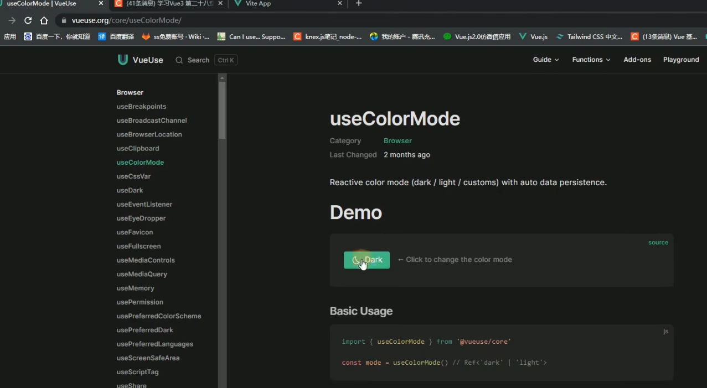
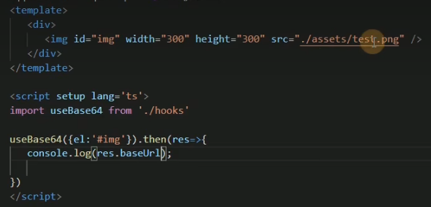
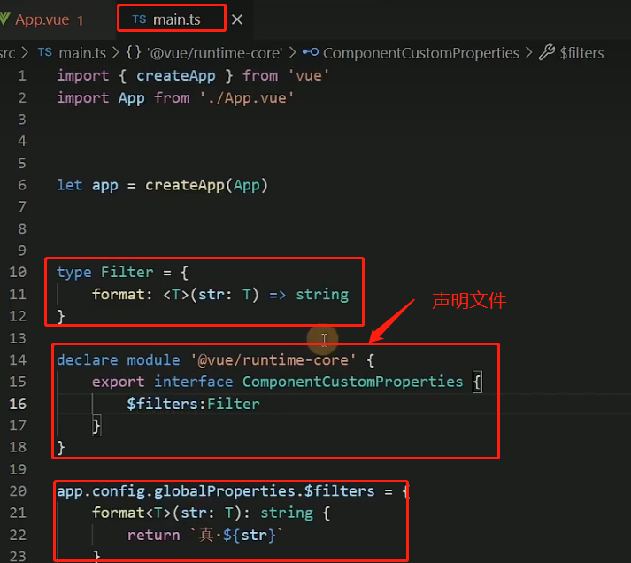
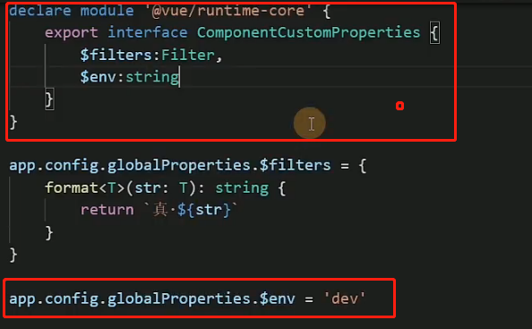
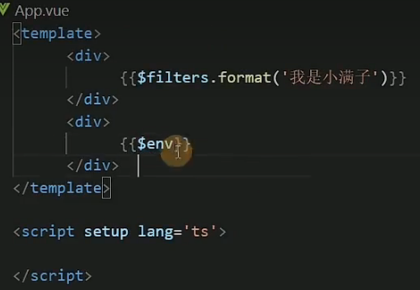
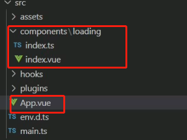
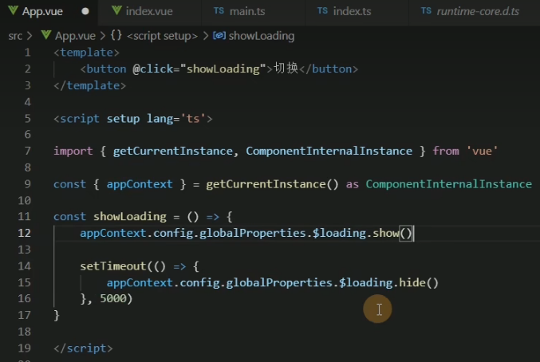
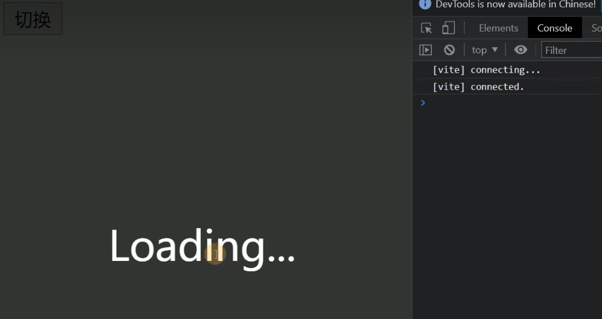

# 学习Vue3 第二十七章（自定义指令directive）

[toc]

directive-自定义指令（属于破坏性更新）

Vue中有v-if,v-for,v-bind，v-show,v-[model](https://so.csdn.net/so/search?q=model&spm=1001.2101.3001.7020) 等等一系列方便快捷的指令 今天一起来了解一下vue里提供的自定义指令

## 1.Vue3指令的[钩子函数](https://so.csdn.net/so/search?q=钩子函数&spm=1001.2101.3001.7020)

- **created** 元素初始化的时候
- **beforeMount** 指令绑定到元素后调用 只调用一次
- **mounted** 元素插入父级dom调用
- **beforeUpdate** 元素被更新之前调用
- **update** 这个周期方法被移除 改用**updated**
- **beforeUnmount** 在元素被移除前调用
- **unmounted** 指令被移除后调用 只调用一次

Vue2 指令 bind inserted update componentUpdated unbind

## 2.在setup内定义局部指令

但这里有一个需要注意的限制：必须以 `vNameOfDirective` 的形式来命名本地自定义指令，以使得它们可以直接在模板中使用。

```xml
<template>
  <button @click="show = !show">开关{{show}} ----- {{title}}</button>
  <Dialog  v-move-directive="{background:'green',flag:show}"></Dialog>
</template>


 
const vMoveDirective: Directive = {
  created: () => {
    console.log("初始化====>");
  },
  beforeMount(...args: Array<any>) {
    // 在元素上做些操作
    console.log("初始化一次=======>");
  },
  mounted(el: any, dir: DirectiveBinding<Value>) {
    el.style.background = dir.value.background;
    console.log("初始化========>");
  },
  beforeUpdate() {
    console.log("更新之前");
  },
  updated() {
    console.log("更新结束");
  },
  beforeUnmount(...args: Array<any>) {
    console.log(args);
    console.log("======>卸载之前");
  },
  unmounted(...args: Array<any>) {
    console.log(args);
    console.log("======>卸载完成");
  },
};
```

## 3.生命周期钩子参数详解

第一个 el 当前绑定的DOM 元素

第二个 binding

- `instance`：使用指令的组件实例。
- `value`：传递给指令的值。例如，在 `v-my-directive="1 + 1"` 中，该值为 `2`。
- `oldValue`：先前的值，仅在 `beforeUpdate` 和 `updated` 中可用。无论值是否有更改都可用。
- `arg`：传递给指令的参数(如果有的话)。例如在 `v-my-directive:foo` 中，arg 为 `"foo"`。
- `modifiers`：包含修饰符(如果有的话) 的对象。例如在 `v-my-directive.foo.bar` 中，修饰符对象为 `{foo: true，bar: true}`。
- `dir`：一个对象，在注册指令时作为参数传递。例如，在以下指令中


第三个 当前元素的虚拟DOM 也就是Vnode

第四个 prevNode 上一个虚拟节点，仅在 `beforeUpdate` 和 `updated` 钩子中可用 

## 4.函数简写

你可能想在 `mounted` 和 `updated` 时触发相同行为，而不关心其他的钩子函数。那么你可以通过将这个函数模式实现

```xml
<template>
   <div>
      <input v-model="value" type="text" />
      <A v-move="{ background: value }"></A>
   </div>
</template>
   
<script setup lang='ts'>
import A from './components/A.vue'
import { ref, Directive, DirectiveBinding } from 'vue'
let value = ref<string>('')
type Dir = {
   background: string
}
const vMove: Directive = (el, binding: DirectiveBinding<Dir>) => {
   el.style.background = binding.value.background
}
</script>
 
 
 
<style>
</style>
```

案例自定义拖拽指令 

```xml
<template>
  <div v-move class="box">
    <div class="header"></div>
    <div>
      内容
    </div>
  </div>
</template>
 
<script setup lang='ts'>
import { Directive } from "vue";
const vMove: Directive = {
  mounted(el: HTMLElement) {
    let moveEl = el.firstElementChild as HTMLElement;
    const mouseDown = (e: MouseEvent) => {
      //鼠标点击物体那一刻相对于物体左侧边框的距离=点击时的位置相对于浏览器最左边的距离-物体左边框相对于浏览器最左边的距离
      console.log(e.clientX, e.clientY, "-----起始", el.offsetLeft);
      let X = e.clientX - el.offsetLeft;
      let Y = e.clientY - el.offsetTop;
      const move = (e: MouseEvent) => {
        el.style.left = e.clientX - X + "px";
        el.style.top = e.clientY - Y + "px";
        console.log(e.clientX, e.clientY, "---改变");
      };
      document.addEventListener("mousemove", move);
      document.addEventListener("mouseup", () => {
        document.removeEventListener("mousemove", move);
      });
    };
    moveEl.addEventListener("mousedown", mouseDown);
  },
};
</script>
 
<style lang='less'>
.box {
  position: fixed;
  left: 50%;
  top: 50%;
  transform: translate(-50%, -50%);
  width: 200px;
  height: 200px;
  border: 1px solid #ccc;
  .header {
    height: 20px;
    background: black;
    cursor: move;
  }
}
</style>
```

# 学习Vue3 第二十八章（自定义Hooks）

vue3 自定义Hook

==主要用来处理复用代码逻辑的一些封装==

这个在vue2 就已经有一个东西是Mixins

## vue2的mixins的弊端

mixins就是将这些多个相同的逻辑抽离出来，各个组件只需要引入mixins，就能实现一次写代码，多组件受益的效果。

### ==会涉及到覆盖的问题==

**组件的data、methods、filters会覆盖mixins里的同名data、methods、filters。**


### 第二点就是 变量来源不明确（隐式传入），不利于阅读，使代码变得难以维护。

## Vue3 的自定义的hook

- Vue3 的 hook函数 相当于 vue2 的 mixin, 不同在与 ==hooks 是函数==
- Vue3 的 hook函数 可以帮助我们==提高代码的复用性, 让我们能在不同的组件中都利用 hooks 函数==

### Vue3 hook 库：VueUse ：[Get Started | VueUse](https://vueuse.org/guide/)



案例

```typescript
# Hooks/index.ts
import { onMounted } from 'vue'

type Options = {
    el: string
}
 
type Return = {
    Baseurl: string | null
}
export default function (option: Options): Promise<Return> {
 
    return new Promise((resolve) => {
        onMounted(() => {
            const file: HTMLImageElement = document.querySelector(option.el) as HTMLImageElement;
            file.onload = ():void => {
                resolve({
                    Baseurl: toBase64(file)
                })
            }
        })
        const toBase64 = (el: HTMLImageElement): string => {
            const canvas: HTMLCanvasElement = document.createElement('canvas')
            const ctx = canvas.getContext('2d') as CanvasRenderingContext2D
            canvas.width = el.width
            canvas.height = el.height
            ctx.drawImage(el, 0, 0, canvas.width,canvas.height)
            console.log(el.width);
            
            return canvas.toDataURL('image/png')
 
        }
    })
}
```



# 学习Vue3 第二十九章（Vue3自定义全局函数和变量）

## globalProperties

由于Vue3 没有Prototype 属性 使用 app.config.globalProperties 代替 然后去定义变量和函数

### Vue2

```javascript
// 之前 (Vue 2.x)
Vue.prototype.$http = () => {}
```

### Vue3

```javascript
// 之后 (Vue 3.x)
const app = createApp({})
app.config.globalProperties.$http = () => {}
```

## 过滤器：==在Vue3 移除了过滤器==

### 我们正好可以使用全局函数代替Filters

```typescript
app.config.globalProperties.$filters = {
  format<T extends any>(str: T): string {
    return `$${str}`
  }}
```

### 声明文件 不然TS无法正确类型 推导

```typescript
type Filter = {
    format: <T extends any>(str: T) => T
  }
// 声明要扩充@vue/runtime-core包的声明.
// 这里扩充"ComponentCustomProperties"接口, 因为他是vue3中实例的属性的类型.
  declare module '@vue/runtime-core' {
    export interface ComponentCustomProperties {
        $filters: Filter
    }  }
```



setup 读取值

```javascript
import { getCurrentInstance, ComponentInternalInstance } from 'vue';
const { appContext } = <ComponentInternalInstance>getCurrentInstance()
console.log(appContext.config.globalProperties.$env);
```



#### 使用：

 

# 学习Vue3 第三十章（编写Vue3自定义插件）

# 插件

插件是自包含的代码，通常向 Vue 添加全局级功能。你如果是一个对象需要有install方法Vue会帮你自动注入到install 方法 你如果是function 就直接当install 方法去使用

## 使用插件

在使用 `createApp()` 初始化 Vue 应用程序后，你可以通过调用 `use()` 方法将插件添加到你的应用程序中。

实现一个Loading



### Loading.Vue

```xml
<template>
    <div v-if="isShow" class="loading">
        <div class="loading-content">Loading...</div>
    </div>
</template>
    
<script setup lang='ts'>
import { ref } from 'vue';
const isShow = ref(false)//定位loading 的开关
 
const show = () => {
    isShow.value = true
}
const hide = () => {
    isShow.value = false
}
//对外暴露 当前组件的属性和方法
defineExpose({
    isShow,
    show,
    hide
})
</script>
<style scoped lang="less">
.loading {
    position: fixed;
    inset: 0;
    background: rgba(0, 0, 0, 0.8);
    display: flex;
    justify-content: center;
    align-items: center;
    &-content {
        font-size: 30px;
        color: #fff;
    }
}
</style>
```

### Loading.ts

```javascript
import {  createVNode, render, VNode, App } from 'vue';
import Loading from './index.vue'
 
export default {
    install(app: App) {
        //createVNode vue提供的底层方法 可以给我们组件创建一个虚拟DOM 也就是Vnode
        const vnode: VNode = createVNode(Loading)
        //render 把我们的Vnode 生成真实DOM 并且挂载到指定节点
        render(vnode, document.body)
        // Vue 提供的全局配置 可以自定义
        app.config.globalProperties.$loading = {
            show: () => vnode.component?.exposed?.show(),
            hide: () => vnode.component?.exposed?.hide()
        }}}
```

### Main.ts

```typescript
import Loading from './components/loading'
let app = createApp(App)
app.use(Loading)
type Lod = {
    show: () => void,
    hide: () => void
}
//编写ts loading 声明文件放置报错 和 智能提示
declare module '@vue/runtime-core' {
    export interface ComponentCustomProperties {
        $loading: Lod
    }
}
app.mount('#app')
```

