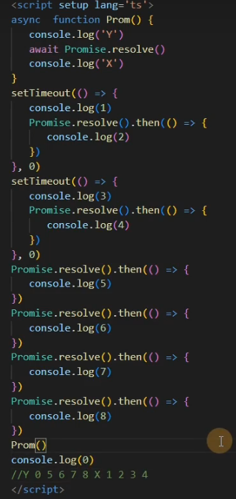
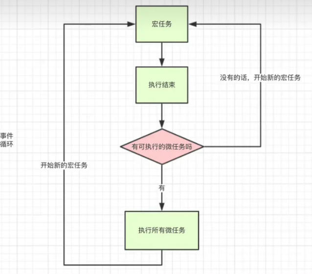
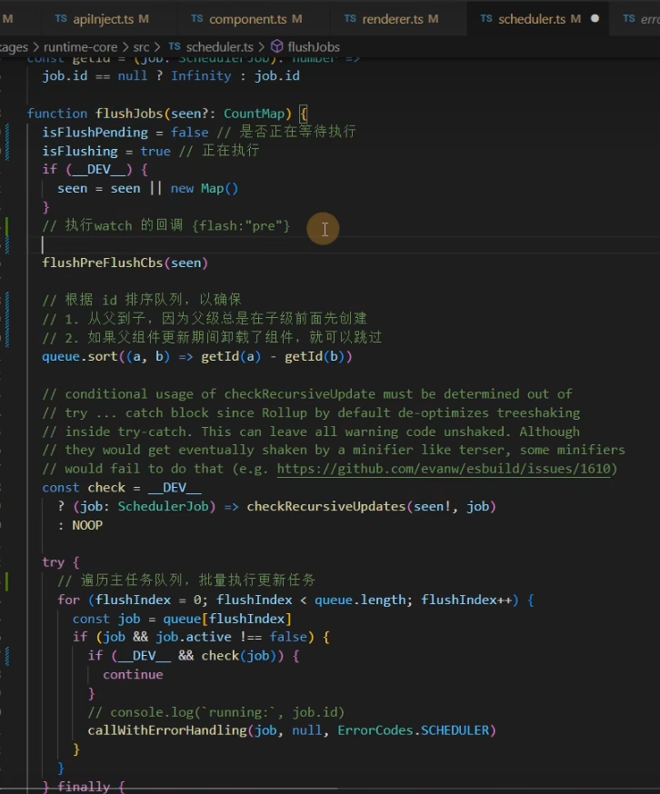

# 学习Vue3 第三十五章（Evnet Loop 和 nextTick）

[toc]

在我们学习nextTick 之前需要先了解Event Loop 事件循环机制

视频教程 [Vue3 + vite + Ts + pinia + 实战 + 源码 +全栈_哔哩哔哩_bilibili](https://www.bilibili.com/video/BV1dS4y1y7vd?p=51&vd_source=7313597670b28c3c44c50e326d82d040)

## JS 执行机制

在我们学js 的时候都知道js 是单线程的如果是[多线程](https://so.csdn.net/so/search?q=多线程&spm=1001.2101.3001.7020)的话会引发一个问题在同一时间同时操作DOM 一个增加一个删除JS就不知道到底要干嘛了，所以这个语言是单线程的但是随着HTML5到来js也支持了多线程webWorker 但是也是不允许操作DOM

单线程就意味着所有的任务都需要排队，后面的任务需要等前面的任务执行完才能执行，如果前面的任务耗时过长，后面的任务就需要一直等，一些从用户角度上不需要等待的任务就会一直等待，这个从体验角度上来讲是不可接受的，所以`JS`中就出现了异步的概念。

## 同步任务

代码从上到下按顺序执行

## 异步任务

### 1.宏任务

script(整体代码)、setTimeout、setInterval、UI交互事件、postMessage、Ajax

### 2.微任务

Promise.then catch finally、MutaionObserver、process.nextTick(Node.js 环境)

## 运行机制



所有的同步任务都是在主进程执行的形成一个执行栈，主线程之外，还存在一个"任务队列"，异步任务执行队列中先执行宏任务，然后清空当次宏任务中的所有微任务，然后进行下一个tick如此形成循环。

## `nextTick` 就是创建一个异步任务，那么它自然要等到同步任务执行完成后才执行。

```xml
<template>
   <div ref="xiaoman">
      {{ text }}
   </div>
   <button @click="change">change div</button>
</template>
   
<script setup lang='ts'>
import { ref,nextTick } from 'vue';
 
const text = ref('小满开飞机')
const xiaoman = ref<HTMLElement>()
 
const change = async () => {
   text.value = '小满不开飞机'
   console.log(xiaoman.value?.innerText) //小满开飞机
   await nextTick();
   console.log(xiaoman.value?.innerText) //小满不开飞机
}
</script>
<style  scoped>
</style>
```

### 源码地址 core\packages\runtime-core\src\scheduler.ts



```typescript
const resolvedPromise: Promise<any> = Promise.resolve()
let currentFlushPromise: Promise<void> | null = null
 
export function nextTick<T = void>(
  this: T,
  fn?: (this: T) => void
): Promise<void> {
  const p = currentFlushPromise || resolvedPromise
  return fn ? p.then(this ? fn.bind(this) : fn) : p
}
```

nextTick 接受一个参数fn（函数）定义了一个变量P 这个P最终返回都是Promise，最后是return 如果传了fn 就使用变量P.then执行一个微任务去执行fn函数，then里面this 如果有值就调用bind改变this指向返回新的函数，否则直接调用fn，如果没传fn，就返回一个promise，最终结果都会返回一个promise

在我们之前讲过的ref源码中有一段 triggerRefValue 他会去调用 triggerEffects

```csharp
export function triggerRefValue(ref: RefBase<any>, newVal?: any) {
  ref = toRaw(ref)
  if (ref.dep) {
    if (__DEV__) {
      triggerEffects(ref.dep, {
        target: ref,
        type: TriggerOpTypes.SET,
        key: 'value',
        newValue: newVal
      })
    } else {
      triggerEffects(ref.dep)
    }
  }
}


export function triggerEffects(
  dep: Dep | ReactiveEffect[],
  debuggerEventExtraInfo?: DebuggerEventExtraInfo
) {
  // spread into array for stabilization
  for (const effect of isArray(dep) ? dep : [...dep]) {
    if (effect !== activeEffect || effect.allowRecurse) {
      if (__DEV__ && effect.onTrigger) {
        effect.onTrigger(extend({ effect }, debuggerEventExtraInfo))
      }
      //当响应式对象发生改变后，执行 effect 如果有 scheduler 这个参数，会执行这个 scheduler 函数
      if (effect.scheduler) {
        effect.scheduler()
      } else {
        effect.run()
      }
    }
  }
}
```

那么scheduler 这个函数从哪儿来的 我们看这个类 ReactiveEffect

```typescript
export class ReactiveEffect<T = any> {
  active = true
  deps: Dep[] = []
  parent: ReactiveEffect | undefined = undefined
 
  /**
   * Can be attached after creation
   * @internal
   */
  computed?: ComputedRefImpl<T>
  /**
   * @internal
   */
  allowRecurse?: boolean
 
  onStop?: () => void
  // dev only
  onTrack?: (event: DebuggerEvent) => void
  // dev only
  onTrigger?: (event: DebuggerEvent) => void
 
  constructor(
    public fn: () => T,
    public scheduler: EffectScheduler | null = null, //我在这儿 
    scope?: EffectScope
  ) {
    recordEffectScope(this, scope)
  }
```

scheduler 作为一个参数传进来的

```javascript
   const effect = (instance.effect = new ReactiveEffect(
      componentUpdateFn,
      () => queueJob(instance.update),
      instance.scope // track it in component's effect scope
    ))
```

他是在初始化 effect 通过 queueJob 传进来的

```cpp
//queueJob 维护job列队，有去重逻辑，保证任务的唯一性，每次调用去执行，被调用的时候去重，每次调用去执行 queueFlush
export function queueJob(job: SchedulerJob) {
  // 判断条件：主任务队列为空 或者 有正在执行的任务且没有在主任务队列中  && job 不能和当前正在执行任务及后面待执行任务相同
  // 重复数据删除：
  // - 使用Array.includes(Obj, startIndex) 的 起始索引参数：startIndex
  // - startIndex默认为包含当前正在运行job的index，此时，它不能再次递归触发自身
  // - 如果job是一个watch()回调函数或者当前job允许递归触发，则搜索索引将+1，以允许他递归触发自身-用户需要确保回调函数不会死循环
  if (
    (!queue.length ||
      !queue.includes(
        job,
        isFlushing && job.allowRecurse ? flushIndex + 1 : flushIndex
      )) &&
    job !== currentPreFlushParentJob
  ) {
    if (job.id == null) {
      queue.push(job)
    } else {
      queue.splice(findInsertionIndex(job.id), 0, job)
    }
    queueFlush()
  }
}
```

 queueJob 维护job列队 并且调用 queueFlush

```javascript
function queueFlush() {
  // 避免重复调用flushJobs
  if (!isFlushing && !isFlushPending) {
    isFlushPending = true
     //开启异步任务处理flushJobs
    currentFlushPromise = resolvedPromise.then(flushJobs)
  }
}
```

queueFlush 给每一个队列创建了微任务