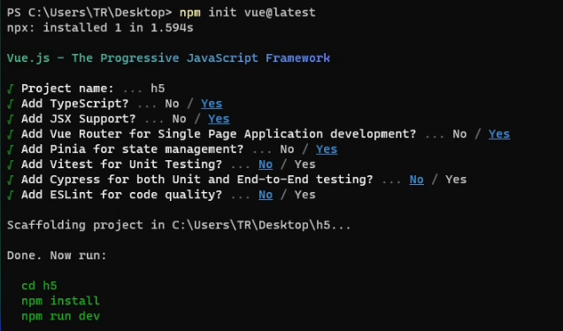

# 小满Vue3第三十六章（Vue如何开发移动端）

[toc]

## 开发移动端最主要的就是适配各种手机，为此我研究了一套解决方案

在之前我们用的是rem 根据HTML font-size 去做缩放

现在有了更好用的vw vh

vw 视口的最大宽度，1vw等于视口宽度的百分之一

vh 视口的最大高度，1vh等于视口高度的百分之一

## 1.安装依赖



```css
npm install postcss-px-to-viewport -D
```

因为vite中已经内联了[postcss](https://so.csdn.net/so/search?q=postcss&spm=1001.2101.3001.7020)，所以并不需要额外的创建 postcss.config.js文件

### vite.config.ts

```javascript
import { fileURLToPath, URL } from 'url'
 
import { defineConfig } from 'vite'
import vue from '@vitejs/plugin-vue'
import vueJsx from '@vitejs/plugin-vue-jsx'
import postcsspxtoviewport from "postcss-px-to-viewport" //插件
// https://vitejs.dev/config/
export default defineConfig({
  plugins: [vue(), vueJsx()],
  css: {
    postcss: {
      plugins: [
        postcsspxtoviewport({
          unitToConvert: 'px', // 要转化的单位
          viewportWidth: 750, // UI设计稿的宽度
          unitPrecision: 6, // 转换后的精度，即小数点位数
          propList: ['*'], // 指定转换的css属性的单位，*代表全部css属性的单位都进行转换
          viewportUnit: 'vw', // 指定需要转换成的视窗单位，默认vw
          fontViewportUnit: 'vw', // 指定字体需要转换成的视窗单位，默认vw
          selectorBlackList: ['ignore-'], // 指定不转换为视窗单位的类名，
          minPixelValue: 1, // 默认值1，小于或等于1px则不进行转换
          mediaQuery: true, // 是否在媒体查询的css代码中也进行转换，默认false
          replace: true, // 是否转换后直接更换属性值
          landscape: false // 是否处理横屏情况
        })
      ]
    }
  },
  resolve: {
    alias: {
      '@': fileURLToPath(new URL('./src', import.meta.url))
    }
  }
})
```

***\*如果你用的vite 是 ts 他这个插件并没有提供声明文件我已经帮大家写好了声明文件（良心）\****

```typescript
declare module 'postcss-px-to-viewport' {
 
    type Options = {
        unitToConvert: 'px' | 'rem' | 'cm' | 'em',
        viewportWidth: number,
        viewportHeight: number, // not now used; TODO: need for different units and math for different properties
        unitPrecision: number,
        viewportUnit: string,
        fontViewportUnit: string,  // vmin is more suitable.
        selectorBlackList: string[],
        propList: string[],
        minPixelValue: number,
        mediaQuery: boolean,
        replace: boolean,
        landscape: boolean,
        landscapeUnit: string,
        landscapeWidth: number
    }
 
    export default (options: Partial<Options>) => any
}
```

引入声明文件 tsconfig.app **postcss-px-to-viewport.d.ts跟vite.ts同级**

```json
{
  "extends": "@vue/tsconfig/tsconfig.web.json",
  "include": ["env.d.ts", "src/**/*", "src/**/*.vue", "postcss-px-to-viewport.d.ts"],
  "exclude": ["src/**/__tests__/*"],
  "compilerOptions": {
    "composite": true,
    "baseUrl": ".",
    "paths": {
      "@/*": ["./src/*"]
    }
  }
}
```

代码案例

```xml
<template>
  <div class="wraps">
    <header class="header">
      <div>left</div>
      <div>中间</div>
      <div>right</div>
    </header>
 
    <main class="main">
      <div class="main-items" v-for="item in 100">
        <div class="main-port">头像</div>
        <div class="main-desc">
          <div>小满{{item}}</div>
          <div>你妈妈喊你回家穿丝袜啦</div>
        </div>
      </div>
    </main>
 
 
    <footer class="footer">
      <div class="footer-items" v-for="item in footer">
        <div>{{ item.icon }}</div>
        <div>{{ item.text }}</div>
      </div>
    </footer>
  </div>
 
</template>
  
<script setup lang='ts'>
import { reactive } from 'vue';
 
type Footer<T> = {
  icon: T,
  text: T
}
 
const footer = reactive<Footer<string>[]>([
  {
    icon: "1",
    text: "首页"
  },
  {
    icon: "2",
    text: "商品"
  },
  {
    icon: "3",
    text: "信息"
  },
  {
    icon: "4",
    text: "我的"
  }
])
</script>
  
<style lang="less">
@import url('@/assets/base.css');
 
html,
body,
#app {
  height: 100%;
  overflow: hidden;
  font-size: 14px;
}
 
.wraps {
  height: inherit;
  overflow: hidden;
  display: flex;
  flex-direction: column;
}
 
.header {
  background-color: pink;
  display: flex;
  height: 30px;
  align-items: center;
  justify-content: space-around;
 
  div:nth-child(1) {
    width: 40px;
  }
 
  div:nth-child(2) {
    text-align: center;
  }
 
  div:nth-child(3) {
    width: 40px;
    text-align: right;
  }
}
 
.main {
  flex: 1;
  overflow: auto;
 
  &-items {
    display: flex;
    border-bottom: 1px solid #ccc;
    box-sizing: border-box;
    padding: 5px;
  }
 
  &-port {
    background: black;
    width: 30px;
    height: 30px;
    border-radius: 200px;
  }
  &-desc{
     margin-left:10px;
     div:last-child{
        font-size: 10px;
        color:#333;
        margin-top: 5px;
     }
  }
}
 
.footer {
 
  border-top: 1px solid #ccc;
  display: grid;
  grid-template-columns: 1fr 1fr 1fr 1fr;
 
  &-items {
    display: flex;
    flex-direction: column;
    justify-content: center;
    align-items: center;
    padding: 5px;
  }
}
</style>
```


 **基本适配百分之99的屏幕**

## 如何将我们的Vue 项目打包成App（会安卓的可以跳过）

### 1.安装JDK [Java Downloads | Oracle](https://www.oracle.com/java/technologies/downloads/#java8-windows)

1. 配置环境变量:JAVA_HOME

 

2. CLASSPATH （下面的照抄就行）

```crystal
.;%JAVA_HOME%\lib\dt.jar;%JAVA_HOME%\lib\tools.jar;
```

3. 最后一个Path： 添加 %JAVA_HOME%\bin


### 2.安卓编辑器下载地址（建议科学上网不然很慢）https://developer.android.com/

一直next 就行了 然后磁盘选一下 安装就可以了 

装完启动需要还需要安装sdk 然后就可以打开了

#### 新建一个空项目选这个就可以了


 语言会java选java 会别的就选别的


####  等待加载完成


#### 打开之后可以创建一个虚拟机


####  创建完成之后就可以运行安卓项目


 其实就是一个虚拟手机


#### 切换成代码模式


 修改成以下代码

```xml
<?xml version="1.0" encoding="utf-8"?>
<LinearLayout  xmlns:android="http://schemas.android.com/apk/res/android"
    android:id="@+id/activity_main"
    android:layout_width="match_parent"
    android:orientation="vertical"
    android:layout_height="match_parent">
 
    <WebView
        android:id="@+id/web_view"
        android:layout_width="match_parent"
        android:layout_height="match_parent" />
</LinearLayout  >
```

 其实就是类似于我们前端的display felx 

1. webView 就和小程序的webView 基本一样 套网页的

2. **match_parent表示让当前控件的大小和父布局的大小一样，也就是让父布局来决定当前控件的大小**


java 代码逻辑

```scala
package com.example.myapplication;
 import androidx.appcompat.app.AppCompatActivity;
 import android.os.Bundle;
 import android.webkit.WebView;
 import android.app.Activity;
 import android.webkit.WebViewClient;
 public class MainActivity extends Activity {
     @Override
    protected void onCreate(Bundle savedInstanceState) {
        super.onCreate(savedInstanceState);
        //设置一个Activity的显示界面，
        setContentView(R.layout.activity_main);
 
        WebView view = (WebView)findViewById(R.id.web_view);
        //设置 WebView 属性，能够执行 Javascript 脚本
        view.getSettings().setJavaScriptEnabled(true);
        //加载需要显示的网页 不能使用局域网地址 只能虚拟机专属地址 http://10.0.2.2 端口是我们vue 项目端口
        view.loadUrl("http://10.0.2.2:3000");
         view.setWebViewClient(new WebViewClient());
    }}
```


```
加载需要显示的网页 不能使用局域网地址 只能虚拟机专属地址 http://10.0.2.2 端口是我们vue 项目端口
```


 配置权限


```xml
<?xml version="1.0" encoding="utf-8"?>
<manifest xmlns:android="http://schemas.android.com/apk/res/android"
    xmlns:tools="http://schemas.android.com/tools"
    package="com.example.myapplication">
 
    <application
        android:allowBackup="true"
        android:dataExtractionRules="@xml/data_extraction_rules"
        android:fullBackupContent="@xml/backup_rules"
        android:icon="@mipmap/ic_launcher"
        android:label="@string/app_name"
        android:roundIcon="@mipmap/ic_launcher_round"
        android:supportsRtl="true"
        android:theme="@style/Theme.MyApplication"
        android:usesCleartextTraffic="true"
        tools:targetApi="31">
        <activity
            android:name=".MainActivity"
            android:exported="true">
            <intent-filter>
                <action android:name="android.intent.action.MAIN" />
 
                <category android:name="android.intent.category.LAUNCHER" />
            </intent-filter>
        </activity>
    </application>
    <uses-permission android:name="android.permission.INTERNET" />
    <uses-permission android:name="android.permission.ACCESS_NETWORK_STATE" />
    <uses-permission android:name="android.permission.ACCESS_WIFI_STATE" />
</manifest>
```

 

 你就可以看到我们的项目了

### 最后打包

打包的时候路径记得换成线上的服务器地址


 安卓手机实测

