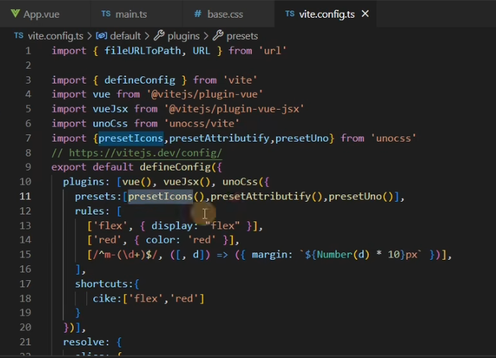

# 小满Vue3第三十七章（unocss原子化）

[toc]

## [重新构想原子化CSS - 知乎](https://zhuanlan.zhihu.com/p/425814828)

## 什么是css原子化？

CSS原子化的优缺点

1.减少了css体积，提高了css复用

2.减少起名的复杂度

3.增加了记忆成本 将css拆分为原子之后，你势必要记住一些class才能书写，哪怕tailwindcss提供了完善的工具链，你写background，也要记住开头是bg

## 接入unocss

**tips：最好用于vite ==webpack属于阉割版功能很少==**

### 安装 

```css
npm i -D unocss
```

### vite.config.ts 

```javascript
import unocss from 'unocss/vite'
 
 plugins: [vue(), vueJsx(),unocss({
      rules:[
        
      ]
  })],
```

### main.ts 引入

```javascript
import 'uno.css'
```

### 配置静态css

```css
rules: [
  ['flex', { display: "flex" }]
]
```


### 配置动态css（使用[正则表达式](https://so.csdn.net/so/search?q=正则表达式&spm=1001.2101.3001.7020)）

m-参数*10  例如 m-10 就是 [margin](https://so.csdn.net/so/search?q=margin&spm=1001.2101.3001.7020):100px

```javascript
rules: [
  [/^m-(\d+)$/, ([, d]) => ({ margin: `${Number(d) * 10}px` })],
  ['flex', { display: "flex" }]
]
```

 


### shortcuts 可以自定义组合样式

```css
  plugins: [vue(), vueJsx(), unocss({
    rules: [
      [/^m-(\d+)$/, ([, d]) => ({ margin: `${Number(d) * 10}px` })],
      ['flex', { display: "flex" }],
      ['pink', { color: 'pink' }]
    ],
    shortcuts: {
      btn: "pink flex"   // ['flex','pink']
    }
  })],
```


###  unocss 预设

```css
 presets:[presetIcons(),presetAttributify(),presetUno()]
```

1.presetIcons Icon图标预设


#### 图标集合安装

```css
npm i -D @iconify-json/ic
```

首先我们去[icones](https://icones.js.org/)官网（方便浏览和使用iconify）浏览我们需要的icon，比如这里我用到了Google Material Icons图标集里面的baseline-add-circle图标


```javascript
<div  class="i-ic-baseline-backspace text-3xl bg-green-500" />
```


#### 2.presetAttributify 属性化模式支持

属性语义化 无须class   <div flex red m="1"></div>

```xml
<div font="black">
     btn
</div>
```


#### 3.presetUno 工具类预设

默认的 `@unocss/preset-uno` 预设（**实验阶段**）是一系列流行的原子化框架的 **通用超集**，包括了 Tailwind CSS，Windi CSS，Bootstrap，Tachyons 等。

例如，`ml-3`（Tailwind），`ms-2`（Bootstrap），`ma4`（Tachyons），`mt-10px`（Windi CSS）均会生效。

