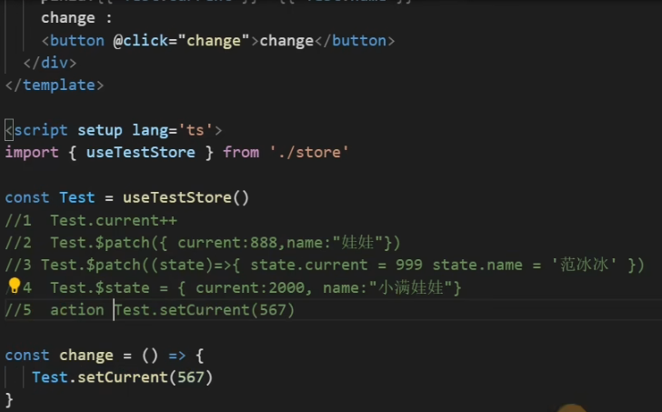
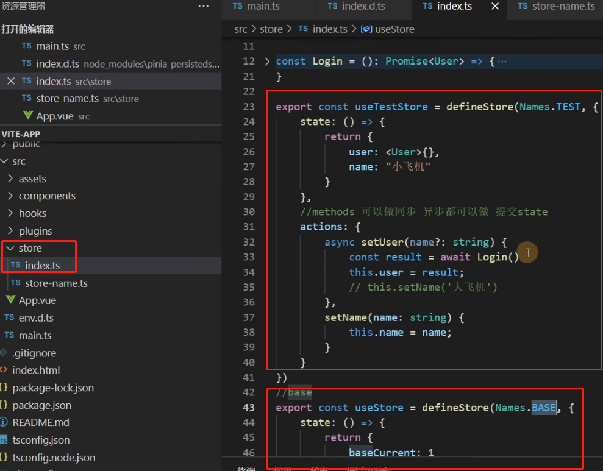
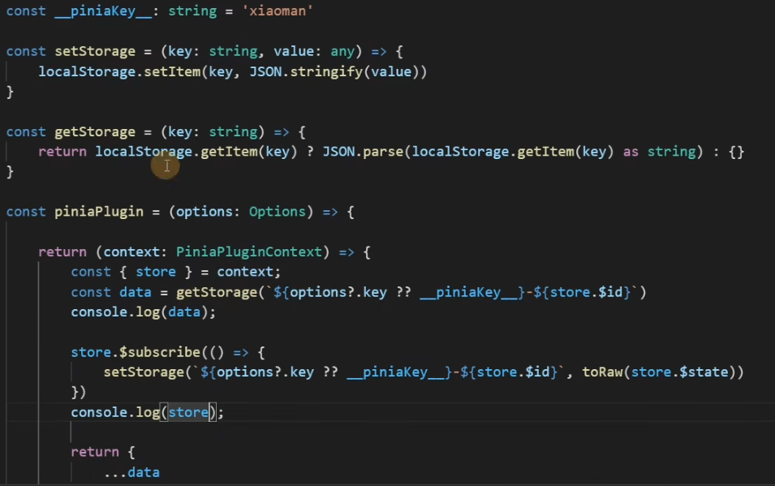

# 学习Pinia 第一章（介绍Pinia）

[toc]

## Pinia 全局状态管理工具

Pinia.js 有如下特点：

- 完整的 ts 的支持；
- 足够轻量，压缩后的体积只有1kb左右;
- 去除 mutations，只有 state，getters，actions；
- actions 支持同步和异步；
- 代码扁平化没有模块嵌套，只有 store 的概念，store 之间可以自由使用，每一个store都是独立的
- 无需手动添加 store，store 一旦创建便会自动添加；
- 支持Vue3 和 Vue2

官方文档[Pinia](https://pinia.vuejs.org/)

git 地址 https://github.com/vuejs/pinia

## 1.起步 安装

```csharp
yarn add pinia
npm install pinia
```

## 2.引入注册Vue3

```javascript
import { createApp } from 'vue'
import App from './App.vue'
import {createPinia} from 'pinia'
 
const store = createPinia()
let app = createApp(App)
 
 
app.use(store)
 
app.mount('#app')
```

Vue2 使用

```javascript
import { createPinia, PiniaVuePlugin } from 'pinia'
 
Vue.use(PiniaVuePlugin)
const pinia = createPinia()
 
new Vue({
  el: '#app',
  // other options...
  // ...
  // note the same `pinia` instance can be used across multiple Vue apps on
  // the same page
  pinia,
})
```

# 学习Pinia 第二章（初始化仓库Store）

## 初始化仓库Store

### **1.新建一个文件夹Store**

### **2.新建文件[name].ts**

### **3.定义仓库Store**

```javascript
import { defineStore } from 'pinia'
```

### **4.我们需要知道存储是使用定义的`defineStore()`，并且它需要一个唯一的名称，作为第一个参数传递**

我这儿名称抽离出去了

新建文件store-namespace/index.ts

```objectivec
export const enum Names {
    Test = 'TEST'
}
```

store 引入

```javascript
import { defineStore } from 'pinia'
import { Names } from './store-namespce'
 
export const useTestStore = defineStore(Names.Test, {
     state:()=>{
         return {
             current:1
         }
     }
})
```

这个*名称*，也称为*id*，==是必要的==，Pania 使用它来将商店连接到 devtools。将返回的函数命名为*use...*是可组合项之间的约定，以使其使用习惯。

### **5.定义值**

**State 箭头函数 返回一个对象 在对象里面定义值**

```coffeescript
import { defineStore } from 'pinia'
import { Names } from './store-namespce'
 
export const useTestStore = defineStore(Names.Test, {
     state:()=>{
         return {
             current:1
         }
     },
     //类似于computed 可以帮我们去修饰我们的值
     getters:{
     },
     //可以操作异步 和 同步提交state
     actions:{
     }
})
```

# 学习Pinia 第三章（State）



## 1.State 是允许直接修改值的 例如current++

```xml
<template>
     <div>
         <button @click="Add">+</button>
          <div>
             {{Test.current}}
          </div>
     </div>
</template>
 
<script setup lang='ts'>
import {useTestStore} from './store'
const Test = useTestStore()
const Add = () => {
    Test.current++
}
 
</script>
 
<style>
 
</style>
```

## 2.批量修改State的值：\$patch()

在他的实例上有$patch方法可以批量修改多个值

```xml
<template>
     <div>
         <button @click="Add">+</button>
          <div>
             {{Test.current}}
          </div>
          <div>
            {{Test.age}}
          </div>
     </div>
</template>
 
<script setup lang='ts'>
import {useTestStore} from './store'
const Test = useTestStore()
const Add = () => {
    Test.$patch({
       current:200,
       age:300
    })
}
 
</script>
 
<style>
 
</style>
```

## 3.批量修改函数形式

推荐使用函数形式 可以自定义修改逻辑

```xml
<template>
     <div>
         <button @click="Add">+</button>
          <div>
             {{Test.current}}
          </div>
          <div>
            {{Test.age}}
          </div>
     </div>
</template>
 
<script setup lang='ts'>
import {useTestStore} from './store'
const Test = useTestStore()
const Add = () => {
    Test.$patch((state)=>{
       state.current++;
       state.age = 40
    })
}
 
</script>
 
<style>
 
</style>
```

## 4.通过原始对象修改整个实例:\$state

`$state`您可以通过将store的属性设置为新对象来替换store的整个状态

==缺点就是必须修改整个对象的所有属性==

```xml
<template>
     <div>
         <button @click="Add">+</button>
          <div>
             {{Test.current}}
          </div>
          <div>
            {{Test.age}}
          </div>
     </div>
</template>
 
<script setup lang='ts'>
import {useTestStore} from './store'
const Test = useTestStore()
const Add = () => {
    Test.$state = {
       current:10,
       age:30
    }    
}
 
</script>
 
<style>
 
</style>
```

## 5.通过actions修改:this

1. 定义Actions: 在actions 中直接使用this就可以指到state里面的值

```javascript
import { defineStore } from 'pinia'
import { Names } from './store-naspace'
export const useTestStore = defineStore(Names.TEST, {
     state:()=>{
         return {
            current:1,
            age:30
         }
     },
 
     actions:{
         setCurrent () {
             this.current++
         }
     }
})
```

2. 使用方法直接在实例调用

```xml
<template>
     <div>
         <button @click="Add">+</button>
          <div>
             {{Test.current}}
          </div>
          <div>
            {{Test.age}}
          </div>
     </div>
</template>
 
<script setup lang='ts'>
import {useTestStore} from './store'
const Test = useTestStore()
const Add = () => {
     Test.setCurrent()
}
 
</script>
 
<style>
 
</style>
```


# 学习Pinia 第四章（解构store）

## 在Pinia是不允许直接解构: ==是会失去响应性的==

```javascript
const Test = useTestStore()
const { current, name } = Test
console.log(current, name);
```

### 差异对比

修改Test current 解构完之后的数据不会变

而源数据是会变的

```xml
<template>
  <div>origin value {{Test.current}}</div>
  <div>
    pinia:{{ current }}--{{ name }}
    change :
    <button @click="change">change</button>
  </div>
</template>
  
<script setup lang='ts'>
import { useTestStore } from './store'
 
const Test = useTestStore()
 
const change = () => {
   Test.current++
}
 
const { current, name } = Test
 
console.log(current, name);
 
 
</script>
  
<style>
</style>
```

### 解决方案可以使用 storeToRefs

```javascript
import { storeToRefs } from 'pinia'
 
const Test = useTestStore()
 
const { current, name } = storeToRefs(Test)
```

其原理跟toRefs 一样的给里面的数据包裹一层toref

源码 通过toRaw使store变回原始数据防止重复代理

循环store 通过 isRef isReactive 判断 如果是响应式对象直接拷贝一份给refs 对象 将其原始对象包裹toRef 使其变为响应式对象 


# 学习Pinia 第五章（Actions，getters）

## Actions（支持同步异步）

### 1.同步 直接调用即可

```vue
import { defineStore } from 'pinia'
import { Names } from './store-naspace'
export const useTestStore = defineStore(Names.TEST, {
    state: () => ({
        counter: 0,
    }),
    actions: {
        increment() {
            this.counter++
        },
        randomizeCounter() {
            this.counter = Math.round(100 * Math.random())
        },
    },
})
```

```javascript
<template>
     <div>
         <button @click="Add">+</button>
          <div>
             {{Test.counter}}
          </div>    
     </div>
</template>
 
<script setup lang='ts'>
import {useTestStore} from './store'
const Test = useTestStore()
const Add = () => {
     Test.randomizeCounter()
}
 
</script>
 
<style>
 
</style>
```

### 2.异步 可以结合async await 修饰

```typescript
import { defineStore } from 'pinia'
import { Names } from './store-naspace'
 
type Result = {
    name: string
    isChu: boolean
}
 
const Login = (): Promise<Result> => {
    return new Promise((resolve) => {
        setTimeout(() => {
            resolve({
                name: '小满',
                isChu: true
            })
        }, 3000)
    })
}
 
export const useTestStore = defineStore(Names.TEST, {
    state: () => ({
        user: <Result>{},
        name: "123"
    }),
    actions: {
        async getLoginInfo() {
            const result = await Login()
            this.user = result;
        }
    },
})
```

template

```xml
<template>
     <div>
         <button @click="Add">test</button>
          <div>
             {{Test.user}}
          </div>    
     </div>
</template>
 
<script setup lang='ts'>
import {useTestStore} from './store'
const Test = useTestStore()
const Add = () => {
     Test.getLoginInfo()
}
 
</script>
 
<style>
 
</style>
```

### 3.多个action互相调用getLoginInfo setName

```typescript
    state: () => ({
        user: <Result>{},
        name: "default"
    }),
    actions: {
        async getLoginInfo() {
            const result = await Login()
            this.user = result;
            this.setName(result.name)
        },
        setName (name:string) {
            this.name = name;
        }
    },
```

## getters

1.使用箭头函数不能使用this this指向已经改变指向undefined 修改值请用state

主要作用类似于computed 数据修饰并且有缓存

```javascript
    getters:{
       newPrice:(state)=>  `$${state.user.price}`
    },
```

2.普通函数形式可以使用this

```kotlin
    getters:{
       newCurrent ():number {
           return ++this.current
       }
    },
```

3.getters 互相调用

```kotlin
    getters:{
       newCurrent ():number | string {
           return ++this.current + this.newName
       },
       newName ():string {
           return `$-${this.name}`
       }
    },
```

# 学习Pinia 第六章（API）

## 1.$[reset](https://so.csdn.net/so/search?q=reset&spm=1001.2101.3001.7020)

重置`store`到他的初始状态

```css
state: () => ({
     user: <Result>{},
     name: "default",
     current:1
}),
```

Vue 例如我把值改变到了10

```coffeescript
const change = () => {
     Test.current++
}
```

调用$reset();

将会把state所有值 重置回 原始状态

## 2.订阅state的改变

类似于Vuex 的abscribe 只要有state 的变化就会走这个函数

```javascript
Test.$subscribe((args,state)=>{
   console.log(args,state);
   
})
```

返回值


第二个参数

如果你的组件卸载之后还想继续调用请设置第二个参数

```javascript
Test.$subscribe((args,state)=>{
   console.log(args,state);
   
},{
  detached:true,
    deep:true,
    flush:'post',
})
```

## 3.订阅Actions的调用

 只要有actions被调用就会走这个函数

```javascript
Test.$onAction((args)=>{
   console.log(args);
   
},true)
```


# 学习Pinia 第七章（pinia插件）

pinia 和 vuex 都有一个通病 页面刷新状态会丢失

我们可以写一个pinia 插件缓存他的值

**视频教程(强烈建议)** [Vue3 + vite + Ts + pinia + 实战 + 源码_哔哩哔哩_bilibili](https://www.bilibili.com/video/BV1dS4y1y7vd?p=49)

```typescript
const __piniaKey = '__PINIAKEY__'
//定义兜底变量
 
 
type Options = {
   key?:string
}
//定义入参类型
 
 
 
//将数据存在本地
const setStorage = (key: string, value: any): void => {
 
localStorage.setItem(key, JSON.stringify(value))
 
}
 
 
//存缓存中读取
const getStorage = (key: string) => {
 
return (localStorage.getItem(key) ? JSON.parse(localStorage.getItem(key) as string) : {})
 
}
 
 
//利用函数柯丽华接受用户入参
const piniaPlugin = (options: Options) => {
 
//将函数返回给pinia  让pinia  调用 注入 context
return (context: PiniaPluginContext) => {
 
const { store } = context;
 
const data = getStorage(`${options?.key ?? __piniaKey}-${store.$id}`)
 
store.$subscribe(() => {
 
setStorage(`${options?.key ?? __piniaKey}-${store.$id}`, toRaw(store.$state));
 
})
 
//返回值覆盖pinia 原始值
return {
 
...data
 
}
 
}
 
}
 
 
//初始化pinia
const pinia = createPinia()
 
 
//注册pinia 插件
pinia.use(piniaPlugin({
 
key: "pinia"
 
}))
```

