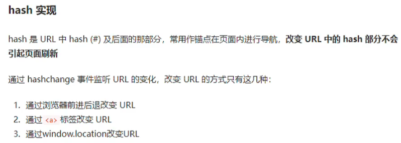

# 小满Router（第一章入门）

[toc]

## 1，router 路由

应为vue是单页应用不会有那么多html 让我们跳转 所有要使用路由做页面的跳转

Vue 路由允许我们通过不同的 URL 访问不同的内容。通过 Vue 可以实现多视图的单页Web应用

## 2.安装

### 构建前端项目

```kotlin
npm init vue@latest
//或者
npm init vite@latest
```

### 使用Vue3 安装对应的router4版本

使用Vue2 安装对应的router3版本

```css
npm install vue-router@4
```

### 在src目录下面新建router 文件 然后在router 文件夹下面新建 index.ts

```javascript
//引入路由对象
import { createRouter, createWebHistory, createWebHashHistory, createMemoryHistory, RouteRecordRaw } from 'vue-router'
 
//vue2 mode history vue3 createWebHistory
//vue2 mode  hash  vue3  createWebHashHistory
//vue2 mode abstact vue3  createMemoryHistory
 
//路由数组的类型 RouteRecordRaw
// 定义一些路由
// 每个路由都需要映射到一个组件。
const routes: Array<RouteRecordRaw> = [{
    path: '/',
    component: () => import('../components/a.vue')
},{
    path: '/register',
    component: () => import('../components/b.vue')
}]
 const router = createRouter({
    history: createWebHistory(),
    routes
})
 
//导出router
export default router
```





### `router-link`[#](https://router.vuejs.org/zh/guide/#router-link)

请注意，我们没有使用常规的 `a` 标签，而是使用一个自定义组件 `router-link` 来创建链接。这使得 Vue Router 可以在不重新加载页面的情况下更改 URL，处理 URL 的生成以及编码。我们将在后面看到如何从这些功能中获益。

### `router-view`[#](https://router.vuejs.org/zh/guide/#router-view)

`router-view` 将显示与 url 对应的组件。你可以把它放在任何地方，以适应你的布局。

```xml
<template>
  <div>
    <h1>小满最骚</h1>
    <div>
    <!--使用 router-link 组件进行导航 -->
    <!--通过传递 `to` 来指定链接 -->
    <!--`<router-link>` 将呈现一个带有正确 `href` 属性的 `<a>` 标签-->
      <router-link tag="div" to="/">跳转a</router-link>
      <router-link tag="div" style="margin-left:200px" to="/register">跳转b</router-link>
    </div>
    <hr />
    <!-- 路由出口 -->
    <!-- 路由匹配到的组件将渲染在这里 -->
    <router-view></router-view>
  </div>
</template>
```

### 最后在main.ts 挂载

```javascript
import { createApp } from 'vue'
import App from './App.vue'
import router from './router'
createApp(App).use(router).mount('#app')
```

# 小满Router（第二章-命名路由-编程式导航）

## 命名路由

除了 `path` 之外，你还可以为任何路由提供 `name`。这有以下优点：

- 没有硬编码的 URL
- `params` 的自动编码/解码。
- 防止你在 url 中出现打字错误。
- 绕过路径排序（如显示一个）

```coffeescript
const routes:Array<RouteRecordRaw> = [
    {
        path:"/",
        name:"Login",
        component:()=> import('../components/login.vue')
    },
    {
        path:"/reg",
        name:"Reg",
        component:()=> import('../components/reg.vue')
    }
]
```

router-link跳转方式需要改变 变为对象并且有对应name

```xml
    <h1>小满最骚</h1>
    <div>
      <router-link :to="{name:'Login'}">Login</router-link>
      <router-link style="margin-left:10px" :to="{name:'Reg'}">Reg</router-link>
    </div>
    <hr />
```

## 编程式导航

除了使用 `<router-link>` 创建 a 标签来定义导航链接，我们还可以借助 router 的实例方法，通过编写代码来实现。

### 1.字符串模式

```javascript
import { useRouter } from 'vue-router'
const router = useRouter()
 
const toPage = () => {
  router.push('/reg')
}
```

### 2.对象模式

```javascript
import { useRouter } from 'vue-router'
const router = useRouter()
 
const toPage = () => {
  router.push({
    path: '/reg'
  })
}
```

### 3.命名式路由模式

```javascript
import { useRouter } from 'vue-router'
const router = useRouter()
 
const toPage = () => {
  router.push({
    name: 'Reg'
  })
}
```

## a标签跳转:会刷新页面

直接通过a href也可以跳转但是会刷新页面

```xml
 <a href="/reg">rrr</a>
```

# 小满Router（第三章-历史记录）

## replace的使用

采用replace进行页面的跳转会同样也会创建渲染新的Vue组件，但是在history中其不会重复保存记录，而是替换原有的vue组件；

### router-link 使用方法

```xml
<router-link replace to="/">Login</router-link>
   <router-link replace style="margin-left:10px" to="/reg">Reg</router-link>
```

### 编程式导航

```xml
<button @click="toPage('/')">Login</button>
<button @click="toPage('/reg')">Reg</button>
```

js

```typescript
import { useRouter } from 'vue-router'
const router = useRouter()
 
const toPage = (url: string) => {
  router.replace(url)
}
```

## 横跨历史

该方法采用一个整数作为参数，表示在历史堆栈中前进或后退多少步

```xml
 <button @click="next">前进</button>
 <button @click="prev">后退</button>
const next = () => {
  //前进 数量不限于1
  router.go(1)
}
 
const prev = () => {
  //后退
  router.back()
}
```

# 小满Router（第四章-路由传参）

## Query路由传参

编程式导航 使用router push 或者 replace 的时候 改为对象形式新增query 必须传入一个对象


```coffeescript
const toDetail = (item: Item) => {
    router.push({
        path: '/reg',
        query: item
    })
}
```

**接受参数**: **使用 useRoute 的 query**


```javascript
import { useRoute } from 'vue-router';
const route = useRoute()
  <div>品牌：{{ route.query?.name }}</div>
 <div>价格：{{ route.query?.price }}</div>
 <div>ID：{{ route.query?.id }}</div>
```


## [Params](https://so.csdn.net/so/search?q=Params&spm=1001.2101.3001.7020)路由传参

编程式导航 使用router push 或者 replace 的时候 改为对象形式并且只能使用name，path无效，然后传入params

```coffeescript
const toDetail = (item: Item) => {
    router.push({
        name: 'Reg',
        params: item
    })
}
```

**接受参数**:**使用 useRoute 的 params**

```javascript
import { useRoute } from 'vue-router';
const route = useRoute()
<div>品牌：{{ route.params?.name }}</div>
<div>价格：{{ route.params?.price }}</div>
<div>ID：{{ route.params?.id }}</div>
```

## 动态路由传参

很多时候，我们需要将给定匹配模式的路由映射到同一个组件。例如，我们可能有一个 `User` 组件，它应该对所有用户进行渲染，但用户 ID 不同。在 Vue Router 中，我们可以在路径中使用一个动态字段来实现，我们称之为 *路径参数* 

*路径参数* 用冒号 `:` 表示。当一个路由被匹配时，它的 *params* 的值将在每个组件

```coffeescript
import { useRoute } from 'vue-router';
import { data } from './list.json'
// 1. route.params.id
const routes:Array<RouteRecordRaw> = [
    {
        path:"/",
        name:"Login",
        component:()=> import('../components/login.vue')
    },
    {
        //动态路由参数
        path:"/reg/:id",
        name:"Reg",
        component:()=> import('../components/reg.vue')
    }
]
//2 . route.params.id
const toDetail = (item: Item) => {
    router.push({
        name: 'Reg',
        params: {
            id: item.id
        }
    })
}
//3. item.id item.price item.name
const route = useRoute()
const item = data.find(v => v.id === Number(route.params.id))
```

### 二者的区别

1. query 传参配置的是 path，而 params 传参配置的是name，在 params中配置 path 无效
2. query 在路由配置不需要设置参数，而 params 必须设置
3. query 传递的参数会显示在地址栏中
4. params传参刷新会无效，但是 query 会保存传递过来的值，刷新不变 ;
5. 路由配置

# 小满Router（第五章-嵌套路由）

## [嵌套](https://so.csdn.net/so/search?q=嵌套&spm=1001.2101.3001.7020)路由

一些应用程序的 UI 由多层嵌套的组件组成。在这种情况下，URL 的片段通常对应于特定的嵌套组件结构，例如：

```coffeescript
const routes: Array<RouteRecordRaw> = [
    {
        path: "/user",
        component: () => import('../components/footer.vue'),
        children: [
            {
                path: "",
                name: "Login",
                component: () => import('../components/login.vue')
            },
            {
                path: "reg",
                name: "Reg",
                component: () => import('../components/reg.vue')
            }
        ]
    },
 
]
```

如你所见，`children` 配置只是另一个路由数组，就像 `routes` 本身一样。因此，你可以根据自己的需要，不断地嵌套视图

TIPS：不要忘记写router-view

```xml
    <div>
        <router-view></router-view>
        <div>
            <router-link to="/">login</router-link>
            <router-link style="margin-left:10px;" to="/user/reg">reg</router-link>
        </div>
    </div>
```

# 小满Router（第六章-命名视图）

命名视图可以在同一级（同一个组件）中展示更多的路由视图，而不是[嵌套](https://so.csdn.net/so/search?q=嵌套&spm=1001.2101.3001.7020)显示。 命名视图可以让一个组件中具有多个路由渲染出口，这对于一些特定的布局组件非常有用。 命名视图的概念非常类似于“具名插槽”，并且视图的默认名称也是 `default`。

一个视图使用一个组件渲染，因此对于同个路由，多个视图就需要多个组件。确保正确使用 `components` 配置 (带上 **s**)

```coffeescript
import { createRouter, createWebHistory, RouteRecordRaw } from 'vue-router'
 
 
const routes: Array<RouteRecordRaw> = [
    {
        path: "/",
        components: {
            default: () => import('../components/layout/menu.vue'),
            header: () => import('../components/layout/header.vue'),
            content: () => import('../components/layout/content.vue'),
        }
    },
]
 
const router = createRouter({
    history: createWebHistory(),
    routes
})
 
export default router
```

对应Router-view 通过name 对应组件

```xml
    <div>
        <router-view></router-view>
        <router-view name="header"></router-view>
        <router-view name="content"></router-view>
    </div>
```

# 小满Router（第七章-重定向-别名）

## [重定向](https://so.csdn.net/so/search?q=重定向&spm=1001.2101.3001.7020) redirect

### 1. [字符串](https://so.csdn.net/so/search?q=字符串&spm=1001.2101.3001.7020)形式配置，访问/ 重定向到 /user （地址栏显示/,内容为/user路由的内容）

```coffeescript
const routes: Array<RouteRecordRaw> = [
    {
        path:'/',
        component:()=> import('../components/root.vue'),
        redirect:'/user1',
        children:[
            {
                path:'/user1',
                components:{
                    default:()=> import('../components/A.vue')
                }
            },
            {
                path:'/user2',
                components:{
                    bbb:()=> import('../components/B.vue'),
                    ccc:()=> import('../components/C.vue')
                }
            }
        ]
    }
]
```

### 2.对象形式配置

```coffeescript
const routes: Array<RouteRecordRaw> = [
    {
        path: '/',
        component: () => import('../components/root.vue'),
        redirect: { path: '/user1' },
        children: [
            {
                path: '/user1',
                components: {
                    default: () => import('../components/A.vue')
                }
            },
            {
                path: '/user2',
                components: {
                    bbb: () => import('../components/B.vue'),
                    ccc: () => import('../components/C.vue')
                }
            }
        ]
    }
]
```

### 3.函数模式（可以传参）

```coffeescript
const routes: Array<RouteRecordRaw> = [
    {
        path: '/',
        component: () => import('../components/root.vue'),
        redirect: (to) => {
            return {
                path: '/user1',
                query: to.query
            }
        },
        children: [
            {
                path: '/user1',
                components: {
                    default: () => import('../components/A.vue')
                }
            },
            {
                path: '/user2',
                components: {
                    bbb: () => import('../components/B.vue'),
                    ccc: () => import('../components/C.vue')
                }
            }
        ]
    }
]
```

## 别名 alias

**将 `/` 别名为 `/`**root**，意味着当用户访问 `/`**root**时，URL 仍然是 `/user`，但会被匹配为用户正在访问 `/`**

```coffeescript
const routes: Array<RouteRecordRaw> = [
    {
        path: '/',
        component: () => import('../components/root.vue'),
        alias:["/root","/root2","/root3"],
        children: [
            {
                path: 'user1',
                components: {
                    default: () => import('../components/A.vue')
                }
            },
            {
                path: 'user2',
                components: {
                    bbb: () => import('../components/B.vue'),
                    ccc: () => import('../components/C.vue')
                }
            }
        ]
    }
]
```

# 小满Router（第八章-导航守卫）

视频教程 [Vue3 + vite + Ts + pinia + 实战 + 源码_哔哩哔哩_bilibili](https://www.bilibili.com/video/BV1dS4y1y7vd?p=69)

## 全局前置守卫 router.beforeEach

```vbscript
router.beforeEach((to, form, next) => {
    console.log(to, form);
    next()
})
```

每个守卫方法接收三个参数：

```css
1. to: Route， 即将要进入的目标 路由对象；
2. from: Route，当前导航正要离开的路由；
3. next(): 进行管道中的下一个钩子。如果全部钩子执行完了，则导航的状态就是 confirmed (确认的)。
   next(false): 中断当前的导航。如果浏览器的 URL 改变了 (可能是用户手动或者浏览器后退按钮)，那么 URL 地址会重置到 from 路由对应的地址。
   next('/') 或者 next({ path: '/' }): 跳转到一个不同的地址。当前的导航被中断，然后进行一个新的导航。
```

案例 权限判断

```javascript
const whileList = ['/']
 
router.beforeEach((to, from, next) => {
    let token = localStorage.getItem('token')
    //白名单 有值 或者登陆过存储了token信息可以跳转 否则就去登录页面
    if (whileList.includes(to.path) || token) {
        next()
    } else {
        next({	
            path:'/'
        })
    }
})
```

## 全局后置守卫


==使用场景一般可以用来做loadingBar==

你也可以注册全局后置钩子，然而和守卫不同的是，这些钩子不会接受 `next` 函数也不会改变导航本身：

```coffeescript
router.afterEach((to,from)=>{
    Vnode.component?.exposed?.endLoading()
})
```

loadingBar 组件

```xml
<template>
    <div class="wraps">
        <div ref="bar" class="bar"></div>
    </div>
</template>
    
<script setup lang='ts'>
import { ref, onMounted } from 'vue'
let speed = ref<number>(1)
let bar = ref<HTMLElement>()
let timer = ref<number>(0)
const startLoading = () => {
    let dom = bar.value as HTMLElement;
    speed.value = 1
    timer.value = window.requestAnimationFrame(function fn() {
        if (speed.value < 90) {
            speed.value += 1;
            dom.style.width = speed.value + '%'
            timer.value = window.requestAnimationFrame(fn)
        } else {
            speed.value = 1;
            window.cancelAnimationFrame(timer.value)
        }
    })
 
}
 
const endLoading = () => {
    let dom = bar.value as HTMLElement;
    setTimeout(() => {
        window.requestAnimationFrame(() => {
            speed.value = 100;
            dom.style.width = speed.value + '%'
        })
    }, 500)
 
}
 
 
defineExpose({
    startLoading,
    endLoading
})
</script>
    
<style scoped lang="less">
.wraps {
    position: fixed;
    top: 0;
    width: 100%;
    height: 2px;
    .bar {
        height: inherit;
        width: 0;
        background: blue;
    }
}
</style>
```

mian.ts

```javascript
import loadingBar from './components/loadingBar.vue'
const Vnode = createVNode(loadingBar)
render(Vnode, document.body)
console.log(Vnode);
 
router.beforeEach((to, from, next) => {
    Vnode.component?.exposed?.startLoading()
})
 
router.afterEach((to, from) => {
    Vnode.component?.exposed?.endLoading()
})
```

# 小满Router（第九章-路由元信息）

## 路由元信息

通过路由记录的 `meta` 属性可以定义路由的**元信息**。使用路由元信息可以在路由中附加自定义的数据，例如：

- 权限校验标识。
- 路由组件的过渡名称。
- 路由组件持久化缓存 (keep-alive) 的相关配置。
- 标题名称

我们可以在**导航守卫**或者是**路由对象**中访问路由的元信息数据。

```coffeescript
const router = createRouter({
  history: createWebHistory(import.meta.env.BASE_URL),
  routes: [
    {
      path: '/',
      component: () => import('@/views/Login.vue'),
      meta: {
        title: "登录"
      }
    },
    {
      path: '/index',
      component: () => import('@/views/Index.vue'),
      meta: {
        title: "首页",
      }
    }
  ]
})
```

## 使用TS扩展

如果不使用扩展 将会是unknow 类型

```typescript
declare module 'vue-router' {
  interface RouteMeta {
    title?: string
  }
}
```

# 小满Router（第十章-路由过渡动效）

## 过渡动效

想要在你的路径组件上使用转场，并对导航进行动画处理，你需要使用 [v-slot API](https://router.vuejs.org/zh/api/#router-view-s-v-slot)：

```xml
    <router-view #default="{route,Component}">
        <transition  :enter-active-class="`animate__animated ${route.meta.transition}`">
            <component :is="Component"></component>
        </transition>
    </router-view>
```

上面的用法会对所有的路由使用相同的过渡。如果你想让每个路由的组件有不同的过渡，你可以将[元信息](https://router.vuejs.org/zh/guide/advanced/meta.html)和动态的 `name` 结合在一起，放在`<transition>` 上： 

```coffeescript
declare module 'vue-router'{
     interface RouteMeta {
        title:string,
        transition:string,
     }
}
 
const router = createRouter({
  history: createWebHistory(import.meta.env.BASE_URL),
  routes: [
    {
      path: '/',
      component: () => import('@/views/Login.vue'),
      meta:{
         title:"登录页面",
         transition:"animate__fadeInUp",
      }
    },
    {
      path: '/index',
      component: () => import('@/views/Index.vue'),
      meta:{
         title:"首页！！！",
         transition:"animate__bounceIn",
      }
    }
  ]
})
```

# 小满Router（第十一章-滚动行为）

## 滚动行为

使用前端路由，当切换到新路由时，想要页面滚到顶部，或者是保持原先的滚动位置，就像重新加载页面那样。vue-router 可以自定义路由切换时页面如何滚动。

当创建一个 Router 实例，你可以提供一个 `scrollBehavior` 方法

```coffeescript
const router = createRouter({
  history: createWebHistory(),
  scrollBehavior: (to, from, savePosition) => {
    console.log(to, '==============>', savePosition);
    return new Promise((r) => {
      setTimeout(() => {
        r({
          top: 10000
        })
      }, 2000);
    })
  },
```

scrollBehavior 方法接收 to 和 from 路由对象。第三个参数 savedPosition 当且仅当 popstate 导航 (通过浏览器的 前进/后退 按钮触发) 时才可用。

scrollBehavior 返回滚动位置的对象信息，长这样：

- { left: number, top: number }

```javascript
const router = createRouter({
  history: createWebHistory(),
  scrollBehavior: (to, from, savePosition) => {
    return {
       top:200
    }
  },
```

# 小满Router（第十二章-动态路由）

## 动态路由

我们一般使用动态路由都是后台会返回一个[路由表](https://so.csdn.net/so/search?q=路由表&spm=1001.2101.3001.7020)前端通过调接口拿到后处理(后端处理路由)

主要使用的方法就是router.addRoute

### 添加路由

 动态路由主要通过两个函数实现。`router.addRoute()` 和 `router.removeRoute()`。它们**只**注册一个新的路由，也就是说，如果新增加的路由与当前位置相匹配，就需要你用 `router.push()` 或 `router.replace()` 来**手动导航**，才能显示该新路由

```css
router.addRoute({ path: '/about', component: About })
```

### 删除路由

有几个不同的方法来删除现有的路由：

- 通过添加一个名称冲突的路由。如果添加与现有途径名称相同的途径，会先删除路由，再添加路由：

  ```css
  router.addRoute({ path: '/about', name: 'about', component: About })
  // 这将会删除之前已经添加的路由，因为他们具有相同的名字且名字必须是唯一的
  router.addRoute({ path: '/other', name: 'about', component: Other })
  ```
  
- 通过调用 `  router.addRoute()`返回的回调：

  ```javascript
  const removeRoute = router.addRoute(routeRecord)
  removeRoute() // 删除路由如果存在的话
  ```
  
  当路由没有名称时，这很有用。
  
- 通过使用`router.removeRoute()`按名称删除路由：

  ```javascript
  router.addRoute({ path: '/about', name: 'about', component: About })
  // 删除路由
  router.removeRoute('about')
  ```
  
  需要注意的是，如果你想使用这个功能，但又想避免名字的冲突，可以在路由中使用 Symbol作为名字。

当路由被删除时，**所有的别名和子路由也会被同时删除**

## 查看现有路由

Vue Router 提供了两个功能来查看现有的路由：

- [router.hasRoute()](https://router.vuejs.org/zh/api/#hasroute)：检查路由是否存在。
- [router.getRoutes()](https://router.vuejs.org/zh/api/#getroutes)：获取一个包含所有路由记录的数组。

案例

前端代码 

***\*注意一个事项vite在使用动态路由的时候无法使用别名@ 必须使用相对路径\****

 

```typescript
const initRouter = async () => {
    const result = await axios.get('http://localhost:9999/login', { params: formInline });
    result.data.route.forEach((v: any) => {
        router.addRoute({
            path: v.path,
            name: v.name,
                                    //这儿不能使用@
            component: () => import(`../views/${v.component}`)
        })
        router.push('/index')
    })
    console.log(router.getRoutes());
 
}
```

后端代码 nodejs express

```coffeescript
import express, { Express, Request, Response } from 'express'
const app: Express = express()
 
app.get('/login', (req: Request, res: Response) => {
    res.header("Access-Control-Allow-Origin", "*");
    // get: req.query.*  post:req.body.*
    if (req.query.user == 'admin' && req.query.password == '123456') {
        res.json({
            route: [
                {
                    path: "/demo1",
                    name: "Demo1",
                    component: 'demo1.vue'
                },
                {
                    path: "/demo2",
                    name: "Demo2",
                    component: 'demo2.vue'
                },
                {
                    path: "/demo3",
                    name: "Demo3",
                    component: 'demo3.vue'
                }
            ]
        })
    }else if(req.query.user == 'admin2	' && req.query.password == '123456'){
            res.json({
            route: [
                {
                    path: "/demo1",
                    name: "Demo1",
                    component: 'demo1.vue'
                },
                {
                    path: "/demo2",
                    name: "Demo2",
                    component: 'demo2.vue'
                },
            ]
        })
    }
    }else{
        res.json({
            code:400,
            mesage:"账号密码错误"
        })
    }
})
 
app.listen(9999, () => {
    console.log('http://localhost:9999');
 
})
```