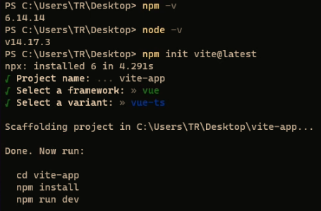

# vue环境配置

[toc]


## 1 安装nodejs（建议装14版本稳定）

[下载 | Node.js 中文网](http://nodejs.cn/download/current/)  装完之后会有一个命令叫 npm: npm -v 来检查是否安装成功

## 2 Nvm(node版本切换工具)

NVM全称[node](https://so.csdn.net/so/search?q=node&spm=1001.2101.3001.7020).js version management ，专门针对node版本进行管理的工具，通过它可以安装和切换不同版本的node.js

### 2.1 使用场景

我目前的公司有很多项目，其中有一些老项目用的是vue2.5左右了[webpack](https://so.csdn.net/so/search?q=webpack&spm=1001.2101.3001.7020)版本也比较低，只能使用10.16.0左右的node版本，但是也有一些新项目需要使用高版本的node例如14.17.3左右的这时候就可以使用nvm切换node 版本

#### 2.1.1 安装nvm: [github](https://so.csdn.net/so/search?q=github&spm=1001.2101.3001.7020)（程序员交友平台）地址

[Releases · coreybutler/nvm-windows · GitHub](https://github.com/coreybutler/nvm-windows/releases)


Mac: 

```bash
sudo curl -o- https://raw.githubusercontent.com/nvm-sh/nvm/v0.38.0/install.sh | bash
```

2.重启电脑 或者是刷新bash文件即可生效

```bash
source ~/.bash_profile
```

### 2.2 Nvm 常用命令操作

#### 2.2.1 nvm list 查看现在所有安装的node版本


#### 2.2.2 nvm list available 查看nodejs 官方的所有版本


#### 2.2.3 nvm install （版本号）下载对应的node版本号


#### 2.2.4 nvm use 切换node版本


## 3 nrm 介绍（npm源管理器）

nrm 是一个 npm 源管理器，允许你快速地在 npm源间切换。

### 3.1 1.安装

```coffeescript
npm install -g nrm
```

### 3.2 2.npm ls **查看可选源 星号代表当前使用源**


### 3.3 3.nrm use （源）切换源

 

### 3.4 4.nrm add （名称）（源)


5.测试速度 nrm test npm

## 4 构建vite项目

官方文档[开始 {#getting-started} | Vite中文网](https://vitejs.cn/guide/#overview)

vite 的优势

1. 冷服务  默认的构建目标浏览器是能 [在 script 标签上支持原生 ESM](https://caniuse.com/es6-module) 和 [原生 ESM 动态导入](https://caniuse.com/es6-module-dynamic-import)

2. HMR 速度快到惊人的 [模块热更新（HMR）](https://vitejs.cn/guide/features.html#hot-module-replacement)

3. Rollup打包 它使用 [Rollup](https://rollupjs.org/) 打包你的代码，并且它是预配置的 并且支持大部分rollup插件

### 4.1 使用vite初始化一个项目



1. 初始化
@1. npm `npm init vite@latest`
@2. Yarn `yarn create vite`

2. 项目名称 

3. 构建的项目模板 

4. 切换目录

```bash
#安装依赖包
npm install 
#启动
npm run dev  
```


 package json 命令解析

```perl
{
  "scripts": {
    "dev": "vite", // 启动开发服务器，别名：`vite dev`，`vite serve`
    "build": "vite build", // 为生产环境构建产物
    "preview": "vite preview" // 本地预览生产构建产物
  }
}
```

### 4.2 安装Vue cli脚手架,进行对比比较（这个启动比较慢，不推荐）

`npm install @vue/cli -g`检查是否安装成功


` vue create <project>`

构建我们的cli 项目可以去对比一下

## 5 Vite目录

1. public 下面的不会被编译 可以存放静态资源
2. assets 下面可以存放可编译的静态资源
3. components 下面用来存放我们的组件
4. App.vue 是全局组件
5. main ts 全局的ts文件
6. **index.html 非常重要的入口文件 （webpack，rollup 他们的入口文件都是enrty input 是一个js文件 而Vite 的入口文件是一个html文件，他刚开始不会编译这些js文件 只有当你用到的时候 如script src="xxxxx.js" 会发起一个请求被vite拦截这时候才会解析js文件）**

> 1. vite config ts 这是vite的配置文件具体配置项 后面会详解
>
> 2. VsCode Vue3 插件推荐 Vue Language Features (Volar)

## 6 SFC 语法规范

```
*.vue` 件都由三种类型的顶层语法块所组成：`<template>`、`<script>`、`<style>
```

### 6.1 `<template>`

- 每个 `*.vue` 文件最多可同时包含一个顶层 `<template>` 块。
- 其中的内容会被提取出来并传递给 `@vue/compiler-dom`，预编译为 JavaScript 的渲染函数，并附属到导出的组件上作为其 `render` 选项。

------

### 6.2 `<script>`

- 每一个 `*.vue` 文件最多可同时包含一个 `<script>` 块 (不包括[](https://v3.cn.vuejs.org/api/sfc-script-setup.html))。
- 该脚本将作为 ES Module 来执行。
- 其**默认导出**的内容应该是 Vue 组件选项对象，它要么是一个普通的对象，要么是 [defineComponent](https://v3.cn.vuejs.org/api/global-api.html#definecomponent) 的返回值。

------

### 6.3 `<script setup>`

- 每个 `*.vue` 文件最多可同时包含一个 `<script setup>` 块 (不包括常规的 `<script>`)
- 该脚本会被预处理并作为组件的 `setup()` 函数使用，也就是说它会在**每个组件实例**中执行。`<script setup>` 的顶层绑定会自动暴露给模板。更多详情请查看 [ 文档](https://v3.cn.vuejs.org/api/sfc-script-setup)。

------

### 6.4 `<style>`

- 一个 `*.vue` 文件可以包含多个 `<style>` 标签。
- `<style>` 标签可以通过 `scoped` 或 `module` attribute (更多详情请查看 [SFC 样式特性](https://v3.cn.vuejs.org/api/sfc-style)) 将样式封装在当前组件内。多个不同封装模式的 `<style>` 标签可以在同一个组件中混

------

## 7 npm run dev 详解

在我们执行这个命令的时候会去找 package json 的scripts 然后执行对应的dev命令


 那为什么我们不直接执行vite 命令不是更方便吗

应为在我们的电脑上面并没有配置过相关命令 所以无法直接执行


 其实在我们执行npm install 的时候（包含vite） 会在node_modules/.bin/ 创建好可执行文件

.bin 目录，这个目录不是任何一个 npm 包。目录下的文件，表示这是一个个软链接，打开文件可以看到文件顶部写着 `#!/bin/sh` ，表示这是一个脚本 


在我们执行npm run xxx npm 会通过软连接 查找这个软连接存在于源码目录node_modules/vite


 所以npm run xxx 的时候，就会到 node_modules/bin中找对应的映射文件，然后再找到相应的js文件来执行

> 1.查找规则是先从当前项目的node_modlue /bin去找,
>
> 2.找不到去全局的node_module/bin 去找
>
> 3.再找不到 去环境变量去找


 node_modules/bin中 有三个vite文件。为什么会有三个文件呢？

```php
# unix Linux macOS 系默认的可执行文件，必须输入完整文件名
vite
# windows cmd 中默认的可执行文件，当我们不添加后缀名时，自动根据 pathext 查找文件
vite.cmd
# Windows PowerShell 中可执行文件，可以跨平台
vite.psl
```

