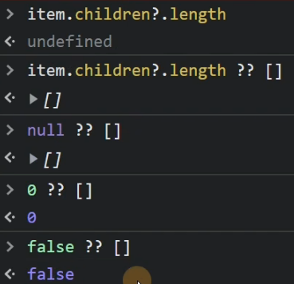
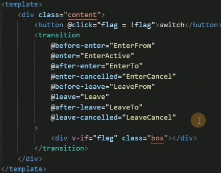
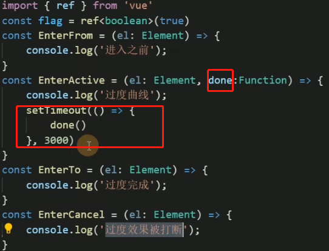
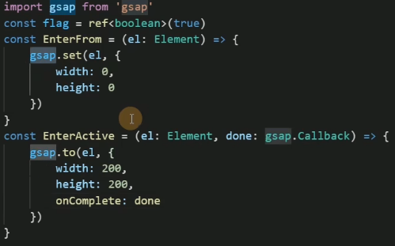
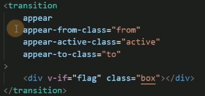
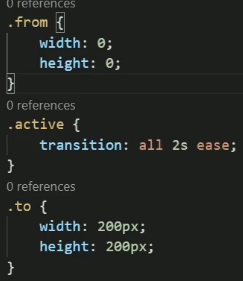

# 学习Vue3 第十二章（认识组件&Vue3生命周期）

[toc]


##  组件基础

每一个.vue 文件呢都可以充当组件来使用

每一个组件都可以复用


例如 helloWorld 充当子组件


###  父组件使用

引入子组件 helloWorld 然后直接就可以去当标签去使用 （切记组件名称不能与html元素标签名称一样）


##  组件的[生命周期](https://so.csdn.net/so/search?q=生命周期&spm=1001.2101.3001.7020)

简单来说就是一个组件从创建 到 销毁的 过程 成为生命周期

在我们使用Vue3 组合式[API](https://so.csdn.net/so/search?q=API&spm=1001.2101.3001.7020) 是没有 `beforeCreate 和 created 这两个生命周期的`


### onBeforeMount()

在组件DOM实际渲染安装之前调用。在这一步中，根元素还不存在。

### onMounted()

在组件的第一次渲染后调用，该元素现在可用，允许直接DOM访问

### onBeforeUpdate()

数据更新时调用，发生在虚拟 DOM 打补丁之前。

### updated()

DOM更新后，`updated`的方法即会调用。

### onBeforeUnmount()

在卸载组件实例之前调用。在这个阶段，实例仍然是完全正常的。

### onUnmounted()

卸载组件实例后调用。调用此钩子时，组件实例的所有指令都被解除绑定，所有事件侦听器都被移除，所有子组件实例被卸载。

| 选项式 API        | Hook inside `setup` |
| :---------------- | :------------------ |
| `beforeCreate`    | Not needed*         |
| `created`         | Not needed*         |
| `beforeMount`     | `onBeforeMount`     |
| `mounted`         | `onMounted`         |
| `beforeUpdate`    | `onBeforeUpdate`    |
| `updated`         | `onUpdated`         |
| `beforeUnmount`   | `onBeforeUnmount`   |
| `unmounted`       | `onUnmounted`       |
| `errorCaptured`   | `onErrorCaptured`   |
| `renderTracked`   | `onRenderTracked`   |
| `renderTriggered` | `onRenderTriggered` |
| `activated`       | `onActivated`       |
| `deactivated`     | `onDeactivated`     |

# 学习Vue3 第十三章（实操组件和认识less 和 scoped）

## 什么是less

**Less （Leaner Style Sheets 的缩写） 是一门向后兼容的 CSS 扩展语言。这里呈现的是 Less 的官方文档（中文版），包含了 Less 语言以及利用 JavaScript 开发的用于将 Less 样式转换成 CSS 样式的 Less.js 工具。**

因为 Less 和 CSS 非常像，因此很容易学习。而且 Less 仅对 CSS 语言增加了少许方便的扩展，这就是 Less 如此易学的原因之一。

官方文档 [Less 快速入门 | Less.js 中文文档 - Less 中文网](https://less.bootcss.com/#概览)

在vite中使用less

```xml
# 安装
npm install less less-loader -D 
# 在style标签注明即可
<style lang="less">
<style>
```

## 什么是scoped

实现组件的私有化, 当前style属性只属于当前模块.

　在DOM结构中可以发现,vue通过在DOM结构以及css样式上加了唯一标记,达到样式私有化,不污染全局的作用,


> ***\*样式穿透问题学到第三方组件精讲 ::v-deep >>> /deep/\****

# 学习Vue3 第十四章（父子组件传参）

## 父组件通过v-bind绑定一个数据，然后子组件通过defineProps接受传过来的值，

给Menu组件 传递了一个title [字符串](https://so.csdn.net/so/search?q=字符串&spm=1001.2101.3001.7020)类型是不需要v-bind

```xml
<template>
    <div class="layout">
        <Menu  title="我是标题"></Menu>
        <div class="layout-right">
            <Header></Header>
            <Content></Content>
        </div>
    </div>
</template>
```

传递非字符串类型需要加v-bind 简写 冒号

```xml
<template>
    <div class="layout">
        <Menu v-bind:data="data"  title="我是标题"></Menu>
        <div class="layout-right">
            <Header></Header>
            <Content></Content>
        </div>
    </div>
</template>
 
<script setup lang="ts">
import Menu from './Menu/index.vue'
import Header from './Header/index.vue'
import Content from './Content/index.vue'
import { reactive } from 'vue';
 
const data = reactive<number[]>([1, 2, 3])
</script>
```

## 子组件接受值

通过defineProps 来接受 **defineProps是无须引入的直接使用即可**

如果我们使用的TypeScript： 可以使用传递字面量类型的纯类型语法做为参数

```xml
<template>
    <div class="menu">
        菜单区域 {{ title }}
        <div>{{ data }}</div>
    </div>
</template>
 
<script setup lang="ts">
defineProps<{
    title:string,
    data:number[]
}>()
</script>
```

如果你使用的不是TS

```haskell
defineProps({
    title:{
        default:"",
        type:string
    },
    data:Array
})
```

## TS 特有的默认值方式

withDefaults是个函数也是无须引入开箱即用接受一个props函数第二个参数是一个对象设置默认值

```haskell
type Props = {
    title?: string,
    data?: number[]
}
withDefaults(defineProps<Props>(), {
    title: "张三",
    data: () => [1, 2, 3]
})
```

## 子组件给父组件传参

是通过defineEmits派发一个事件

```xml
<template>
    <div class="menu">
        <button @click="clickTap">派发给父组件</button>
    </div>
</template>
 
<script setup lang="ts">
import { reactive } from 'vue'
const list = reactive<number[]>([4, 5, 6])
 
const emit = defineEmits(['on-click'])
const clickTap = () => {
    emit('on-click', list)
}
</script>
```

我们在子组件绑定了一个click 事件 然后通过defineEmits 注册了一个自定义事件

点击click 触发 emit 去调用我们注册的事件 然后传递参数

### 父组件接受子组件的事件

```xml
<template>
    <div class="layout">
        <Menu @on-click="getList"></Menu>
        <div class="layout-right">
            <Header></Header>
            <Content></Content>
        </div>
    </div>
</template>
 
<script setup lang="ts">
import Menu from './Menu/index.vue'
import Header from './Header/index.vue'
import Content from './Content/index.vue'
import { reactive } from 'vue';
 
const data = reactive<number[]>([1, 2, 3])
 
const getList = (list: number[]) => {
    console.log(list,'父组件接受子组件');
}
</script>
```

我们从Menu 组件接受子组件派发的事件on-click 后面是我们自己定义的函数名称getList

会把参数返回过来

## 子组件暴露给父组件内部属性

通过defineExpose

我们从父组件获取子组件实例通过ref

```csharp
 <Menu ref="menus"></Menu>
const menus = ref(null)
```

然后打印menus.value 发现没有任何属性

这时候父组件想要读到子组件的属性可以通过 defineExpose暴露

```typescript
const list = reactive<number[]>([4, 5, 6])
defineExpose({
  list
})
```

这样父组件就可以读到了

# 学习Vue3 第十五章（全局组件，局部组件，递归组件）

## 配置全局组件

例如组件使用频率非常高（table，Input，button，等）这些组件 几乎每个页面都在使用便可以封装成全局组件

案例------我这儿封装一个Card组件想在任何地方去使用

```xml
<template>
  <div class="card">
     <div class="card-header">
         <div>标题</div>
         <div>副标题</div>
     </div>
     <div v-if='content' class="card-content">
         {{content}}
     </div>
  </div>
</template>
 
<script setup lang="ts">
type Props = {
    content:string
}
defineProps<Props>()
 
</script>
 
<style scoped lang='less'>
@border:#ccc;
.card{
    width: 300px;
    border: 1px solid @border;
    border-radius: 3px;
    &:hover{
        box-shadow:0 0 10px @border;
    }
 
    &-content{
        padding: 10px;
    }
    &-header{
        display: flex;
        justify-content: space-between;
        padding: 10px;
        border-bottom: 1px solid @border;
    }
}
</style>
```


使用方法

在main.ts 引入我们的组件跟随在createApp(App) 后面 切记不能放到mount 后面这是一个链式调用用

其次调用 component 第一个参数组件名称 第二个参数组件实例

```javascript
import { createApp } from 'vue'
import App from './App.vue'
import './assets/css/reset/index.less'
import Card from './components/Card/index.vue'
 
 
createApp(App).component('Card',Card).mount('#app')
```

### 使用方法

直接在其他vue页面 立即使用即可 无需引入

```xml
<template>
 <Card></Card>
</template>
```

## 配置局部组件

```xml
<template>
  <div class="wraps">
    <layout-menu :flag="flag" @on-click="getMenu" @on-toogle="getMenuItem" :data="menuList" class="wraps-left"></layout-menu>
    <div class="wraps-right">
      <layout-header> </layout-header>
      <layout-main class="wraps-right-main"></layout-main>
    </div>
  </div>
</template>
 
<script setup lang="ts">
import { reactive,ref } from "vue";
import layoutHeader from "./Header.vue";
import layoutMenu from "./Menu.vue";
import layoutMain from "./Content.vue";
```

就是在一个组件内（A） 通过import 去引入别的组件(B) 称之为局部组件

应为B组件只能在A组件内使用 所以是局部组件

如果C组件想用B组件 就需要C组件也手动import 引入 B 组件

## 配置递归组件

原理跟我们写js递归是一样的 自己调用自己 通过一个条件来结束递归 否则导致内存泄漏

### 案例递归树

 在父组件配置数据结构 数组对象格式 传给子组件

```go
type TreeList = {
  name: string;
  icon?: string;
  children?: TreeList[] | [];
};
const data = reactive<TreeList[]>([
  {
    name: "no.1",
    children: [
      {
        name: "no.1-1",
        children: [
          {
            name: "no.1-1-1",
          },
        ],
      },
    ],
  },
  {
    name: "no.2",
    children: [
      {
        name: "no.2-1",
      },
    ],
  },
  {
    name: "no.3",
  },
]);
```

### 子组件接收值

```haskell
type TreeList = {
  name: string;
  icon?: string;
  children?: TreeList[] | [];
};
 
type Props<T> = {
  data?: T[] | [];
};
 
defineProps<Props<TreeList>>();
```

### template

TreeItem 其实就是当前组件 通过import 把自身又引入了一遍 如果他没有children 了就结束

```xml
  <div style="margin-left:10px;" class="tree">
    <div :key="index" v-for="(item,index) in data">
      <div @click='clickItem(item)'>{{item.name}}
    </div>
    <TreeItem @on-click='clickItem' v-if='item?.children?.length' :data="item.children"></TreeItem>
  </div>
  </div>
```

## 双问号



# 学习Vue3 第十六章（动态组件）

## 什么是动态组件 就是：让多个组件使用同一个[挂载](https://so.csdn.net/so/search?q=挂载&spm=1001.2101.3001.7020)点，并动态切换，这就是动态组件。

在挂载点使用[component](https://so.csdn.net/so/search?q=component&spm=1001.2101.3001.7020)标签，然后使用v-bind:is=”组件”

```javascript
import A from './A.vue'
import B from './B.vue'
```

通过is 切换 A B 组件：使用场景==tab切换 居多==

> ***\*1.在Vue2 的时候is 是通过组件名称切换的 在Vue3 setup 是通过组件实例切换的\****
>
> ***\*2.如果你把组件实例放到Reactive Vue会给你一个警告runtime-core.esm-bundler.js:38 [Vue warn]: Vue received a Component which was made a reactive object. This can lead to unnecessary performance overhead, and should be avoided by marking the component with `markRaw` or using `shallowRef` instead of `ref`. 
> Component that was made reactive:\**** 
>
> ***\*这是因为reactive 会进行proxy 代理 而我们组件代理之后毫无用处 节省性能开销 推荐我们使用shallowRef 或者 markRaw 跳过proxy 代理\****

```javascript
const tab = reactive<Com[]>([{
    name: "A组件",
    comName: markRaw(A)
}, {
    name: "B组件",
    comName: markRaw(B)
}])
```

# 学习Vue3 第十七章（插槽slot）


[插槽](https://so.csdn.net/so/search?q=插槽&spm=1001.2101.3001.7020)就是子组件中的提供给父组件使用的一个[占位符](https://so.csdn.net/so/search?q=占位符&spm=1001.2101.3001.7020)，用<slot></slot> 表示，父组件可以在这个[占位符](https://so.csdn.net/so/search?q=占位符&spm=1001.2101.3001.7020)中填充任何模板代码，如 HTML、组件等，填充的内容会替换子组件的<slot></slot>标签。

## 匿名插槽

### 1.在子组件放置一个插槽

```xml
<template>
    <div>
       <slot></slot>
    </div>
</template>
```

### 父组件使用插槽

在父组件给这个插槽填充内容

```xml
        <Dialog>
           <template v-slot>
               <div>2132</div>
           </template>
        </Dialog>
```

## 具名插槽·

具名插槽其实就是给插槽取个名字。一个子组件可以放多个插槽，而且可以放在不同的地方，而父组件填充内容时，可以根据这个名字把内容填充到对应插槽中

```xml
    <div>
        <slot name="header"></slot>
        <slot></slot>
 
        <slot name="footer"></slot>
    </div>
```

### 父组件使用需对应名称

```xml
        <Dialog>
            <template v-slot:header>
               <div>1</div>
           </template>
           <template v-slot>
               <div>2</div>
           </template>
           <template v-slot:footer>
               <div>3</div>
           </template>
        </Dialog>
```

###  插槽简写

```xml
        <Dialog>
            <template #header>
               <div>1</div>
           </template>
           <template #default>
               <div>2</div>
           </template>
           <template #footer>
               <div>3</div>
           </template>
        </Dialog>
```

## 作用域插槽

在子组件动态绑定参数 派发给父组件的slot去使用

```xml
    <div>
        <slot name="header"></slot>
        <div>
            <div v-for="item in 100">
                <slot :data="item"></slot>
            </div>
        </div>
 
        <slot name="footer"></slot>
    </div>
```

通过结构方式取值

```xml
         <Dialog>
            <template #header>
                <div>1</div>
            </template>
            <template #default="{ data }">
                <div>{{ data }}</div>
            </template>
            <template #footer>
                <div>3</div>
            </template>
        </Dialog>
```

 

## 动态插槽

插槽可以是一个变量名

```xml
        <Dialog>
            <template #[name]>
                <div>
                    23
                </div>
            </template>
        </Dialog>
```

# 学习Vue3 第十八章（异步组件&代码分包&suspense）

## 异步组件

在大型应用中，我们可能需要将应用分割成小一些的代码块 并且减少主包的体积

这时候就可以使用异步组件

## 顶层 `await`

```
在setup语法糖里面 使用方法
```

<script setup> 中可以使用顶层 await。结果代码会被编译成 async setup()

```xml
<script setup>
const post = await fetch(`/api/post/1`).then(r => r.json())
</script>
```

父组件引用子组件 通过defineAsyncComponent加载异步配合import 函数模式便可以分包

```xml
<script setup lang="ts">
import { reactive, ref, markRaw, toRaw, defineAsyncComponent } from 'vue'
 
const Dialog = defineAsyncComponent(() => import('../../components/Dialog/index.vue'))
```

## suspense

`<suspense>` 组件有两个插槽。它们都只接收一个直接子节点。`default` 插槽里的节点会尽可能展示出来。如果不能，则展示 `fallback` 插槽里的节点。

```xml
     <Suspense>
            <template #default>
                <Dialog>
                    <template #default>
                        <div>我在哪儿</div>
                    </template>
                </Dialog>
            </template>
 
            <template #fallback>
                <div>loading...</div>
            </template>
        </Suspense>
```

# 学习Vue3 第十九章（Teleport传送组件）

## `Teleport` Vue 3.0新特性之一。

`Teleport` 是一种能够将我们的模板渲染至指定`DOM`节点，不受父级`style`、`v-show`等属性影响，但`data`、`prop`数据依旧能够共用的技术；类似于 `React` 的 `Portal`。

主要解决的问题 因为`Teleport`节点[挂载](https://so.csdn.net/so/search?q=挂载&spm=1001.2101.3001.7020)在其他指定的`DOM`节点下，完全不受父级`style`样式影响

### 使用方法

通过to 属性 插入指定元素位置 to="body" 便可以将`Teleport` 内容传送到指定位置

```xml
<Teleport to="body">
    <Loading></Loading>
</Teleport>
```

### 也可以自定义传送位置 支持 class id等 选择器

```xml
    <div id="app"></div>
    <div class="modal"></div>
```

### 也可以使用多个

```xml
<Teleport to=".modal1">
     <Loading></Loading>
</Teleport>
<Teleport to=".modal2">
     <Loading></Loading>
</Teleport>
```

# 学习Vue3 第二十章（keep-alive缓存组件）

## **内置组件keep-alive**

有时候我们不希望组件被重新渲染影响使用体验；或者处于性能考虑，避免多次重复渲染降低性能。而是希望组件可以缓存下来,维持当前的状态。这时候就需要用到`keep-alive`组件。

开启keep-alive [生命周期](https://so.csdn.net/so/search?q=生命周期&spm=1001.2101.3001.7020)的变化

- 初次进入时： onMounted> onActivated
- 退出后触发 `deactivated`
- 再次进入：
- 只会触发 onActivated
- 事件挂载的方法等，只执行一次的放在 onMounted中；组件每次进去执行的方法放在 onActivated中

```xml
<!-- 基本 -->
<keep-alive>
  <component :is="view"></component>
</keep-alive>
 
<!-- 多个条件判断的子组件 -->
<keep-alive>
  <comp-a v-if="a > 1"></comp-a>
  <comp-b v-else></comp-b>
</keep-alive>
 
<!-- 和 `<transition>` 一起使用 -->
<transition>
  <keep-alive>
    <component :is="view"></component>
  </keep-alive>
</transition>
```

###  **`include` 和 `exclude`**

```ruby
 <keep-alive :include="" :exclude="" :max=""></keep-alive>
```

include 和 exclude prop 允许组件有条件地缓存。二者都可以用逗号分隔字符串、正则表达式或一个数组来表示：

### **`max`**

```ruby
<keep-alive :max="10">
  <component :is="view"></component>
</keep-alive>
```

# 学习Vue3 第二十一章（transition动画组件）

## Vue 提供了 transition 的封装组件

在下列情形中，可以给任何元素和组件添加进入/离开过渡:

- 条件渲染 (使用 v-if)
- 条件展示 (使用 v-show)
- 动态组件
- 组件根节点

自定义 transition 过度效果，你需要对`transition`组件的`name`属性自定义。并在css中写入对应的样式

### 1.过渡的类名

在进入/离开的过渡中，会有 6 个 class 切换。

1. `v-enter-from`：定义进入过渡的开始状态。在元素被插入之前生效，在元素被插入之后的下一帧移除。
2. `v-enter-active`：定义进入过渡生效时的状态。在整个进入过渡的阶段中应用，在元素被插入之前生效，在过渡/动画完成之后移除。这个类可以被用来定义进入过渡的过程时间，延迟和曲线函数。
3. `v-enter-to`：定义进入过渡的结束状态。在元素被插入之后下一帧生效 (与此同时 `v-enter-from` 被移除)，在过渡/动画完成之后移除。
4. `v-leave-from`：定义离开过渡的开始状态。在离开过渡被触发时立刻生效，下一帧被移除。
5. `v-leave-active`：定义离开过渡生效时的状态。在整个离开过渡的阶段中应用，在离开过渡被触发时立刻生效，在过渡/动画完成之后移除。这个类可以被用来定义离开过渡的过程时间，延迟和曲线函数。
6. `v-leave-to`：离开过渡的结束状态。在离开过渡被触发之后下一帧生效 (与此同时 `v-leave-from` 被移除)，在过渡/动画完成之后移除。

如下

```xml
       <button @click='flag = !flag'>切换</button>
       <transition name='fade'>
         <div v-if='flag' class="box"></div>
       </transition>
```


```css
//开始过度
.fade-enter-from{
   background:red;
   width:0px;
   height:0px;
   transform:rotate(360deg)
}
//开始过度了
.fade-enter-active{
  transition: all 2.5s linear;
}
//过度完成
.fade-enter-to{
   background:yellow;
   width:200px;
   height:200px;
}
//离开的过度
.fade-leave-from{
  width:200px;
  height:200px;
  transform:rotate(360deg)
}
//离开中过度
.fade-leave-active{
  transition: all 1s linear;
}
//离开完成
.fade-leave-to{
  width:0px;
   height:0px;
}
```

### 自定义过渡 class 类名

trasnsition props

- `enter-from-class`
- `enter-active-class`
- `enter-to-class`
- `leave-from-class`
- `leave-active-class`
- `leave-to-class`

### 自定义过度时间 单位毫秒

你也可以分别指定进入和离开的持续时间：

```xml
<transition :duration="1000">...</transition>
<transition :duration="{ enter: 500, leave: 800 }">...</transition>
```

## 通过自定义class ==结合css动画库animate.css==

1. 安装库 npm install animate.css -S
2. 引入 import 'animate.css'

官方文档 [Animate.css | A cross-browser library of CSS animations.](https://animate.style/)

```javascript
        <transition
            leave-active-class="animate__animated animate__bounceInLeft"
            enter-active-class="animate__animated animate__bounceInRight"
        >
            <div v-if="flag" class="box"></div>
        </transition>
```

## 3.transition 生命周期8个

```kotlin
  @before-enter="beforeEnter" //对应enter-from
  @enter="enter"//对应enter-active 过度曲线
  @after-enter="afterEnter"//对应enter-to
  @enter-cancelled="enterCancelled"//显示过度打断
  @before-leave="beforeLeave"//对应leave-from
  @leave="leave"//对应enter-active
  @after-leave="afterLeave"//对应leave-to
  @leave-cancelled="leaveCancelled"//离开过度打断
```

当只用 JavaScript 过渡的时候，在 **`enter` 和 `leave` 钩子中必须使用 `done` 进行回调**






## 结合gsap 动画库使用(==更丝滑==) [GreenSock](https://greensock.com/)

npm install gsap -S

import gsap from “gsap”



```coffeescript
const beforeEnter = (el: Element) => {
    console.log('进入之前from', el);
}
const Enter = (el: Element,done:Function) => {
    console.log('过度曲线');
    setTimeout(()=>{
       done()
    },3000)
}
const AfterEnter = (el: Element) => {
    console.log('to');
}
```

## 4.appear 首次加载时动画

通过这个属性可以设置初始节点过度 就是页面加载完成就开始动画 对应三个状态

```vbnet
appear-active-class=""
appear-from-class=""
appear-to-class=""
appear
```




# 学习Vue3 第二十二章（transition-group过度列表）

- 单个节点
- 多个节点，每次只渲染一个

那么怎么同时渲染整个列表，比如使用 `v-for`？在这种场景下，我们会使用 `<transition-group>` 组件。在我们深入例子之前，先了解关于这个组件的几个特点：

- 默认情况下，它不会渲染一个包裹元素，但是你可以通过 `tag` attribute 指定渲染一个元素。
- [过渡模式](https://v3.cn.vuejs.org/guide/transitions-enterleave.html#过渡模式)不可用，因为我们不再相互切换特有的元素。
- 内部元素**总是需要**提供唯一的 `key` attribute 值。
- CSS 过渡的类将会应用在内部的元素中，而不是这个组/容器本身。

```xml
<transition-group>
     <div style="margin: 10px;" :key="item" v-for="item in list">{{ item }</div>
</transition-group>
```

## 2.列表的移动过渡

`<transition-group>` 组件还有一个特殊之处。除了进入和离开，它还可以为定位的改变添加动画。只需了解新增的 **`v-move` 类**就可以使用这个新功能，它会应用在元素改变定位的过程中。像之前的类名一样，它的前缀可以通过 `name` attribute 来自定义，也可以通过 `move-class` attribute 手动设置

下面代码很酷炫

### 将列表随机打乱： lodash ：

npm i @types/lodash -D 

npm i lodash -S

### lodash使用：

```vue
import _ from "lodash"
items.value = _.shuffle(items.value)
```


```xml
<template>
    <div>
        <button @click="shuffle">Shuffle</button>
        <transition-group class="wraps" name="mmm" tag="ul">
            <li class="cell" v-for="item in items" :key="item.id">{{ item.number }}</li>
        </transition-group>
    </div>
</template>
  
<script setup  lang='ts'>
import _ from 'lodash'
import { ref } from 'vue'
let items = ref(Array.apply(null, { length: 81 } as number[]).map((_, index) => {
    return {
        id: index,
        number: (index % 9) + 1
    }
}))
const shuffle = () => {
    items.value = _.shuffle(items.value)
}
</script>
  
<style scoped lang="less">
.wraps {
    display: flex;
    flex-wrap: wrap;
    width: calc(25px * 10 + 9px);
    .cell {
        width: 25px;
        height: 25px;
        border: 1px solid #ccc;
        list-style-type: none;
        display: flex;
        justify-content: center;
        align-items: center;
    }
}
 
.mmm-move {
    transition: transform 0.8s ease;
}
</style>
```

## 3.状态过渡 gsap库

Vue 也同样可以给数字 Svg 背景颜色等添加过度动画 今天演示数字变化

```xml
<template>
    <div>
        <input step="20" v-model="num.current" type="number" />
        <div>{{ num.tweenedNumber.toFixed(0) }}</div>
    </div>
</template>
    
<script setup lang='ts'>
import { reactive, watch } from 'vue'
import gsap from 'gsap'
const num = reactive({
    tweenedNumber: 0,
    current:0
})
 
watch(()=>num.current, (newVal) => {
    gsap.to(num, {
        duration: 1,
        tweenedNumber: newVal
    })
})
 
</script>
    
<style>
</style>
```
