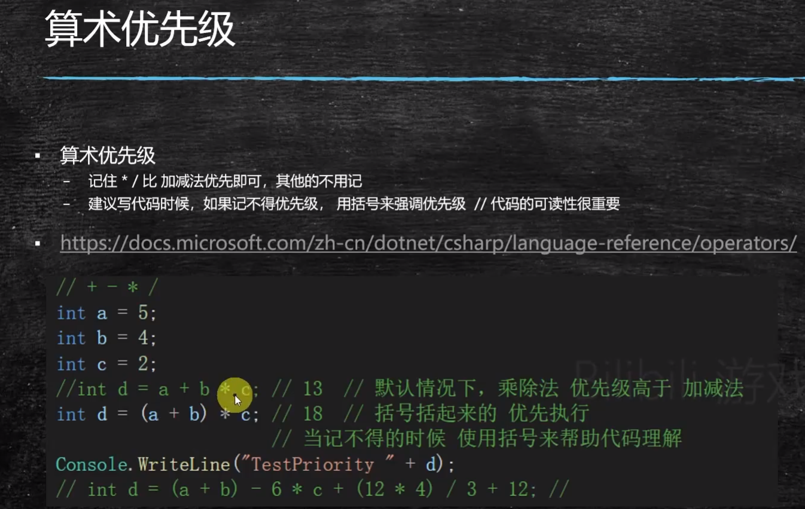
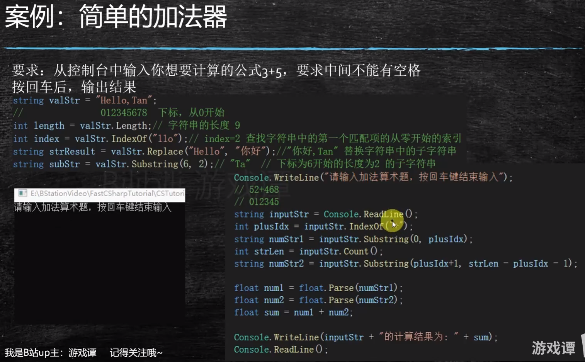
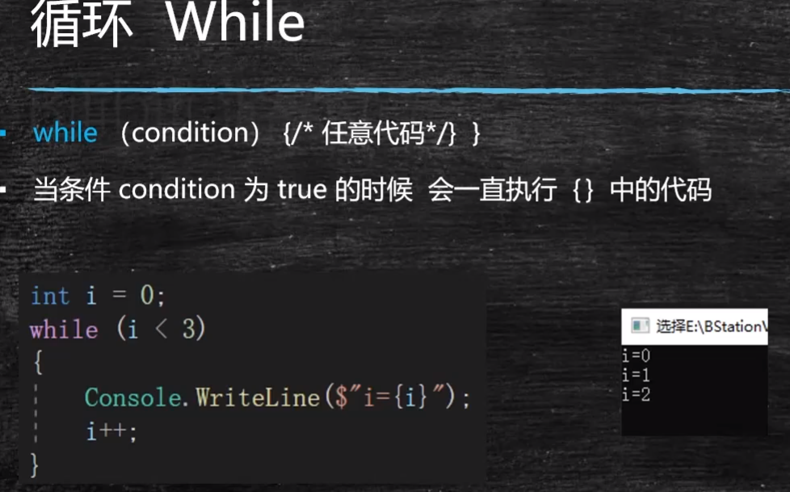
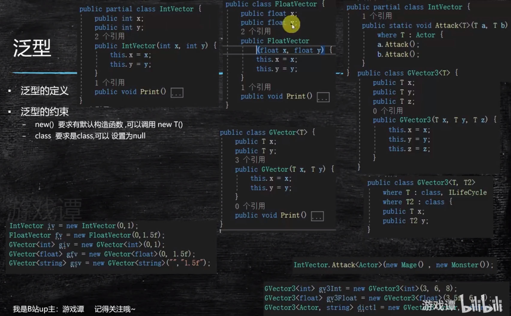
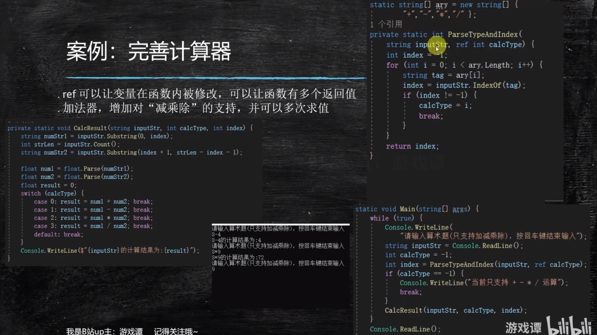
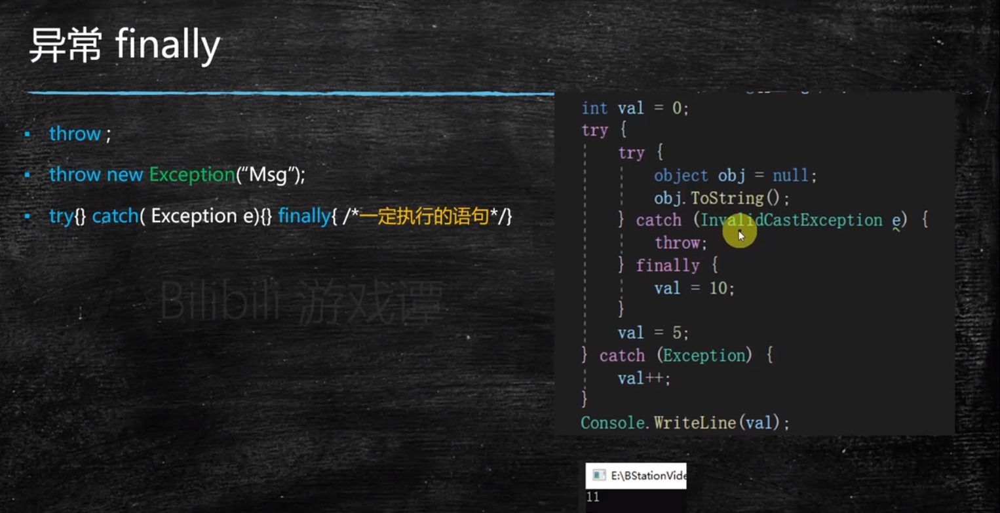

# 快速学完c#

[toc]

## P1. 基础类型，变量，

### 函数

### 程序结构

### 汇编

### 机器指令

### 代码解释

### 编译&注释

### 关键字,变量命名规范

#### 命名规范

### 存储单位 Byte,KB,MB

### 基础数据类型 Int,Bool,Float

### 基础数据类型 String,数组

### 基础数值类型使用示范

### 基础数学运算&字符串格式化

#### 算术优先级

#### 函数&使用

#### 案例：简单加法器

## 条件&循环

### 1. bool 比较和组合

### 2. If else 语句

### 3. switch语句

### 4. enum 枚举

### 5. 循环While 语句

### 6. continue跳过当前语

### 句块

### 7. break 跳出循环

### 8. do while

### 9. for 循环

### 10.循环总结

### 11.ref 引用传递

### 12.案例：完善计算器

## P3. 面向对象

### 1. class 定义： 成员变量，静态函数&变量，const，

### 2. class 成员函数，属性Property，构造函数

### 3. struct的概念，内存分布,堆，栈

### 4. struct,class创建时候具体内存分布讲解

### 5. 值类型和引用类型的区别，引用传递 ref

### 6. 什么是继承，函数override,protected

### 7. 接口的定义和继承，Abstact 类,面向对象

### 8. 所有类型的基类System.Object

### 总结

## 容器，泛型，反射，delegate

### 1. 泛型

泛型的约束

### 2. 容器：List

### 3. 容器：Dictionary

### 4. 容器：Hashset,Stack,Queue

queue

stack

#### 总结

### 5. delegate 函数指针

#### 重构计算器

### 6. 属性 attribute

### 7. 反射

### 8. 宏

## 异常

