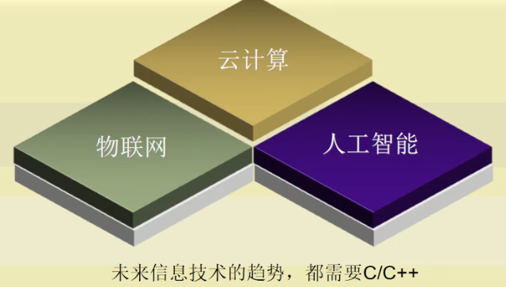

# C程序设计入门

[toc]

难点|重点：掌握计算机常用的概念

## 软件和数据

## 语言和C语言的区别关系

## 计算机系统的组成

## ASCII码

## 计算机中的数制及其转换

## 程序和指令

### 编译器的概念

### 语言的层次划分

### 主流语言进化史

## C语言特点

### 为什么要学习C语言

### C/C++市场份额

### C语言适用的领域

### 学习C语言的理由

### C语言未来发展

## C语言是面向过程的编程语言

