# 求知讲堂2021C语言/C++视频99天完整版 学完可就业

[toc]

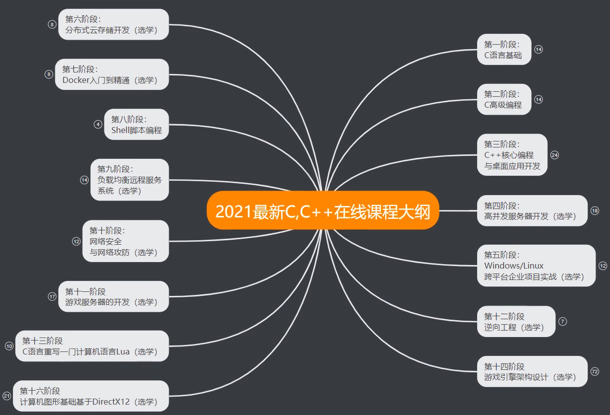

## 第一阶段 C语言基础

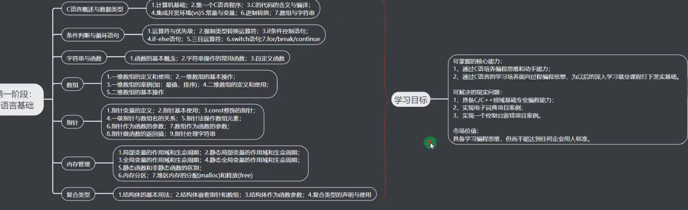

## 第二阶段 c高级编程

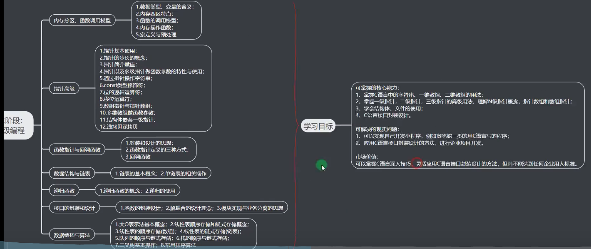

## 第三阶段 C++核心编程与桌面应用开发

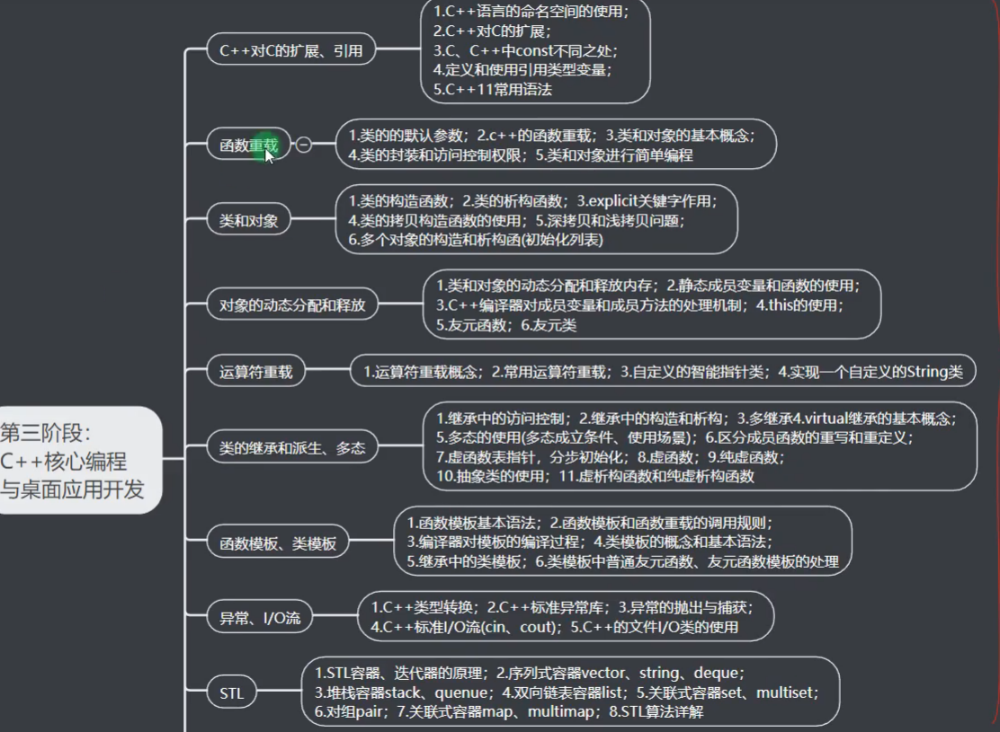

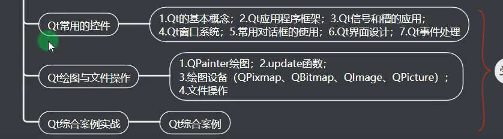

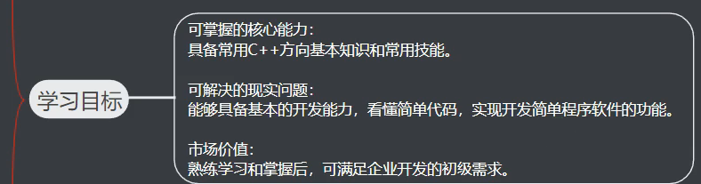

## 第四阶段 高并发服务器开发（选学）

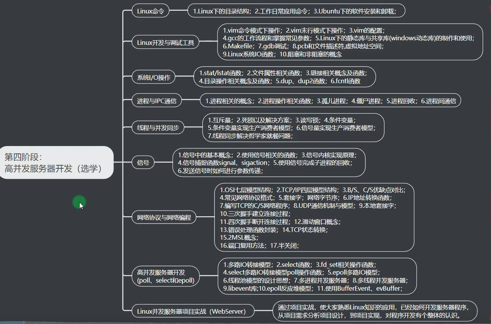

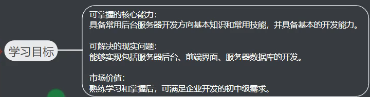

## 第五阶段 windows、linux跨平台企业项目实战

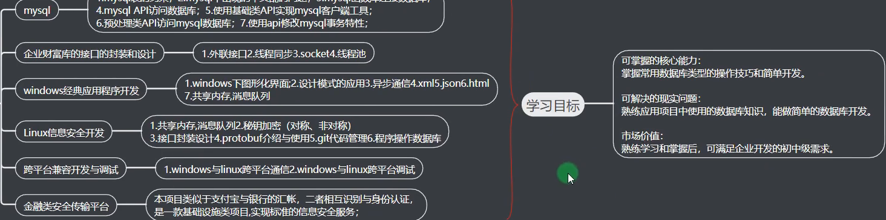

##  第六阶段 分布式云存储开发

​	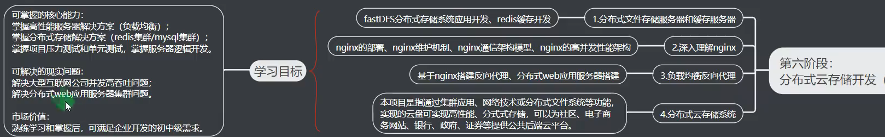

##  第七阶段 Docker入门和精通

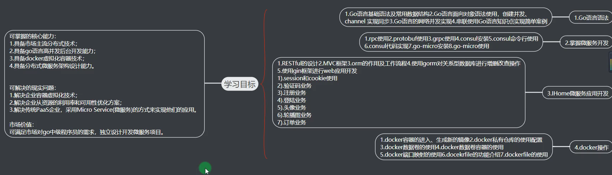

##  shell脚本编程

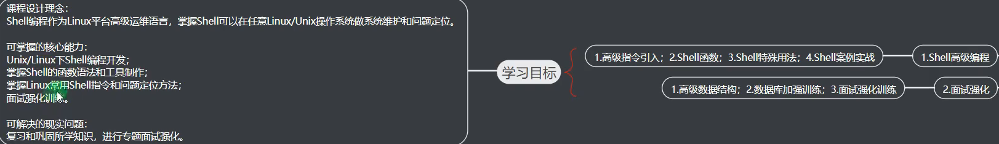

##  负载均衡原程服务系统

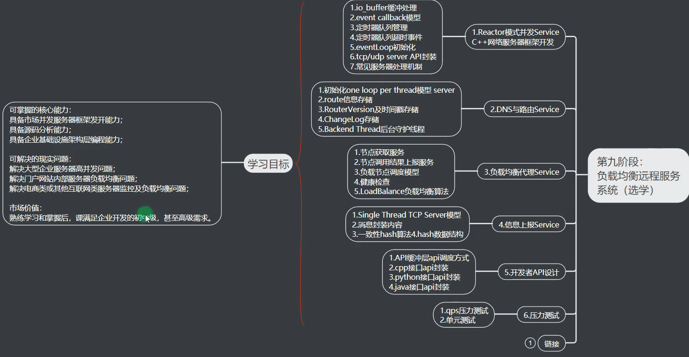

## 网络安全和网络攻防

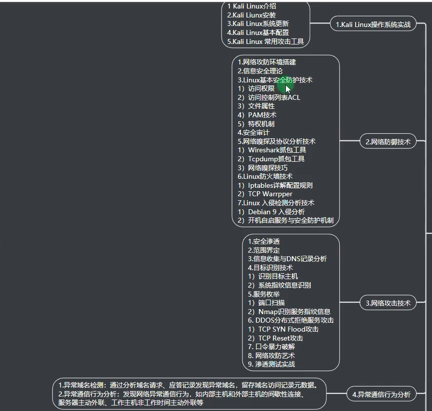

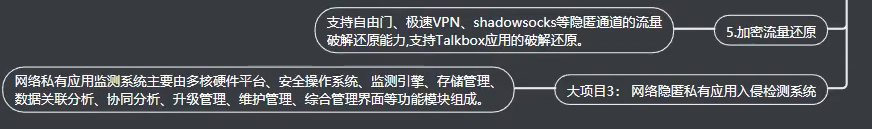

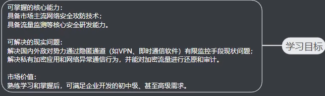

## 第11阶段 游戏服务器的开发

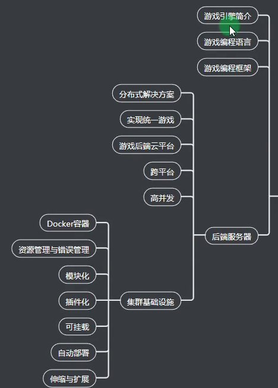

## 第12阶段 逆向工程

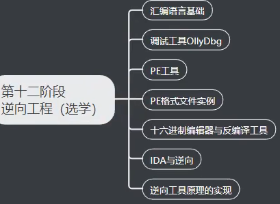

## 第13阶段 C语言重写一门计算机语言Lua

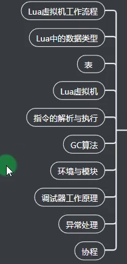

## 第十四阶段游戏引擎架构设计

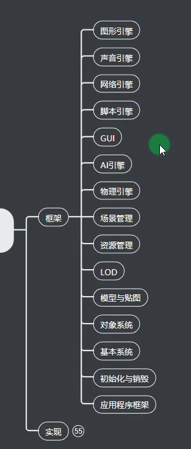

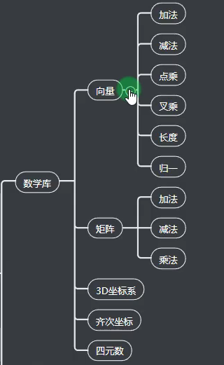

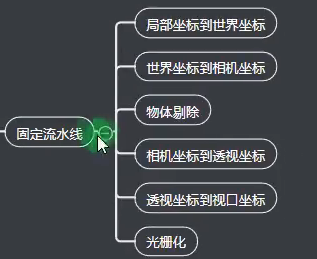

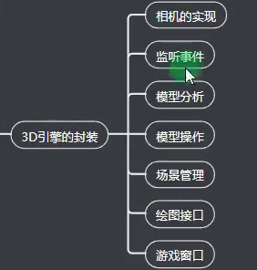

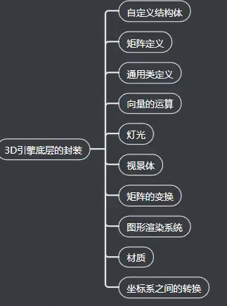

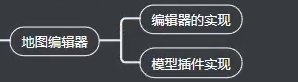

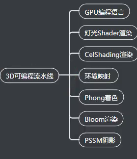

## 第15阶段 计算机图形基础基于DirectX12

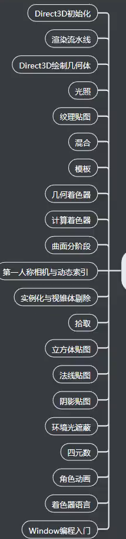

