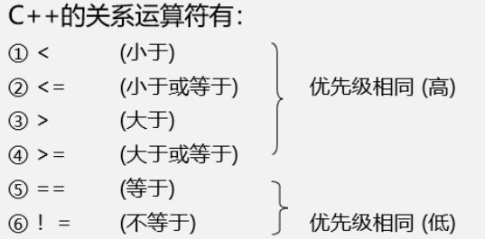

# C++期末复习超详细总结知识点（期末冲刺）
[toc]

## c++期末总结
重点已经用黑体和高亮表示，属于记忆理解部分,可收藏使用
 后面考完找时间分享下c++面向对象程序设计课后习题答案(谭浩强版)与C++题库刷题部分！

10.`时间充足者`可以按如下顺序学习，更有利于掌握。


```bash
《黑马程序员》C++基础入门(一)
《黑马程序员》通讯录管理系统实战
《黑马程序员》通讯录管理系统源码
《黑马程序员》C++核心编程(二)
《黑马程序员》职工管理系统实战
《黑马程序员》职工管理系统源码
《黑马程序员》C++提高编程(三)
《黑马程序员》演讲比赛管理系统实战
《黑马程序员》演讲比赛管理系统源码
《黑马程序员》演讲比赛管理系统成品
```
### 程序的构成

一个C++程序可以由一个程序单位或多个程序单位构成。

每一个程序单位作为一个文件。

在程序编译时，编译系统`分别对`各个文件进行编译，

因此，一个文件是一个编译单元。

### 程序的编写与实践

用 高级语言编写的程序称为“源程序”，C++的源程序是以`.cpp`作为后缀的

==对源程序(.cpp)进行编译 ➡ 目标程序(.obj) ➡ 二进制文件(.exe)==

编写C++程序一般需要经过的几个步骤是：`编辑➡编译➡连接➡调试`

## 数据类型

### 整型
作用：整型变量表示的是整数类型的数据

```bash
int - 占4个字节
unsigned int - 无符号整型，占4个字节
```

### sizeof关键字

作用：利用sizeof关键字可以统计`数据类型所占内存大小`

### 浮点型
作用：用于表示小数

浮点型变量分为两种：

1. 单精度float ➡占4个字节，提供==6位有效数组==

2. 双精度double ➡占8个字节，提供==15位有效数字==

### 数值型常量

#### 数值常量
一个整型常量可以用3种不同的方式表示：

1. `十进制`整数。如1357,-432，0等
2. `八进制`整数。在常数的开头加一个数字0，就表示这是以八进制数形式表示的常数。
3. `十六进制`整数。在常数的开头加一个数字0和一个英文字母X(或x)，就表示这是以十六进制数形式表示的常数

#### 浮点数的表示方法
一个浮点数可以用两种不同的方式表示：

1. 十进制小数形式。如21.456,-7.98等。
2. 指数形式(即浮点形式)

### 字符型常量
作用：字符型变量用于显示单个字符

语法：`char ch = 'a';`

– ==注意1==：在显示字符型变量时，用单引号将字符括起来，不要用双引号

– ==注意2==：单引号内只能有一个字符，不可以是字符串

1. C和C++中字符型变量只==占用1个字节==。

2. 字符常量==只能包括一个字符==，如′AB′ 是不合法的

3. 字符常量==区分大小写==字母，如′A′和′a′是两个不同的字符常量

4. 字符型变量并不是把字符本身放到内存中存储，而是将==对应的ASCII编码放入==到存储单元


### 字符串型常量

作用：用于表示一串字符

两种风格

1. C风格字符串： `char 变量名[] = "字符串值"`
   char str1[] = "hello world";
   1
   注意：C风格的字符串要用双引号括起来

2. C++风格字符串：` string 变量名 = "字符串值"`
   string str = "hello world";
   1
   注意：C++风格字符串，需要加入头文件==#include<string>==字符串常量为双引号

```bash
# 1. 常考：字符串 "abc" 在内存中占几个字节？
答：占4个字节，而不是3个字节，编译系统会在字符串最后自动加一个′＼0′作为字符串结束标志。但′＼0′并不是字符串的一部分，它只作为字符串的结束标志

# 2. 常考: 字符串常量″abc＼n″包含几个字符?
答：不是5个而是4个字符，其中“＼n”是一个转义字符,但它在内存中占5个字节
```

### 布尔类型bool
作用：布尔数据类型代表真或假的值 bool类型==占1个字节==大小

bool类型只有两个值：

1. true — 真（本质是1）
2. false — 假（本质是0）

### 数据的输入输出
关键字：`cin、cout`

语法： `cin >> 变量1>>变量2>>....>>变量n、cout<<表达式1<<表达式2<<...<<表达式n`

```c++
cout<<a,b,c;     //错误，不能一次插入多项
cout<<a+b+c;     //正确，这是一个表达式，作为一项

cin>>a>>b>>c>>d;
```

### 变量命名规则
C++规定标识符只能由`字母、数字和下划线`3种字符组成，且==第一个字符必须为字母或下划线==
==不能是关键字==
==区分大小写==

1. 局部变量
   在一个==函数内部定义==的变量是`局部`变量，它只在本函数范围内有效，也就是说只有在本函数内才能使用它们，在此函数以外是不能使用这些变量的`
   形参`也是局部变量
   用`static声明`局部变量

2. 全局变量
   在`函数之外定义的变量`是外部变量，称为全局变量

## 运算符

### 算数运算符

```bash
运算符	术语	示例	结果
+	正号	+3	3
-	负号	-3	-3
+	加	10 + 5	15
-	减	10 - 5	5
*	乘	10 * 5	50
/	除	10 / 5	2
%	取模(取余)	10 % 3	1
++	前置递增	a=2; b=++a;	a=3; b=3;
++	后置递增	a=2; b=a++;	a=3; b=2;
–	前置递减	a=2; b=–a;	a=1; b=1;
–	后置递减	a=2; b=a–;	a=1; b=2;
```

*	注意：

> ==两个整数相除结果依然是整数==（这里不进行四舍五入，直接舍去小数点后面数字）
>
> C++中==两个小数可以相除==
>
> 运算的两个数中有一个数为float型数据，则运算的结果是double型，因为C++在运算时==对所有float型数据都按double型==数据处理
>
> ==只有整型变量可以进行取模==运算，两个==小数不可以取模==
>
> 在除法运算中，==除数不能为0==
>
> ==取模运算时，除数也不能为0==

常考：==前置后置运算符==单独使用没有什么区别

1. 前置递增先对变量进行++，再计算表达式

2. 后置递增先计算表达式，后对变量进行++

```c++
//递增
int main() {
//后置递增
int a = 10;
a++; //等价于a = a + 1
cout << a << endl; // 11

//前置递增
int b = 10;
++b;
cout << b << endl; // 11

//区别
//前置递增先对变量进行++，再计算表达式
int a2 = 10;
int b2 = ++a2 * 10;
cout << b2 << endl; //110

//后置递增先计算表达式，后对变量进行++
int a3 = 10;
int b3 = a3++ * 10;
cout << b3 << endl; //100

system("pause");

return 0;
}
```
### 赋值运算符:用于将表达式的值赋给变量

```bash
运算符	术语	示例	结果
=	赋值	a=2; b=3;	a=2; b=3;
+=	加等于	a=0; a+=2;	a=2;
-=	减等于	a=5; a-=3;	a=2;
*=	乘等于	a=2; a*=2;	a=4;
/=	除等于	a=4; a/=2;	a=2;
%=	模等于	a=3; a%2;	a=1;
```
### 比较运算符：用于表达式的比较，并返回一个真值或假值

```bash
运算符	术语	示例	结果
==	相等于	4 == 3	0
!=	不等于	4 != 3	1
<	小于	4 < 3	0
>	大于	4 > 3	1
<=	小于等于	4 <= 3	0
>=	大于等于	4 >= 1	1
# 注意：C和C++ 语言的比较运算中， “真”用数字“1”来表示， “假”用数字“0”来表示。
```


### 逻辑运算符：用于根据表达式的值返回真值或假值

```bash
运算符	术语	示例	结果
!	非	!a	如果a为假，则!a为真； 如果a为真，则!a为假。
&&	与	a && b	如果a和b都为真，则结果为真，否则为假。
||	或	a || b	如果a和b有一个为真，则结果为真，二者都为假时，结果为假。
# !非为三者中运算符最高的
```


## 流程结构

### 选择结构

#### if语句:常搭配else使用，且可以嵌套使用

#### 三目运算符：通过三目运算符实现简单的判断

`语法：表达式1 ? 表达式2 ：表达式3`

1. 如果表达式1的值为真，执行表达式2，并返回表达式2的结果；

2. 如果表达式1的值为假，执行表达式3，并返回表达式3的结果。

#### switch语句：执行多条件分支语句

	switch(表达式){
	case 结果1：执行语句;break;
	case 结果2：执行语句;break;
	...
	default:执行语句;break;
	}


> switch语句中`表达式`类型只能是==整型或者字符型== case里如果没有break，那么程序会一直向下执行

### 循环结构

#### while：满足循环条件，执行循环语句

语法：`while(循环条件){ 循环语句 }`

解释：只要==循环条件为真==，就执行循环语句

#### do…while：满足循环条件，执行循环语句(==会先执行一次循环语句==，再判断循环条件)

语法： `do{ 循环语句 } while(循环条件);`

### for循环中的表达式，要用分号进行分隔

```c++
int main() {
for (int i = 0; i < 10; i++)
{
	cout << i << endl;
}
system("pause");
return 0;}
```
### 跳转语句(continue不终止循环，而break会跳出循环)

#### break: 用于跳出选择结构或者循环结构

#### continue: 在循环语句中，跳过本次循环中余下尚未执行的语句，继续执行下一次循环

## 数组
数组：所谓数组，就是一个`集合`，存放相`同类型的数据元素`

数组中的每个数据元素都是==相同的数据类型==
数组是由==连续的内存位置==组成的

### 一维数组

一维数组定义的三种方式：

```c++
// 数据类型 数组名[ 数组长度 ];
// 数据类型 数组名[ 数组长度 ] = { 值1，值2 ...};
// 数据类型 数组名[ ] = { 值1，值2 ...};
int score[10];
int score2[10] = { 100, 90,80,70,60,50,40,30,20,10 };
int score3[] = { 100,90,80,70,60,50,40,30,20,10 };
```

> - **数组中下标是==从0开始==索引**
> - **在对==全部数组元素赋初值==时，可以`不指定数组长度`**
> - 直接打印`数组名`，可以查看数组所占内存的`首地址`
> - 对==数组名==进行`sizeof`，可以获取`整个数组`占`内存空间的大小`

#### 一维数组初始化
1. 在定义数组时`分别对数组元素赋予初值`。例如
   `int a[10]={0，1，2，3，4，5，6，7，8，9};`

2.
可以只给`一部分元素赋值`。例如
`int a[10]={0,1,2,3,4};   `

3.
如果想使一个数组中`全部元素值为1`，可以写成
`int a[10]={1，1，1，1，1，1，1，1，1，1};
int a[10］={1*10}; // 错误写法,不能给数组整体赋初值
1`

4.
在`对全部数组元素赋初值`时，可以不指定数组长度
`int a[5]={1，2，3，4，5};
// 可以写成
int a[]={1，2，3，4，5};
1
2
3
4.`

### 二维数组
二维数组定义的四种方式：

```c++
// 数据类型 数组名[ 行数 ][ 列数 ];
// 数据类型 数组名[ 行数 ][ 列数 ] = { {数据1，数据2 } ，{数据3，数据4 } };
// 数据类型 数组名[ 行数 ][ 列数 ] = { 数据1，数据2，数据3，数据4};
// 数据类型 数组名[ ][ 列数 ] = { 数据1，数据2，数据3，数据4};
int arr[2][3];
int arr2[2][3] =
{
    {1,2,3},
    {4,5,6}
};
int arr3[2][3] = { 1,2,3,4,5,6 }; 
int arr4[][3] = { 1,2,3,4,5,6 };
/*以上4种定义方式，利用`第二种`更加直观，提高代码的可读性
如果对全部元素赋初值，定义数组时对第一维的长度可以不指定，但是第二维的长度不能省略*/
```

### 字符数组
用来存放字符数据的数组是字符数组，字符数组中的一个元素存放一个字符
定义：`char c[10] = {′I′,′ ′,′a′,′m′,′ ′,′h′,′a′,′p′,′p′,′y′};`

```c++
// 只能对字符数组的元素赋值，而不能用赋值语句对整个数组赋值
char c[5];
c={′C′,′h′,′i′,′n′,′a′};           //错误，不能对整个数组一次赋值
C[0]=′C′; c[1]=′h′; c[2]=′i′; c[3]=′n′; c[4]=′a′;  //对数组元素赋值，正确

int a[5],b[5]={1,2,3,4,5};
a=b;                                   //错误，不能对整个数组整体赋值
a[0]=b[0];                          //正确，引用数组元素 
```

### 字符串函数

1. 字符串连接函数 strcat
2. 字符串复制函数 strcpy

3. 字符串比较函数 strcmp

4. 字符串长度函数 strlen


## 函数
作用：将一段经常使用的代码封装起来，==减少重复代码==

### 函数定义
函数的定义一般主要有5个步骤：
```c++
返回值类型 ：一个函数可以返回一个值。在函数定义中
函数名：给函数起个名称
参数列表：使用该函数时，传入的数据
函数体语句：花括号内的代码，函数内需要执行的语句
return表达式： 和返回值类型挂钩，函数执行完后，返回相应的数据
```

```shell
返回值类型 函数名 （参数列表）{ 
	函数体语句
   	return表达式
}

//函数定义
int add(int num1, int num2)
{
	int sum = num1 + num2;
	return sum;
}
```
### 函数调用
```c++
// 功能：使用定义好的函数
// 语法：函数名（参数）
int result = add(10,20);
// 函数定义里小括号内称为形参，函数调用时传入的参数称为实参
// 例如此处的num1,num2 为形参，10,20为实参
// 函数不能嵌套定义但是可以嵌套调用（常考）
```

### 函数声明

```c++
// 函数的声明可以多次，但是函数的定义只能有一次
//声明可以多次，定义只能一次
//声明
int max(int a, int b);
int max(int a, int b);
//定义
int max(int a, int b)
{
	return a > b ? a : b;
}
int main() {

	int a = 100;
	int b = 200;
	cout << max(a, b) << endl;
	system("pause");
	return 0;
}
```
### 值传递
- 所谓值传递，即单向传递，就是函数调用时实参将数值传入给形参，而不能由形参传回来给实参。
- 值传递时，如果形参发生改变，并不会影响实参（值传递时，形参是修饰不了实参的），请务必理解并记住，此处因篇幅就不进行讲解了！

### 函数默认参数
在C++中，函数的形参列表中的==形参是可以有默认值==的。

语法：`返回值类型 函数名 （参数= 默认值）{}`


```c++
int func(int a, int b = 10, int c = 10) {
	return a + b + c;
}
//1. 如果某个位置参数有默认值，那么从这个位置往后，从左向右，必须都要有默认值
//2. 如果函数声明有默认值，函数实现的时候就不能有默认参数
int func2(int a = 10, int b = 10);
int func2(int a, int b) {
	return a + b;
}

int main() {
	cout << "ret = " << func(20, 20) << endl;
	cout << "ret = " << func(100) << endl;
	system("pause");
	return 0;
}
//如果某个位置参数有默认值，那么从这个位置往后，从左向右，必须都要有默认值
//如果函数声明有默认值，函数实现的时候就不能有默认参数
```
### 函数占位参数
C++中函数的==形参列表里可以有占位参数==，用来做`占位`，`调用函数时必须填补`该位置

语法： `返回值类型 函数名 (数据类型){}`

	//函数占位参数 ，占位参数也可以有默认参数
	void func(int a, int) {
		cout << "this is func" << endl;
	}
	int main() {
		func(10,10); //占位参数必须填补
		system("pause");
		return 0;
	}
### 函数重载：函数名可以相同，提高`复用性`

函数重载满足条件：

1. ==函数名称相同==
2. ==函数参数类型不同==
3. ==个数不同== 
4. ==顺序不同==

注意: 函数的`返回值`不可以作为`函数重载的条件`

```c++
//函数重载需要函数都在同一个作用域下
void func(){
	cout << "func 的调用！" << endl;
}
void func(int a){
	cout << "func (int a) 的调用！" << endl;
}
void func(double a){
	cout << "func (double a)的调用！" << endl;
}
void func(int a ,double b){
	cout << "func (int a ,double b) 的调用！" << endl;
}
void func(double a ,int b){
	cout << "func (double a ,int b)的调用！" << endl;
}

//函数返回值不可以作为函数重载条件
//int func(double a, int b)
//{
//	cout << "func (double a ,int b)的调用！" << endl;
//}
int main() {

	func();
	func(10);
	func(3.14);
	func(10,3.14);
	func(3.14 , 10);
		system("pause");
	return 0;}
```
### 重载运算符规则

#### 有以下五个运算符==不能重载==

```bash
#C++中有以下五个运算符不能重载
成员访问运算符	成员指针访问运算符	域运算符	长度运算符	条件运算符
.				.*				：：		sizeof		？：
```
#### 重载运算符规则：

* 重载不能改变==运算符运算对象（即操作数）的个数==
* 重载不能改变运算符的==优先级别==
* 重载不能改变运算符的==结合性==
* 重载运算符的函数==不能有默认的参数==，否则就改变了运算符参数的个数，与前面第(1)点矛盾。
* 重载的运算符必须和用户定义的==自定义类型的对象一起使用==，其参数至少应有一个是`类对象`(或类对象的引用)。也就是说，`参数不能全部是C++的标准类型`，以防止用户修改用于标准类型数据的运算符的性质
* 运算符重载函数可以是`类的成员函数`，也可以是`类的友元函数`，还可以是既非类的成员函数也不是友元函数的`普通函数`（极少用）

##### 成员函数方式/友元函数方式？二者有何区别呢？

* 一般将单目运算符重载为成员函数，将双目运算符（二元运算符）重载为友元函数
* 重载为类的成员函数 - operator 函数有一个参数
* 重载为类的友元函数 - operator 函数有两个参数
* 只能将重载 “>>” （流插入运算符）和“<<” （流提取运算符）的函数作为友元函数或者普通函数重载，而不能将它们定义为成员函数，因为参数为两个
* 类型转换运算符只能作为成员函数重载
1. `单目运算符`：只有一个操作数，如` !，-(负号)，&，*，++，--`
2. `双目运算符`：`*，/，%，+，-，==，!=，<,>,<=,>=,&&，||`

### 内联函数:首行左端加inline

`inline int max(int a,int b);`

 1
使用内置函数可以==节省运行时间==
只有那些`规模较小`而又被`频繁调用`的简单函数，才适合于声明为inline函数。

### 函数模板

```bash
# 语法：
template	<typename T>
函数声明或定义
#解释：
template — 声明创建模板
typename — 表面其后面的符号是一种数据类型，可以用class代替
T — 通用的数据类型，名称可以替换，通常为大写字母

只适用于函数体相同、函数的参数个数相同而类型不同的情况，如果参数的个数不同，则不能用函数模板。
```

## 指针：可以通过指针`间接`访问内存

### 指针变量:数据类型 * 变量名

请看下方代码示例，理解指针变量的定义与使用，

```c++
int main() {
	//1、指针的定义
	int a = 10; //定义整型变量a
		//指针定义语法： 数据类型 * 变量名 ;
	int * p;
	//指针变量赋值
	p = &a; //指针指向变量a的地址
	cout << &a << endl; //打印数据a的地址
	cout << p << endl;  //打印指针变量p
    //0073F8BC
    //0073F8BC
	//2、指针的使用
	//通过*操作指针变量指向的内存
	cout << "*p = " << *p << endl;
    // *p = 10
	system("pause");
	return 0;
}
```
####  指针变量和普通变量的区别

1. ==普通变量==存放的是`数据`,==指针变量==存放的是`地址`
2. 指针变量可以通过`" * "操作符`，操作`指针变量指向的内存空间`，这个过程称为==解引用==

> 总结1： 我们可以通过 `&符号 获取变量的地址`

> 总结2：利用指针可以`记录地址`

> 总结3：对指针变量`解引用`，可以`操作指针指向的内存`

> 总结4：所有指针类型在`32位`操作系统下是`4个字节`（了解）

### const修饰指针

const修饰指针有三种情况

==const修饰指针 — 常量指针==

==const修饰常量 — 指针常量==

==const既修饰指针，又修饰常量==

```c++
int main() {
	int a = 10;
	int b = 10;
	//const修饰的是指针，指针指向可以改，指针指向的值不可以更改
	const int * p1 = &a; 
	p1 = &b; //正确
	//*p1 = 100;  报错
	//const修饰的是常量，指针指向不可以改，指针指向的值可以更改
	int * const p2 = &a;
	//p2 = &b; //错误
	*p2 = 100; //正确
    //const既修饰指针又修饰常量
	const int * const p3 = &a;
	//p3 = &b; //错误
	//*p3 = 100; //错误
	system("pause");
	return 0;}    
```

> 看const右侧紧跟着的是指针还是常量, 是指针就是常量指针，是常量就是指针常量

### 指针和数组:利用指针访问数组中元素

C++规定，==数组名==就是`数组的起始地址`
==数组的指针==就是`数组的起始地址`
==数组名==可以作`函数的实参和形参`，传递的是`数组的地址`

```c++
int main() {
int arr[] = { 1,2,3,4,5,6,7,8,9,10 };
int * p = arr;  //指向数组的指针
cout << "第一个元素： " << arr[0] << endl; 		//1
cout << "指针访问第一个元素： " << *p << endl;	  //1
for (int i = 0; i < 10; i++)
{
	//利用指针遍历数组
	cout << *p << endl;
	p++;
}
system("pause");
return 0;}
```
### 指针和函数:指针作函数参数，可以修改实参的值（地址传递）

```c++
//值传递
void swap1(int a ,int b){
	int temp = a;
	a = b; 
	b = temp;
}
//地址传递
void swap2(int * p1, int *p2){
	int temp = *p1;
	*p1 = *p2;
	*p2 = temp;
}

int main() {
	int a = 10;
	int b = 20;
	swap1(a, b); // 值传递不会改变实参
	swap2(&a, &b); //地址传递会改变实参
	cout << "a = " << a << endl;
	cout << "b = " << b << endl;
	system("pause");
	return 0;
}
int a[10];
		
int *p = &a[0];	 // 等价于 int *p = a;	
*p = 1; 	     // 等价于 a[0] = 1;
*(p+1) = 2;		 // 等价于 a[1] = 2;
// 所以 *(p+1) = a[1]; *(p+2) = a[2];
```
C++规定， `p+1` 指向数组的 `下一个元素
`

```c++
void main()
{
    int array[10];
    // 用数组名作形参，因为接收的是地址，所以可以不指定具体的元素个数
    f(array,10);
}
// 形参数组
f(int arr[],int n)
{
    ....
}
void main()
{
    int a[10];
    // 实参数组
    f(a,10);
}
// 形参指针
f(int *x,int n)
{
    ...
}
```

> 如果==不想修改实参==，就用`值传递`，如果想==修改实参==，就用`地址传递`

### 返回指针值的函数:返回指针值的函数简称指针函数。
定义指针函数的一般形式为：
`// 类型名 * 函数名（参数列表）
int  * a(int x,int y);
`

## 引用:给变量起别名

语法： `数据类型 &别名 = 原名`

```c++
int main() {
int a = 10;
int &b = a;

cout << "a = " << a << endl;
cout << "b = " << b << endl;
// 10
// 10
b = 100;
cout << "a = " << a << endl;
cout << "b = " << b << endl;
// 100
// 100
system("pause");
return 0;}
```
### 引用注意事项:==必须初始化==

`int &c; // 错误，引用必须初始化
`

>  在声明一个引用后，不能再使之作为另一变量的引用

### 引用做函数参数
作用：函数传参时，可以利用引用的技术让`形参修饰实参`

优点：可以简化`指针修改实参`

通过引用参数产生的效果`同按地址传递`是一样的。引用的语法更清楚简单


```c++
//1. 值传递
void mySwap01(int a, int b) {
	int temp = a;
	a = b;
	b = temp;
}
//2. 地址传递
void mySwap02(int* a, int* b) {
	int temp = *a;
	*a = *b;
	*b = temp;
}
//参数：把地址传进去，用指针接收
//3. 引用传递
void mySwap03(int& a, int& b) {
	int temp = a;
	a = b;
	b = temp;
}
//参数：别名，下面的a是上面的a的别名，用别名操作修改可原名操作修改是一样的
int main() {
	int a = 10;
	int b = 20;
    // 值传递，形参不会修饰实参
	mySwap01(a, b);
	cout << "a:" << a << " b:" << b << endl;
    // a:10 b:20

    // 地址传递，形参会修饰实参
	mySwap02(&a, &b);
	cout << "a:" << a << " b:" << b << endl;
    // a:20 b:10

    // 引用传递，形参会修饰实参
	mySwap03(a, b);
	cout << "a:" << a << " b:" << b << endl;
    // a:10 b:20
	system("pause");
	return 0;
}
```
### 引用做函数返回值:引用是可以作为函数的返回值存在的

```c++
//数据类型后加&，相当于用引用的方式返回 
int& test02() {
    // 必须使用静态变量,需加 static 关键字
	static int a = 20;
	return a;
}
int main(){
    int& ref2 = test02();
    system("pause");
    return 0;
}
```

## 类和对象

### struct和class区别
在C++中 struct和class唯一的区别就在于 `默认的访问权限不同`

区别：

==struct 默认权限为公共==

==class 默认权限为私有==

### 构造函数和析构函数
构造函数：主要作用在于`创建对象时`为对象的成员属性赋值，构造函数由`编译器自动调用`，无须手动调用。

析构函数：主要作用在于对象`销毁前系统自动调用`，执行一些清理工作。

####  构造函数语法：`类名(){}`（构造和析构很容易出选择题，特点要记住）

构造函数，没有返回值也不写void
构造函数的名字必须与`类名相同`
构造函数`可以有参数`，因此==可以发生重载==
程序在调用对象时候会自动调用构造函数，无须手动调用,而且`只会调用一次`（构造函数不需用户调用，也`不能被用户调用`）

#### 析构函数语法： `~类名(){}`

析构函数，没有返回值也不写void
函数名称与`类名相同`,在名称`前加上符号~
`析构函数`不可以有参数`，因此`不可以发生重载`
程序在对象销毁前会自动调用析构，无须手动调用,而且`只会调用一次`	

```c++
class Person
{
public:
	//构造函数
	Person()
	{
		cout << "Person的构造函数调用" << endl;
	}
	//析构函数
	~Person()
	{
		cout << "Person的析构函数调用" << endl;
	}
};
void test01()
{
	Person p; //在栈上的数据，test01()执行完毕后，释放这个对象
}
int main() {
	test01();
	system("pause");
	return 0;
}
```
### 构造函数分类与调用
构造函数按参数分为： `有参构造和无参构造`

调用方式：==括号法==

```c++
class Person {
public:
	//无参（默认）构造函数
	Person() {
		cout << "无参构造函数!" << endl;
	}
	//有参构造函数
	Person(int a) {
		age = a;
		cout << "有参构造函数!" << endl;
	}
    //析构函数
	~Person() {
		cout << "析构函数!" << endl;
	}
public:
	int age;
};

//2、构造函数的调用
//调用无参构造函数
void test01() {
	Person p; //调用无参构造函数
}

//调用有参的构造函数
void test02() {
	// 括号法，常用
	Person p1(10);
}
```
> - 尽管在一个类中可以包含多个构造函数，但是对于每一个对象来说，建立对象时`只执行其中一个构造函数`，并非每个构造函数都被执行

### 初始化列表:用来初始化属性

语法：`构造函数()：属性1(值1),属性2（值2）... {}`

```c++
class Person {
public:

	传统方式初始化
	//Person(int a, int b, int c) {
	//	m_A = a;
	//	m_B = b;
	//	m_C = c;
	//}

	//初始化列表方式初始化
	Person(int a, int b, int c) :m_A(a), m_B(b), m_C(c) {}
	void PrintPerson() {
		cout << "mA:" << m_A << endl;
		cout << "mB:" << m_B << endl;
		cout << "mC:" << m_C << endl;
	}
private:
	int m_A;
	int m_B;
	int m_C;
};

int main() {
	Person p(1, 2, 3);
	p.PrintPerson();
	system("pause");
	return 0;
}
```

### 类对象作为类成员
C++类中的成员可以是另一个类的对象，我们称该成员为 `对象成员`

例如：`class A {}
`

`class B
{
    A a；
}`

1. B类中有对象A作为成员，A为对象成员
2. 那么当创建B对象时，A与B的构造和析构的顺序是谁先谁后？
   1. 先调用`对象成员的构造，再调用本类构造`(如上例中，先调用A的构造函数)
   2. 析构顺序与构造相反

### 静态成员
静态成员就是在==成员变量==和==成员函数==前加上关键字`static`，称为静态成员

静态成员分为：

1. 静态成员变量
   所有对象`共享同一份数据`
   在`编译阶段分配内存`
   类`内声明`，类`外初始化`
2. 静态成员函数
   所有对象`共享同一个函数`
   ==静态成员函数==只能访问==静态成员变量==

### const修饰成员函数
1. 常函数：`成员函数后加const`后我们称为这个函数为常函数
   常函数内`不可以修改成员属性`
2. 常对象：`声明对象前加const`称该对象为常对象
   常对象`只能调用常函数`

### const型数据小结

```bash
形式							含义
Time const t1				t1 是常对象，其值在任何情况下都不能改变
void Time：：fun() const		fun 是 Time类中的常成员函数，可以引用，但不能修改本类中的数据成员
Time * const p				p 是指向Time对象的常指针，P的值不能改变
const Time *p				p是指向 Time 类常对象的指针，其指向的类对象的值不能通过指针来改变
Time &t1 = t；			    t1是Time类对象t的引用，二者指向同一段内存空间
```

## 继承：减少重复代码

继承的语法：`class 子类 : 继承方式 父类`

`class A : public B;`

1. A 类称为子类 或 派生类

2. B 类称为父类 或 基类


### 继承方式
继承方式一共有三种：`公共继承`
`保护继承`
`私有继承`


#### 公共继承：基类的公用成员和保护成员在派生类中`保持原有访问属性`，其`私有成员仍为基类私有`。
#### 私有继承：基类的公用成员和保护成员在派生类中`成了私有成员`。其`私有成员仍为基类私有`

#### 保护继承：基类的公用成员和保护成员在派生类中成了`保护成员`，其`私有成员仍为基类私有`。

### 构造和析构函数
构造函数的主要作用是`对数据成员初始化`

派生类是`不能`继承==基类的析构函数==，也需要通过`派生类的析构函数`去==调用==`基类的析构函数`

继承中 先调用`父类构造函数`，再调用`子类构造函数`，==析构顺序与构造相反==

### 不能继承
C++中，不能被派生类继承的是：==构造函数==

### 继承特点
1. 单继承：一个派生类只从`一个基类派生`

2. 多继承：一个派生类有`两个或多个基类`的称为多重继承

## 多态

多态性是指`具有不同功能的函数`可以用`同一个函数名`，这样就可以用一个函数名调用不同内容的函数

多态分为两类

#### 静态多态: `函数重载 和 运算符重载`属于静态多态，复用函数名

#### 动态多态: `派生类和虚函数`（virtual function）实现==运行时多态==

### 虚函数:在基类用 virtual 声明成员函数

1. 虚函数的作用是`允许`在派生类中`重新定义与基类同名的函数`，并且可以通过`基类指针`或`引用`来==访问==`基类和派生类中的同名函数`

2. 虚函数的使用方法：在基类用 `virtual `声明成员函数为虚函数。这样就可以在派生类中`重新定义`此函数，为它赋予新的功能，并能方便地被调用

   > 在`类外`定义虚函数时，`不必再加virtual`

> 在派生类中重新定义此函数，要求函数名、函数类型、函数参数个数和类型全部与基类的虚函数相同，并根据派生类的需要重新定义函数体

C++规定，当一个`成员函数被声明为虚函数后`，其`派生类中的同名函数`都==自动成为虚函数==。因此在派生类重新声明该虚函数时，`可以加`virtual，`也可以不加`，但习惯上一般在每一层声明该函数时都加virtual，使程序==更加清晰==

```c++
class Animal{
public:
	//Speak函数就是虚函数
	//函数前面加上virtual关键字，变成虚函数，那么编译器在编译的时候就不能确定函数调用了。
	virtual void speak()	{
		cout << "动物在说话" << endl;
	}
};
class Cat :public Animal{
public:
	void speak()	{
		cout << "小猫在说话" << endl;
	}
};
class Dog :public Animal
{
public:
	void speak()	{
		cout << "小狗在说话" << endl;
	}
};
//我们希望传入什么对象，那么就调用什么对象的函数
//如果函数地址在编译阶段就能确定，那么静态联编
//如果函数地址在运行阶段才能确定，就是动态联编

void DoSpeak(Animal & animal)
{
	animal.speak();
}
//
//多态满足条件： 
//1、有继承关系
//2、子类重写父类中的虚函数
//多态使用：
//父类指针或引用指向子类对象
void test01(){
	Cat cat;
	DoSpeak(cat);
	Dog dog;
	DoSpeak(dog);
}
int main() {
	test01();
	system("pause");
	return 0;
}
```

### 多态满足条件

1. 有继承关系
2. 子类重写父类中的虚函数

### 纯虚函数:在声明虚函数时被“初始化”为0的函数

1. 声明纯虚函数的一般形式是`virtual 函数类型 函数名 (参数表列) =0;
   `

2. 纯虚函数没有函数体,最后面的 =0 ，并不表示函数返回值为0，它只`告诉编译系统`“老子是纯虚函数”

3. 纯虚函数`只有函数的名字`而不具备函数的功能，`不能被调用`

###  抽象类:包含纯虚函数的类

`一个基类如果包含一个或一个以上纯虚函数`，就是抽象基类。==抽象基类==`不能`也`不必要`定义对象、

## 文件操作:<fstream>

### 	文件类型分为两种：

1. 文本文件 - 文件以`文本的ASCII码`形式存储在计算机中
2. 二进制文件 - 文件以`文本的二进制形式`存储在计算机中，用户一般不能直接读懂它们

### 操作文件的三大类:

`ofstream`：写操作

`ifstream`： 读操作

`fstream `： 读写操作

```
文件操作必须包含头文件 fstream
读文件可以利用 ofstream ，或者fstream类
打开文件时候需要指定操作文件的路径，以及打开方式
利用<<可以向文件中写数据
操作完毕，要关闭文件
```

#### 写文件步骤
1. 包含头文件`#include <fstream>`

2. 创建流对象`ofstream ofs;`

3. 打开文件`ofs.open(“文件路径”,打开方式);`

4. 写数据`ofs << “写入的数据”;`

5. 关闭文件`文件打开方式：`


#### 打开方式

```bash
打开方式		解释
ios::in		为读文件而打开文件
ios::out	为写文件而打开文件
ios::ate	初始位置：文件尾
ios::app	追加方式写文件
ios::trunc	如果文件存在先删除，再创建
ios::binary	二进制方式
```

```c++
#include <fstream>
void test01()
{
	ofstream ofs;
	ofs.open("test.txt", ios::out);
	ofs << "姓名：张三" << endl;
	ofs << "性别：男" << endl;
	ofs << "年龄：18" << endl;
	ofs.close();
}

int main() {
	test01();
	system("pause");
	return 0;
}
```
### 读文件步骤

1. 包含头文件#include <fstream>

2. 创建流对象ifstream ifs;

3. 打开文件并判断文件是否打开成功ifs.open(“文件路径”,打开方式);

4. 读数据	四种方式读取

5. 关闭文件ifs.close();


```c++
#include <fstream>
#include <string>
void test01()
{
	ifstream ifs;
	ifs.open("test.txt", ios::in);
	if (!ifs.is_open())	{
		cout << "文件打开失败" << endl;
		return;
	}
	//第一种方式
	//char buf[1024] = { 0 };
	//while (ifs >> buf)
	//{
	//	cout << buf << endl;
	//}

	//第二种
	//char buf[1024] = { 0 };
	//while (ifs.getline(buf,sizeof(buf)))
	//{
	//	cout << buf << endl;
	//}

	//第三种
	//string buf;
	//while (getline(ifs, buf))
	//{
	//	cout << buf << endl;
	//}

	char c;
	while ((c = ifs.get()) != EOF)	{
		cout << c;
	}
	ifs.close();
}

int main() {
	test01();
	system("pause");
	return 0;
}
```

> - 读文件可以利用 ifstream ，或者fstream类
> - 利用is_open函数可以判断文件是否打开成功
> - close 关闭文件

### 二进制文件

以==二进制的方式==对文件进行读写操作:打开方式要指定为 `ios::binary`

二进制方式写文件主要利用流对象调用`成员函数write`

函数原型 ：`ostream& write(const char * buffer,int len);`

参数解释：字符指针`buffer指向内存中一段存储空间`。len是`读写的字节数`

```c++
#include <fstream>
#include <string>
class Person{
public:
	char m_Name[64];
	int m_Age;
};

//二进制文件  写文件
void test01()
{
	//1、包含头文件
	//2、创建输出流对象
	ofstream ofs("person.txt", ios::out | ios::binary);
	//3、打开文件
	//ofs.open("person.txt", ios::out | ios::binary);
	Person p = {"张三"  , 18};
	//4、写文件
	ofs.write((const char *)&p, sizeof(p));
	//5、关闭文件
	ofs.close();
}

int main() {
	test01();
	system("pause");
	return 0;
}
```
> 文件输出流对象 可以通过write函数，以二进制方式写数据

#### 读文件

二进制方式读文件主要利用流对象调用`成员函数read`

函数原型：`istream& read(char *buffer,int len);`

参数解释：字符指针buffer指向内存中一段存储空间。len是读写的字节数

```c++
#include <fstream>
#include <string>

class Person{
public:
	char m_Name[64];
	int m_Age;
};

void test01(){
	ifstream ifs("person.txt", ios::in | ios::binary);
	if (!ifs.is_open())	{
		cout << "文件打开失败" << endl;
	}
	Person p;
	ifs.read((char *)&p, sizeof(p));
	cout << "姓名： " << p.m_Name << " 年龄： " << p.m_Age << endl;
}

int main() {
	test01();
	system("pause");
	return 0;
}
```
>  文件输入流对象 可以通过read函数，以二进制方式读数据

## 输入输出流

1. 标准输出流：cout 、cerr、clog
2. cerr、clog流对象都是标准错误流，都是在终端显示器上显示出错信息

3. 标准输入流：cin、get、getline

4. get函数读入一个字符，getline读入一行字符

5. eof函数：文件结束

6. peek函数：peek函数的作用是观测下一个字符。

7. putback函数：其作用是将前面用get或getline函数从输入流中读取的字符ch返回到输入流，插入到当前指针位置，以供后面读取

8. ignore函数：函数作用是跳过输入流中n个字符，或在遇到指定的终止字符时提前结束


## 异常
C++处理异常的机制是由3个部分组成的，即检查(try)、抛出(throw)和捕捉(catch)。

命名空间的作用是建立一些互相分隔的作用域，把一些全局实体分隔开来，以免产生名字冲突

