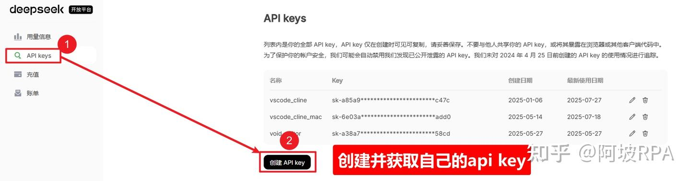
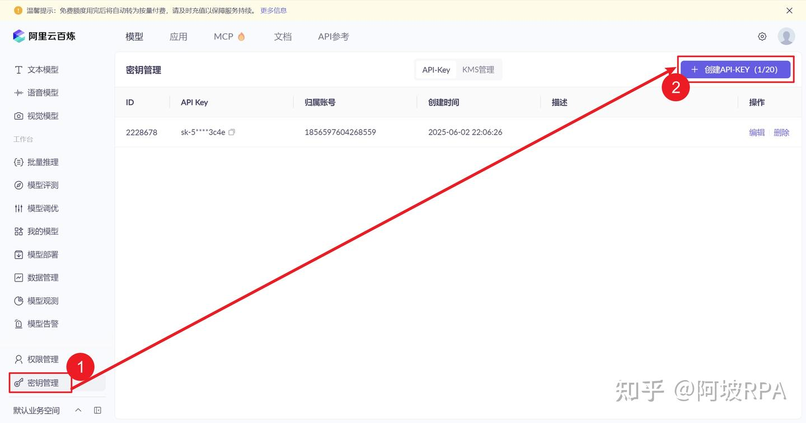
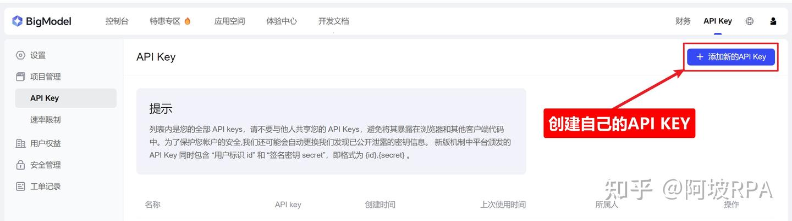
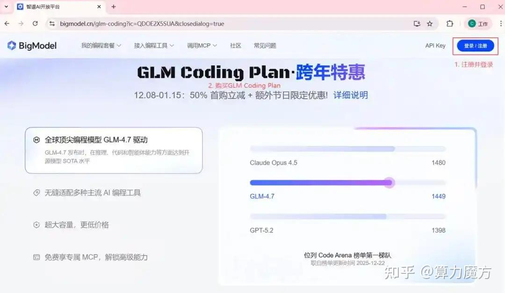
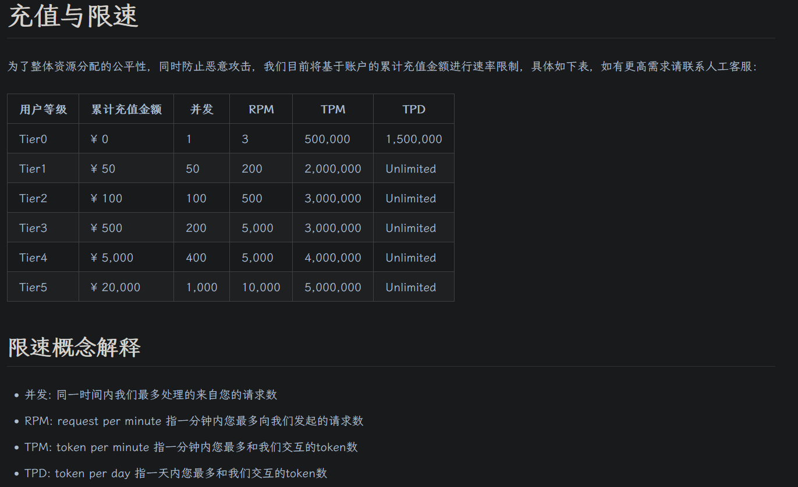
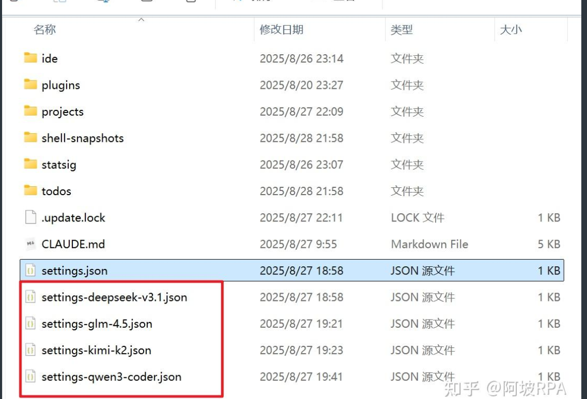
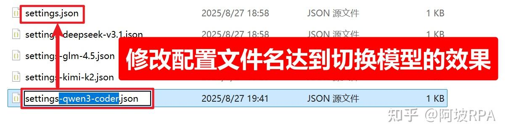

## 1 **安装Claude Code最新版本**

**Claude Code 是新一代的“实干型”AI 编程智能体。**

- **它能真正帮你干活：**你只需下达指令（如“帮我写个贪吃蛇游戏”或“修复这个报错”），它就能自主规划、直接修改你电脑上的代码文件、运行测试命令，并根据报错自动修正，直到任务完成。
- **国内开发友好：**它最棒的地方在于支持接入国产 GLM-4.7 模型。这对国内用户意味着：网络更稳、价格更低、中文理解更好。

安装Claude Code最新版本

```
npm install -g @anthropic-ai/claude-code@latest

claude -v
```
## 2 配置大模型
来到系统用户`home`目录下会看到有一个 `.claude` 文件夹，在 `.claude` 文件夹内创建一个 `settings.json` 配置文件
`~/.claude/settings.json`

这个配置文件是配置你的大模型信息的，不只是可以配置 `claude` 一家的大模型，还可以配置国内主流编程大模型的 `API KEY` ，因为他们官方都支持将自家大模型 `api` 接入 `Claude Code`，后面逐个为大家详细介绍。
```json
{
  "env": {
    "ANTHROPIC_BASE_URL": "https://api.deepseek.com/anthropic",
    "ANTHROPIC_AUTH_TOKEN": "你的API KEY",
    "ANTHROPIC_MODEL": "deepseek-reasoner",
    "ANTHROPIC_SMALL_FAST_MODEL": "deepseek-reasoner"
  }
}
```

配置好自己的模型信息后，重新进入 `claude` 可以看到接入模型成功：

这样，我们就可以在 `Claude Code` 上愉快地使用国内大模型了！

## 3 接入国内大模型
国内大模型虽然和Claude模型相比有一点差距，但是应对<mark style="background-color: yellow；color: black">普通场景</mark>，足够胜任了，并且完成的非常好，关键是便宜！

使用原则是：
1. 复杂度高的场景，使用Claude接口来完成，
2. 普通场景，使用国内大模型，
> claude 和 国内大模型轮换着用，有效控制成本！
### 3.1 deepseek-v3.2

2025年08月21日，deepseek悄悄发布 DeepSeek V3.1，具体更新了啥，可以看官方文档：[DeepSeek-V3.1 发布](https://api-docs.deepseek.com/zh-cn/news/news250821)
获取deepseek的api key 地址：[https://platform.deepseek.com/](https://platform.deepseek.com/)
注册账号并获取自己的api key

<mark style="background-color: red；color: black">获取接口配置信息</mark>
`deepseek v3.1` 官方是支持接入 `Claude Code` ，教程：[https://api-docs.deepseek.com/zh-cn/guides/anthropic_api](https://api-docs.deepseek.com/zh-cn/guides/anthropic_api)
我这里讲重点信息提炼出来，大家直接复制到自己用户目录下的 `.claude/settings.json` 文件内即可：
```json
{
  "env": {
    "ANTHROPIC_BASE_URL": "https://api.deepseek.com/anthropic",
    "ANTHROPIC_AUTH_TOKEN": "你的API KEY",
    "ANTHROPIC_MODEL": "deepseek-reasoner",
    "ANTHROPIC_SMALL_FAST_MODEL": "deepseek-reasoner"
  }
}
```
#### 3.1.1 模型 & 价格
下表所列模型价格以“<span style="color: yellow">百万 tokens</span>”为单位。
Token 是模型用来表示自然语言文本的的最小单位，可以是一个词、一个数字或一个标点符号等。
我们将根据模型输入和输出的总 token 数进行计量计费。
- 1 个英文字符 ≈ 0.3 个 token。
- 1 个中文字符 ≈ 0.6 个 token。
##### 3.1.1.1 模型细节

|                                                                                   |                                                                     |                                                      |                           |
| --------------------------------------------------------------------------------- | :------------------------------------------------------------------ | :--------------------------------------------------- | :------------------------ |
| 模型                                                                                |                                                                     | deepseek-chat                                        | deepseek-reasoner         |
| BASE URL                                                                          |                                                                     | [https://api.deepseek.com](https://api.deepseek.com) |                           |
| 模型版本                                                                              |                                                                     | DeepSeek-V3.2  <br>（非思考模式）                           | DeepSeek-V3.2  <br>（思考模式） |
| 上下文长度                                                                             |                                                                     | 128K                                                 |                           |
| 输出长度                                                                              |                                                                     | 默认 4K，最大 8K                                          | 默认 32K，最大 64K             |
| 功能                                                                                | [Json Output](https://api-docs.deepseek.com/zh-cn/guides/json_mode) | 支持                                                   | 支持                        |
| [Tool Calls](https://api-docs.deepseek.com/zh-cn/guides/tool_calls)               | 支持                                                                  | 支持                                                   |                           |
| [对话前缀续写（Beta）](https://api-docs.deepseek.com/zh-cn/guides/chat_prefix_completion) | 支持                                                                  | 支持                                                   |                           |
| [FIM 补全（Beta）](https://api-docs.deepseek.com/zh-cn/guides/fim_completion)         | 支持                                                                  | 不支持                                                  |                           |
| 价格                                                                                | 百万tokens输入（缓存命中）                                                    | 0.2元                                                 |                           |
| 百万tokens输入（缓存未命中）                                                                 | 2元                                                                  |                                                      |                           |
| 百万tokens输出                                                                        | 3元                                                                  |                                                      |                           |
##### 3.1.1.2 扣费规则
扣减费用 = token 消耗量 × 模型单价，对应的费用将直接从充值余额或赠送余额中进行扣减。 当充值余额与赠送余额同时存在时，优先扣减赠送余额。
产品价格可能发生变动，DeepSeek 保留修改价格的权利。请您依据实际用量按需充值，定期查看此页面以获知最新价格信息。
### 3.2 Qwen3-coder  --阿里
注册一个阿里的账号  地址：[https://bailian.console.aliyun.com/?tab=model#/model-market](https://bailian.console.aliyun.com/?tab=model#/model-market)

https://account.aliyun.com/login/uni_qr_login.htm?check_ua=&yst=OTN338Gm5U45PmgsUGuLj4y6Zvc7n4D9&isTracing=true&version=0.0.47&from=aliyun&newSmsLoginReg=true&type=one_login&uuid=9e3b5529-3f61-4925-9baf-325f23f3f995&ignoreRam=true (二维码自动识别)

<mark style="background-color: red；color: black">接口配置信息获取</mark>

百炼官方文档有讲如何讲api接入 `claude code` ，地址：[https://bailian.console.aliyun.com/?tab=doc#/doc/?type=model&url=2949529](https://bailian.console.aliyun.com/?tab=doc#/doc/?type=model&url=2949529)

我这里讲重点信息提炼出来，大家直接复制即可：
```bash
# 下面这一行写入~/.bashrc
export CLAUDE_CODE_GIT_BASH_PATH=/c/software/Git/bin/bash.exe
```


```json
{
  "env": {
    "ANTHROPIC_BASE_URL": "https://dashscope.aliyuncs.com/api/v2/apps/claude-code-proxy",
    "ANTHROPIC_AUTH_TOKEN": "你的API KEY",
    "ANTHROPIC_MODEL": "qwen3-coder-plus",
    "ANTHROPIC_SMALL_FAST_MODEL": "qwen3-coder-plus"
  }
}
```

Claude Code 界面仅会显示其默认的模型名称（ 如 Claude-3-5-haiku 等），而非实际调用的 qwen3-coder-plus，这属于正常现象，可以直接忽略。如果想进一步确认，可以在阿里云百炼的[模型观测](https://bailian.console.aliyun.com/?spm=5176.21213303.aillm.1.1a232f3dAFihmQ&tab=model&scm=20140722.S_百炼prompt._.RL_百炼prompt-LOC_aillm-OR_chat-V_3-RC_llm#/model-telemetry)中查询是否有 qwen3-coder-plus 的调用记录。

> 请注意：百炼api接入Claude Code 当前仅支持 qwen3-coder-plus，无法通过 `ANTHROPIC_MODEL` 环境变量修改调用模型。
  
### 3.3 智谱GLM 4.5

注册并获取API KEY: [https://bigmodel.cn/](https://bigmodel.cn/)
注册一个账户，进入个人中心页面，或者直达下面地址，来创建自己的 `api key`：
[https://bigmodel.cn/usercenter/proj-mgmt/apikeys](https://bigmodel.cn/usercenter/proj-mgmt/apikeys)

<mark style="background-color: red；color: black">接口配置信息获取</mark>
官方也对如何将api接入 `Claude Code` 写了教程：[https://docs.bigmodel.cn/cn/guide/develop/claude#claude-code](https://docs.bigmodel.cn/cn/guide/develop/claude#claude-code)
老规矩，我这里讲重点信息提炼出来，大家直接复制即可：

```json
{
  "env": {
    "ANTHROPIC_BASE_URL": "https://open.bigmodel.cn/api/anthropic",
    "ANTHROPIC_AUTH_TOKEN": "你的API KEY"
  }
}
```

> 请注意：默认接口使用的模型为 GLM-4.5 和 GLM-4.5-Air，具体根据任务复杂程度自动路由，也是我们推荐的使用方式，兼顾性能、速度与价格，暂不支持其它模型（如 GLM-4.5-X/AirX/Flash 等），因此，此处不必显式配置具体模型。

### 3.4 在Claude Code中接入GLM-4.7模型
**1，购买GLM Coding Plan**
GLM-4.7 是媲美全球顶尖竞品的国产编程模型首选。
**硬实力：**在 Code Arena 榜单中稳居第一梯队，推理与代码能力比肩 Claude Opus 4.5 等最强模型，超越 GPT-5.2。
**高性价比：**拥有超大上下文容量，但**调用成本仅为 Claude Opus 4.5 的不到 10%**（约 6%-8%），大幅降低了开发与试错成本。
**生态优势：**无缝适配主流 AI 编程工具，更独家免费赠送 **MCP（模型上下文协议）**，解锁高级编程能力。

它是国内开发者在性能、成本与工具链兼容性上的最优解。
请访问：

```text
https://www.bigmodel.cn/glm-coding?ic=QDOE2X5SUA
```
完成注册➡登录➡购买GLM Coding Plan.
完成购买后，在个人中心页面，点击 API Keys，创建一个新的 API Key。

```text
https://bigmodel.cn/login?redirect=%2Fusercenter%2Fproj-mgmt%2Fapikeys
```


**接入GLM模型**

打开Windows 的 CMD（命令提示符），依次输入下面的命令：

```text
# 在 Cmd 中运行以下命令
# 注意替换里面的 `your_zhipu_api_key` 为您上一步获取到的 API Key
setx ANTHROPIC_AUTH_TOKEN your_zhipu_api_key
setx ANTHROPIC_BASE_URL https://open.bigmodel.cn/api/anthropic
setx CLAUDE_CODE_DISABLE_NONESSENTIAL_TRAFFIC 1
```

### 3.5 Kimi K2

1、注册一个账号 地址：[https://platform.moonshot.cn](https://platform.moonshot.cn/)


进入API KEY管理页面：[https://platform.moonshot.cn/console/api-keys](https://platform.moonshot.cn/console/api-keys)


<mark style="background-color: red；color: black">接口配置信息获取</mark>
官方教程地址：[https://platform.moonshot.cn/docs/guide/agent-support](https://platform.moonshot.cn/docs/guide/agent-support)
这里重点信息提炼出来，大家直接复制即可：

```text
{
  "env": {
    "ANTHROPIC_BASE_URL": "https://api.moonshot.cn/anthropic",
    "ANTHROPIC_AUTH_TOKEN": "你的API KEY",
    "ANTHROPIC_MODEL": "kimi-k2-turbo-preview",
    "ANTHROPIC_SMALL_FAST_MODEL": "kimi-k2-turbo-preview"
  }
}
```

## 4 切换模型
### 4.1 cc-switch
https://github.com/farion1231/cc-switch


讲了这么多，这几家国产大模型我都注册了，想切换着用怎么办？
目前 Claude Code 并不支持添加多个自定义模型，大家可以参考我的方法来切换模型使用，大家若有更好的方法也欢迎评论区告诉我：
### 4.2 每个模型配置一个文件
通过配置文件配置大模型的，可以先将每个模型配置一个文件：

### 4.3 切换模型

希望用哪个大模型的话，可以通过切换文件名来达到切换模型的效果，不过记得切换完配置文件，记得**重启claude**，配置才能生效！


## 5 启动后
遇到“Do you trust the files in this folder?"， 选择”1. Yes, proceed"，直接按回车键 (Enter)，进入Claude Code的交互界面。


关闭了 VPN/代理，确保在国内环境，进入Claude Code的交互界面后，输入：你好，现在网络通畅吗？若收到回复类似下图，恭喜你，GLM-4.7配置成功！你可以放心地开始让Claude Code帮你写代码了！


## 6 五，开启 AI Agent编程新时

至此，你已经拥有了一位**不知疲倦、成本低廉且智商超群**的 AI 编程智能体。

从现在起，不管是重构遗留代码、编写单元测试，还是从零构建一个小工具，你都可以试着把任务丢给它：“Hey Claude, 帮我读一下当前目录的代码，然后...”

别让它只做聊天机器人，**让它去操作文件，让它去跑命令。**这才是 Vibe Coding 时代程序员该有的开发体验。

**Happy Coding! 💻✨**

