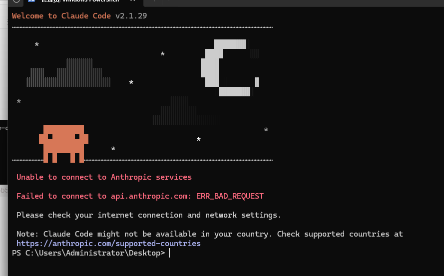
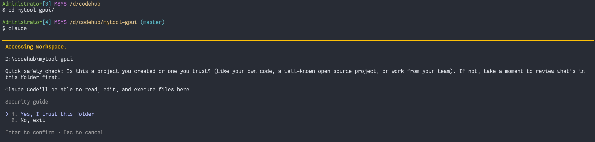
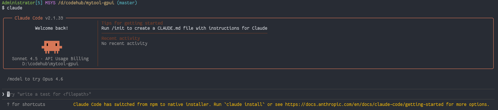

# claude

## 1 install
```bash
npm install -g @anthropic-ai/claude-code@latest
```
## 2 初始化
添加配置文件："~\.claude\settings.json"
```json
{
  "env": {
    "hasCompletedOnboarding": "true",
    "ANTHROPIC_BASE_URL": "https://open.bigmodel.cn/api/anthropic",
    "ANTHROPIC_AUTH_TOKEN": "your_zhipu_api_key",
    "CLAUDE_CODE_GIT_BASH_PATH": "C:\\software\\Git\\bin\\bash.exe",
    "CLAUDE_CODE_DISABLE_NONESSENTIAL_TRAFFIC": "1",
    "ANTHROPIC_DEFAULT_OPUS_MODEL": "GLM-4.7",
    "ANTHROPIC_DEFAULT_SONNET_MODEL": "GLM-4.7",
    "ANTHROPIC_DEFAULT_HAIKU_MODEL": "GLM-4.7",
    "ANTHROPIC_MODEL": "GLM-4.7"
  },
  "language": "Chinese",
  "mcpServers": {
    "zhipu-web-search-sse": {
      "url": "https://open.bigmodel.cn/api/mcp-broker/proxy/web-search/mcp?Authorization=your_zhipu_api_key"
    }
  }
}
```
```cmd
setx ANTHROPIC_AUTH_TOKEN your_zhipu_api_key
setx ANTHROPIC_BASE_URL https://open.bigmodel.cn/api/anthropic
setx CLAUDE_CODE_DISABLE_NONESSENTIAL_TRAFFIC 1
```

> claude 锁区解决


```cmd
powershell -Command "$f='%USERPROFILE%\.claude.json';$j=Get-Content $f|ConvertFrom-Json;$j|Add-Member -NotePropertyName 'hasCompletedOnboarding' -NotePropertyValue $true -Force;$j|ConvertTo-Json|Set-Content $f"
```
意思是在~/.claude.json 中添加`hasCompletedOnboarding：true`

继续：


## 3 配置 MCP 扩展功能
<mark style="background-color: red；color: black"> 当前配置的 MCP 服务器列表</mark>

| 服务器名称                                                      | 主要功能                                  | 响应时间  |
| ---------------------------------------------------------- | ------------------------------------- | ----- |
| MiniMax MCP                                                | 网络搜索 + 图像理解                           | 2.5 秒 |
| [http://BigModel.cn](http://bigmodel.cn/) Web Search Prime | 网页搜索 + 抓取                             | 1.8 秒 |
| [http://BigModel.cn](http://bigmodel.cn/) Web Reader       | 网页读取                                  | 2.0 秒 |
| [http://BigModel.cn](http://bigmodel.cn/) ZRead            | GitHub 仓库浏览                           | 1.5 秒 |
| Office-Word-MCP-Server                                     | Word 文档处理                             | 3.3 秒 |
| MarkItDown-MCP                                             | 格式转换  `pip install 'markitdown[all]'` | 2.8 秒 |
| Bright Data                                                | 网络数据提取                                | 3.0 秒 |
| Z.AI MCP                                                   | 8 个实用工具                               | 2.5 秒 |


1. 命令行添加
```bash
claude mcp add -s user -t http web-search-prime https://open.bigmodel.cn/api/mcp/web_search_prime/mcp --header "Authorization: Bearer your_api_key"

```
2. 修改文件（追加到 `~/.claude.json` 的尾部）
```bash
"mcpServers": {
    "zhipu-web-search-sse": {
      "url": "https://open.bigmodel.cn/api/mcp-broker/proxy/web-search/mcp?Authorization=your_api_key"
    }
  }
```


### 3.1 联网搜索 MCP（`webSearchPrime`）
```json
{
  "mcpServers": {
    "zhipu-web-search-sse": {
      "url": "https://open.bigmodel.cn/api/mcp-broker/proxy/web-search/mcp?Authorization=Your Zhipu API Key"
    }
  } 
}
```
### 3.2 网页读取 MCP（`webReader`）
```json

##### 配置方式

**一键安装**：

```bash
claude mcp add -s user -t http web-reader https://open.bigmodel.cn/api/mcp/web_reader/mcp --header "Authorization: Bearer your_api_key"

**或手动配置**：

{
  "mcpServers": {
    "web-reader": {
      "type": "http",
      "url": "https://open.bigmodel.cn/api/mcp/web_reader/mcp",
      "headers": {
        "Authorization": "Bearer your_api_key"
      }
    }
  }
}
```

##### 3.2.1.1 典型场景

- 自动解析 API 文档并生成摘要
- 提取 GitHub 项目 README 核心信息
- 构建团队技术知识库

### 3.3 视觉理解 MCP（`image_analysis` / `video_analysis`）

> 此 MCP 为 **本地服务**，需 Node.js ≥ v18
##### 3.3.1.1 配置方式

**一键安装**：

```bash
claude mcp add -s user zai-mcp-server --env Z_AI_API_KEY=your_api_key -- npx -y "@z_ai/mcp-server"
```

> **Windows 用户注意**：若在 PowerShell 中报 `-y` 错误，请改用 **CMD** 执行。

**或手动配置**：

```json
{
  "mcpServers": {
    "zai-mcp-server": {
      "type": "stdio",
      "command": "npx",
      "args": ["-y", "@z_ai/mcp-server"],
      "env": {
        "Z_AI_API_KEY": "your_api_key",
        "Z_AI_MODE": "ZHIPU"
      }
    }
  }
}
```

##### 3.3.1.2 使用方法

1. 将图片（如 `demo.png`）放入当前工作目录
    
2. 在 Claude Code 中输入：
    
    ```
    What does demo.png describe?
    ```
    
    或
    
    ```
    hi describe this chart.jpg
    ```
    

> **禁止直接粘贴图片**！否则客户端会绕过 MCP 直接调用模型，无法使用视觉理解能力。


## 4 MCP 使用额度说明

|套餐|搜索 + 网页读取次数/月|视觉理解资源池|
|---|---|---|
|Lite|100 次|5 小时 prompt，超限后 5 小时恢复|
|Pro|1,000 次|同上|
|Max|4,000 次|同上|

> 搜索 MCP 与网页读取 MCP **共享额度**；视觉理解 MCP **独立计费**。
## 5 故障排查

#### 5.1.1 配置不生效

- 关闭所有 Claude Code 进程
- **新建终端窗口**再启动
- 检查 `settings.json` 是否为合法 JSON（可用 [JSONLint](https://jsonlint.com/) 验证）
- 如仍无效，删除 `~/.claude/settings.json` 后重配

#### 5.1.2 API Key 无效

- 确认密钥复制完整（无多余空格）
- 确认密钥已在平台激活
- 确认账户有足够余额

#### 5.1.3 MCP 连接失败

- 检查网络与防火墙
    
- 验证 URL 是否正确（见各 MCP 文档）
    
- 视觉 MCP 可本地测试：
    
    ```bash
    Z_AI_API_KEY=your_api_key npx -y @z_ai/mcp-server
    ```

#### 5.1.4 卸载旧 MCP（重装前必做）

```bash
claude mcp list
claude mcp remove <server-name>
```
## 6 推荐版本与升级
- **查看版本**：
    
    ```bash
    claude --version
    ```
    
- **升级到最新版**：
    
    ```bash
    claude update
    ```
    

---


## 7 MarkItDown
```bash
MarkItDown目前支持以下转换：

- 可移植文档格式
- 幻灯片
- 字
- Excel
- 图像（EXIF元数据和OCR）
- 音频（EXIF元数据和语音转录）
- 超文本标记语言
- 基于文本的格式（CSV、JSON、XML）
- ZIP文件（迭代内容）
- Youtube网址
- EPubs
- …还有更多！

## 为什么选择Markdown？

Markdown非常接近纯文本，标记或格式很少，但仍然 提供了一种表示重要文档结构的方法。主流LLM，例如 OpenAI的GPT-4o，原生”_说_“Markdown，并经常将Markdown合并到他们的 未经提示的回复。这表明他们已经接受了大量的培训 Markdown格式的文本，并能很好地理解。作为附带好处，Markdown约定 也具有很高的令牌效率。

## 先决条件
MarkItDown需要Python 3.10或更高版本。建议使用虚拟环境以避免依赖冲突。
使用标准Python安装，您可以使用以下命令创建和激活虚拟环境：

如果使用 `uv`，您可以使用以下工具创建虚拟环境：

uv venv --python=3.12 .venv
source .venv/bin/activate
# NOTE: Be sure to use 'uv pip install' rather than just 'pip install' to install packages in this virtual environment

如果你正在使用Anaconda，你可以使用以下工具创建一个虚拟环境：
conda create -n markitdown python=3.12
conda activate markitdown

## 安装
要安装MarkItDown，请使用pip： `pip install 'markitdown[all]'`。或者，您可以从源代码安装它：
git clone git@github.com:microsoft/markitdown.git
cd markitdown
pip install -e 'packages/markitdown[all]'

## 用法

### 命令行

markitdown path-to-file.pdf > document.md
或使用 `-o` 要指定输出文件，请执行以下操作：
markitdown path-to-file.pdf -o document.md
您还可以管道内容：
cat path-to-file.pdf | markitdown
### 7.1 可选依赖关系
MarkItDown具有用于激活各种文件格式的可选依赖项。在本文档的前面，我们安装了所有可选的依赖项 `[all]` 选项。但是，您也可以单独安装它们以获得更多控制。例如：

pip install 'markitdown[pdf, docx, pptx]'
将仅安装PDF、DOCX和PPTX文件的依赖项。
目前，以下可选依赖项可用：
- `[all]` 安装所有可选依赖项
- `[pptx]` 安装PowerPoint文件的依赖项
- `[docx]` 安装Word文件的依赖项
- `[xlsx]` 安装Excel文件的依赖项
- `[xls]` 安装旧Excel文件的依赖项
- `[pdf]` 安装PDF文件的依赖项
- `[outlook]` 安装Outlook邮件的依赖项
- `[az-doc-intel]` 安装Azure文档智能的依赖项
- `[audio-transcription]` 安装wav和mp3文件音频转录的依赖项
- `[youtube-transcription]` 安装用于获取YouTube视频转录的依赖项

### 7.2 插件

MarkItDown还支持第三方插件。默认情况下，插件是禁用的。要列出已安装的插件：
markitdown --list-plugins
要启用插件，请使用：
markitdown --use-plugins path-to-file.pdf
要查找可用的插件，请在GitHub上搜索标签 `#markitdown-plugin`。要开发插件，请参阅 `packages/markitdown-sample-plugin`.
### 7.3 Azure文档智能
要使用Microsoft文档智能进行转换，请执行以下操作：
markitdown path-to-file.pdf -o document.md -d -e "<document_intelligence_endpoint>"

有关如何设置Azure文档智能资源的详细信息，请参阅 [这里](https://learn.microsoft.com/en-us/azure/ai-services/document-intelligence/how-to-guides/create-document-intelligence-resource?view=doc-intel-4.0.0)
### 7.4 Python API
# Python的基本用法：
from markitdown import MarkItDown
md = MarkItDown(enable_plugins=False) # Set to True to enable plugins
result = md.convert("test.xlsx")
print(result.text_content)
# Python中的文档智能转换：
from markitdown import MarkItDown
md = MarkItDown(docintel_endpoint="<document_intelligence_endpoint>")
result = md.convert("test.pdf")
print(result.text_content)

# 要使用大型语言模型进行图像描述（目前仅适用于pptx和图像文件），请提供 `llm_client` 和 `llm_model`:

from markitdown import MarkItDown
from openai import OpenAI
client = OpenAI()
md = MarkItDown(llm_client=client, llm_model="gpt-4o", llm_prompt="optional custom prompt")
result = md.convert("example.jpg")
print(result.text_content)
### 7.1 码头工人
docker build -t markitdown:latest .
docker run --rm -i markitdown:latest < ~/your-file.pdf > output.md

```