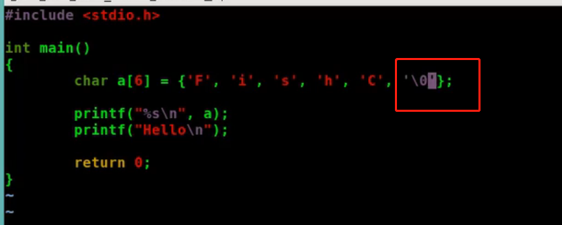

[toc]

## 什么是变量

变量的意义是确定目标并提供存放的空间


## 变量名

```sh
1. 变量名只能是英文字母(a-zA-Z)/数字(0-9)/下划线(_)组成: i_love_fishC_520
2. 第一个字母必须是字母或者下划线开头
3. 变量名区分大小写: fish FISH是两个变量
4. 不能使用关键字来命名变量
```

### 标识符

定义变量时，我们使用了诸如 a、abc、mn123 这样的名字，它们都是程序员自己起的，一般能够表达出变量的作用，这叫做标识符（Identifier）。

标识符就是程序员自己起的名字，除了变量名，后面还会讲到函数名、宏名、结构体名等，它们都是标识符。不过，名字也不能随便起，要遵守规范；C语言规定，标识符只能由字母（A~Z, a~z）、数字（0~9）和下划线（_）组成，并且`第一个字符必须是字母或下划线，不能是数字`。

以下是合法的标识符：
a, x, x3, BOOK_1, sum5

　关键字是由Ｃ语言规定的具有特定意义的字符串，通常也称为保留字。用户定义的标识符不应与关键字相同。

==Ｃ语言的关键字分为以下几类：==

(1) 类型说明符:
用于定义、说明变量、函数或其它数据结构的类型。如前面例题中用到的int,double等

(2) 语句定义符: 用于表示一个语句的功能。如例1.3中用到的if  else就是条件语句的语句定义符。

(3) 预处理命令字:
用于表示一个预处理命令。如前面各例中用到的include。


## 数据类型

```sh
char 字符型: 占1个字节
int 整形: 所用机器中整数的最自然长度
float 单精度浮点型
double 双精度浮点型
```


## 数据类型的取值范围

1. 比特位:CPU能读懂的最小单位: bit b

2. 字节:内存机构的最小寻址单位: Byte B

`1 Byte = 8 bit`


### 类型强制转换


### 数据类型的长度


### 基本数据类型的取值范围


## 常量
1. 整型常量:520,1314,123

2. 实型常量:3.14,5.21,8.55

3. 字符常量:

  (1) 普通字符: 'L','o'

  (2) 转义字符: '\n','\t'

  

4. 字符串常量:"FISHC"

5. 符号常量: 使用之前必须先定义


### 符号常量的定义


### 字符串常量


## sizeof运算符

​	


### signed和unsigned


### 进制和存储


### signed类型数据的符号位

1. 存放signed类型的存储单元中,左边第一位表示符号位(为0整数为正数,为1正数为负数)
2. 一个32位的整型变量 signed int,除去左边第一位符号位,剩下只有31个表示值的bit位

==int的最大值和最小值: signed int取值范围:[-128,127]==


1. 事实上计算机是用补码的方式存储整数的值

   1) 正数的补码是该数的二进制形式

   2) 负数的补码是该数的绝对值的二进制形式再按位取反


## 字符和字符串


### 字符串

```c
1. char 变量名[数量];   //声明
2. 变量名[索引号]=字符;  //赋值
//例子:
char name[5];
name[0]='F';
name[3]='3';
3. 定义字符串
char name[3]={'F','1','2'};
char name[]="F12";
```




## 算数运算符

C语言通过提供运算符支持我们对数据进行处理


#### 目的定义

```c
//有几个操作数就为 几目
//1   		+   		2
//操作数1	运算符+		操作数2
```

#### 表达式

```sh
用用算符和括号将被操作数连接起来的式子,称之为表达式
1+1
'a'+'b'
a+b
a+'b'+pow(a,b) *3/4+5
```

==表达式的优先级==


### 关系运算符


### 逻辑运算符: 逻辑与/逻辑或/逻辑非


### 短路求值(最小化求值)

是一种逻辑运算符的求值策略

只有当第一个运算数的值无法确定逻辑运算的结果时,才对第二个运算数进行求值

C语言对于逻辑与和逻辑或采用短路求值的方式:


