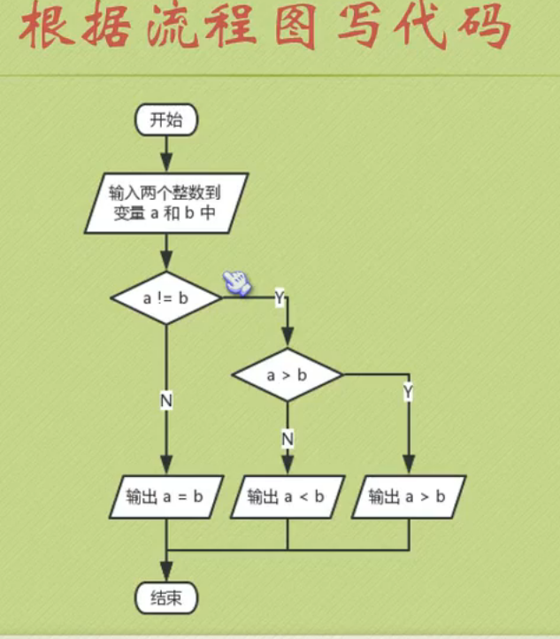

[toc]

## if语句


## switch和分支嵌套




### scanf输入函数


## while和 dowhile

### 1+2+3+4+…+100


## for 循环


### 一个数是否位素数


### 简化写法


### 两个循环变量


```sh
0 10
1 9
2 8
3 7
4 6
5 5
```

### 九九乘法表


## 运算符

### 赋值运算符


### 自增自减运算符


### 逗号运算符


### 条件运算符


### goto语句

```
语法: goto 标签;
```


### 注释

