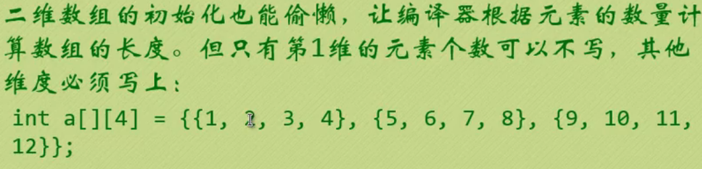

[toc]


## 数组


1. 数组的定义

```
类型 数组名[元素个数]
int a[6];
char b[24];
double c[3];
```


2. 访问数组中的元素

```C
//数组名[下标]
a[0]; //a数组中第一个元素
b[2]; //b数组中第3个元素
c[5]; //a数组中第6个元素
```

3. 循环和数组的关系(常常使用循环来访问数组)
```c
int a[10];
for (int i = 0;i<10;i++){
    a[i]=i;
}
```

### 数组的初始化

1. 数组中所有元素初始化化为0:  

`int a[10]={0};  //事实上这里只是将第一个元素赋值为0 `

2. 赋值为不同的值,用逗号隔开:

`int a[10]={0,1,2,3,4,5,6,7,8,9}; `

3. 只给部分元素赋值,未被赋值的将自动初始化为0:

`int a[10]={2,2,4,5};//剩余默认自动化初始为0`

4. 只给出元素的值,不指定数组长度(编译器会根据值的个数自动计算数组的长度)

`int a[]={1,2,3,56,78,12};`

5. 只为数组中的某些指定元素进行赋值,而未赋值的默认自动初始化为0:

`int a[10]={[3]=45;[6]=1,[8]=9};`

##  特殊注意

### 变长数组: 编译后由入参决定数组的个数


### 数组越界: 


### 字符数组初始化


### C语言标准库函数分类

C标准函数库(C standard library) 是所有符合标准的头文件的集合,以及常用的函数库实现程序,几乎所有的C语言程序都是由标准函数库的函数来创建的.


1. strlen


2. strcpy


3. strncpy受限拷贝


4. strcat和strncat


5. strcmp和strncmp

int strncmp(const char *s1, const char *s2, size_t n);
**参数解析：**

strncmp 函数用于比较两个字符串的前 n 个字符。[该函数从第一个字符开始，依次比较每个字符的 ASCII 码大小，发现两个字符不相等或抵达结束符（'\0'）为止，或者前 n 个字符完全一样，也会停止比较。]

| **参数** | **含义**             |
| -------- | -------------------- |
| s1       | 指向待比较的字符串 1 |
| s2       | 指向待比较的字符串 2 |
| n        | 指定待比较的字符数   |
**返回值：**
返回一个整数表示两个字符串的关系：

| **返回值** | **含义**                                   |
| ---------- | ------------------------------------------ |
| < 0        | 字符串 1 的字符小于字符串 2 对应位置的字符 |
| = 0        | 两个字符串的内容完全一致                   |
| > 0        | 字符串 1 的字符大于字符串 2 对应位置的字符 |

```c
#include <stdio.h>
#include <string.h>

int main(){
        char str1[40] = "FishC";
        char str2[40] = "FishC.com";

        if (!strncmp(str1, str2, 5))
        {   printf("str1和str2前5个字符相同！\n");        }
        else {
            printf("str1和str2前5个字符不同！\n");        }
        return 0;
}
```

 比较字符串大小写 ==strcmpi strncmp strnicmp strcmp这四个函数有什么区别==


## 二维数组





