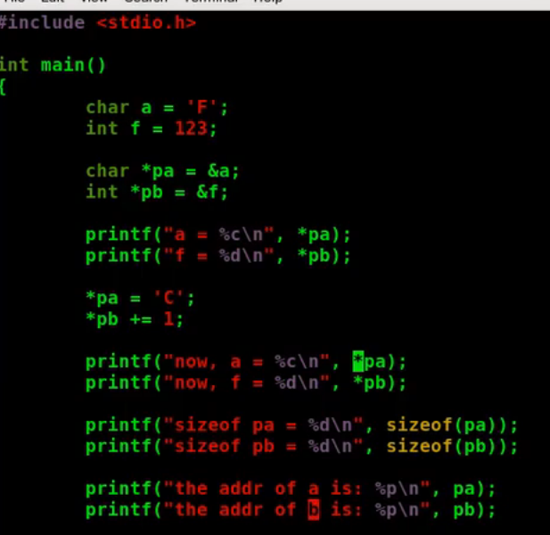

[toc]


## ==指针==


### 指针和指针变量


### 取地址运算符和取值运算符

1. 取地址: 获取变量的地址   &

`char *pa=&a; int *pb=&f;`

2. 取值:获取指针变量指向的数据   *

`printf("%c, %d\n", *pa, *pb);`

取值运算符也叫间接运算符




### 避免访问未初始化的指针(可能会擦除物理真实数据)


## 指针和数组


### 指向数组的指针:

```c
char *p;
p=a;
p=&a[0];
```

### 指针的运算

1. 指针指向数组元素: 可以对指针变量进行加减运算==指向距离指针所在位置向前和i向后移动第n个元素
2. 指针法: 使用指针访问数组元素的方法(对比标准下标访问数组元素的方法)

==p+1不是简单的将地址加1,而是指向数组的下一个元素==

(1) 数组指针:


(2)字符指针


### 指针和数组的区别

数组名只是一个地址,而指针是一个左值


### 指针数组

1. 指针数组:  `int *p1[5];`==指针数组是一个数组,数组中每一个元素存放一个指针变量==
2. 指针数组的初始化


### 数组指针

数组指针:` int (*p2)[5]; `==数组指针是一个指针,它指向的是一个数组,==数组名指向的是数组第一个元素的地址


## 指针和二维数组


### 语法糖 解引用


## void指针和NULL指针

void指针称为通用指针,可以指向任意类型的数据, 任何类型的指针都可以赋值给void指针;

void指针可以指向任意类型的指针(不同类型的数据转换)

**特殊的约定**: ==字符串地址指向字符串的第一个字符的地址,会一直读下去,直到遇到\0为止==


### NULL指针  空指针

`#define NULL ((void *)0)`


==NULL 和 NUL==

```
NULL: 是用于指针和对象,表示控制,指向一个不被使用的地址
NUL: 表示'\0',表示字符串的结尾
```

## 指向指针的指针


### 指针数组和指向指针的指针

指针数组里面存放的都是指针,字符串名都是指向字符串首字符的指针


## 指针数组和指向指针的指针


### 数组指针和二维数组

通过指针对一维数组进行索引


#### 数组指针


## 常量和指针


### 常量指针

const int s=0; int const s=0;

p指针是一个常量不可以修改,一旦赋值不可更改


