[toc]


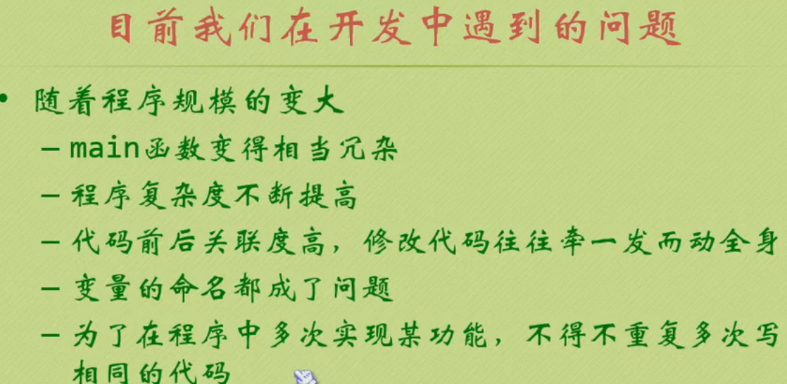

## 函数:

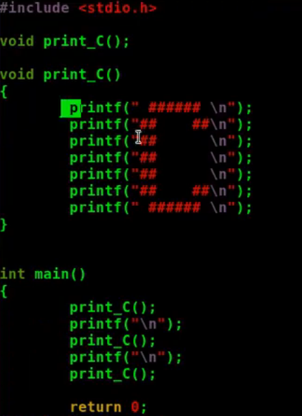

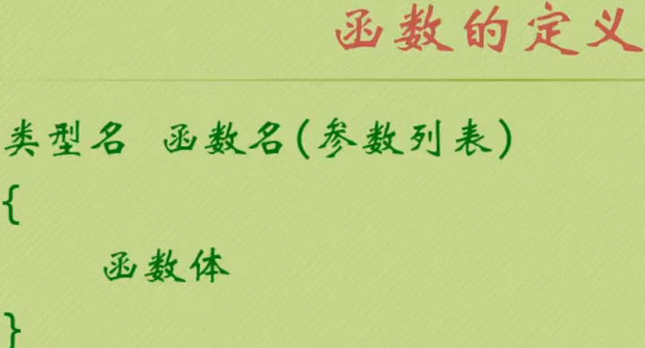

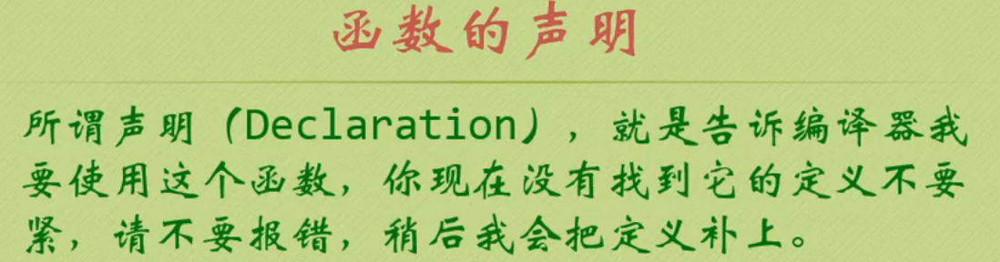

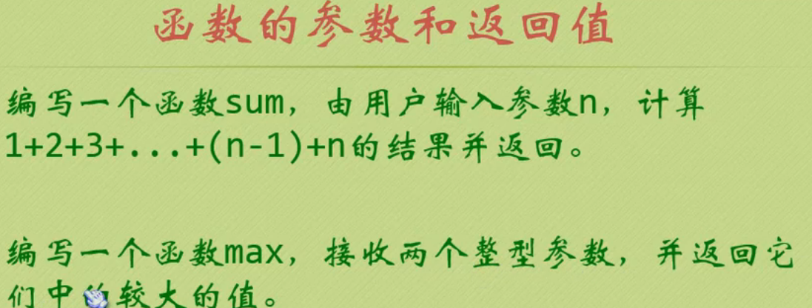

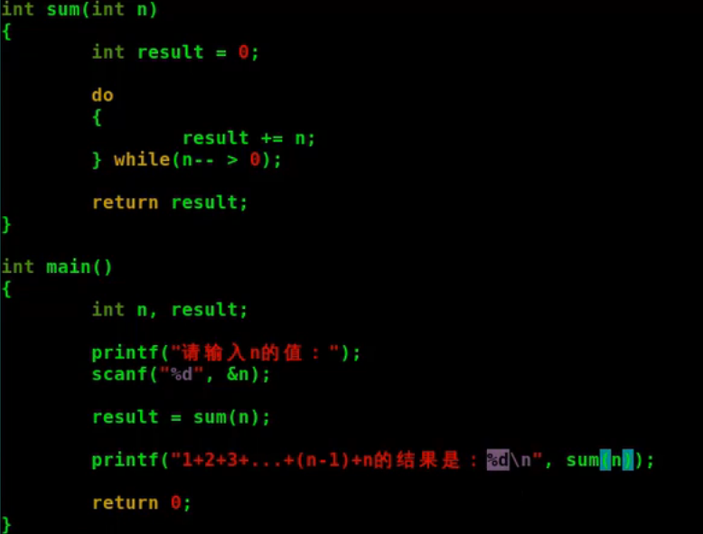

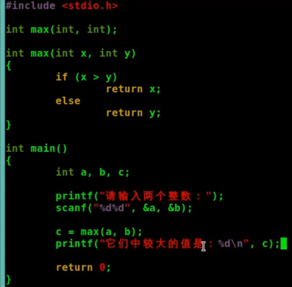

## 参数和指针

类型名 函数名(参数列表){

​	函数体

}

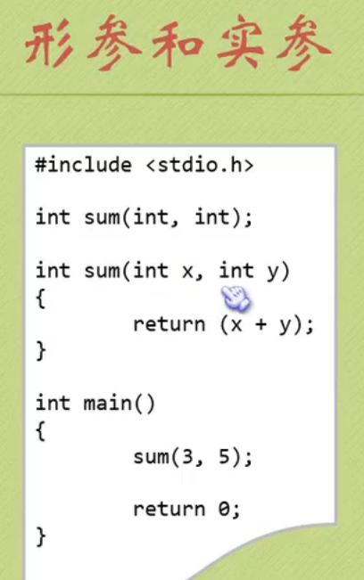

### 传值和传址

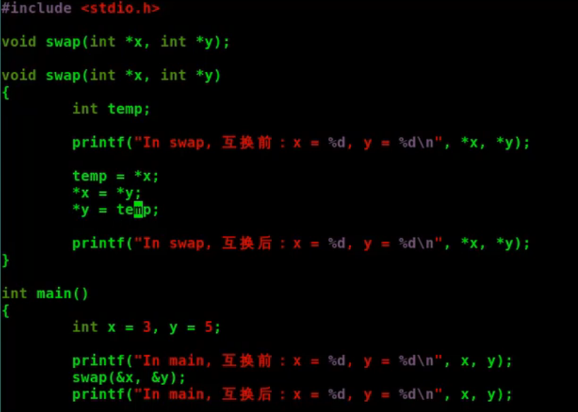

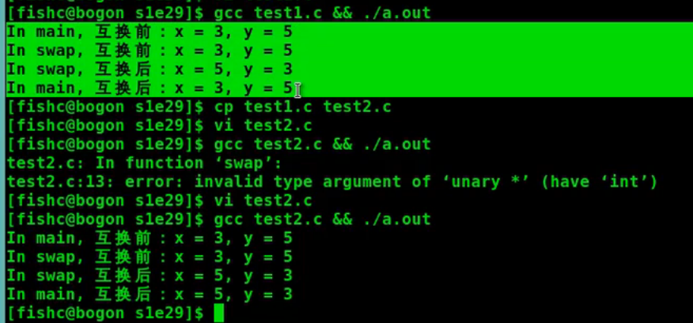

### 传数组

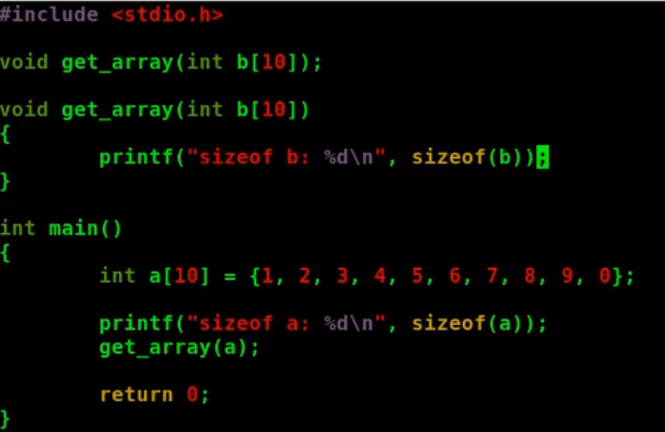

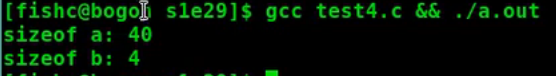

### 可变参数 var_arg

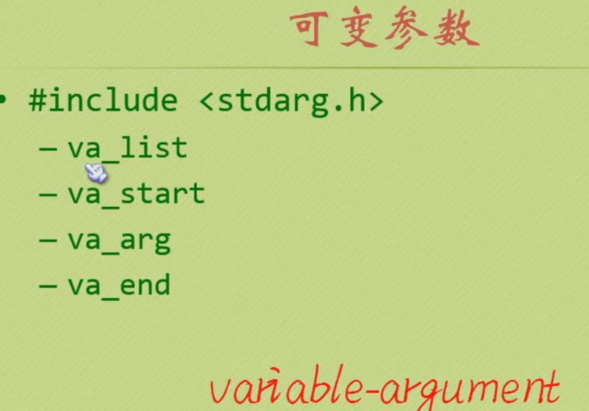

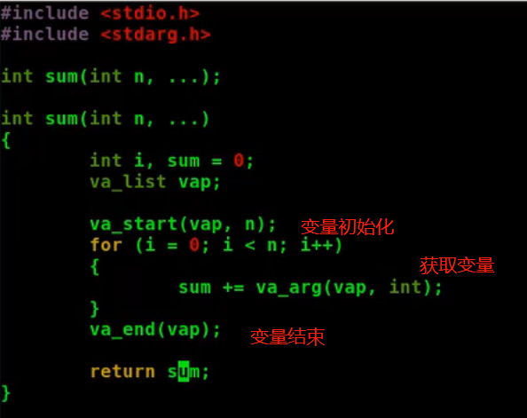

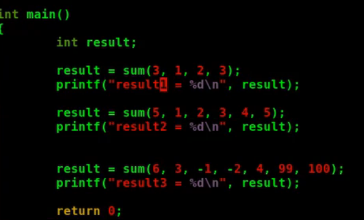

## 指针函数和函数指针

### 指针函数

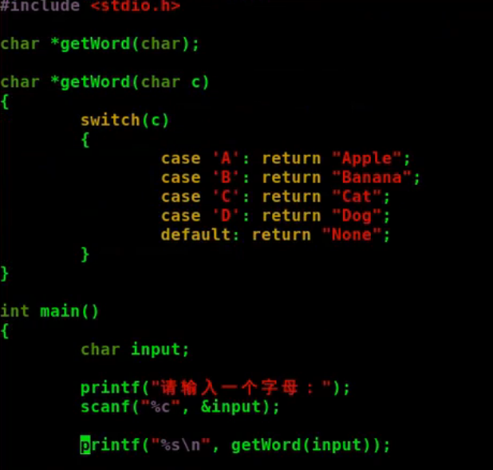

字符串约定只要直到第一个字符的地址,就可以知道整个字符串; 打印第一个地址直到结束符\0为止

==指针函数:使用指针变量作为函数的返回值,就是指针函数==

<font color=red>**不要返回局部变量的指针**</font>

错误示例:

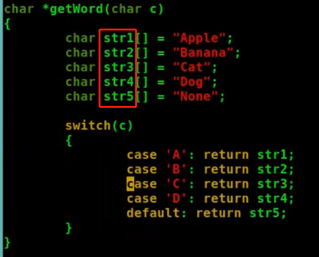

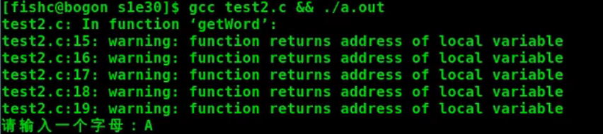

### 函数指针

```c
指针函数: int *p();
函数指针: int (*p)(); //指向函数的指针
```

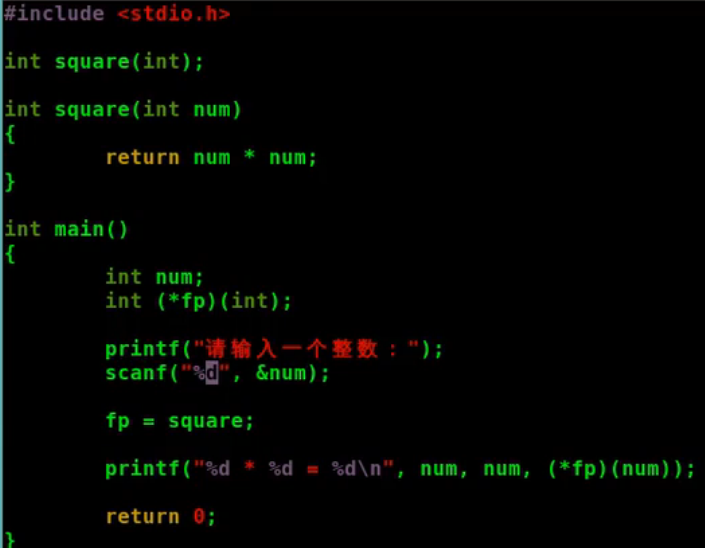

函数名==函数的地址

```c
fp=&square;
printf("%d * %d = %d\n",num,num,fp(num));//虽然不会报错,但是不建议这样些,fp一眼看上去可能会是一个函数名,(*fp)(num)就知道是一个函数指针,方便别人阅读你的代码
```

### 函数指针作为参数

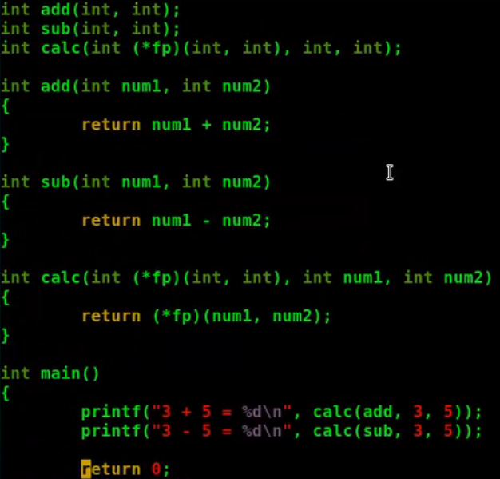

### 函数指针作为返回值

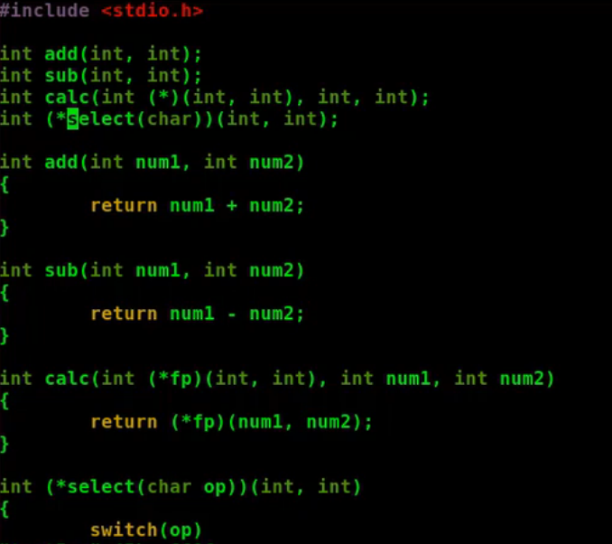

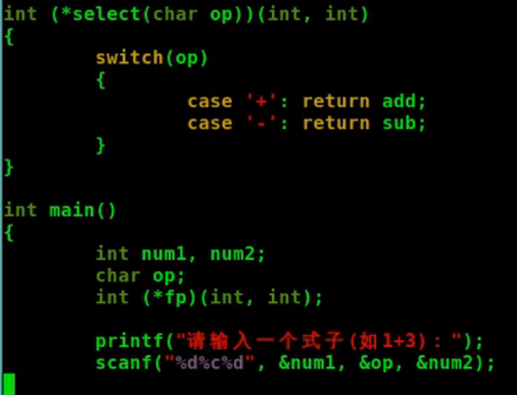

