[toc]

## 动态内存管理

1. malloc 申请动态内存空间

  可以申请任意尺寸的内存空间

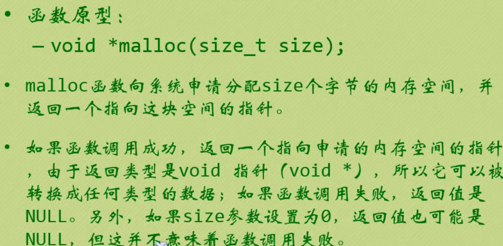

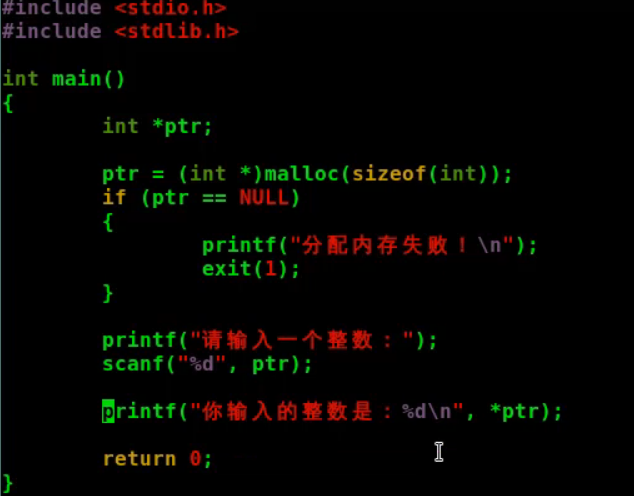


2. free 释放动态内存空间

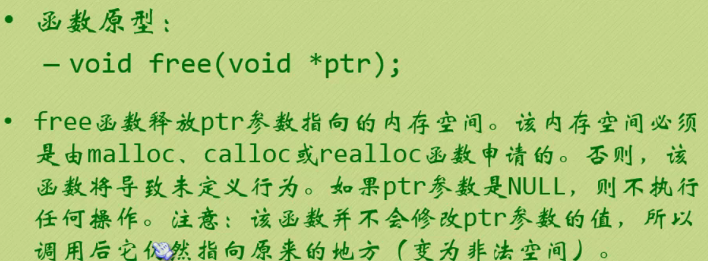

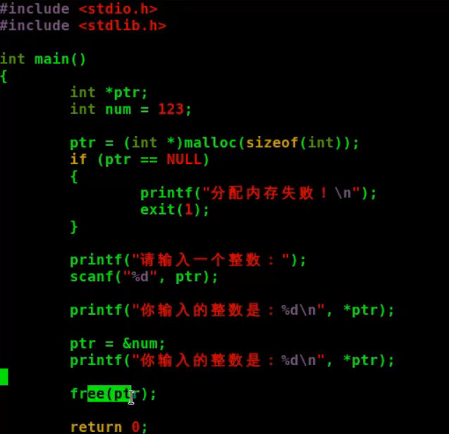

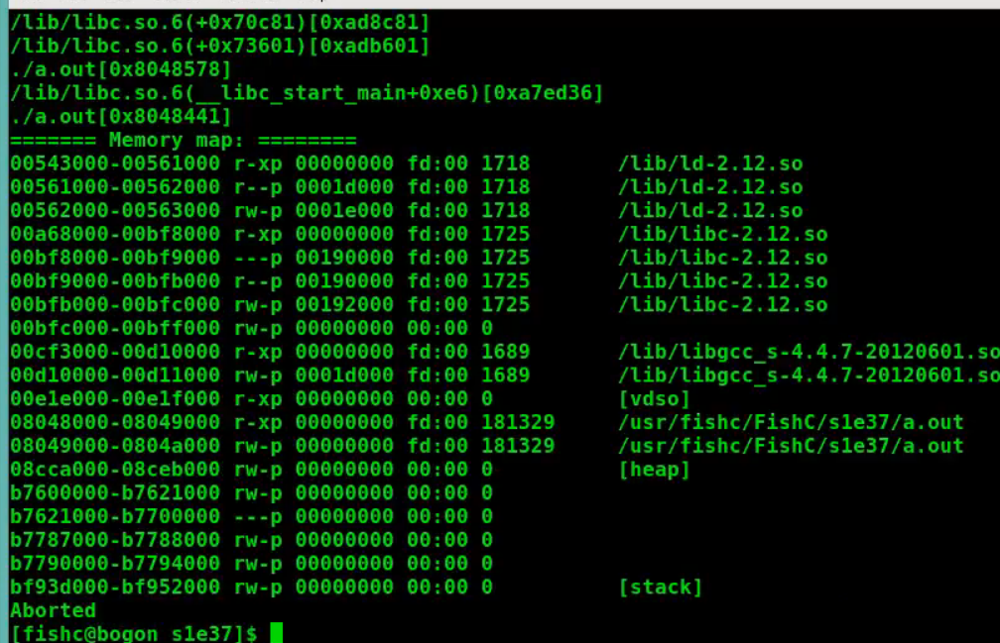

3. calloc 申请并初始化一系列内存空间

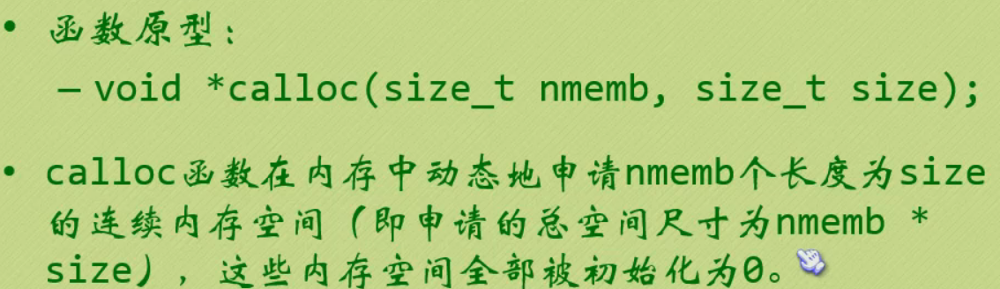

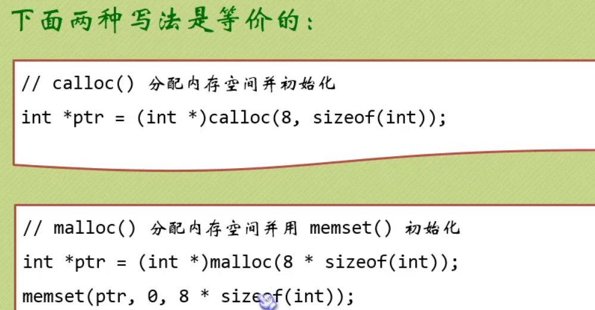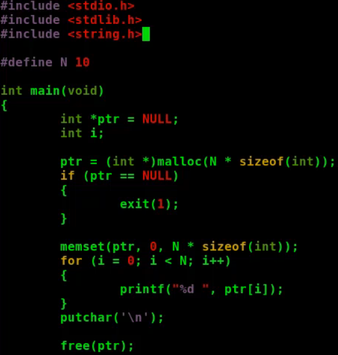

4. realloc 重新分配内存空间

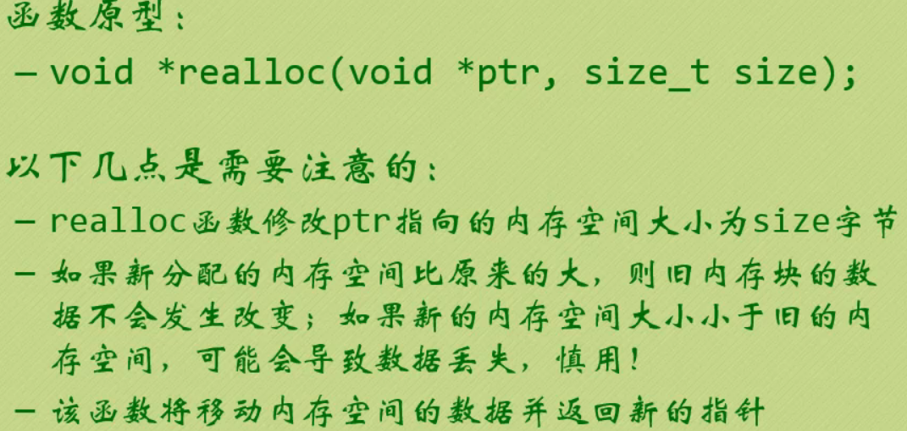

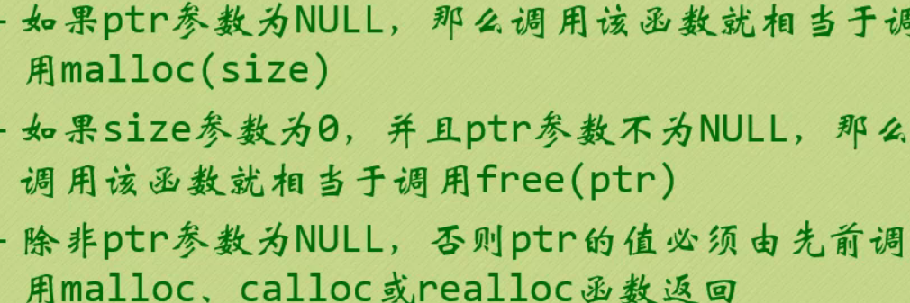

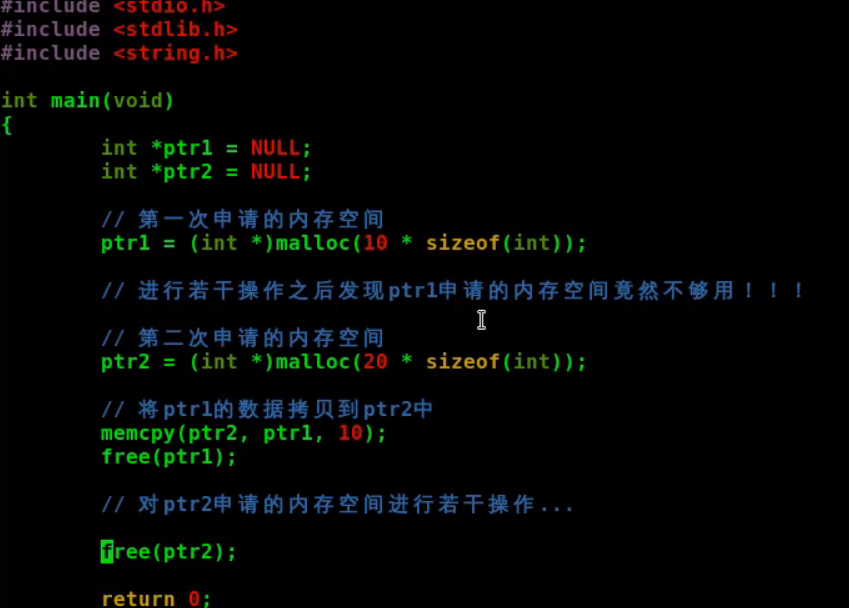

==根据用户输入的数据个数,重新realloc内存==

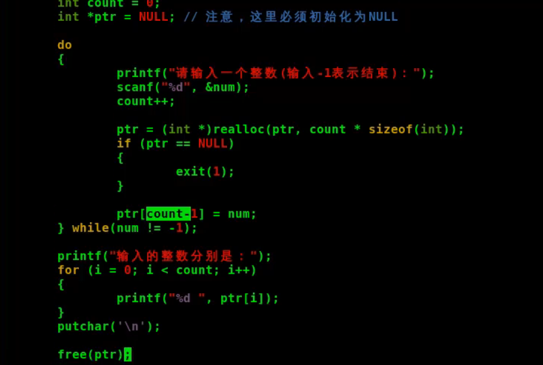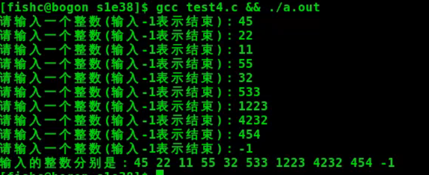

### 内存泄漏

申请的内存没有主动释放会导致内存泄漏

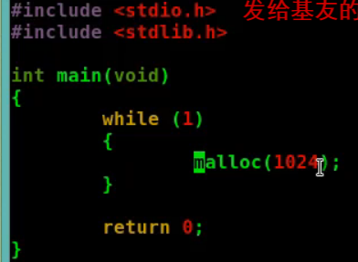

导致内存泄漏的场景:

1. 用完内存块没有及时使用free进行释放
2. 丢失内存块地址

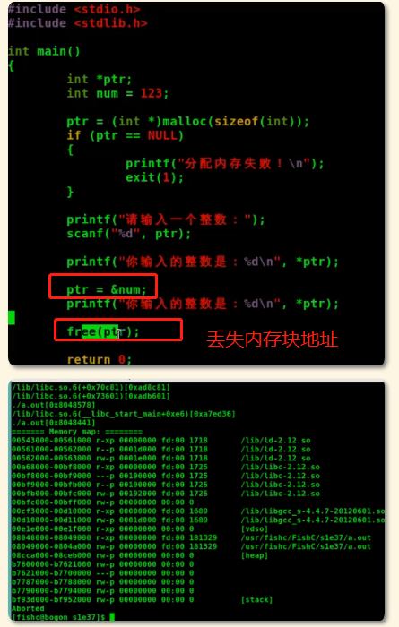

## 内存动态管理

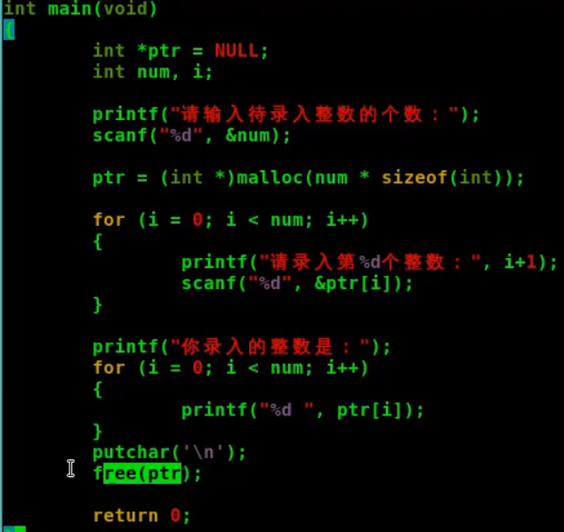

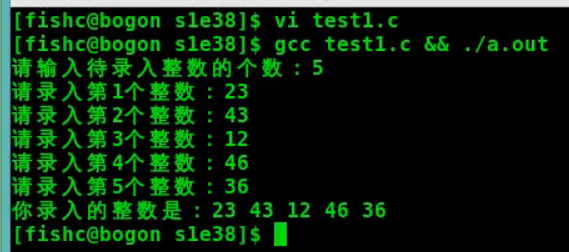

### 初始化内存空间


```c
malloc -- 申请动态内存空间 | <stdlib.h>
memchr -- 在内存空间中搜索一个字符 | <string.h>
memcmp -- 比较内存空间 | <string.h>
memcpy -- 拷贝内存空间 | <string.h>
memmove -- 拷贝内存空间 | <string.h>
memset -- 使用一个常量字节填充内存空间 | <string.h>
```

