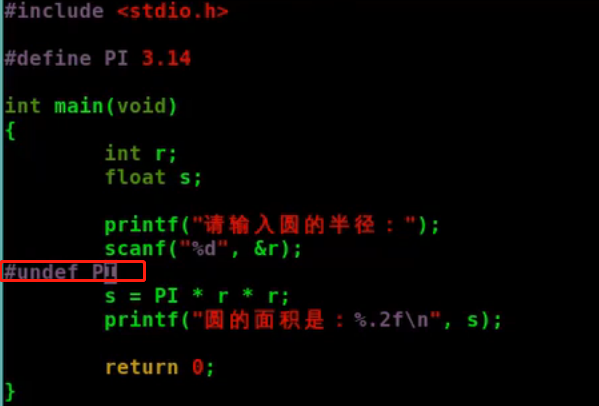

[toc]

## 内存布局

1. 代码段

代码段text segment 通常是用来存放程序执行代码的一块内存区域,这部分区域的大小在程序运行之前就确定了.并且内存区域通常只属于只读.在代码段中,也有可能包含一些只读的常数变量,如字符串常量等;

2. 数据段 initialized data segment

通常用来存放已经初始化的全局变量和局部静态变量

3. BSS段  Bss segment/Uninitialized data segment

通常用来存放程序中未初始化的全局变量的一块内存区域,BSS是英文block started by symbol的简称,这个区段中的数据在运行前被自动初始化为数字0;

==bss段==

==data段==

text段:

4. 堆

用于存放进程运行中被动态分配的内存段,他的大小并不固定,可动态扩展或缩小,当进程调用malloc函数分配内存时,新分配的内存就被动态添加到堆上,当利用free释放内存时,被释放的内存从堆中被剔除;

5. 栈

是函数执行的内存区域,通常和堆共享同一片区域

## 堆和栈的区别

1. 申请方式

(1) 堆由程序员手动申请

(2) 栈由系统自动分配

2. 释放方式

(1) 堆由程序员手动释放

(2) 栈由系统自动释放

3. 生存周期

(1) 堆的生存周期由动态申请到程序员主动释放为止,不同函数直接均可自由访问

(2) 栈的生存周期由函数调用开始到函数返回时结束,函数间的局部变量不能互相访问

4. 发展方向

(1)堆和其他区段一样,是从低地址向高地址发展的

(2)栈是从高地址向低地址发展

栈中存放局部变量,堆存放的是动态变量

课后题

## 高级宏定义

### 不带参数的宏定义

#define PI 3.14

undef终止宏定义作用域

### 单参数的宏定义

必须加括号

传入指针就会错误 如p++;

## 内联函数

宏定义展开会有问题:

多次调用函数时:使用内联函数 inline关键字

## #和##

## 可变参数

