[toc]

## 结构体

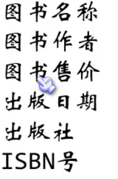

结构体声明

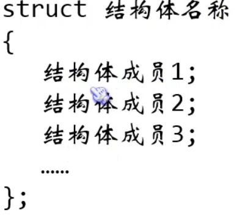

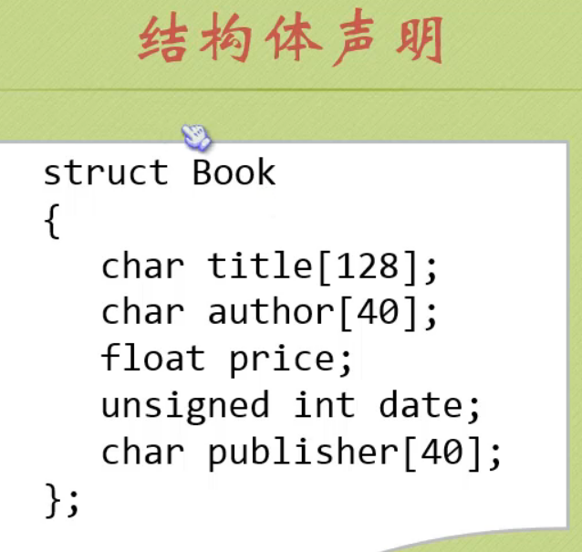

### 定义结构体类型变量

struct 结构体名称 结构体变量名

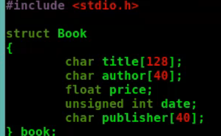

### 访问结构体变量


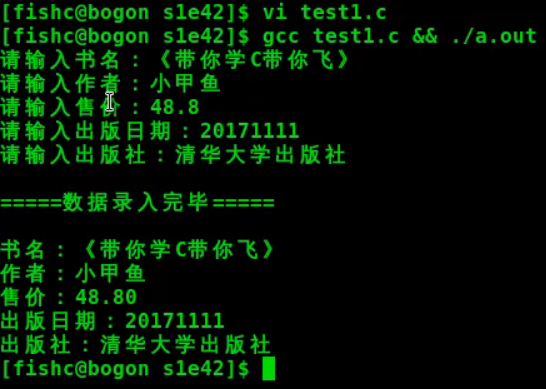

### 初始化结构体变量

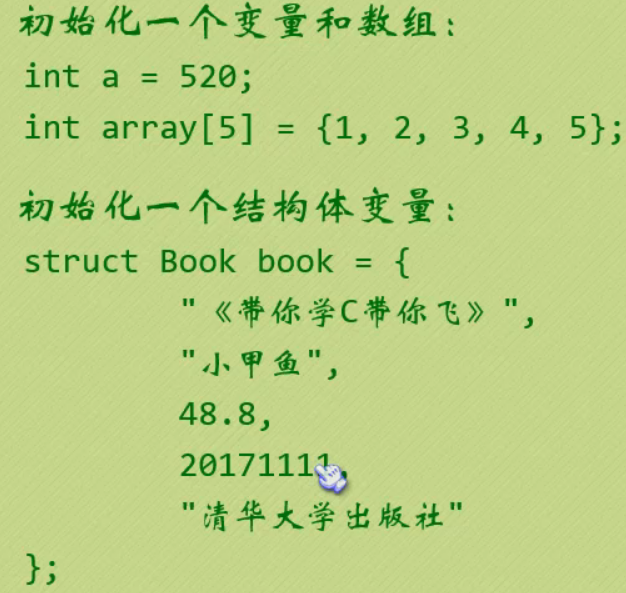

### 初始化结构体的指定成员值

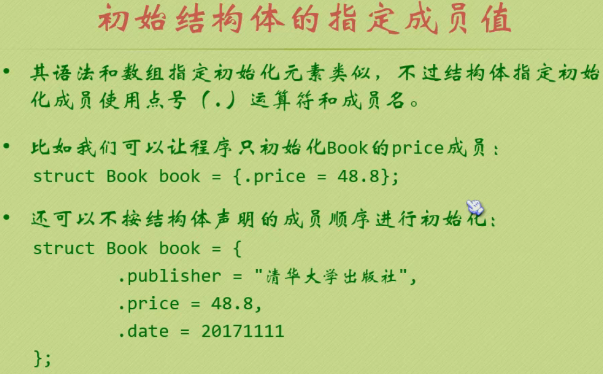


## 练习题

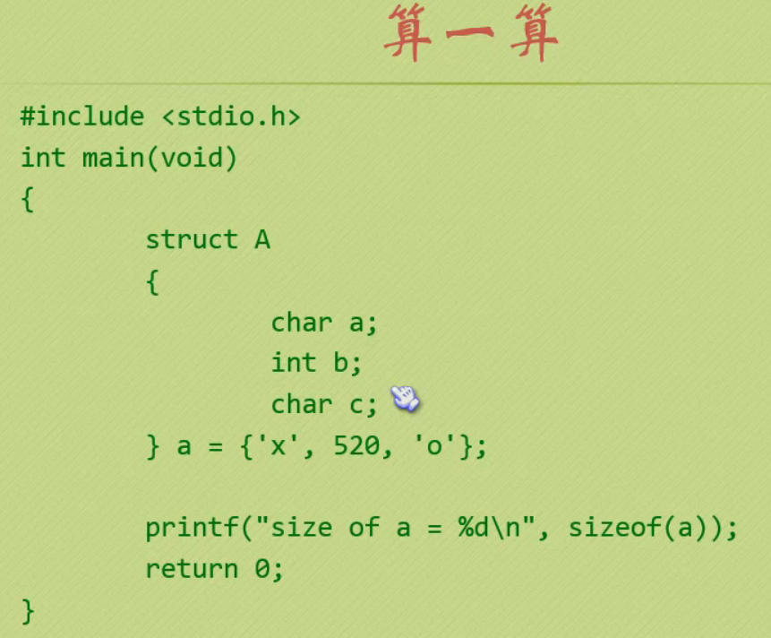

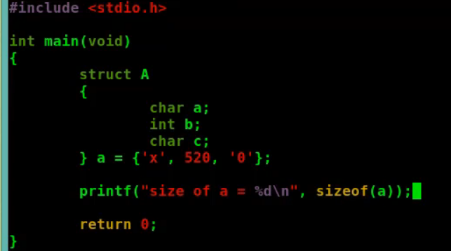

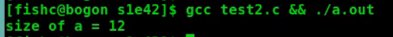

内存对齐的原因:

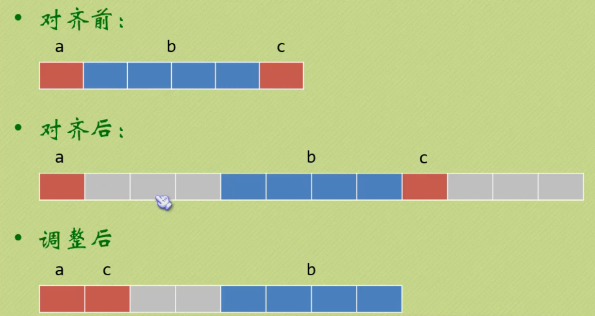

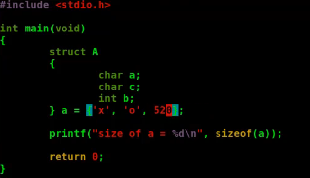

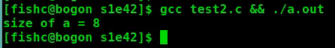

## 结构体数组和结构体指针

### 结构体嵌套

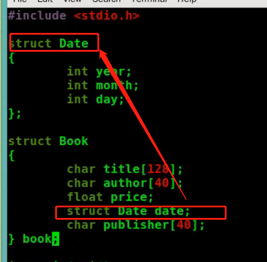

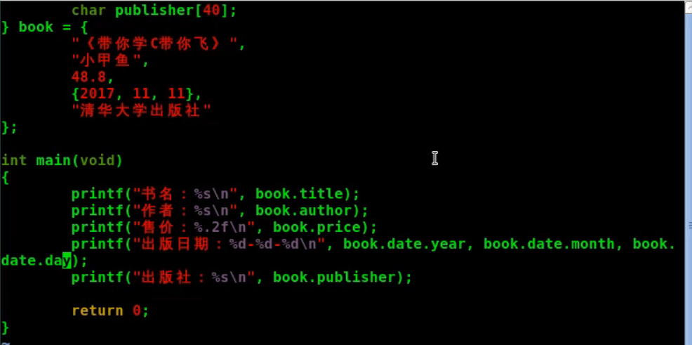

### 结构体数组

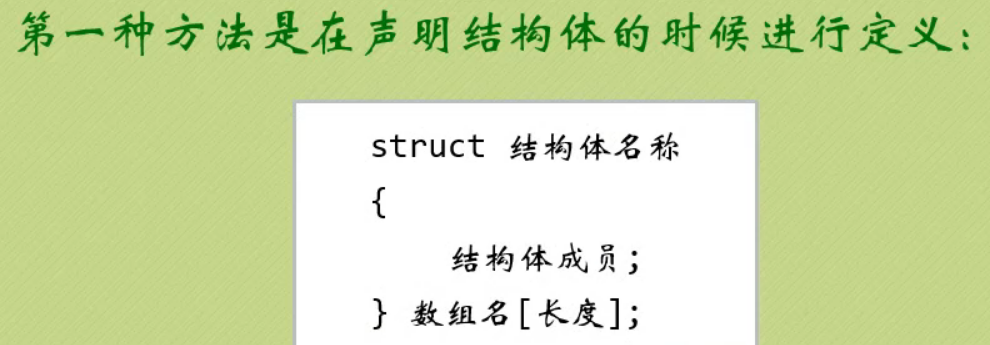

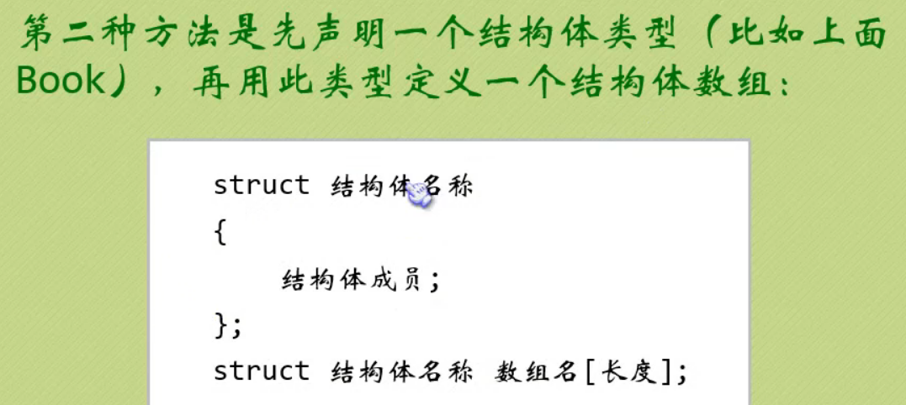

#### 初始化结构体数组

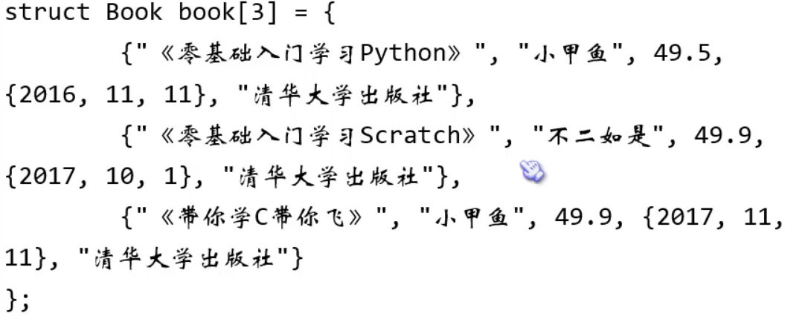

### 结构体指针
```c
struct Book *pt;
pt=&book;
```

通过结构体指针访问结构体成员有两种方法:
```sh
(*结构体指针).成员名
结构体指针->成员名
```

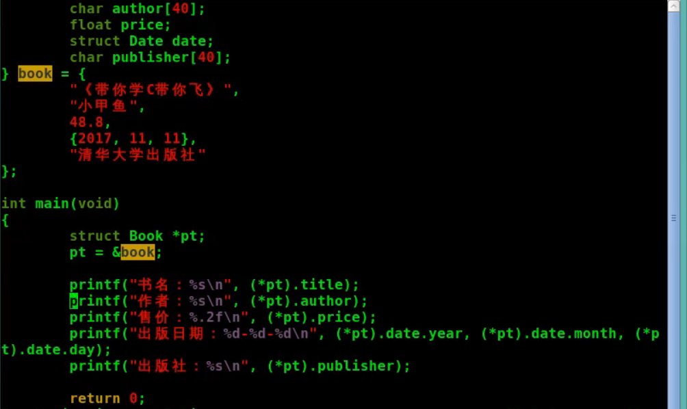

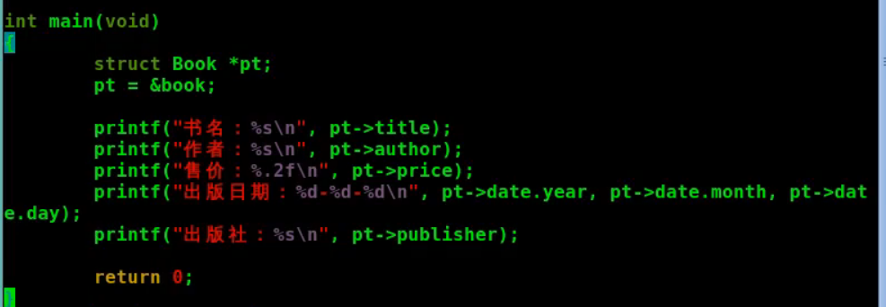


## 传递结构体变量和结构体指针

### 传递结构体变量

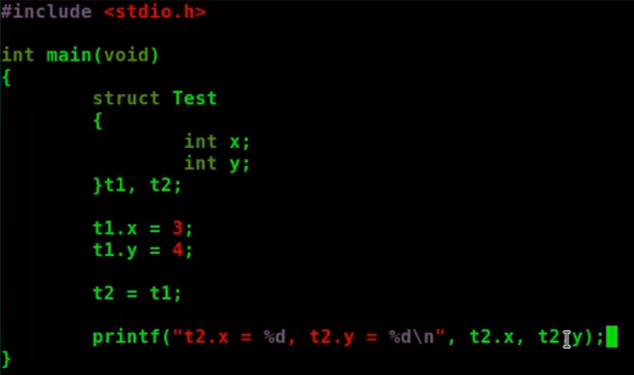

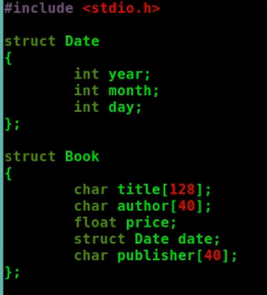

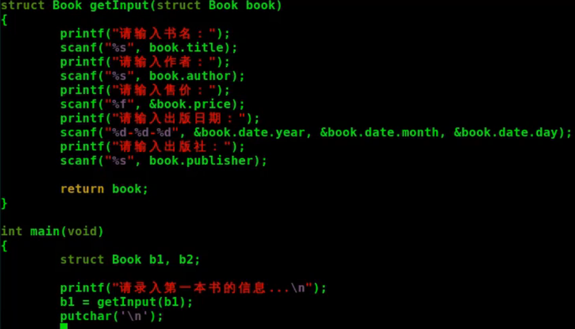

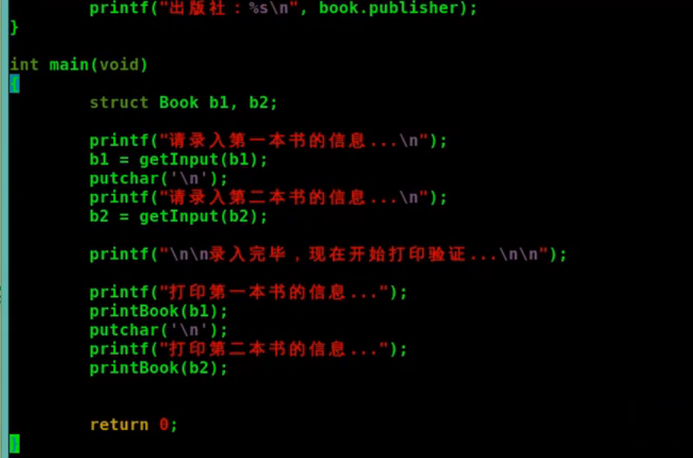

### 传递指向结构体变量的指针

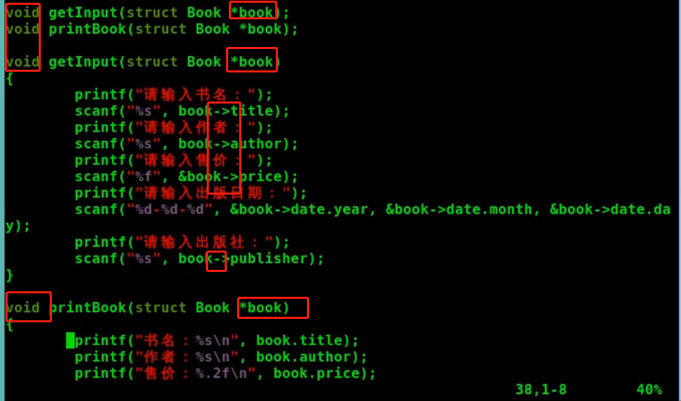

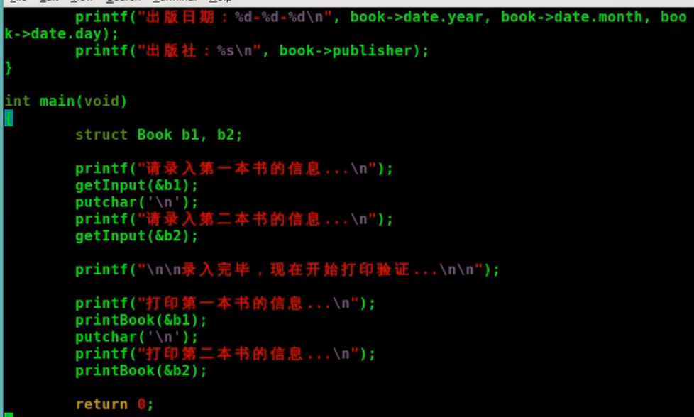

### 动态申请结构体

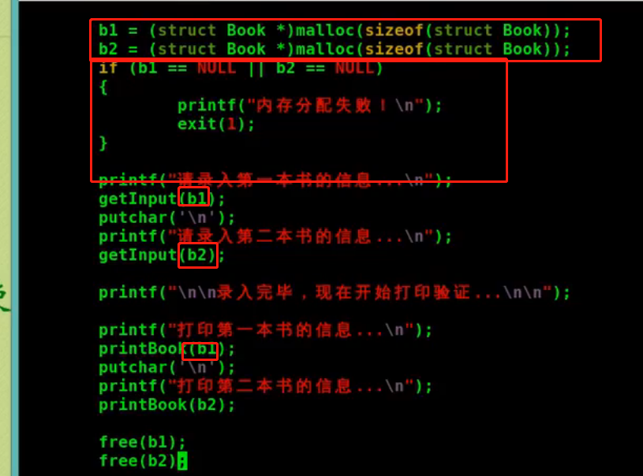

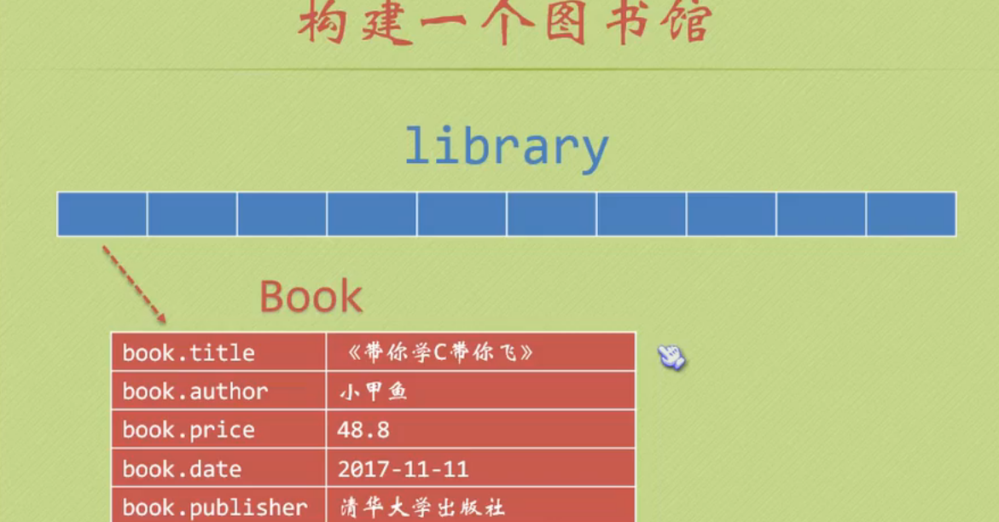