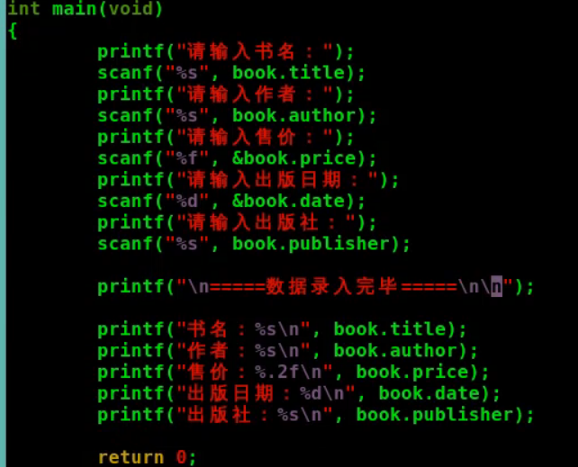

[toc]

## 结构体


结构体声明


### 定义结构体类型变量

struct 结构体名称 结构体变量名


### 访问结构体变量





### 初始化结构体变量


### 初始化结构体的指定成员值


## 练习题


内存对齐的原因:


## 结构体数组和结构体指针

### 结构体嵌套


### 结构体数组


#### 初始化结构体数组


### 结构体指针
```c
struct Book *pt;
pt=&book;
```

通过结构体指针访问结构体成员有两种方法:
```sh
(*结构体指针).成员名
结构体指针->成员名
```


## 传递结构体变量和结构体指针

### 传递结构体变量


### 传递指向结构体变量的指针


### 动态申请结构体


