[toc]

# typedef

## typedef

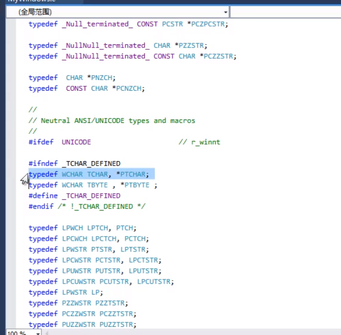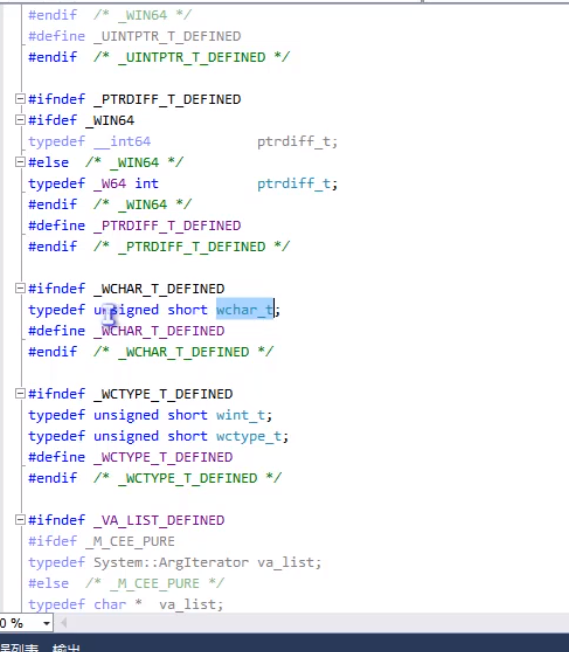

typedef 是C语言最重要的关键字之一

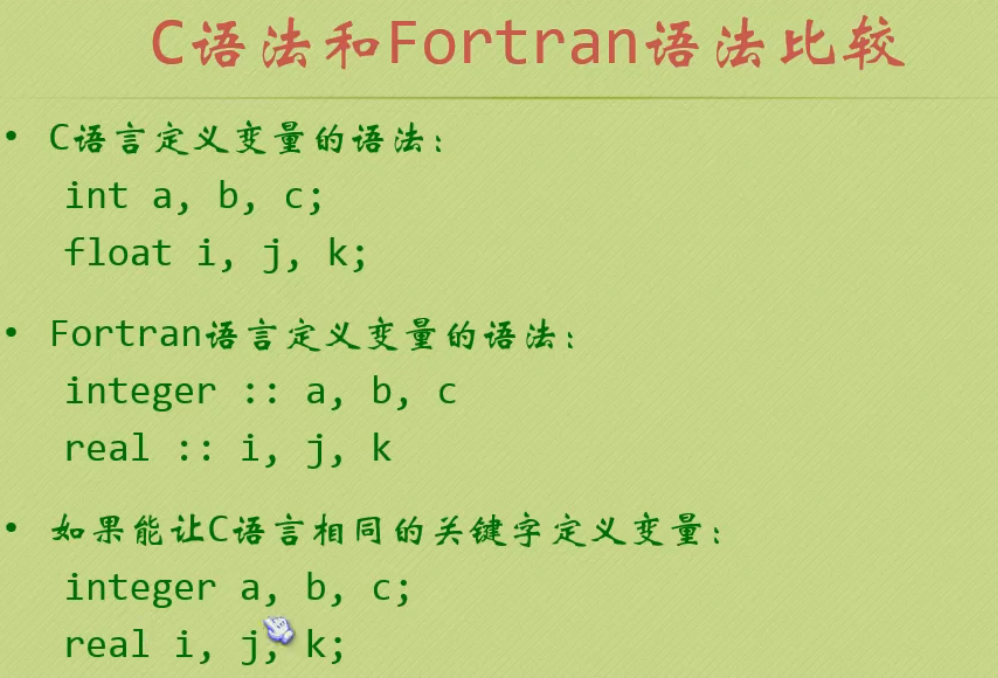

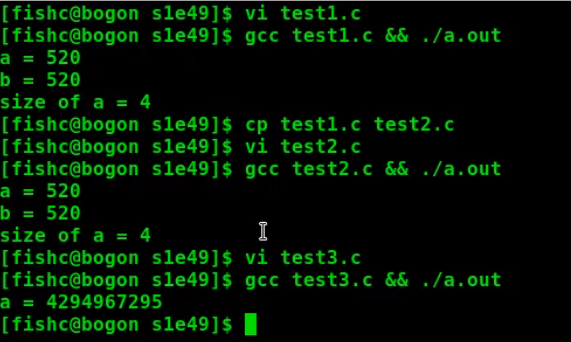

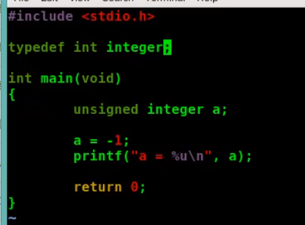

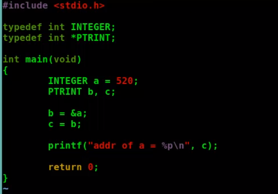

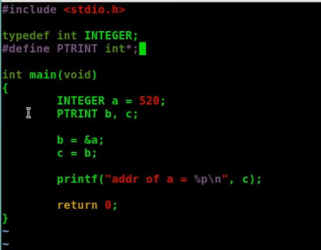

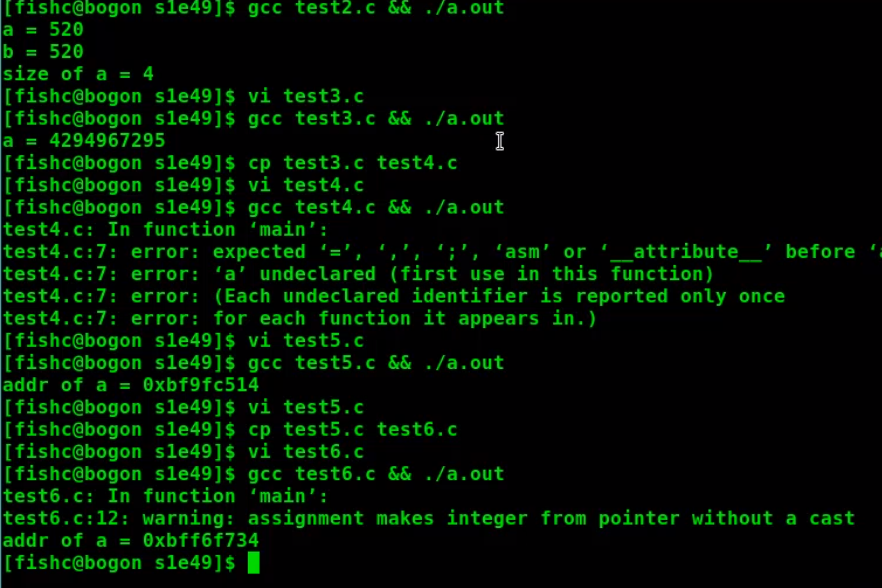

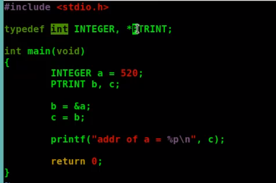

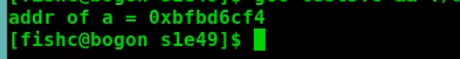

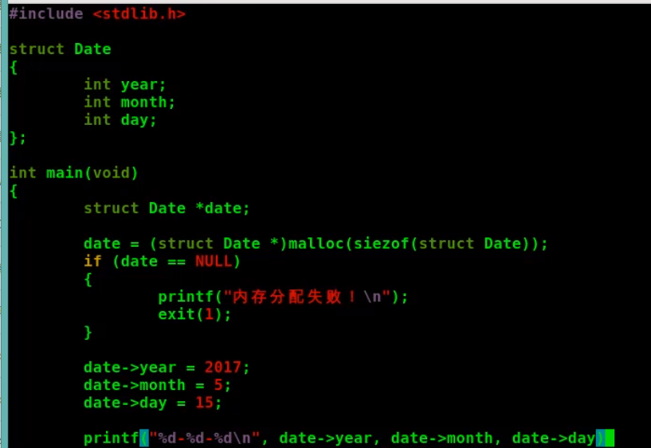

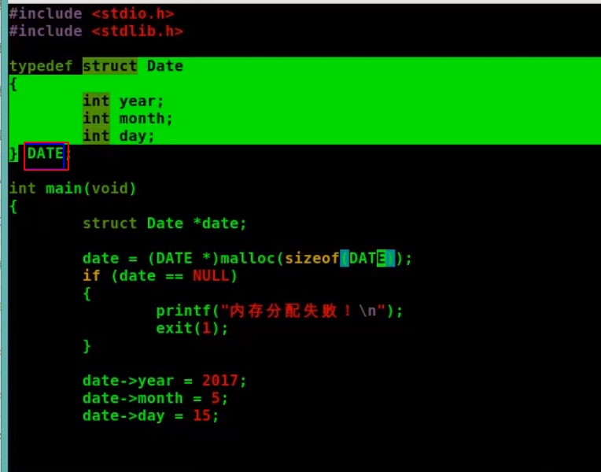

起一个别名，typedef struct Date{ ...} DATE;
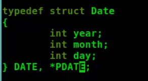

## typedef 进阶

### 数组指针 ：ptr为指向数组的指针

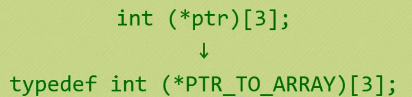

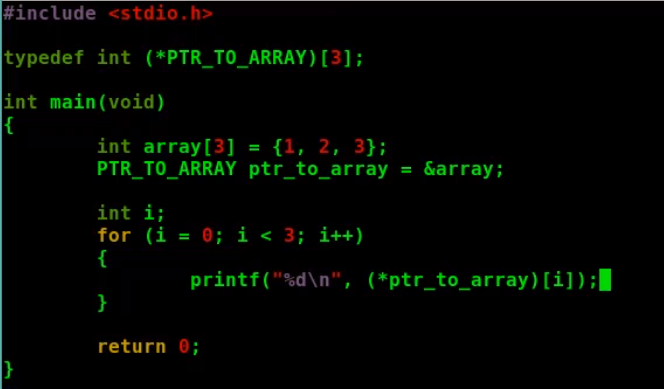

### 函数指针：func 为指向函数的指针

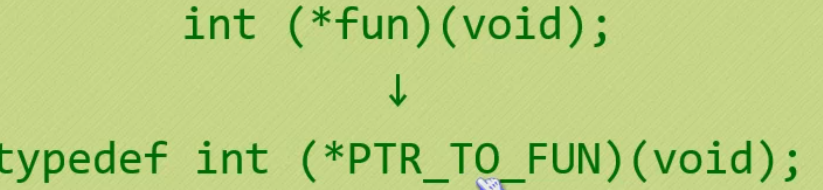

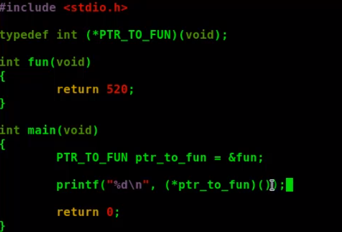

### 复杂的指针

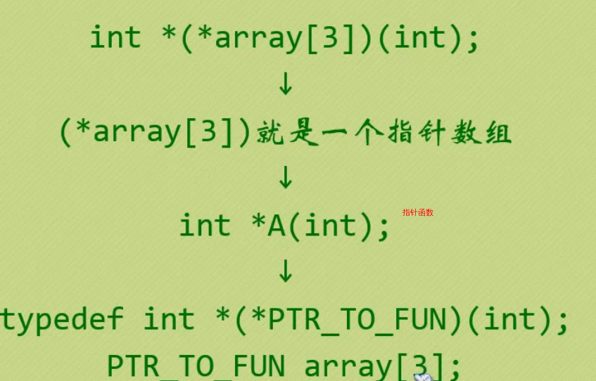

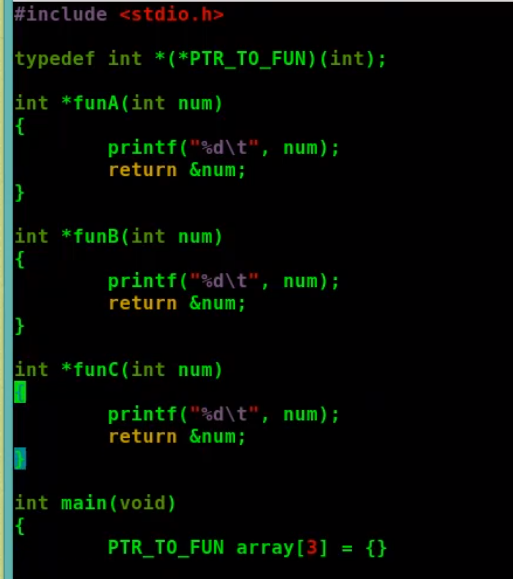

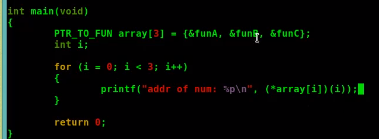

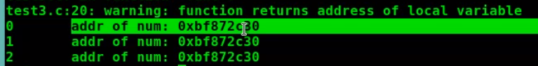

### 更复杂的

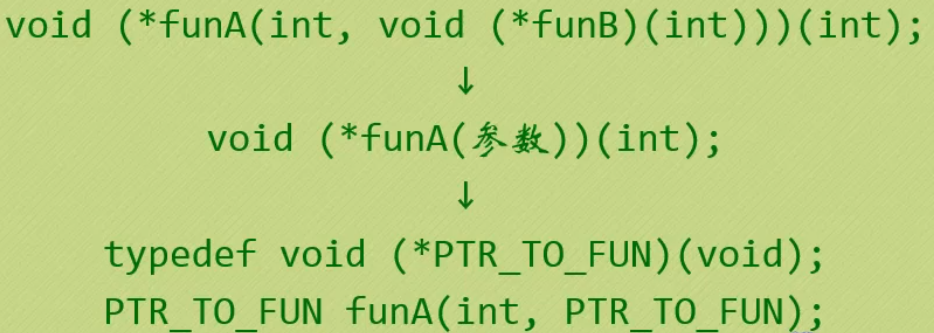

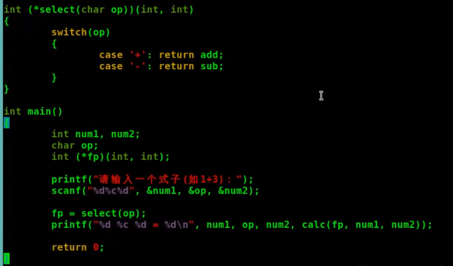

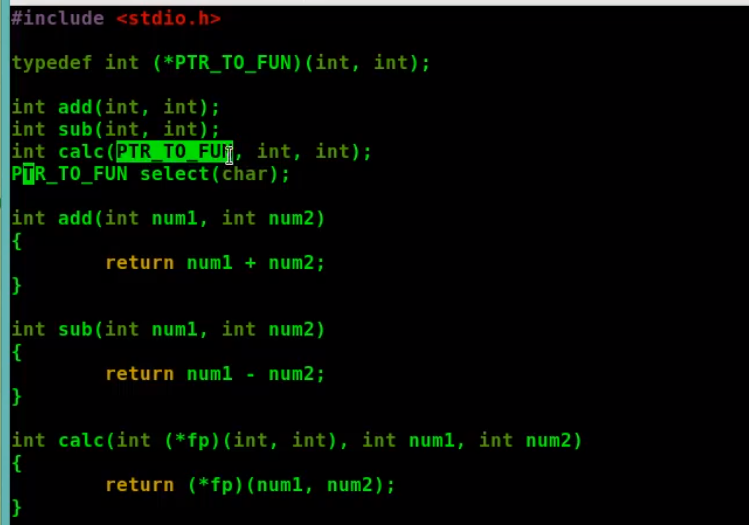