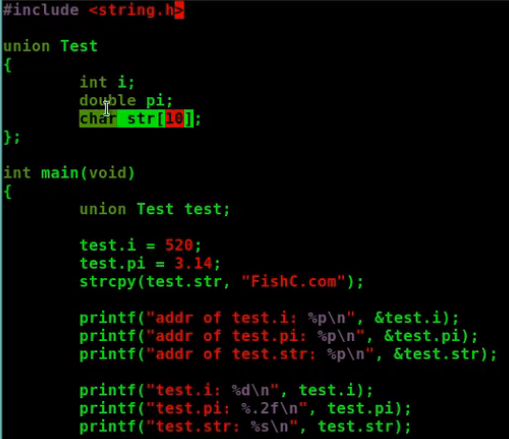
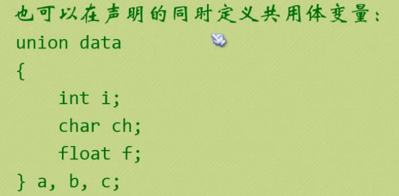

# 共用体

[toc]

## 共用体(联合体)

共用体所有成员共享同一个内存地址

```c
union 共用体名称{
    共用体成员1;
    共用体成员2;
    共用体成员3;
    ....
};
// 指针访问:->   成员访问:.
```


每一刻只能使用一个值,最终值为最后一次赋值的值

union的大小为最大的成员的大小,==也不一定,因为内存会对齐==




## 定义共用体类型变量

1. 先声明,再定义


2. 声明的同时定义



### 共用体的名字并不是必须的


## 初始化共用体

