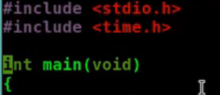

# 枚举类型

## 枚举类型(enumeration)

如果一个变量只有几种可能的值,那么就可以将其定义为枚举类型

### 声明

enum 枚举类型名称{枚举值名称,枚举值名称…};

### 定义枚举变量

### 枚举值默认从0开始

enum 枚举类型名称 枚举变量1,枚举变量2;

### 自定义起始值

一旦确定下来就是常量了,不能修改

### 中间赋值

默认从0开始,遇到自定义的后,自增

