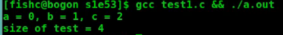

# 位域

[toc]

## 单片机

## 位域(位段/位字段)

允许将二进制位划分为不同的区域,并指定每个区域的位数,每个区域单独命名,然后使用

==使用位域:==在结构体定义时,在结构体成员后面使用冒号和数字来表示该成员占有的位数

位域的宽度不能超过所依附的数据的长度

`unsigned int a:33; //位域的宽度33即是错误的用法,超过了unsigned int的32位`

## 无名位域(占位用)

==填充和调整数据的位置==

位域成员可以没有名称,只要给出数据类型和位宽即可

==不能直接拿来使用==

