# 位操作

[toc]

## 一个字节的尺寸

C语言并没有规定一个自己的尺寸

可寻址的数据存储单位,其尺寸必须可以容纳运行环境的基本字符集的任何成员


## limits.h

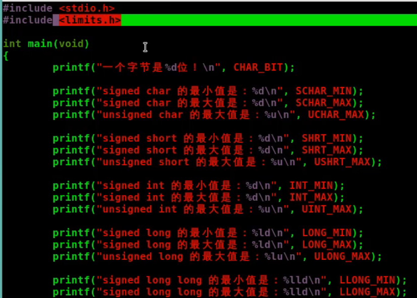

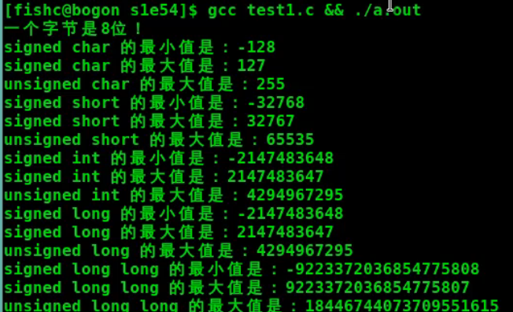

## 逻辑位运算符(每个二进制位进行操作)

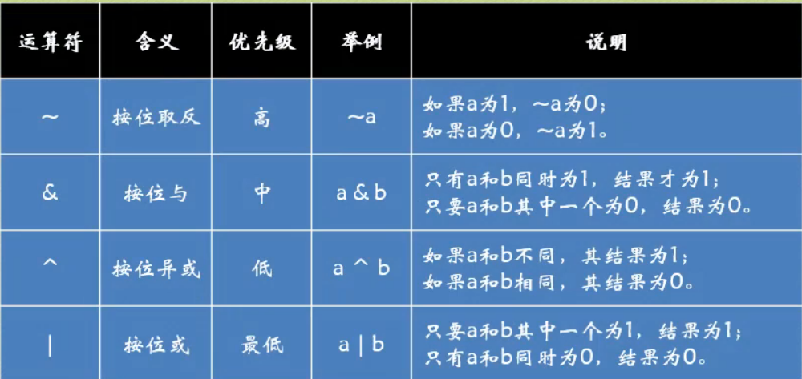

### 按位取反(~)–将1变为0,将0变为1

逻辑位运算符中优先级最高的

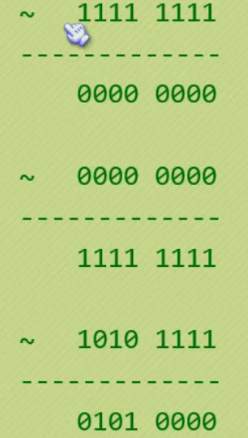

### 按位与(&)– 同时为1才为1,否则为0

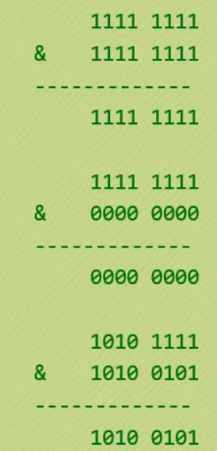

### 按位异或(^)– 两操作数对应的二进制位不同时为1,否则为0

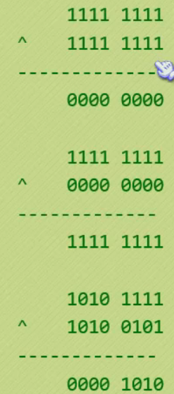

### 按位或(|) – 其中1个为1结果为1,否则为0

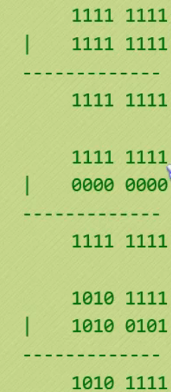

## 和赋值号结合

这四个运算符,除了按位取反只有一个操作数之外,其他三个都可以跟赋值号(=)结合到一起,使代码更简洁.

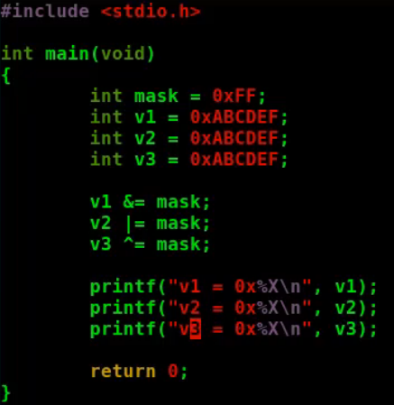

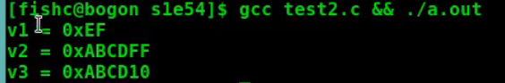

# 位运算

## 移位运算符

移位运算符:将某个变量中所有的二进制位进行左移或右移的运算符

### 左移位运算符(乘以2的n次幂)

```c
11001010 << 2
```

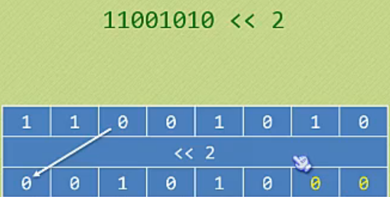

### 右移位运算符(除以2的n次幂)

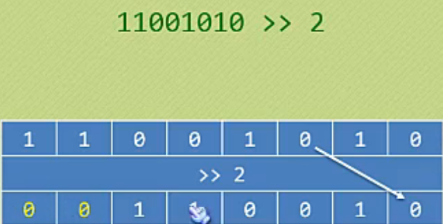

### 和赋值号结合

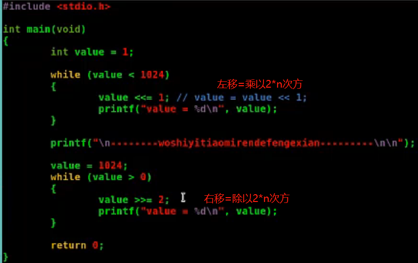

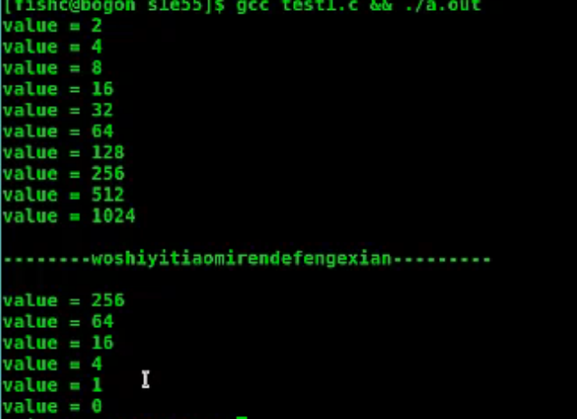

## 一些未定义行为

1. 左移和右移运算符==右边的操作数如果为负数==,或者==右边的操作数大于左边操作数支持的最大宽度==,那个表达式的结果均属于“未定义行为”.

2. 左边的操作数是有符号还是无符号数,其实也对移位运算符有着不同的影响,无符号数肯定没问题,因为这时候变量里边的所有位都用于表示该数值的大小;但有符号数,区别对待,因为有符号数的左边第一位是符号位,如果恰好这个操作数是个负数,那个移动之后是否符号符号位决定权,还是落到了编译器上.

## 应用

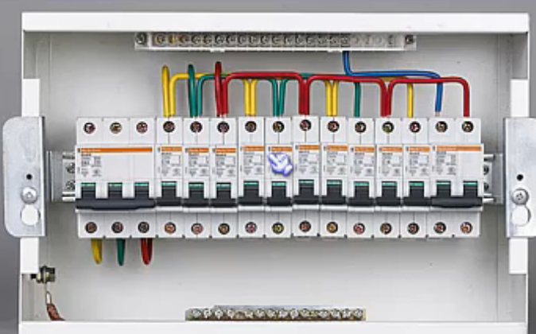

### 判断那个是开的(&)

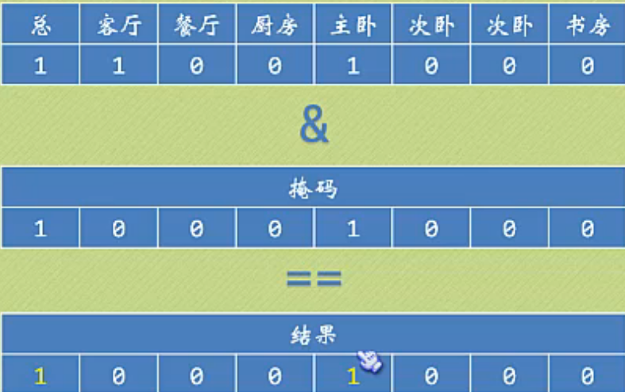

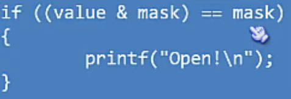

### 打开位(0->1只开主卧)

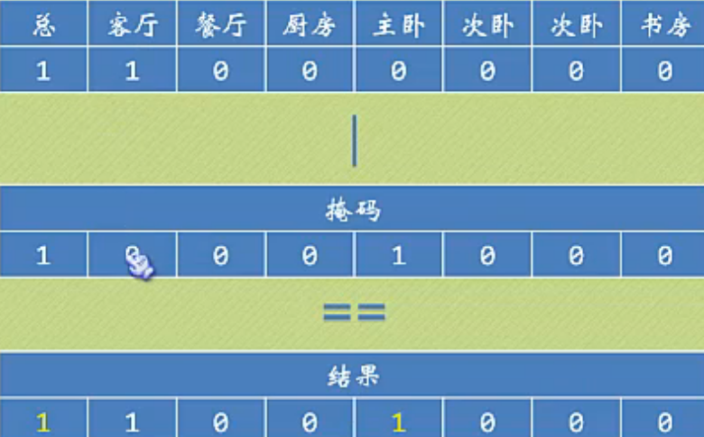

## 关闭位(1->0关闭客厅)

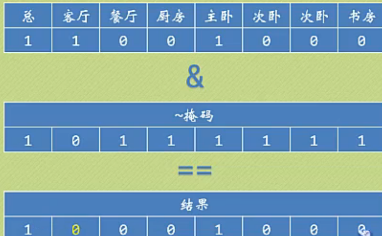

## 转置位(0->1,1->0关掉客厅,打开主卧)

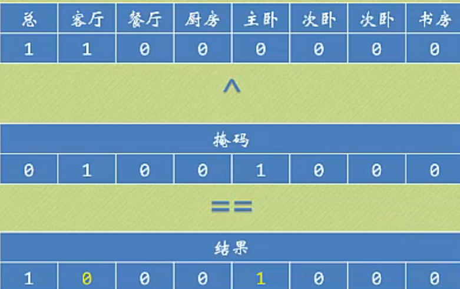

## 利用xor进行简单高效的加密

