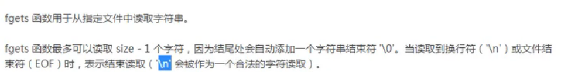
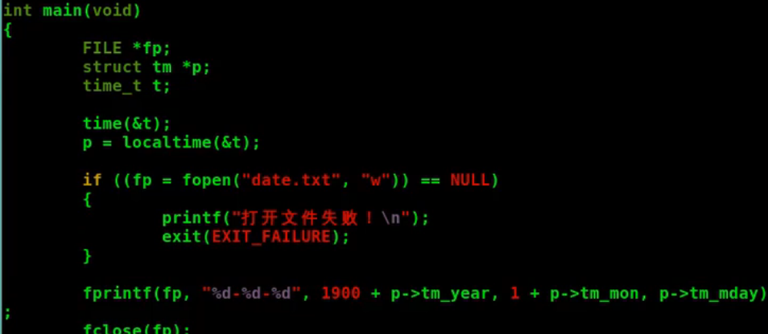
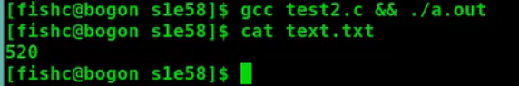
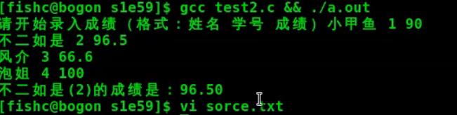

# 文件操作

[toc]


## 文件是什么

linux中万物皆文件


### 文本文件和二进制文件


## 打开和关闭文件

1. 只有在一个文件被打开的时候,才能对其进行读写操作
2. 读:从文件中获取数据;写:将数据写入文件
3. 在完成一个文件的读写操作后,==必须将其关闭==


## 读写文件

顺序读写,随机读写


### 读写单个字符(fgetc|getc/fputc|putc)

#### fgetc:从文件流中读取下一个字符并推进文件的位置指示器(用于指示下一个读取字符的位置)


#### fputc:将一个字符写入指定的文件,并推进文件的位置指示器(用来只是接下来要读写的下一个字符的位置)


### 读写整个字符串(fgets/fputs)

#### fgets:用于从文件中读取字符串




#### fputs:用于将字符串写入到指定的文件中,表示字符串结尾的‘\0’不会被一并写入


## 格式化读写文件(fscanf/fprintf)

### fscanf

fscanf 函数用于从指定文件中读取格式化字符串。

```c
#include <stdio.h>
...
int fscanf(FILE *stream, const char *format, ...);
```

**参数解析：**

**1、stream 参数**

该参数是一个 FILE 对象的指针，指定一个待操作的数据流。


**2、format 参数**

format 参数是一个格式化字符串，由格式化占位符和普通字符组成。

该格式化字符串指定如何处理读取到的数据：

- 空白字符：该函数将读取并忽略空白字符（空白字符包含空格、回车和制表符）；
- 除了格式占位符（% 开头）外的非空白字符：指定函数必须从输入流中读取到的字符，如果读取不匹配，则函数调用失败，并从匹配失败处截断输入流；
- 格式化占位符（% 开头）：用于指明获取的数据类型及位置。

==格式化占位符的语法如下==：`%[width][length]specifier`

每一个格式化占位符均以 % 开始，以转换字符结束。


specifier（转换字符，必选）的内容及含义如下：

| **转换字符**  | **含义**                                                     |
| ------------- | ------------------------------------------------------------ |
| c             | 读取一个字符                                                 |
| d             | 读取一个十进制整数，前边可以加上符号（+ 或 -）表示正负       |
| i             | 1. 读取一个整数，前边可以加上符号（+ 或 -）表示正负 2. 0 开头表示八进制数，0x 开头表示十六进制数 |
| e             | 读取一个以指数形式的单、双精度浮点数（小写 e）               |
| E             | 同上（大写 E）                                               |
| f             | 读取一个单、双精度浮点数（需要使用 lf），前边可以加上符号（+ 或 -）表示正负 |
| g             | 同 f、e、E                                                   |
| G             | 同上（指数显示大写 E）                                       |
| a             | 读取一个十六进制的浮点数（以 0x 或 0X 开头）                 |
| o             | 读取一个八进制整数，前边可以加上符号（+ 或 -）表示正负       |
| s             | 读取一连串字符，直到遇到空白字符结束。                       |
| u             | 读取一个无符号的十进制整数                                   |
| x             | 1. 读取一个十六进制整数，前边可以加上符号（+ 或 -）表示正负 2. 十六进制数以 0x 或 0X 开头 |
| p             | 读取一个指针的值                                             |
| [characters]  | 1. 匹配中括号括起来的字符集 2. 可以用小横杆（-）表示范围，比如 [0-9] |
| [^characters] | 1. 匹配除了中括号括起来的字符集 2. 可以用小横杆（-）表示范围，比如 [0-9] |
| n             | 1. 存放已经读取的字符个数 2. 不消耗任何标准输入流的字符      |
| %             | 表示匹配 % 自身                                              |

注1：除了 n，其他的每次读取都会至少消耗标准输入流中的一个字符。

注2：如果读取失败，则标准输入流截断于读取失败的位置。

星号（*）、width 和 length 是可选的。

- 星号（*）表示读取但忽略（读取但不保存）；
- width 指定当前读取操作的最大字符数；
- length 是用于限定不同类型的宽度，具体请参考下表：

| length | **d 或 i**     | **u、o 或 x**           | **f、e、g 或 a** | **c、s、[] 或 [^]** | **p**  | **n**          |
| ------ | -------------- | ----------------------- | ---------------- | ------------------- | ------ | -------------- |
| 默认   | int*           | unsigned int*           | float*           | char*               | void** | int*           |
| hh     | signed char*   | unsigned char*          |                  |                     |        | signed char*   |
| h      | short int*     | unsigned short int*     |                  |                     |        | short int*     |
| l      | long int*      | unsigned long int*      | double*          | wchar_t*            |        | long int*      |
| ll     | long long int* | unsigned long long int* |                  |                     |        | long long int* |
| j      | intmax_t*      | uintmax_t*              |                  |                     |        | intmax_t*      |
| z      | size_t*        | size_t*                 |                  |                     |        | size_t*        |
| t      | ptrdiff_t*     | ptrdiff_t*              |                  |                     |        | ptrdiff_t*     |
| L      |                |                         | long double*     |                     |        |                |

==3、附加参数==

该参数的个数由格式化字符串决定。

每个参数均为一个存储空间，并与面格式化字符串中占位符的类型和位置一一对应。

如果是一个普通的变量名，应在其名字前边加上 & 符号。


==**返回值：**==

如果函数调用成功，返回值是成功获取并填充到附加参数中的个数。

如果函数调用失败，返回值小于附加参数的个数（甚至是 0）。

如果读取到标准输入流的结尾处，则返回 EOF。

```c
#include <stdio.h>
#include <stdlib.h>
int main(void)
{
        FILE *fp;
        int year, month, day;
        if ((fp = fopen("file.txt", "r")) == NULL) {
                printf("打开文件失败！\n");
                exit(EXIT_FAILURE);
        }
        fscanf(fp, "%d-%d-%d", &year, &month, &day);
        printf("%d-%d-%d\n", year, month, day);
        fclose(fp);
        return 0;
}
```

### fprintf

```c
struct tm
{
           int tm_sec;     /* 秒，范围为 0~59，60 的话表示闰秒 */
           int tm_min;     /* 分，范围是 0~59 */
           int tm_hour;    /* 时，范围是 0~23 */
           int tm_mday;    /* 一个月中的第几天，范围是 1~31 */
           int tm_mon;     /* 一年中的第几个月，范围是 0~11 */
           int tm_year;    /* 自 1900 年往后的第几年 */
           int tm_wday;    /* 星期几，自星期天开始计算，范围是 0~6 */
           int tm_yday;    /* 一年中的第几天，范围是 0~365 */
           int tm_isdst;   /* 指定日光节约时间是否生效，正数表示生效，0 表示不生效，负数表示该信息不可用 */
};
```




## 二进制读写文件(fread/fwrite)




xxd使用16进制方式查看文件


### fread 函数用于从指定的文件中读取指定尺寸的数据。

`size_t fread(void *ptr, size_t size, size_t nmemb, FILE *stream);`

| **参数** | **含义**                                                     |
| -------- | ------------------------------------------------------------ |
| ptr      | 指向存放数据的内存块指针，该内存块的尺寸最小应该是 size * nmemb 个字节 |
| size     | 指定要读取的每个元素的尺寸，最终尺寸等于 size * nmemb        |
| nmemb    | 指定要读取的元素个数，最终尺寸等于 size * nmemb              |
| stream   | 该参数是一个 FILE 对象的指针，指定一个待读取的文件流         |

**返回值：**

1. 返回值是实际读取到的元素个数（nmemb）；

2. 如果返回值比 nmemb 参数的值小，表示可能读取到文件末尾或者有错误发生（可以使用 [feof](http://bbs.fishc.com/thread-91250-1-1.html) 函数或 [ferror](http://bbs.fishc.com/thread-91251-1-1.html) 函数进一步判断）。

### fwrite 函数用于将指定尺寸的数据写入到指定的文件中。

`size_t fwrite(const void *ptr, size_t size, size_t nmemb, FILE *stream);`

| **参数** | **含义**                                                     |
| -------- | ------------------------------------------------------------ |
| ptr      | 指向存放数据的内存块指针，该内存块的尺寸最小应该是 size * nmemb 个字节 |
| size     | 指定要写入的每个元素的尺寸，最终尺寸等于 size * nmemb        |
| nmemb    | 指定要写入的元素个数，最终尺寸等于 size * nmemb              |
| stream   | 该参数是一个 FILE 对象的指针，指定一个待写入的文件流         |

**返回值：**

\1. 返回值是实际写入到文件中的元素个数（nmemb）；

\2. 如果返回值与 nmemb 参数的值不同，则有错误发生。

```c
#include <stdio.h>
#include <string.h>
#include <stdlib.h>

struct Date
{
        int year;
        int month;
        int day;
};

struct Book
{
        char name[40];
        char author[40];
        char publisher[40];
        struct Date date;
};

int main(void)
{
        FILE *fp;
        struct Book *book_for_write, *book_for_read;

        // 为结构体分配堆内存空间
        book_for_write = (struct Book *)malloc(sizeof (struct Book));
        book_for_read = (struct Book *)malloc(sizeof (struct Book));

        if (book_for_write == NULL || book_for_read == NULL)
        {
                printf("内存分配失败！\n");
                exit(EXIT_SUCCESS);
        }

        // 填充结构体数据
        strcpy(book_for_write->name, "《带你学C带你飞》");
        strcpy(book_for_write->author, "小甲鱼");
        strcpy(book_for_write->publisher, "清华大学出版社");
        book_for_write->date.year = 2017;
        book_for_write->date.month = 11;
        book_for_write->date.day = 11;

        if ((fp = fopen("file.txt", "w")) == NULL)
        {
                printf("打开文件失败！\n");
                exit(EXIT_SUCCESS);
        }

        // 将整个结构体写入文件中
        fwrite(book_for_write, sizeof(struct Book), 1, fp);

        // 写入完成，关闭保存文件
        fclose(fp);

        // 重新打开文件，检测是否成功写入数据
        if ((fp = fopen("file.txt", "r")) == NULL)
        {
                printf("打开文件失败！\n");
                exit(EXIT_FAILURE);
        }

        // 在文件中读取结构体并打印到屏幕上
        fread(book_for_read, sizeof(struct Book), 1, fp);

        printf("书名：%s\n", book_for_read->name);
        printf("作者：%s\n", book_for_read->author);
        printf("出版社：%s\n", book_for_read->publisher);
        printf("出版日期：%d-%d-%d\n", book_for_read->date.year, book_for_read->date.month, book_for_read->date.day);

        fclose(fp);

        return 0;
} 
```

用文本(fgetc|gputc)或二进制方式(fread|fwrite)读写文件只会影响到换行符


## 随机读写文件

### 获取文件位置指示器(ftell)


### 初始化位置指示器(rewind)


### 指定文件位置指示器(fseek)

fseek用于设置文件流的位置指示器

`int fseek(FILE *stream, long it offset, int whence)'`


成功返回0,否则返回非0值




##### 可移植性问题

