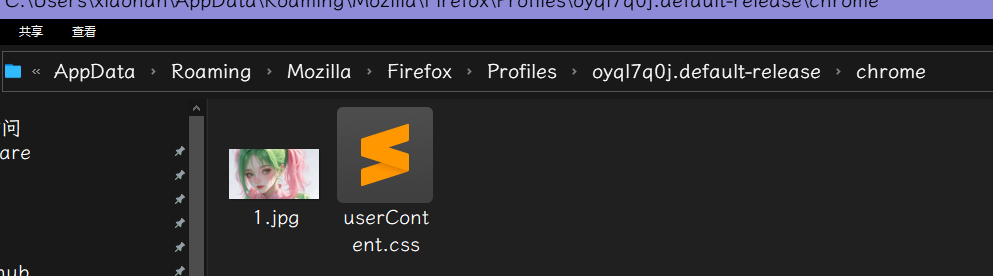

# 给Firefox的新标签页添加背景图片的方法

## 用的firefox浏览器，但是**原生的新标签页自定义不支持添加背景图片**。

相比之下，chrome和edge都支持给新标签页自定义背景图片。因此我研究了一下，在superuser上找到了修改新标签页背景图片的方法。

[how-do-i-change-the-background-image-of-home-page-in-firefox](https://superuser.com/questions/1495946/how-do-i-change-the-background-image-of-home-page-in-firefox)

不过直接使用这里面的CSS的效果并不好，**所以我修改了一下CSS，在图片上叠加了一层半透明黑色的径向渐变，以降低其亮度，使页面看起来更美观，还把火狐的logo给去掉了**……效果如图。


------

## 步骤

### 一、在地址栏进输入**`about:profiles`** 回车访问。**打开默认配置文件的根目录。**

```bash
C:\Users\xiaohan\AppData\Roaming\Mozilla\Firefox\Profiles\4v5re874.default\chrome 有时不生效，放到下面
C:\Users\xiaohan\AppData\Roaming\Mozilla\Firefox\Profiles\oyql7q0j.default-release\chrome
```

### 二、在这个目录下**新建一个名为** `chrome` **的文件夹**（说起来居然要起名为chrome啊……）


新建一个名为chrome的文件夹

三、**将背景图片放入新建的** `chrome` **文件夹中**，并**新建文本文件，重命名为** `userContent.css` 



新建userContent.css与放入背景图片

四、修改 `userContent.css` 的内容并保存。注意**这里面的** `img.jpg` **要替换成你的背景图片的文件名**……

```css
@-moz-document url(about:home), url(about:newtab), url(about:privatebrowsing) {
    //这一段用来将字体颜色改为白色
    .top-site-button .title, .context-menu-button {
        color: #fff !important ;
        text-shadow: 2px 2px 2px #222 !important ;
    }
    // 这一段用来移除logo
    .search-inner-wrapper,
    .logo-and-wordmark {
        display: none !important;
    }

    body {
        --newtab-topsites-outer-card-hover:rgba(255, 255, 255, 0.4) !important;
        --newtab-element-hover-color: rgba(255, 255, 255, 0.3) !important;
    }
	//当鼠标移动到网页图标上时显示的方框的颜色
	//图片上叠加了一个中心渐变，不然原图是要亮很多的，图片太花了会导致看不清前面的网页按钮
    body::before {
        content: "" ;
        z-index: -1 ;
        position: fixed ;
        top: 0 ;
        left: 0 ;
        //这一段就是修改背景图片啦
        background:radial-gradient(rgba(255, 255, 255, 0), rgba(0, 0, 0, 0.75)), no-repeat url(img.jpg) center ;
        background-size: cover ;
        width: 100vw ;
        height: 100vh ;
    }
}
```


五、访问`about:config`，搜索`toolkit.legacyUserProfileCustomizations.stylesheets`并将其改为 `true` 


六、重启firefox即可。
