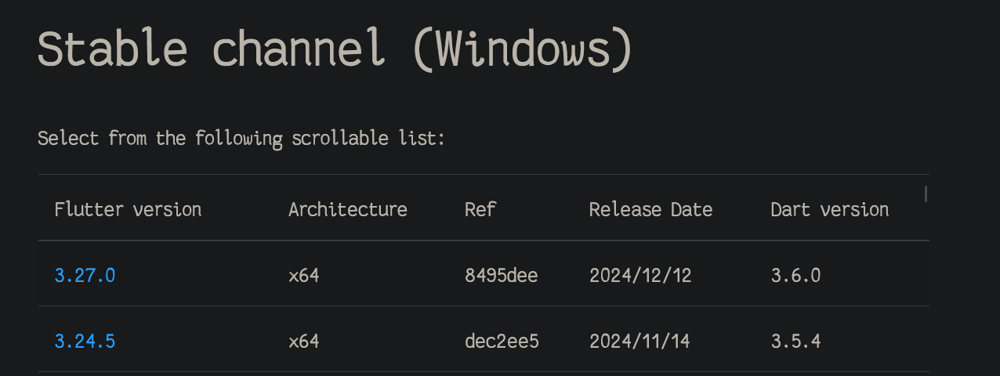
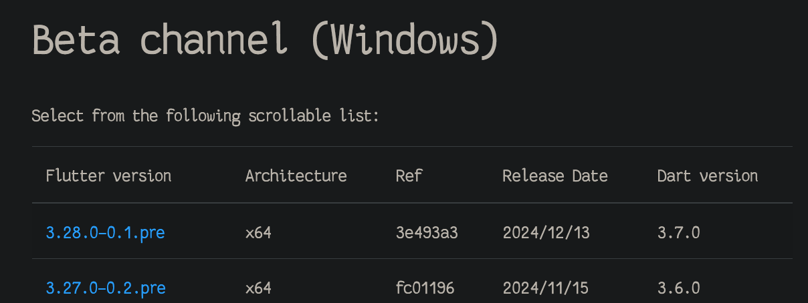

# flutter环境搭建

[toc]


## 1 使用 VS Code 安装 Flutter


  1.  启动 VS Code。
  2.  打开 命令面板 (Command Palette)，按下快捷键 Control + Shift + P。
  3.  在 命令面板 (Command Palette) 中输入 flutter。
  4.  选择 Flutter: New Project。
  5.  VS Code 会提示你在计算机上找到 Flutter SDK。
        如果你已经安装 Flutter SDK，请单击 Locate SDK。
        如果你没有安装 Flutter SDK, 请单击 Download SDK。
        如果你没有按照 开发工具的必要条件 安装 Git for Windows ，单击该按钮后会导航至 Flutter 安装页面。
   6. 当提示 Which Flutter template? 的时候，请忽略它。可以按下 Esc。你可以在检查完开发配置后创建初始测试项目。

## 2 下载 Flutter SDK
1.    当对话框 Select Folder for Flutter SDK 显示时，选择你想要安装 Flutter 的位置。
    VS Code 会打开你默认的位置。你可以选择其他位置。
    请考虑 %USERPROFILE% 或 C:\dev 这样的位置。
> 请注意
> 不要将 Flutter 安装到以下情况的目录或路径中：
>    路径包含特殊字符或空格。
>    路径需要较高的权限。
例如，C:\Program Files 路径就是以上情况。
2. 单击 Clone Flutter。
在下载 Flutter 时，VS Code 会弹出该通知：
````
Downloading the Flutter SDK. This may take a few minutes.`
````
Flutter 一旦完成下载， 输出 (Output) 面板就会显示。
该进程还会运行 flutter doctor -v。此时，请忽略该输出。因为 Flutter Doctor 可能会显示与本次快速启动无关的错误。
Flutter 安装成功后，VS Code 会弹出该通知：
```
Do you want to add the Flutter SDK to PATH so it's accessible
in external terminals?
```
`单击 Add SDK to PATH。`
成功后会显示通知：
`The Flutter SDK was added to your PATH`
VS Code 可能会显示一则 Google Analytics 的通知。
如果你同意，请单击 OK。
在所有 PowerShell 窗口中启用 flutter：
    关闭，然后重新打开所有 PowerShell 窗口。
    重新启动 VS Code。

## 3 检查你的开发配置

### 3.1 运行 Flutter doctor
`flutter doctor` 指令将检查 Windows 完整的 Flutter 开发环境的所有组件。
由于你选择为 desktop 进行开发，因此不需要 **所有** 组件。如果你遵循本指南，指令结果应该类似于：

```
Running flutter doctor...
Doctor summary (to see all details, run flutter doctor -v):
[✓] Flutter (Channel stable, 3.24.5, on Microsoft Windows 11 [Version 10.0.22621.3155], locale en)
[✓] Windows version (Installed version of Windows is version 10 or higher)
[!] Android toolchain - develop for Android devices
[!] Chrome - develop for the web
[✓] Visual Studio - develop Windows apps (version 2022)
[!] Android Studio (not installed)
[✓] VS Code (version 1.95)
[✓] Connected device (1 available)
[✓] Network resources
! Doctor found issues in 3 categories.
```

## 4 管理 Flutter SDK
1. 升级 Flutter SDK:  
```
flutter upgrade
```
2. 修改channel
```bash
# 查询channel
flutter channel
# 修改channel
# flutter channel <channel-name>
flutter channel beta
# 修改后更新依赖包
flutter upgrade


# 仅更新 packages
flutter pub upgrade


```

## 5 flutter sdk 下载
https://flutter-ko.dev/development/tools/sdk/releases


