https://www.bilibili.com/video/BV1Us4y197Ge/?spm_id_from=333.337.search-card.all.click&vd_source=7b79add459d98e32de7675d1d0915637

## golang特点

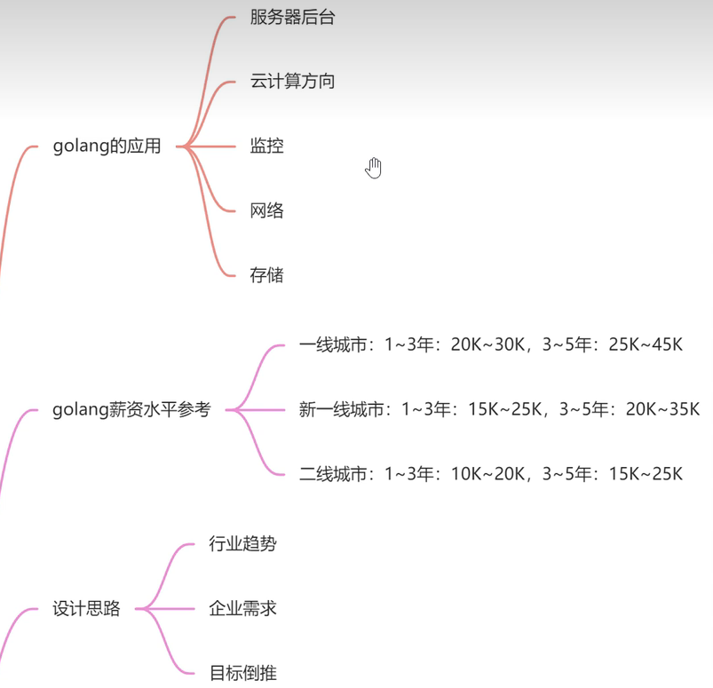

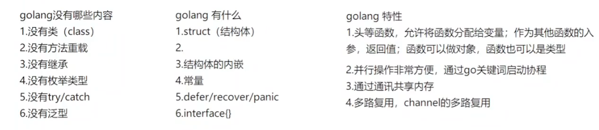

## golang 接口和方法

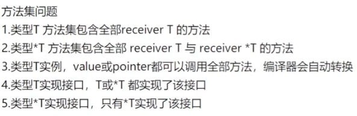

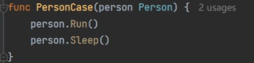

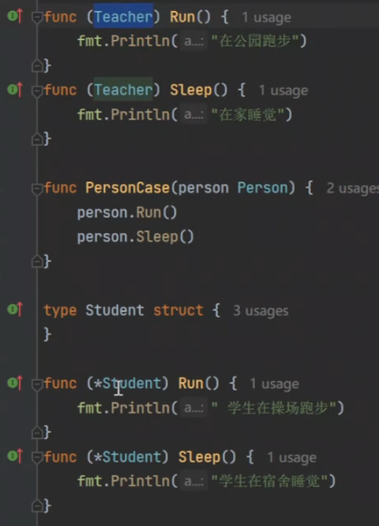

## interface

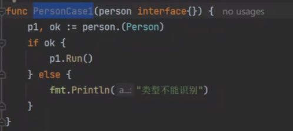

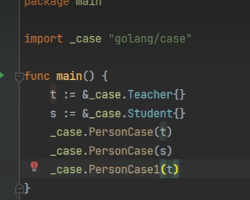

## defer

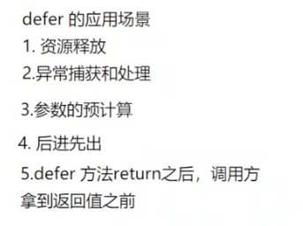

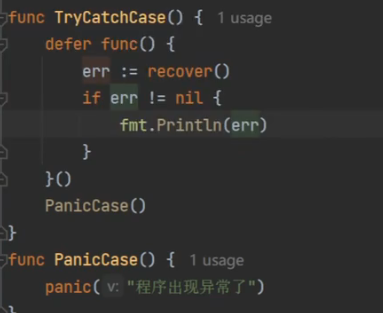

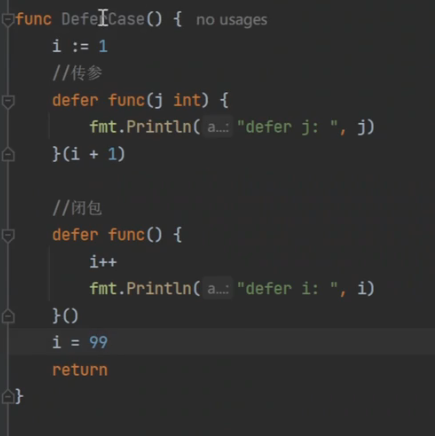

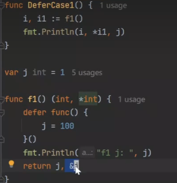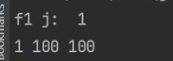