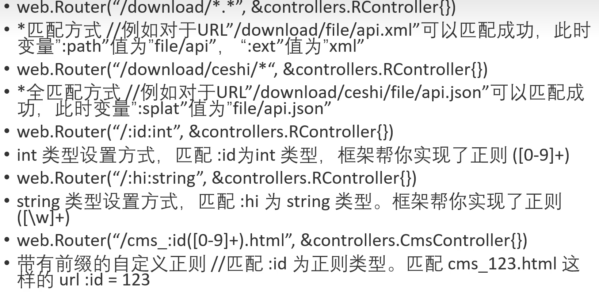

# web框架beego

[toc]

## beego的入门使用

### 参考文档


### beego简介


RESTful   MVC

### Beego架构图


### 执行逻辑


### beego的项目结构


### beego的MVC架构


### bee工具


## beego具体使用

### 环境准备


```bash
# 源码仓
github.com/beego/beego

# go mod init后安装bee
go get -u github.com/beego/beego/v2@latest
# install bee
go install github.com/beego/beego/v2@latest
```

### 新建项目

```bash
bee new project_name
bee run
访问： http://localhost:8080
```


#### 添加controller


#### 控制器


热编译

## beego多种路由实现

### 固定路由


### 正则路由





### 自定义方法及RESTful规则


### 自定义匹配


### 注解路由


 自动生成： 

### 方法表达式路由


## beego路由namespace


## bee 常用命令使用


