# logrus日志框架


[toc]

## logrus

```bash
go get -u github.com/sirupsen/logrus
```

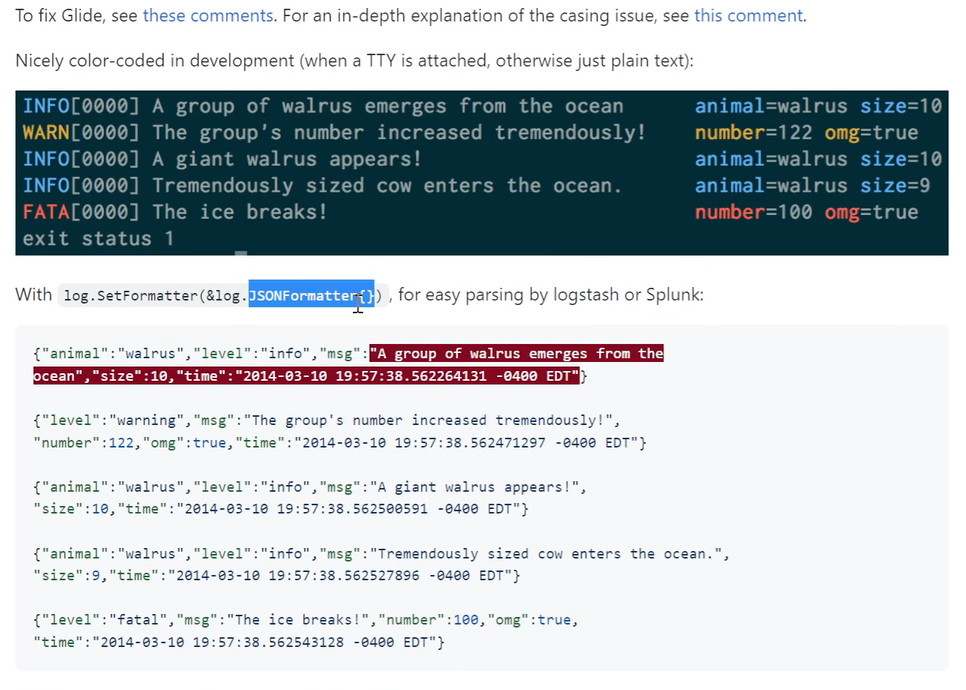

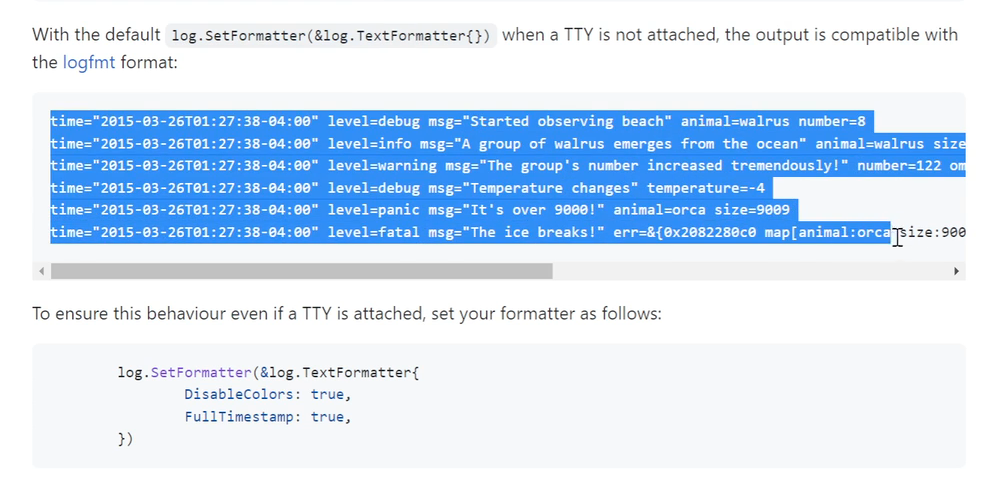

打印报错代码行

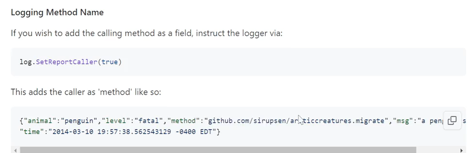

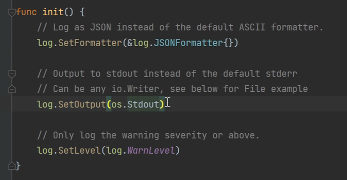


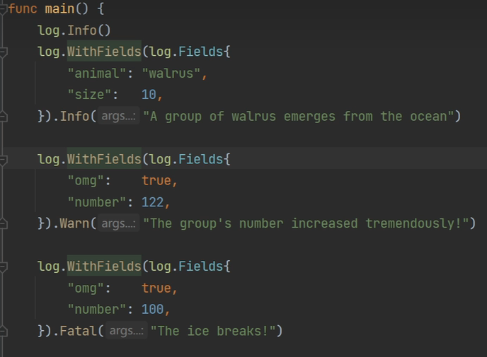

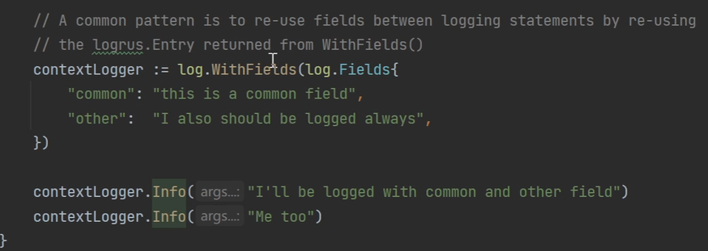

### 自定义writer

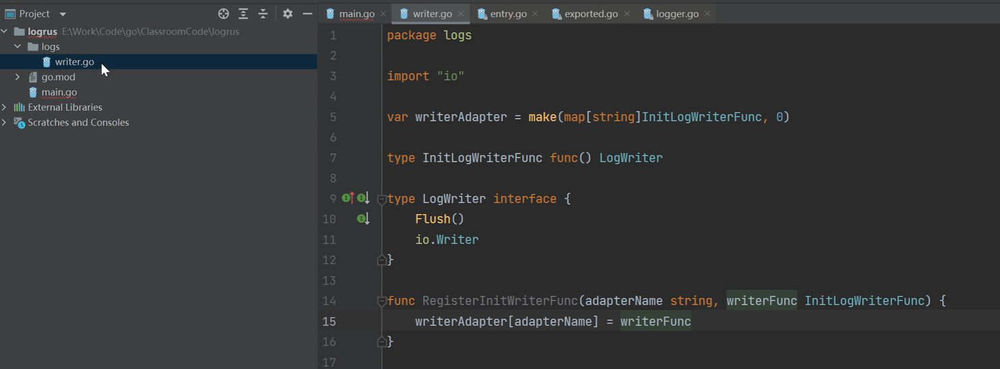

#### std

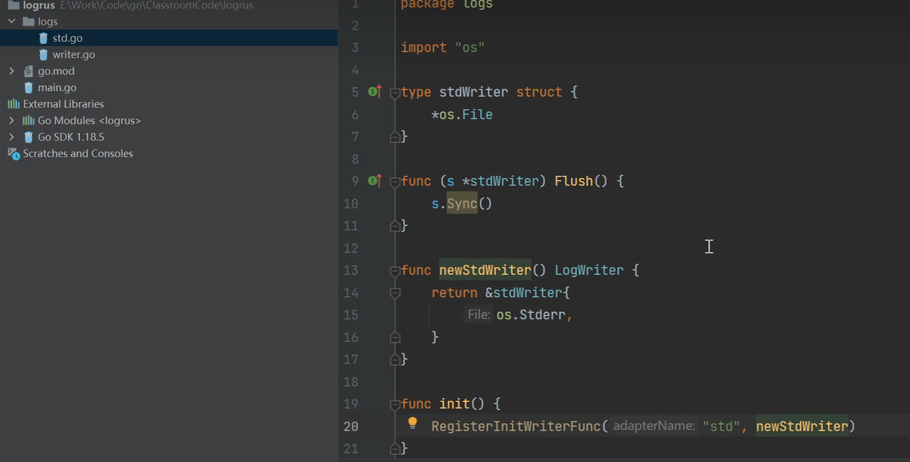

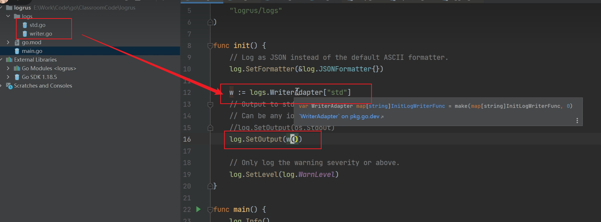

#### file

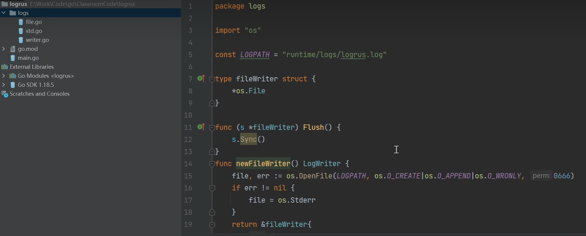

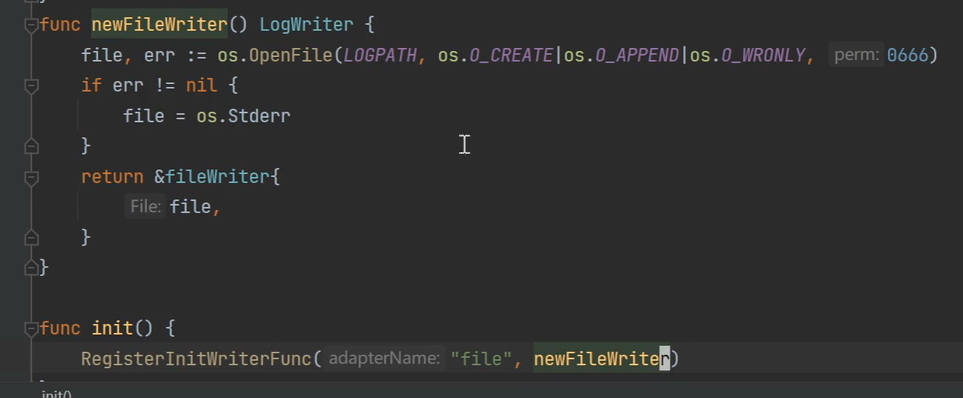

#### log


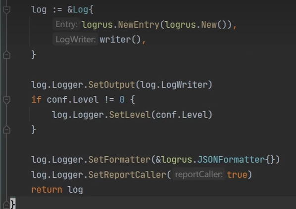


##### 把日志打印到文件

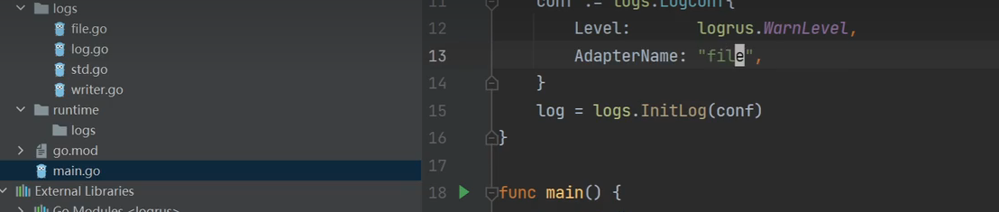

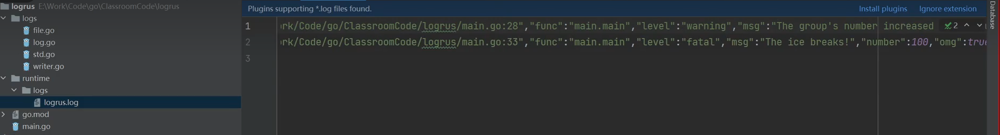


##### 文件切分

```bash
go get -u github.com/lestrrat-go/file-rotatelogs
```


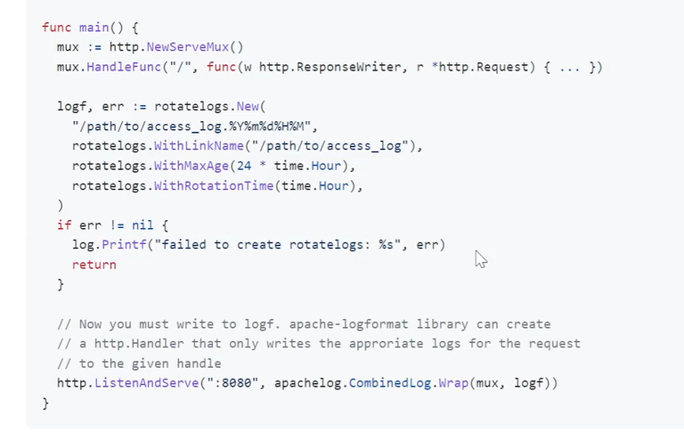

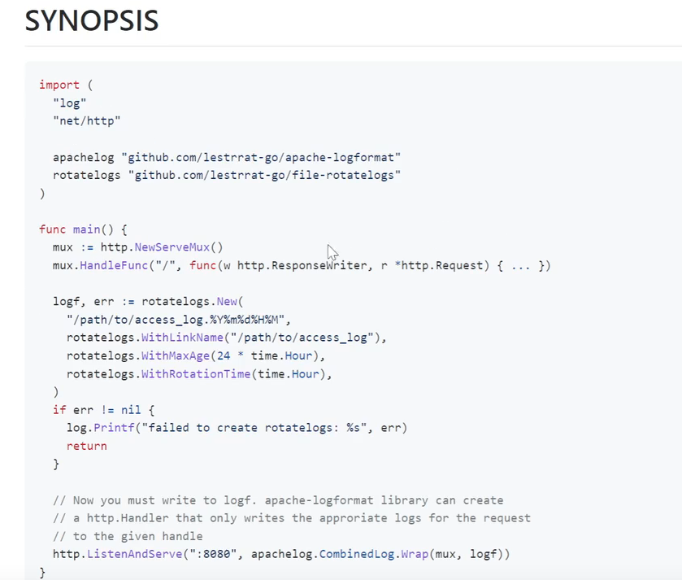

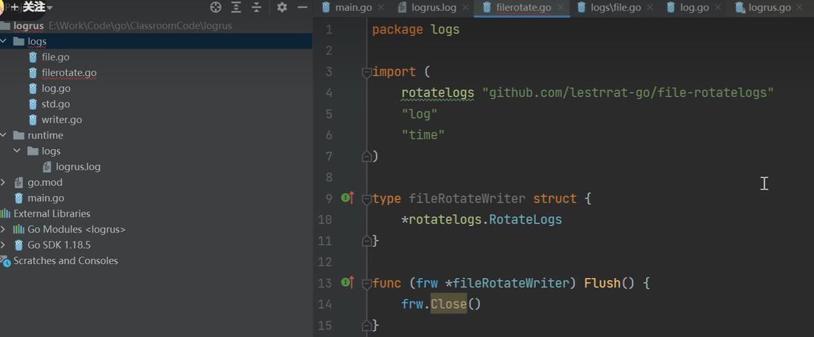

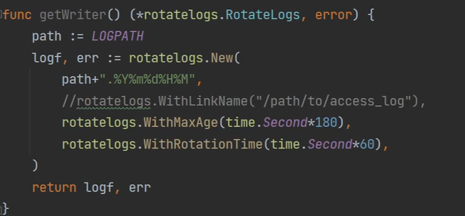

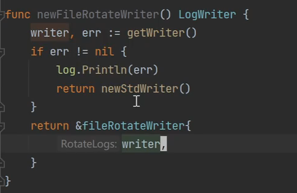

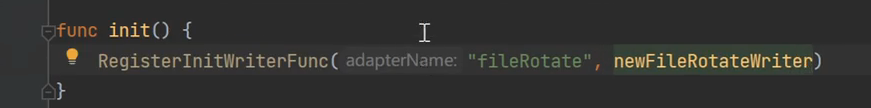

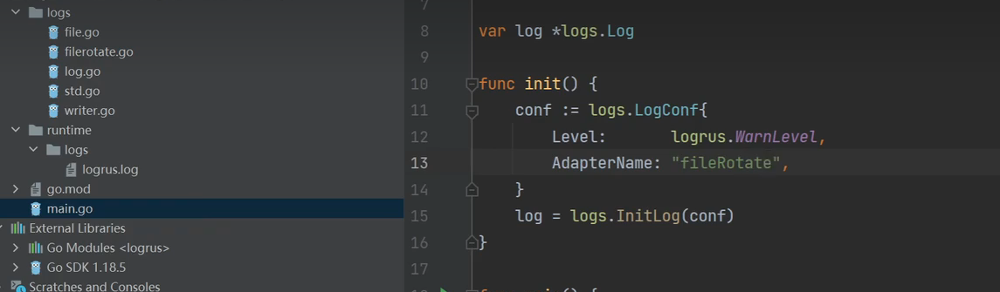

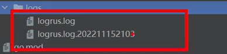

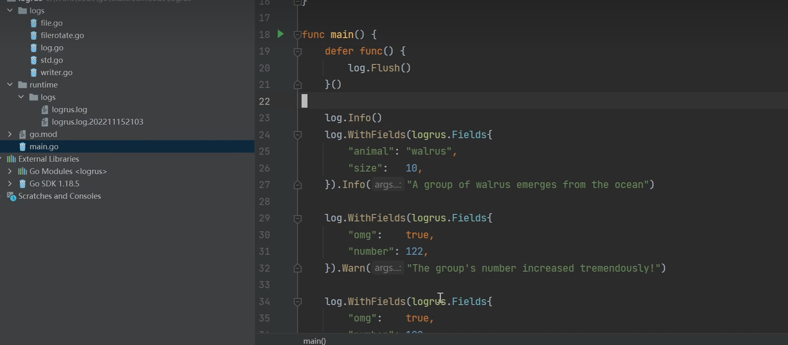

## logrus替换gin框架的log日志框架


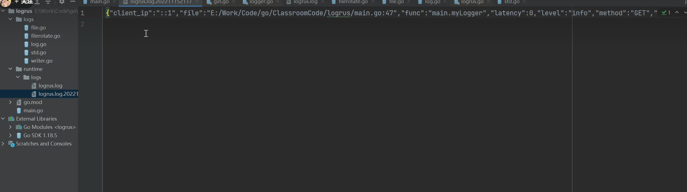