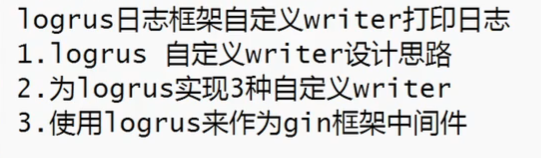
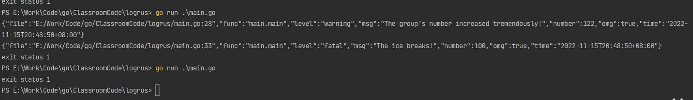

# logrus日志框架



[toc]

## logrus

```bash
go get -u github.com/sirupsen/logrus
```


打印报错代码行


### 自定义writer


#### std


#### file


#### log


##### 把日志打印到文件




##### 文件切分

```bash
go get -u github.com/lestrrat-go/file-rotatelogs
```


## logrus替换gin框架的log日志框架


