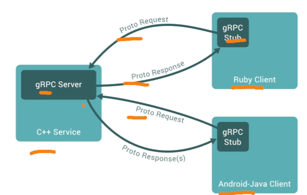

# 高性能RPC框架gRPC 如何用于微服务

[toc]

## 微服务需要考虑哪些因素

1. 鉴权问题
2. grpc数据传递，类似http header
3. 拦截器，
4. 分布式部署的副㪘，客户端负载均衡（如果服务已经部署为负载均衡，就无须）
5. 服务的健康检查
6. 数据传输的方式： 一元请求或流式请求
7. 服务之间的认证问题
8. 服务限流的问题，服务接口限流
9. 服务的熔断，通过判断发生的错误次数，对服务做降级
10. 日志追踪

## protobuf服务定义

1. 编译器
2. 安装编译器插件
3. 生成代码

### 优势

1. 传输会更快，以二进制方式传输

http://protobuf.dev   支持的语言

## gRPC 4中消息传递方式

protoc编译器工具下载

github搜索  下载后会有protoc命令

需要配置环境变量

安装插件

### 生成代码

### 一元请求

#### server

#### client

启动server： 接受请求

启动client： 发送请求

### 流式请求

#### 进行改造封装

==client.go==

​	

#### 流式调用

##### client发送请求

##### server端接受请求

##### run执行日志

### 双向流

#### 客户端

#### 服务端

