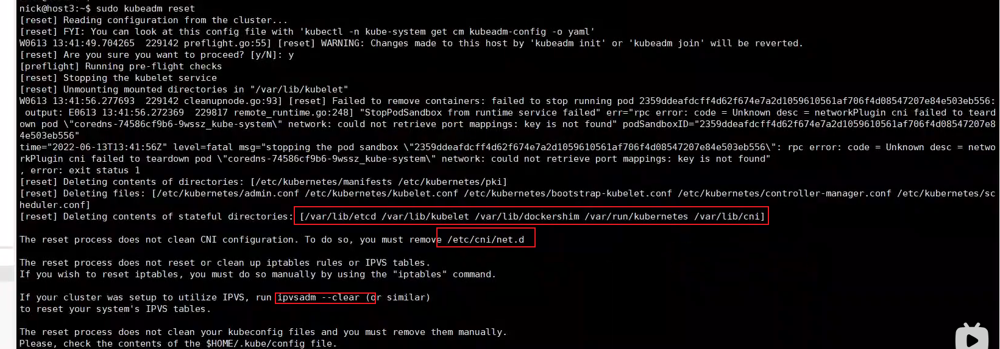

# kubernetes框架

[toc]

## 什么是kubernetes


## 为什么要使用kubernetes


## kubernetes架构图


## K8S搭建安装示意图


## kubernetes基本术语和概念


Pod


label：类似于标签

service


横向扩展： Horizontal Pod Autoscaler


## kubernetes集群安装

### 安装docker


### docker cgroup driver修改


### cri-dockerd安装

https://github.com/Mirantis/cri-dockerd.git

容器运行时


#### 方法一  二进制直接下载


#### 方法二 下载源码docker构建


###  cri-dockerd服务配置和启动


  实例文件


### cri-docer安装可能遇到的坑

1. 直接采用源码提供的service配置文件： cri-docker.service


2. 采用源码提供的sockert文件cri-docker.socket

   

3. 应用程序安装位置不明，配置文件是否有正确的引用应用程序，请检查路径和名称是否正确
4. 套接字路径是否正确，套接字名字是否一致，尤弥尔有再不经意间将cri-docker和cri-dockerd搞混了

### kubeadm工具


### 使用kubeadm初始化master节点


永久关闭swap

写到/etc/fstab


```bash
sudo hostnamectl set-hostname k8s-node1
```


#### 生成默认配置文件

```bash
kubeadm config print init-defaults > init.default.yaml
```

需要修改的地方


==master配置==


#### 拉取相关镜像

```bash
sudo kubeadm config images pull --config=init.default.yaml
```

#### 初始化集群

```bash
# 二选一
# 通过配置文件初始化(推荐)
sudo kubeadm init --config=init.default.yaml

# 通过参数初始化
sudo kubeadm init --image-repository registry.aliyucs.com/google_containers --kubernetes-vers=1.24.1 ....
```


```bash
kubectl get pod --all-namespaces
```


#### 添加pod网络组件


github访问不了，修改host，然后重试


##### 开启kube-proxy的ipvs模式


### 重置节点





### node节点配置


137:


138:容器运行时


#### 删除节点


## 部署一个应用

### 创建一个myhello-rc.yaml:副本控制器


### 创建myhello-svc.yaml： 服务


### 创建资源+访问


