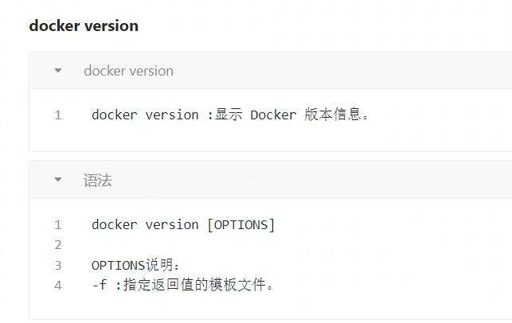
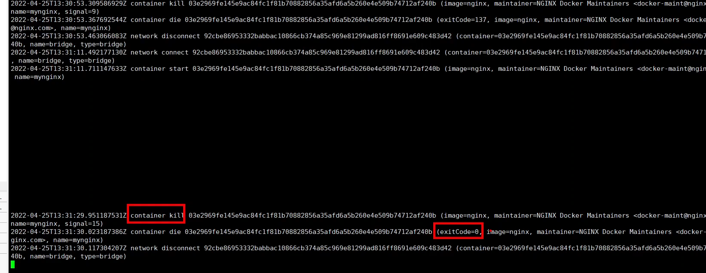

# docker

[toc]

## 什么是docker

## docker简介

### docker发展史

### docker能做什么

### Docker给我们带来的改变

### docker和虚拟机的区别

### Docker隔离机制

### linux namespace

查看进程命名空间： ls /proc/pid/ns

### cgroup

### 起一个docker

## 涉及的概念与概念之间的关系

## 基本架构

## Docker命令

### Docker生命周期

### docker start/stop/restart

### docker kill

### 容器操作

### Docker ps

### Docker inspect

### Docker attach

### docker log

### 本地镜像操作

### docker build

### docker history

dockerfile

### 镜像仓库操作

## Dockerfile

### 关键字

