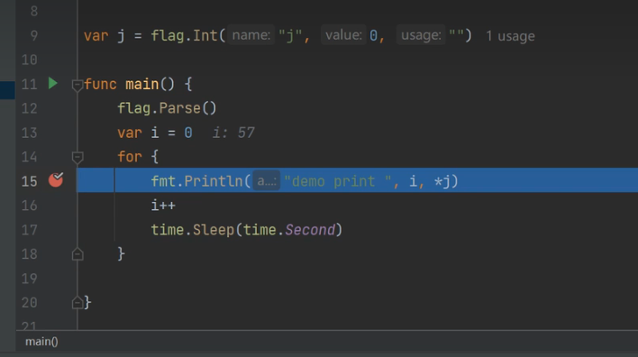
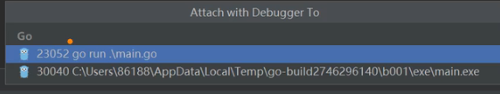
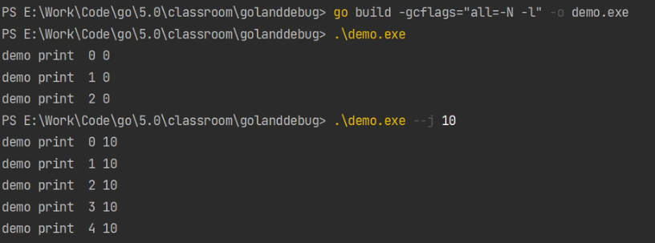
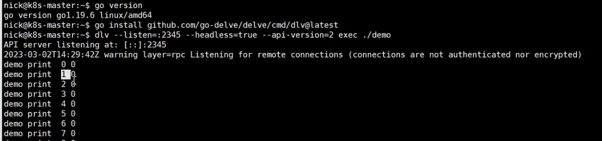
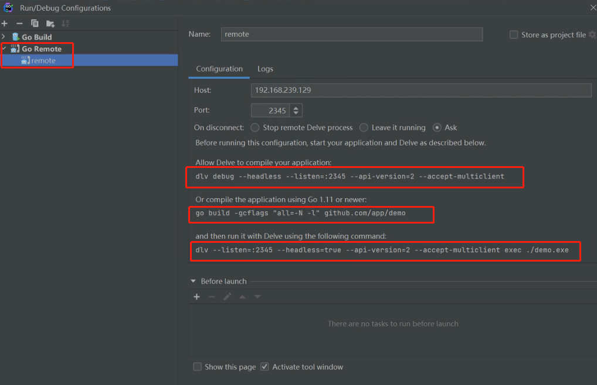
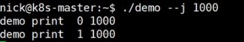
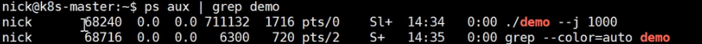
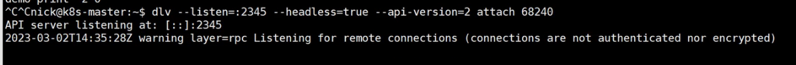

# Goland debug

[toc]

## debug调试模式

### local调试



### 安装插件后，才能atatch到进程进行调试

```bash
go install github.com/google/gops@latest
```





### remote调试

将编译后的二进制拷贝至远程机器上

#### 第一种调试方式

```bash
$Env:CGO_ENABLED=0;$Env:GOARCH="amd64";$Env:GOOS="linux"; 
go build -gcflags="all=-N -l" -o demo
chmod +x demo
# ./demo --j 100
go version
go install github.com/go-delve/delve/cmd/dlv@latest
dlv --listen=:2345 --headless=true --api-version=2 exec ./demo
```





#### 第二种调试方式







