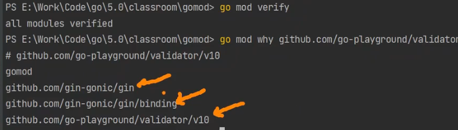

# go mod 依赖

[toc]

## go.mod


### replace 替换


### 撤回，让第三方不引用你自己的包


## go mod命令

### go mod download 下载指定包（不会下载依赖）

GOPATH/pkg.mod中（本地缓存）


### go mod tidy 依赖对齐（下载所有依赖）

### 命令编辑go.mod


```bash
# 返回对指定模块的依赖关系的最短路径，解释为什么依赖指定包
go mod why
go mod why github.com/go-playground/validator/v10
```



### go install/get/clean

